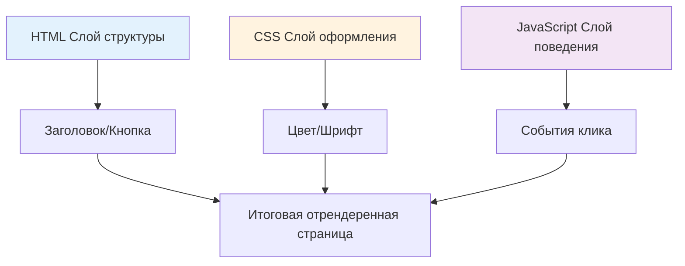
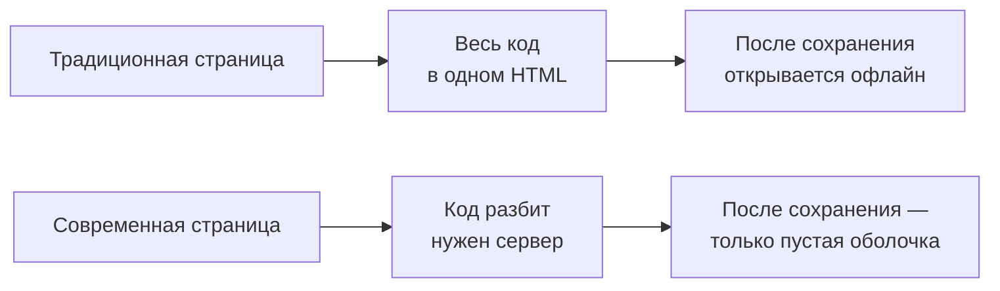

# 1.1 Эволюция форматов кода

> **Прочитав этот раздел, вы получите:**
>
> - Понимание того, как HTML, CSS и JavaScript работают вместе для создания веб-страниц
> - Ясную картину того, как форматы кода эволюционировали от одностраничных файлов к модульности и TypeScript
> - Способность определять, когда использовать простой формат, а когда — более сложный
> - Понимание того, почему AI-сгенерированный код требует особых runtime-окружений

> Как упоминалось в предисловии, AI иногда даёт вам файл `.html`, а иногда — `.ts`: форматы кода усложняются вместе с ростом сложности проекта.

## Три слоя веб-страницы

Веб-страница похожа на сэндвич и состоит из трёх слоёв:



**Полный пример**:

```html
<!DOCTYPE html>
<html>
<head>
  <style>
    /* CSS: слой оформления — как это выглядит */
    .box { background: #f0f0f0; padding: 20px; }
    .count { font-size: 24px; }
  </style>
</head>
<body>
  <!-- HTML: слой структуры — какой контент существует -->
  <div class="box">
    <span class="count">0</span>
    <button>Add</button>
  </div>

  <script>
    /* JavaScript: слой поведения — как это взаимодействует */
    let count = 0;
    document.querySelector('button').addEventListener('click', () => {
      count++;
      document.querySelector('.count').textContent = count;
    });
  </script>
</body>
</html>
```

Сложить все три вида кода в один файл `.html` — это **одностраничный формат**: его можно запустить двойным кликом, ничего не устанавливая.

## Почему некоторые сохранённые страницы перестают работать?

Возможно, вы пробовали сохранить понравившуюся страницу через `Ctrl + S` — и при повторном открытии получали разные результаты:

| Поведение | Причина |
|------|------|
| **Работает идеально** | Одностраничный формат: весь код внутри одного HTML-файла |
| **Оформлено, но не кликается** | CSS локальный, но JS загружается с сервера и офлайн не работает |
| **Совсем без оформления** | И CSS, и JS загружаются с сервера; локально вы сохранили только пустую оболочку |
| **Вообще не открывается** | Современное single-page приложение, требующее сервера для работы |

Современные сайты (такие как Weibo и Bilibili) построены на фреймворках вроде React и Next.js: код разбит по разным файлам, а контент подгружается динамически через JS — поэтому при сохранении остаётся лишь пустая HTML-оболочка.



## Четыре стадии форматов кода


::: details 🎮 Кликните, чтобы исследовать: эволюция форматов кода
<CodeFormatEvolution />

> 💡 **Упражнение**: кликайте разные стадии на таймлайне и наблюдайте, как форматы кода развивались от машинного языка к современному JavaScript.
>
> 🎯 **Ключевая идея**: форматы кода всё ближе к человеческому языку, но требуют больше шагов преобразования перед запуском.
:::

### Стадия 1: одностраничный HTML

Весь код живёт в одном файле `.html`.

**Лучше всего для**: простых demo, изучения концепций, быстрого прототипирования

**Ограничение**: когда код перерастает 200 строк, его становится тяжело поддерживать

### Стадия 2: разделение файлов

Структура (HTML), стили (CSS) и логика (JS) разделены:

```
project/
├── index.html
├── style.css
└── script.js
```

**Лучше всего для**: кодовых баз свыше 200 строк или нескольких страниц с общими стилями

**Ограничение**: зависимости файлов нужно отслеживать вручную; npm-пакеты использовать нельзя

### Стадия 3: модульность

Используйте `import`/`export` для организации кода:

```javascript
// utils.js
export function formatDate(date) {
  return date.toISOString();
}

// app.js
import { formatDate } from './utils.js';
```

**Лучше всего для**: кода с повторяющейся логикой или командной работы

**Ограничение**: браузерам нужна поддержка build-инструментов

### Стадия 4: TypeScript-инженерия

TypeScript + build-инструменты:

```typescript
// utils.ts
export function formatDate(date: Date): string {
  return date.toISOString();
}
```

**Лучше всего для**: проектов со сложной логикой, командной работы и долгосрочной поддержки

**Почему AI любит TypeScript?**

- Система типов уменьшает количество ошибок
- AI лучше генерирует type-safe код
- Это стандарт современной frontend-разработки

::: danger TypeScript не запускается напрямую

Код TypeScript **не может выполняться в браузере напрямую** и должен быть сначала скомпилирован:

```
файлы .ts/.tsx → компилятор TypeScript → файлы .js → выполняется браузером
```

**Во время разработки**: `pnpm dev` компилирует автоматически
**Для production**: `pnpm build` собирает и оптимизирует

:::

## Как выбрать формат кода

| Сложность проекта | Рекомендуемый формат | Как запускать |
|------------|----------|----------|
| Простое demo, одноразовый скрипт | Одностраничный HTML | Открыть напрямую |
| Проект небольшого-среднего размера | Модульный JS | Требуется build |
| Сложное приложение, командная работа | TypeScript + фреймворк | Требуется dev-сервер |

**Принцип**: если работает простое решение — не используйте сложное; но и не натягивайте простое решение на сложный проект.

Сообщите AI, что вам нужно, — и он выберет подходящий формат:

```
«Сгенерируй одностраничный HTML-счётчик» → один файл, запуск двойным кликом
«Сгенерируй приложение для управления задачами» → TypeScript-проект, нужен pnpm dev
```

## FAQ

### Q1: В чём разница между TypeScript и JavaScript?

TypeScript — обновлённая версия JavaScript с проверкой типов.

```typescript
// TypeScript ловит ошибки в момент написания
const count: number = "hello";  // ❌ Редактор подчёркивает красным

// JavaScript ошибётся только в рантайме
const count = "hello";
count.toFixed(2);  // 💥 Падение в рантайме
```

Синтаксис запоминать не нужно. Достаточно знать:

- файлы `.ts` или `.tsx` нужно запускать через `pnpm dev`
- если видите аннотации типов вроде `: string` — это TypeScript

### Q2: Почему бы всегда не использовать одностраничный HTML?

Для сложных проектов одностраничный HTML становится неподдерживаемым. Представьте HTML-файл на 1000 строк, где смена стиля означает охоту за соответствующим тегом `<style>` где-то на 500-й строке — это катастрофа. Модульность позволяет каждому файлу заниматься своим делом.

### Q3: Что делать, если AI-сгенерированный код не запускается?

Сначала определите тип кода:

**Одностраничный HTML**:

```bash
# Открыть двойным кликом, или
open index.html      # Mac
start index.html     # Windows
```

**TypeScript-проект**:

```bash
pnpm install   # Установить зависимости
pnpm dev       # Запустить dev-сервер
```

Если всё равно ошибка — отправьте сообщение об ошибке AI, и он назовёт конкретную причину.

## Связанное

- См. также: [1.2 Понятия tech stack](./02-tech-stack.md)
- См. также: [1.3 Основы браузера и сервера](./03-browser-server.md)
- Далее: [1.5 Управление пакетами и конфигурация проекта](./05-package-manager-and-config.md)
