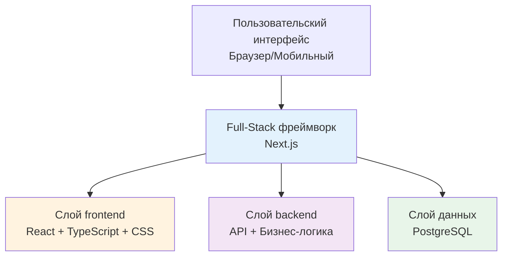

# 1.2 Понятия tech stack

> **Прочитав этот раздел, вы получите:**
>
> - Понимание слоистой архитектуры tech stack (frontend, backend, база данных)
> - Знакомство с tech stack, используемым в этом туториале, и почему выбран именно он
> - Способность быстро определять tech stack проекта по package.json

> Термины из введения, такие как TypeScript и Next.js, составляют tech stack современной Web-разработки.

## Что такое tech stack

**Tech stack** — это комбинация технологий, используемых для построения проекта.

Современные Web-приложения делятся на три слоя:



- **Frontend**: интерфейс, который видят пользователи (HTML, CSS, JavaScript)
- **Backend**: серверная логика, обрабатывающая данные (Node.js, Python)
- **База данных**: хранит данные (PostgreSQL, MongoDB)

Этот туториал использует **full-stack фреймворк Next.js** — frontend и backend в одном проекте, запускаются одной командой.

::: details 🏗️ Кликните, чтобы исследовать: слоистая архитектура tech stack
<TechStackLayers />

> 💡 **Упражнение**: кликайте каждый слой, чтобы посмотреть детали и понять связь между frontend, backend, базой данных и инфраструктурой.
>
> 🎯 **Ключевая идея**: современные Web-приложения делятся на несколько слоёв, каждый отвечает за своё и общается через API.
:::

## Tech stack этого туториала

| Слой | Выбор технологии | Назначение |
|:-----|:---------|:----|
| **Фреймворк** | Next.js | Единый frontend и backend |
| **Язык** | TypeScript | Безопасность типов |
| **Стили** | Tailwind CSS | Utility-first CSS |
| **Библиотека компонентов** | shadcn/ui | Переиспользуемые UI-компоненты |
| **Аутентификация** | better-auth | Type-safe аутентификация |
| **ORM базы данных** | Drizzle ORM | Type-safe операции с БД |
| **База данных** | PostgreSQL | Реляционная БД |
| **AI-интеграция** | Vercel AI SDK | Стриминговое AI-взаимодействие |

::: tip Справочник частых «колёс»

В npm миллионы готовых пакетов. Вот некоторые часто используемые:

| Функция | Рекомендуемый пакет |
|------|--------|
| **Валидация форм** | `zod` |
| **Управление формами** | `react-hook-form` |
| **Получение данных** | `@tanstack/react-query` |
| **Работа с датами** | `date-fns` или `dayjs` |
| **HTTP-клиент** | `axios` или `ofetch` |
| **Иконки** | `lucide-react` |
| **Утилитарные функции** | `lodash` |

AI выберет нужный пакет под ваши потребности. Вам достаточно понять принцип «не изобретайте велосипед».

:::

## Почему выбран этот tech stack

Tech stack выбран **для AI-native разработки** и держится двух принципов: сделать AI эффективнее и снизить ваши затраты.

**1. Ниже стоимость понимания для AI**

Full-stack на Next.js = frontend и backend в одном проекте. Традиционный подход требует два проекта, настройку CORS и запуск двух сервисов; с Next.js достаточно одного `pnpm dev`. Чем консистентнее структура проекта, тем меньше шанс, что AI-сгенерированный код пойдёт не так.

**2. Нулевая стоимость deploy**

| Вариант | Стоимость |
|------|------|
| Традиционно: арендовать сервер | ¥50–200/мес |
| Этот туториал: Vercel/EdgeOne | Бесплатно |

**3. Экосистема npm: не изобретайте велосипед**

npm — крупнейший в мире репозиторий open source кода, более 2 миллионов пакетов.

```bash
# Нужна аутентификация пользователей? Готово
pnpm add next-auth

# Нужна работа с датами? Готово
pnpm add dayjs

# Нужна валидация данных? Готово
pnpm add zod
```

AI не пишет код с нуля — он собирает эти готовые «кирпичики».

**4. У PostgreSQL есть бесплатный хостинг**

| База данных | Платформы с бесплатным хостингом |
|--------|-------------|
| PostgreSQL | Supabase, Neon, Railway |
| MySQL | Почти нет |

**5. Когда вам нужен full-stack?**

Если вы строите чисто статический сайт (например, сайт компании), достаточно HTML + CSS. Когда проекту нужны:

- Пользовательская система (логин, регистрация, права)
- Персистентность данных (сохранение данных пользователей)
- Бизнес-логика (платежи, уведомления, email)

— пора присматриваться к full-stack tech stack.

## Быстрое определение tech stack проекта

Принимая новый проект, вы можете быстро понять его tech stack, глянув в `package.json`:

| Имя зависимости | Тип технологии |
|--------|----------|
| `next` | Full-stack фреймворк Next.js |
| `react` | Frontend-библиотека React |
| `typescript` | Система типов TypeScript |
| `drizzle-orm` | ORM Drizzle |
| `tailwindcss` | Стили Tailwind CSS |
| `ai` | Vercel AI SDK |

Зная tech stack, вы понимаете:

- Какого типа этот проект
- Какие окружения нужны
- По каким ключевым словам искать при проблемах

## Частые вопросы

### Q1: Мне нужно разбираться в этих технологиях?

Достаточно знать, что они есть и какие проблемы решают, — писать их не нужно. Кодинг возьмёт на себя AI. От вас требуется:

- Понимать структуру проекта
- Уметь описывать нужные функции

### Q2: Почему TypeScript, а не JavaScript?

TypeScript ловит ошибки на этапе разработки, и AI будет писать код на нём. Вам достаточно знать: видите расширение `.ts` — значит, это TypeScript.

### Q3: Чем это отличается от Java/Python из университета?

| Традиционное обучение | AI-native путь |
|---------|-------------|
| Ориентация на работу | Ориентация на продукт |
| Учиться 6–24 месяца | Учиться, строя проекты |
| Стать программистом | Решать задачи инструментами |

Принципиальная разница: большинство туториалов учат, как стать программистом, а этот учит решать задачи через продукты. В эпоху AI вам не нужно становиться программистом — нужно понимать инструменты, описывать требования и поручать AI их реализовывать.

## Связанное

- См. также: [1.1 Эволюция форматов кода](./01-code-formats.md)
- См. также: [1.3 Основы браузера и сервера](./03-browser-server.md)
- Далее: [1.5 Управление пакетами и конфигурация проекта](./05-package-manager-and-config.md)
