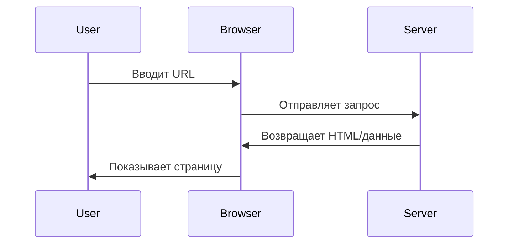
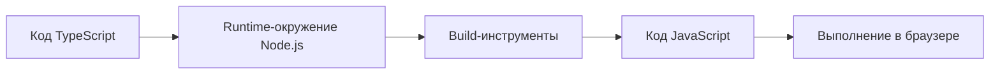

# 1.3 Основы браузера и сервера

> **Прочитав этот раздел, вы получите:**
>
> - Понимание базовых обязанностей браузера и сервера и того, как они работают вместе
> - Представление о разнице между dev-окружением (localhost) и production-окружением
> - Понимание, почему TypeScript нужно компилировать, и какова роль Node.js
> - Способность различать, где выполняется client-side и server-side код

> Во введении говорилось, что «браузеры не понимают TypeScript», — потому что у браузера и сервера разные обязанности.

## Базовые понятия

**Браузеры** (Chrome, Firefox, Safari) работают на компьютерах пользователей и понимают только HTML, CSS и JavaScript.

**Серверы** — это удалённые компьютеры, на которых крутится ПО веб-сервера (например, Nginx и Apache), отвечающее на запросы браузера и возвращающее данные.

**Client-side** = устройства пользователя (браузеры, мобильные приложения); **server-side** = провайдер сервиса (серверы, API).

## Как работает Web-приложение

::: details 🌐 Кликните, чтобы исследовать: взаимодействие браузера и сервера
<BrowserServerFlow />

> 💡 **Упражнение**: нажмите «Play Demo», чтобы посмотреть полный цикл запрос-ответ, затем кликните браузер или сервер и посмотрите, что умеет каждый.
>
> 🎯 **Ключевая идея**: браузер отправляет запрос, сервер обрабатывает его и возвращает данные, а затем браузер рендерит их в страницу.
:::

## Браузер vs сервер

| | Браузер (Client-side) | Сервер (Server-side) |
|---|-----------------|-----------------|
| **Обязанности** | Рендерить страницы, обрабатывать взаимодействия, запрашивать данные | Обрабатывать бизнес-логику, обращаться к базам данных, возвращать результаты |
| **Хранилище** | Cookie, LocalStorage | Файловая система, база данных |
| **Может запускать** | HTML, CSS, JavaScript | Node.js, Python, Go |
| **Не может запускать** | TypeScript, backend-языки | Browser API |

## Зачем нужен Node.js

Код TypeScript перед запуском в браузере нужно скомпилировать, и процессу компиляции требуется runtime-окружение:

**Что делает Node.js**:

- Запускает build-инструменты на вашем компьютере
- Компилирует TypeScript в JavaScript
- Собирает код в bundle
- Стартует dev-сервер

::: tip Современная frontend-разработка требует Node.js

Установить его обязательно в следующих случаях:

- TypeScript-проекты (нужна компиляция)
- Использование npm-пакетов (нужно управление зависимостями)
- Запуск build-инструментов (Vite, Webpack, Next.js)
- Локальная разработка (запуск dev-сервера)

:::

## Dev-окружение vs production-окружение

| | Dev-окружение (Localhost) | Production (публичный интернет) |
|---|---------------------|-----------------|
| **Расположение** | Ваш компьютер | Удалённый сервер |
| **Адрес** | `localhost:3000` | `https://example.com` |
| **Код** | Несжатый, с отладочной информацией | Сжатый, обфусцированный |
| **Ошибки** | Показывают детальные стеки | Показывают только необходимое |
| **Обновления** | Hot reload (автообновление) | Требуют передеплоя |

## Различия runtime-окружений

**Серверы имеют доступ к**: файловой системе, базам данных, переменным окружения, всем сетевым запросам

**Браузеры имеют доступ только к**: контенту страницы, устройствам пользователя (с ограниченными правами), same-origin запросам

::: tip Где выполняется код?

При написании кода вам следует ясно понимать, где он исполняется:

- **Frontend-код**: работает в браузере, виден пользователям
- **Backend-код**: работает на сервере, невидим пользователям
- **API routes**: в Next.js особые — они могут и обращаться к ресурсам сервера, и отвечать на запросы frontend

:::

## Связанное

- См.: [1.1 Эволюция форматов кода](./01-code-formats.md)
- См.: [1.2 Понятия tech stack](./02-tech-stack.md)
- Далее: [1.5 Управление пакетами и конфигурация проекта](./05-package-manager-and-config.md)
- См.: [Глава 10 Localhost и публичный доступ](../10-localhost-public-access/)
