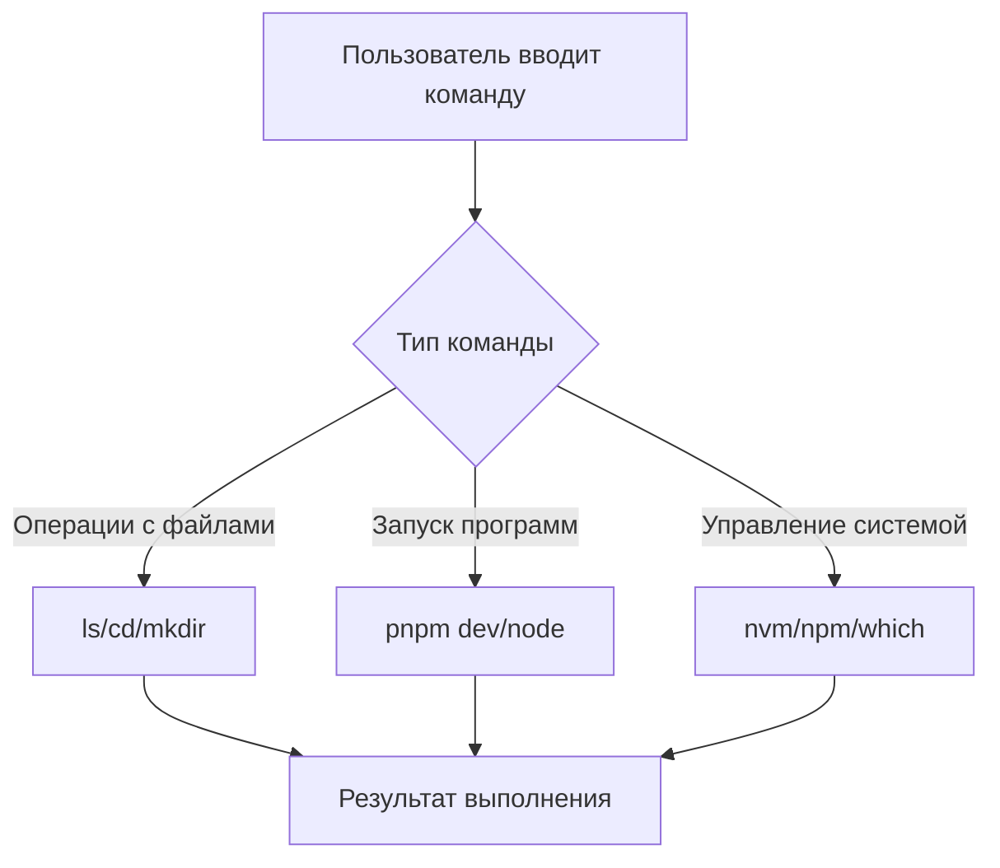
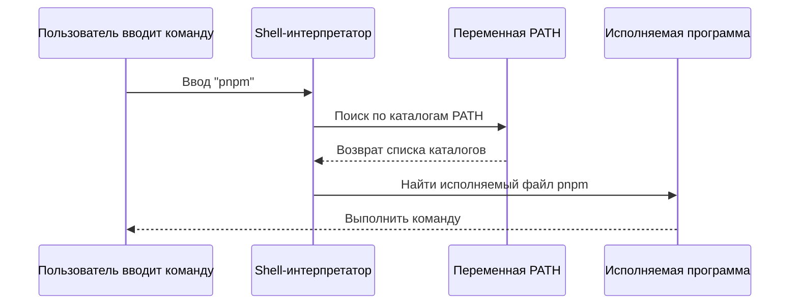

# 1.4 Terminal: начинаем

> **Прочитав этот раздел, вы получите:**
>
> - Освоите основы работы с terminal (открытие, навигация по файлам, выполнение команд)
> - Поймёте разницу между terminal, Shell и командной строкой
> - Изучите горячие клавиши terminal и операции копирования/вставки
> - Поймёте роль переменных окружения и PATH
> - Освоите систематический процесс разбора ошибок команд

> Terminal из введения — это способ общения с операционной системой текстовыми командами.

## Пререквизиты

::: tip Разница между terminal, Shell и командной строкой

Эти три понятия часто путают, но они живут на разных слоях:

- **Terminal**: **окно интерфейса**, которое вы видите и в которое вводите команды. На Windows это PowerShell/CMD, на Mac — Terminal/iTerm2
- **Shell**: **интерпретатор команд**, скрытый за terminal: читает ваш ввод и исполняет его. Частые: bash, zsh (дефолт на Mac), PowerShell (Windows)
- **Командная строка (CLI)**: **способ** управления компьютером текстовыми командами — более эффективный и точный, чем графический интерфейс

:::

::: tip Почему на Windows рекомендуется PowerShell?

В Windows два терминала: CMD (легаси) и PowerShell (современный).

PowerShell мощнее, его команды консистентнее (например, `ls` в PowerShell тоже работает), и это официально рекомендуемый Microsoft современный terminal. **Все команды Windows в этом туториале используют PowerShell как стандарт**.

:::

## Основные концепции

Terminal — главное рабочее место разработчика. Основы работы с ним:



## Практические шаги

### Откройте Terminal

**Mac**:

- Нажмите `Command + Space`, введите «Terminal»
- Или Finder → Applications → Utilities → Terminal

**Windows**:

- Нажмите `Win + R`, введите `powershell` или `Windows Terminal`
- Или правый клик по папке → «Open in Terminal»

**Встроенный terminal VS Code**: меню Terminal → New Terminal. Рекомендуется открывать сразу в каталоге проекта

### Что такое prompt?

Открыв terminal, вы увидите строку текста, начинающуюся с символов:

```bash
user@MacBook ~ $     # Промпт Mac/Linux — $
PS C:\Users\user>    # Промпт Windows PowerShell — >
```

Это называется **prompt**, и он **не является частью команды**. При вводе команд не копируйте его.

`$` означает, что вы используете Shell bash/zsh, а `>` — PowerShell. В примерах команд ниже эти промпты опущены.

### Копирование и вставка

**Windows PowerShell**:

- **Вставка**: правый клик по окну (вставляется сразу; Ctrl+V может не работать)
- **Копирование**: выделите текст, затем правый клик

**Mac Terminal**:

- **Копирование**: `Command + C`
- **Вставка**: `Command + V`
- **Вставка извне**: `Command + Shift + V` (иногда требуется)

### Базовые операции с файлами

Эти команды часто используются на Mac, Linux и в Windows PowerShell/CMD:

```bash
# Показать текущий каталог
pwd

# Список файлов
ls          # Mac/Linux/PowerShell
dir         # Windows CMD

# Сменить каталог
cd folder-name
cd ..         # Вернуться на уровень выше
cd ~          # Перейти в домашний каталог пользователя (Mac/Linux/PowerShell)

# Создать каталог
mkdir folder-name
```

### Горячие клавиши terminal

| Клавиши | Функция |
|--------|------|
| `Ctrl + C` | Остановить текущую программу |
| `Ctrl + L` | Очистить экран (эквивалент `clear`) |
| `↑ / ↓` | Листать историю команд |
| `Tab` | Автодополнение имён файлов или команд |
| `Ctrl + A` | Курсор в начало строки |
| `Ctrl + E` | Курсор в конец строки |

::: tip Два применения Ctrl + C

В terminal у `Ctrl + C` два применения:

1. **Остановить работающую программу** (например, dev-сервер)
2. **Отменить текущий ввод** (если вы печатаете команду и хотите бросить и начать заново)

:::

### Переменные окружения и PATH

::: tip Что такое переменные окружения

Переменные окружения — это конфигурационные данные, хранимые операционной системой, через которые программы получают доступ к системным настройкам. Например, `PATH` — переменная окружения, говорящая системе, в каких каталогах искать исполняемые программы.

:::

Когда вы вводите команду вроде `node` или `pnpm`, как система её находит?



**Как работает PATH**:

1. Вы вводите `pnpm`
2. Shell ищет в каждом каталоге из PATH файл с именем `pnpm`
3. Найдя — выполняет этот файл
4. Если не найдено ни в одном каталоге — показывает `command not found`

::: tip Что делать, если команда не найдена?

Если при вводе команды появляется `command not found`, значит, инструмент либо не установлен, либо не включён в PATH.

После установки из следующего раздела (1.5 Окружение Node.js и управление пакетами) команда должна заработать нормально.

:::

### CLI-софт и аргументы команд

**Что такое CLI-софт?**

CLI-софт (Command Line Interface) не имеет меню и кнопок: всё делается вводом команд. Вы можете спросить: **почему инструменты разработчика предпочитают этот кажущийся примитивным способ?**

Причина проста: печатать команды гораздо быстрее, чем кликать по меню; команды принимают аргументы для точного управления; их можно записывать в скрипты для автоматизации; и они расходуют меньше памяти. Привыкнув, вы найдёте это куда эффективнее графического интерфейса.

**Знакомство с аргументами команд**

За командами часто идут аргументы, меняющие их поведение. Есть два формата аргументов:

- **Короткие аргументы**: одиночное тире и буква, например `-v` (версия) или `-h` (help)
- **Длинные аргументы**: двойное тире и слово, например `--version` или `--help`

```bash
# Узнать версию (короткий аргумент)
node -v
pnpm -v

# Посмотреть help (длинный аргумент)
git --help
npm --help
```

Короткие и длинные аргументы делают одно и то же. Короткие быстрее печатать, длинные легче читать. Большинство команд поддерживает обе формы.

## Частые вопросы

### Q1: Как выполнить несколько команд одновременно?

Используйте `&&` для соединения команд. Следующая команда выполнится, только если предыдущая успешна:

```bash
# Очистить и переустановить
rm -rf node_modules && pnpm install
```

Используйте `;` (или перенос строки), чтобы команды выполнялись независимо от успеха предыдущей:

```bash
mkdir new-folder ; cd new-folder    # new-folder — пример имени папки
```

### Q2: Что делать, если в terminal кракозябры вместо китайского текста?

Измените настройки кодировки terminal.

- **Mac**: Terminal → Preferences → Profiles → Advanced → Character Encoding → UTF-8
- **Windows**: Свойства PowerShell → Шрифт → выберите шрифт с поддержкой китайского

### Q3: Как открыть terminal для текущей папки в VS Code?

Кликните меню: Terminal → New Terminal

## Разбор ошибок команд

Столкнувшись с `command not found` или другими ошибками команд, разбирайте по шагам в таком порядке:

::: details 🔧 Кликните, чтобы попробовать: процесс разбора ошибок команд
<TerminalTroubleshoot />

> 💡 **Практика**: следуйте шагам и вводите правильные команды для разбора проблемы. Начните с проверки написания, затем установки инструмента, каталога и так далее.
>
> 🎯 **Ключевая идея**: при сбое команды разбирайте по порядку: написание → установка → каталог → PATH → различия систем.
:::

### Чек-лист разбора

**1. Проверьте написание**

```bash
# Частые ошибки
pnpm instal  # Ошибка: пропущена l
l s          # Ошибка: лишний пробел

# Правильно
pnpm install
ls
```

**2. Убедитесь, что инструмент установлен**

```bash
# Проверить версию (подтвердить работоспособность)
node -v
pnpm -v
```

Если команда числится отсутствующей — сначала установите её.

**3. Убедитесь, что вы в правильном каталоге**

```bash
# Показать текущий каталог
pwd

# Проверить, существует ли package.json
ls package.json
```

**4. Перезагрузите terminal**

После установки инструмента или изменения PATH нужно перезапустить terminal:

```bash
# Mac: перезагрузить конфигурацию
source ~/.zshrc

# Или просто закрыть и заново открыть terminal
```

::: tip Не понимаете, в чём проблема?

Просто отправьте сообщение об ошибке AI — он назовёт конкретную причину и способ исправления.

Запоминать каждую ошибку не нужно. Достаточно знать порядок разбора.

:::

## Связанное

- См. также: [1.5 Управление пакетами и конфигурация проекта](./05-package-manager-and-config.md)
