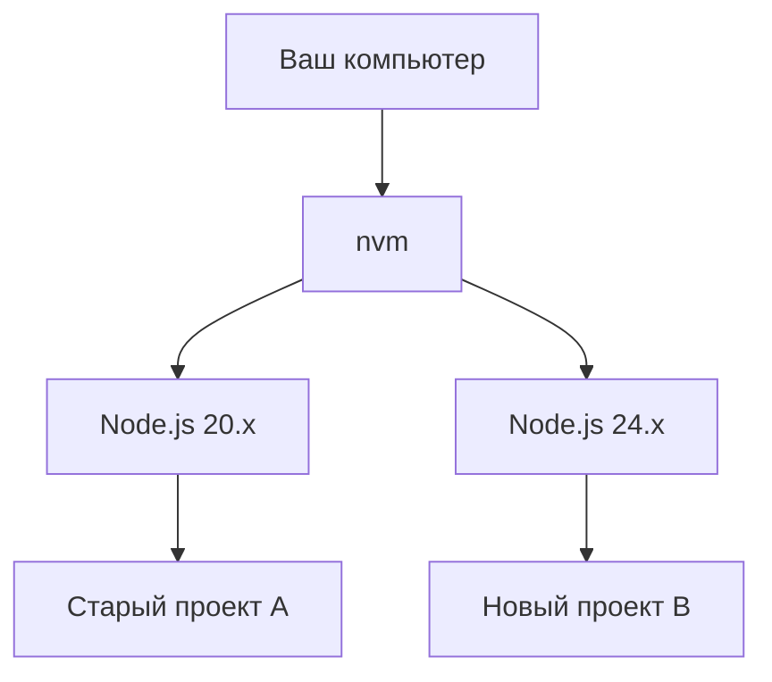

# 1.5 Управление пакетами и конфигурация проекта

> **Прочитав этот раздел, вы получите:**
>
> - Понимание того, как работают nvm и pnpm
> - Освоение частых команд pnpm (включая глобальную установку)
> - Понимание роли ключевых конфиг-файлов: package.json, pnpm-lock.yaml и др.

::: tip Ещё не установили окружение?

Если вы ещё не установили Node.js и pnpm, обратитесь к [1.0 Quick Start](./00-quick-start.md) и завершите установку.

:::

## Базовые понятия

**Node.js** — runtime-окружение JavaScript, позволяющее JS работать на серверной стороне. Все современные frontend build-инструменты зависят от него.

**LTS** (Long Term Support) — версия с долгосрочной поддержкой. Она стабильнее Current и рекомендуется для разработки.

**nvm** (Node Version Manager) позволяет устанавливать и переключать несколько версий Node.js на одном компьютере.

**pnpm** — менеджер пакетов для установки зависимостей проекта. По сравнению с npm он быстрее и занимает меньше места на диске.

## Почему pnpm?

| Свойство | npm | pnpm |
|------|-----|------|
| Скорость | Базовая | **В 2–3 раза быстрее** |
| Место на диске (10 проектов) | ~5 ГБ | **~1,5 ГБ** |

pnpm использует **hard link**, поэтому все проекты могут делиться одними и теми же файлами зависимостей вместо копирования отдельного экземпляра для каждого проекта.

::: details 🎮 Кликните, чтобы попробовать: сравнение установки npm vs pnpm
<PackageManagerCompare />

> 💡 **Упражнение**: по очереди кликайте «Проект A/B/C» и наблюдайте, как меняется занятое место у npm и pnpm
>
> 🎯 **Ключевая идея**: pnpm экономит большие объёмы диска в сценариях с множеством проектов благодаря разделению зависимостей через hard link
:::

## Частые команды pnpm

### Команды для зависимостей проекта

| Команда | Назначение |
|------|------|
| `pnpm init` | Инициализировать проект |
| `pnpm install` | Установить все зависимости |
| `pnpm add xxx` | Установить production-зависимость (`xxx` — имя пакета, например React) |
| `pnpm add -D xxx` | Установить dev-зависимость (`xxx` — имя пакета, например TypeScript) |
| `pnpm remove xxx` | Удалить пакет |
| `pnpm dev` | Запустить скрипт (эквивалент pnpm run dev) |

::: tip В чём разница между add и add -D?

- **add xxx**: production-зависимость, нужна при работе проекта
- **add -D xxx**: dev-зависимость, нужна только во время разработки

Если не уверены — пусть AI решит, какую использовать.

:::

### Команды глобальной установки

Помимо зависимостей проекта, можно через npm устанавливать **глобальные инструменты** — они доступны из любого места вашего компьютера:

```bash
# Установить глобальные CLI-инструменты
npm install -g @anthropic-ai/claude-code
```

**Глобальная установка vs установка в проект**:

| | Глобальная установка | Установка в проект |
|---|---------|---------|
| **Команда** | `npm install -g xxx` | `pnpm add xxx` |
| **Расположение** | Системный каталог, доступен всем проектам | node_modules текущего проекта |
| **Назначение** | CLI-инструменты (например, Claude Code) | Зависимости проекта (например, React) |
| **Примеры** | claude, http-server | react, lodash |

::: tip Когда стоит устанавливать глобально?

- **CLI-инструменты**: например, Claude Code, http-server, create-react-app
- **Системные инструменты**: например, nrm (управление registry-источниками), vercel (инструмент deploy)

Обычные зависимости проекта (React, Vue) следует устанавливать внутри проекта, а не глобально.

:::

## Ключевые конфиг-файлы

**Что такое конфиг-файлы?** Это текстовые файлы, в которых записаны метаданные проекта. Они сообщают менеджеру пакетов, какие зависимости нужны проекту и как его запускать. Они лежат в **корневом каталоге** проекта (самая внешняя папка).

**Почему они есть у каждого проекта?** Потому что каждый проект зависит от разных сторонних библиотек — одни используют React, другие Vue; одним нужны конкретные версии, другим — самые свежие. Конфиг-файлы фиксируют эти различия, чтобы любой, кто получит код, мог воспроизвести то же dev-окружение.

**Зачем они нужны?** Представьте, что вы скачали open source проект без конфиг-файлов: вы не будете знать, какие зависимости нужны и как его запустить. Конфиг-файлы решают эту проблему: `pnpm install` автоматически скачивает все зависимости по конфигурации, а `pnpm dev` знает, как стартовать проект.

### package.json

Файл описания проекта, в котором записаны зависимости и скрипты:

```json
{
  "dependencies": {
    "react": "^18.0.0"
  },
  "devDependencies": {
    "typescript": "^5.0.0"
  }
}
```

::: details 🎮 Кликните, чтобы попробовать: интерактивный просмотрщик package.json
<PackageJsonExplorer />

> 💡 **Упражнение**: кликайте любое поле в JSON слева, чтобы увидеть его назначение и связанные команды
>
> 🎯 **Ключевая идея**: package.json — это «паспорт» проекта: зависимости, скрипты и метаданные
:::

### pnpm-lock.yaml

Автоматически генерируемый lock-файл, фиксирующий точную версию каждой зависимости. Он гарантирует, что все устанавливают **ровно те же версии**, спасая от проблемы «у меня же работало».

**Обратите внимание**:

- Генерируется автоматически, **не редактируйте вручную**
- Его обязательно коммитят в Git

### .nvmrc (опционально)

Задаёт рекомендуемую для проекта версию Node.js:

```bash
# содержимое файла .nvmrc
24
```

У большинства проектов этого файла нет; достаточно свежей LTS. Если файл существует, `nvm use` переключит версию автоматически.

## Дополнительно: когда вам нужен nvm?

::: tip Уже установили?

Если вы прошли установку по [1.0 Quick Start](./00-quick-start.md), то nvm уже установлен (на Mac/Linux — автоматически через скрипт; пользователи Windows могут установить его опционально).

:::

Разным проектам могут требоваться разные версии Node.js:



**Когда нужно переключать версии**: поддержка старых проектов, тесты совместимости. Большинству новых проектов достаточно свежей LTS.

## Частые вопросы

### Q: Команда nvm выдаёт `command not found`

Нужно перезагрузить конфигурацию или перезапустить terminal:

```bash
source ~/.zshrc   # если используете zsh
source ~/.bashrc  # если используете bash
```

### Q: Как узнать, какая версия Node.js нужна проекту?

Проверьте поле `engines` в `package.json` или файл `.nvmrc` в корне проекта.

### Q: Можно ли мигрировать npm-проект на pnpm?

Да, полная совместимость:

```bash
rm -rf node_modules package-lock.json
pnpm install
```

> **Что делает эта команда**: удаляет папку зависимостей npm и lock-файл, затем переустанавливает всё через pnpm.

## Ключевая философия

**nvm решает конфликты версий, pnpm повышает эффективность установки**.

- ✅ Разные проекты могут использовать разные версии Node.js
- ✅ pnpm переиспользует зависимости: установка быстрая и экономная по месту
- ✅ Строгий режим pnpm помогает избегать «фантомных зависимостей»

## Связанное

- См. также: [1.4 Основы terminal](./04-terminal-basics.md)
- См. также: [nvm Chinese Official Website](https://nvm.uihtm.com/)
- Пререквизит: [1.0 Quick Start](./00-quick-start.md)
- Пререквизит: [1.2 Понятия tech stack](./02-tech-stack.md)
