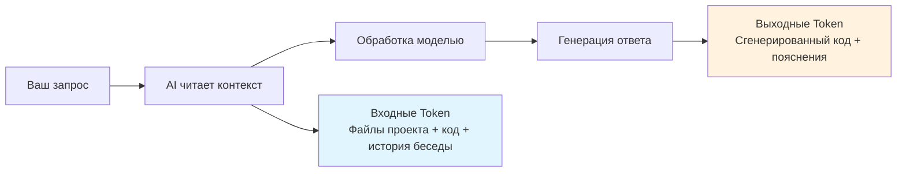

# 2.1 Экономика AI-программирования 🔴

> **Прочитав этот раздел, вы получите:**
>
> - Понимание, что Token — единица тарификации AI-моделей, и как работает биллинг входных/выходных Token
> - Чутьё на стоимость и умение оптимизировать её через точные промпты, контролирующие объём контекста AI
> - Освоение базовых принципов оптимизации промптов: указывать пути, чётко определять scope, убирать вежливые обороты
> - Понимание связи размера контекста со стоимостью и умение избегать лишнего расхода Token

> Как говорилось во введении, «модель определяет скорость и верхнюю границу способности к кодингу» — и важность чутья на стоимость в AI-разработке. **Tokens — это деньги**: каждый вызов модели потребляет реальную стоимость.

> Про установку и настройку инструментов см.: [1.6 Модели и инструменты](../01-environment-setup/06-models-and-tools.md)

## Пререквизиты

::: tip Что такое LLM

LLM (Large Language Model) — AI-модель, натренированная на огромных объёмах текста и способная понимать и генерировать человеческий язык, код и многое другое.

:::

::: tip Что такое Token

Token — единица тарификации AI-моделей и базовая единица, которой модель обрабатывает текст.

**Ориентиры конвертации**:

- 1 китайский иероглиф ≈ 1 Token
- 1 английское слово ≈ 0,75 Token
- 1 строка кода ≈ 5–15 Token

Модели тарифицируются по количеству входных (Prompt) и выходных (Completion) Token.

:::

**Попробуйте калькулятор Token, чтобы интуитивно почувствовать связь текста и Token:**

<TokenCalculator />

::: tip Что такое входные/выходные Token

**Входные Token**: контент, который вы отправляете модели (промпты, код, контекст)

**Выходные Token**: контент, генерируемый моделью (код, объяснения, ответы)

**Как считается стоимость**: тарифицируются и входные, и выходные Token, причём выходные обычно чуть дороже входных.

Как пользователю, вам не нужно запоминать точные тарифы — инструмент покажет стоимость каждого вызова, а пополнить баланс можно по мере надобности. Важно понять другое: **чем больше контекст, тем выше стоимость**.

:::

::: tip Что такое Context Window

Context Window — максимальная длина контекста, которую модель может обработать, измеряется в Token. GLM поддерживает окно контекста 200K — этого достаточно для полных больших файлов и длинных бесед.

**При превышении лимита происходит автосжатие**: когда контекст приближается к лимиту или превышает его, модель автоматически сжимает более раннюю беседу, сохраняя самую свежую и релевантную информацию. При этом часть исторических деталей может быть упрощена или опущена.

:::

## Основные концепции

### Откуда берётся стоимость



**Ключевое понимание**:

- Один вызов дешев, но в сумме они накапливаются
- **Больше контекста = выше стоимость**: чтение всего проекта против чтения одного файла — разница на порядок
- Остерегайтесь частых отладок: итеративные правки непрерывно накапливают Token

::: tip Как контролировать расходы

Большинство AI-инструментов кодинга будут:

- Показывать количество Token и стоимость каждого вызова
- Предоставлять планы или квоты использования
- Напоминать о пополнении, когда квота заканчивается

**Запоминать точные тарифы не нужно** — но полезные привычки (см. следующий раздел) стоит завести, чтобы сокращать лишний расход.

:::

## Стратегии оптимизации стоимости и качества

**Ключевой инсайт**: сам промпт обычно короткий. **Что реально потребляет Token — контекст, который читает AI**: файлы проекта, код, история беседы и другой материал, который нужно загрузить, чтобы AI понял ваш запрос.

Поэтому оптимизация промптов — не «шлифовка формулировок». Это **сокращение объёма контекста, который AI нужно читать**, с одновременным **контролем длины вывода**.

**Объём контекста влияет и на стоимость, и на качество**: точный контекст помогает AI сфокусироваться на проблеме и выдать более точный результат; нерелевантный контекст распыляет внимание и повышает шанс ошибок.

### Принципы оптимизации

| Принцип | Пояснение |
|-----|------|
| **Указывайте пути** | Указывайте пути к файлам/папкам, чтобы сузить область поиска AI |
| **Чётко определяйте scope** | «Проблема с функцией логина» сфокусированнее, чем «проблема с проектом» |
| **Убирайте вежливые обороты** | «Пожалуйста», «спасибо» и «если возможно» не нужны |
| **Сразу к делу** | Описывайте задачу напрямую, без вежливости и раскачки |

### Сравнение примеров

```
❌ Размытый промпт (AI читает больше контекста):
«Проверь, есть ли в проекте проблемы, и почини их»
→ AI не понимает, с чего начать, и может прочитать массу нерелевантных файлов

✅ Точный промпт (AI фокусируется на нужной зоне):
«Проверь, что не так с функцией логина, и почини»
→ AI сам находит файлы, связанные с логином, и читает только нужный контекст
→ Или ещё прямее: «Исправь ошибку типов на строке 42 в src/auth/login.ts: user может быть null»
```

## Практические советы

### Следите за расходом

AI-инструменты кодинга обычно показывают количество Token и стоимость каждого вызова. Детали использования также можно посмотреть на платформе провайдера модели.

**Кончилась квота — просто пополните**: как с мобильным трафиком, переживать особо не о чем, но сознательно избегать расточительности стоит.

### Чек-лист чутья на стоимость

- Указывайте пути к файлам/папкам
- Определяйте scope функции
- Убирайте вежливые обороты
- Регулярно очищайте историю беседы

## Частые вопросы

### Q1: Что если я превышу лимит Token?

Обычно лимит не встретится — AI автоматически разбивает большие файлы при чтении. Но если ошибка лимита всё же возникла, значит, проект достиг масштаба, где нужна инженерная структура:

- Рассмотрите разбиение проекта (monorepo или микросервисы)
- Очистите историю беседы и начните новую сессию
- Используйте `.gitignore`, чтобы исключить файлы, которые AI не должен читать

### Q2: Почему модель иногда выдумывает?

Это проблема «hallucination», и она есть у всех моделей. Решение: предоставляйте ясный контекст и просите AI явно говорить о неуверенности и ждать вашего подтверждения вместо выдумывания.

### Q3: Достаточно ли способен GLM?

Да.

## Ключевая философия

**Контекст определяет и стоимость, и качество; прямота важнее вежливости.**

Укажите путь или scope функции, чтобы AI читал только необходимый контекст. Точный контекст экономит деньги и делает вывод точнее.

## Связанное

- Пререквизит: [1.6 Модели и инструменты](../01-environment-setup/06-models-and-tools.md)
- См. также: [2.2 VibeCoding Workflow](./02-vibecoding-workflow.md)
