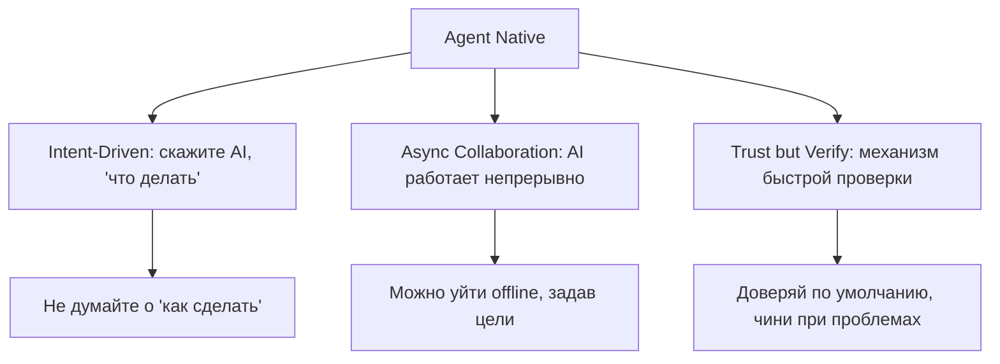
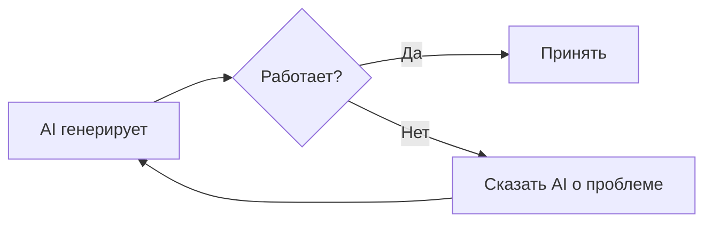
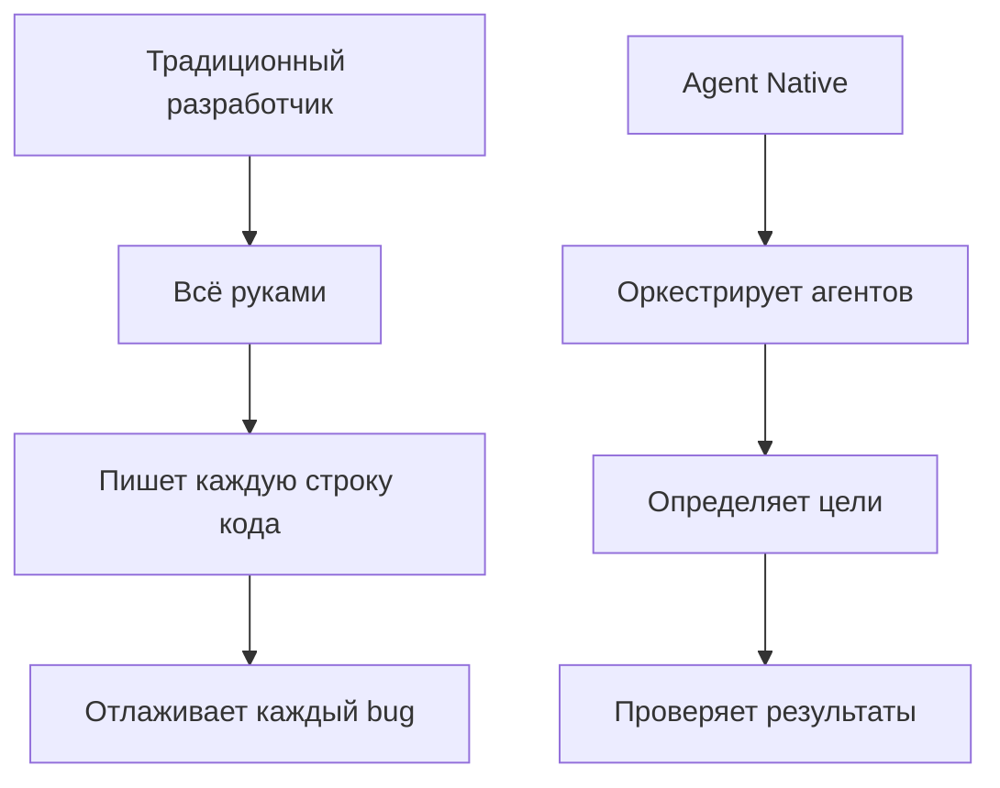
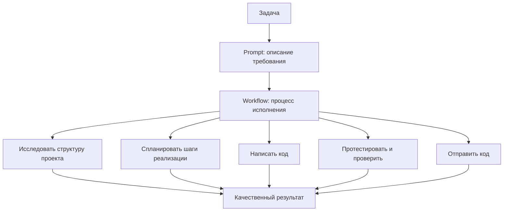
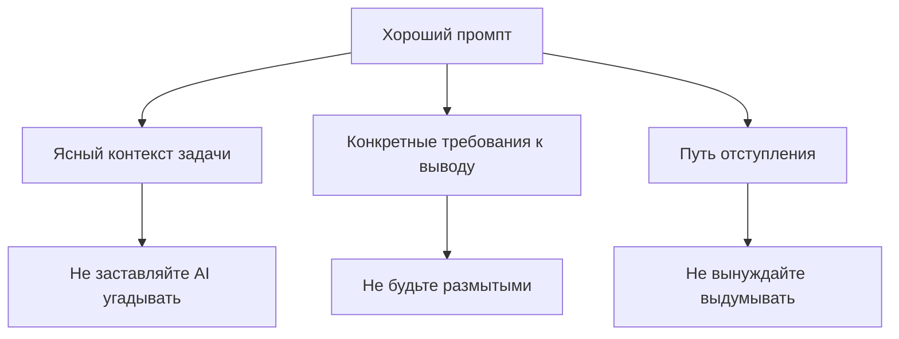
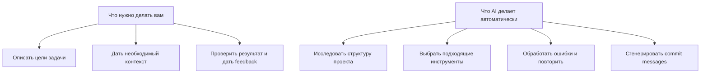
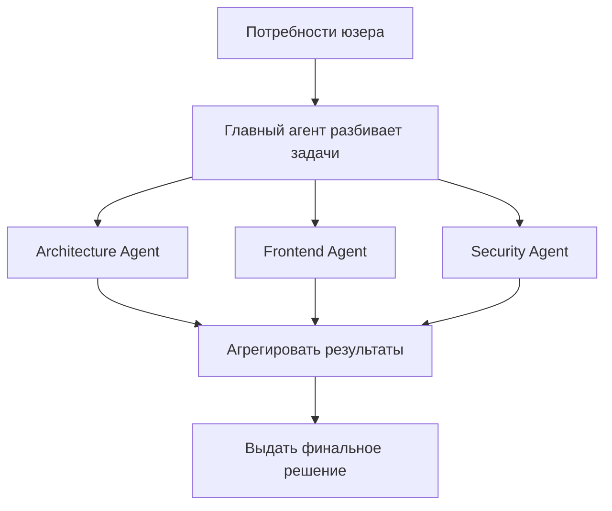
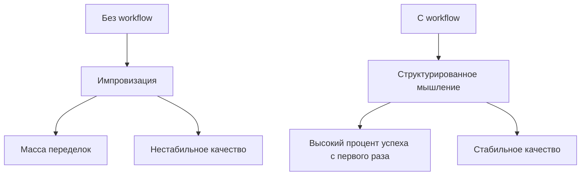

# 2.2 VibeCoding Workflow

> **Прочитав этот раздел, вы получите:**
>
> - Освоение пятишагового VibeCoding workflow: Explore → Plan → Execute → Verify → Submit
> - Понимание Agent Native-мышления разработчика: переход от «как сделать» к продуктовому мышлению «что построить»
> - Умение писать качественные промпты: описывать задачу напрямую, давать контекст и конкретные ограничения
> - Освоение ключевых взаимодействий Claude Code: режимов разрешения, slash-команд и checkpoint-механики
> - Понимание механизмов параллельной коллаборации мульти-агентов и умение использовать AI-автоматизацию для ускорения разработки

> «Workflow (поток инструментов)» из предисловия — это ядро Vibecoding и стандартный процесс VibeCoding-разработки.

## Пререквизиты

::: tip Что такое Claude Code

Claude Code — AI-инструмент командной строки, который может напрямую читать файлы проекта, исполнять команды, автоматически менять код и завершать задачи.
:::

::: tip Что такое Workflow

Workflow — стандартизированный процесс выполнения задач. AI-workflow разработки включает этапы: исследование, планирование, кодинг, отправка и другие.
:::

::: tip Что такое Prompt

Промпт — текстовая инструкция для AI, описывающая, что вы хотите получить. **Хорошие промпты — часть workflow**.
:::
::: details Кликните для просмотра: Agent Native-мышление разработчика


**Agent Native** = мышление разработки с центром на AI-агенте

В традиционной разработке AI — ассистент (Copilot); в Agent Native AI — автономный исполнитель (Autopilot).


#### Традиционная разработка vs Agent Native

| Измерение | Традиционная AI-ассистированная разработка | Agent Native-разработка |
|-----------|-------------------------------------|--------------------------|
| **Ключевая роль** | Человек пишет код, AI помогает | AI ведёт, код — деталь реализации AI |
| **Режим работы** | AI — Copilot | AI — Autopilot |
| **Паттерн взаимодействия** | Человек пишет Prompt, направляя AI | AI сам задаёт вопросы, планирует, исполняет |
| **Форма вывода** | AI генерирует сниппеты, человек интегрирует | AI автономно завершает полные задачи |
| **Ваш фокус** | Как писать код | Какой продукт строить |

### Ключевая философия Vibecoding: вы — режиссёр, AI — актёр

Ядро Vibecoding — не «AI пишет код за вас», а «вы направляете AI на написание кода». Это различие критично. Если считать AI заменой, вы постепенно теряете контроль над продуктом и в итоге получаете нечто технически идеальное, но продуктово посредственное. По-настоящему мощный подход — «отпускание + контроль»: отпускание означает позволить AI свободно исследовать среди массы технических решений, генерировать несколько путей реализации и показывать вам возможности, которых вы раньше не видели; контроль означает принимать направляющие решения в ключевых точках, брать финальное слово и ответственность.

Ценность вашей работы — не в том, сколько кода вы написали и насколько нов ваш tech stack, а в выбранном продуктовом направлении, архитектурных суждениях и ответственности, которую вы готовы нести. AI может написать десять тысяч строк кода, но только вы решаете, какую проблему эти строки должны решить. Вот почему PRD так важен: PRD — ваш «контроль» над AI. Без PRD AI — взбесившаяся лошадь: может бежать быстро, но не туда; с PRD AI — послушный исполнитель, каждый шаг которого под вашим контролем.

### Разделение труда AI и человека: предсказание vs суждение

В VibeCoding workflow важно понимать разделение между AI и человеком. AI отвечает за «предсказание»: на основе массивных тренировочных данных он генерирует несколько кодовых решений, даёт архитектурные советы и рекомендации по выбору технологий. Эти решения — обычно самые вероятные, соответствующие best practice. Но AI не знает ваш бизнес-контекст, не понимает потребности ваших пользователей и не несёт ответственности за продуктовое направление.

Здесь и лежит ваша ценность. Вы отвечаете за «суждение»: выбрать самое подходящее из нескольких предложений AI, решить на основе бизнес-понимания, принимать ли код, определять продуктовое направление из user-инсайтов. Дело не в неспособности AI — разделение труда таково изначально: AI силён в предсказании на данных, вы — в суждении на понимании.

Режимы разрешения (Default/Plan/Accept Edits) по сути регулируют «степень разрыва предсказания и суждения». В Default read-only исследования AI выполняются автоматически, но правки кода требуют вашего суждения; в Plan AI может только исследовать и анализировать — все суждения за вами; в Accept Edits AI может самостоятельно запускать команды и тесты, но правки кода всё равно требуют вашего решения. Какой режим выбрать — зависит от знакомости с задачей и терпимости к риску.

#### Три принципа Agent Native



**1. Intent-Driven**

Скажите AI цель, пусть он сам решает реализацию:

```bash
❌ Традиционное мышление:
"Напиши функцию, которая принимает массив,
проходит по нему циклом for и пушит элементы больше 10
в новый массив..."

✅ Agent Native:
"Отфильтруй из массива элементы больше 10, верни новый массив"
```

**2. Async Collaboration**

AI может работать, пока вы спите:

```bash
# Вы задаёте цель, AI исполняет автономно
"Реализуй функцию комментариев, включая:
1. Схему БД (модель Comment)
2. CRUD API
3. Форму комментариев на frontend
4. Отображение списка комментариев

Сообщи, когда готово — я занят другими делами."
```

**3. Trust but Verify**

Не проверяйте код AI построчно, вместо этого:



**Методы проверки**:

- Функциональное тестирование: запустить и посмотреть, работает ли
- Проверка типов: есть ли ошибки у `tsc`?
- Code review: смотреть только критичную логику, а не детали реализации

#### От разработчика к оркестратору

В эпоху Agent Native ваша роль трансформируется:



| Традиционный разработчик | Оркестратор Agent Native |
|-----------------------|---------------------------|
| Пишет код руками | Описывает требования |
| Чинит по одному | Даёт feedback |
| Фокус на синтаксисе | Фокус на продукте |
| Ремесленник | Командир |

**Помните**: код — деталь реализации, продукт — цель. Agent Native освобождает вас от «как сделать», чтобы сфокусироваться на «что сделать».

:::

## Основные концепции

### Ключевая философия Vibecoding

```
Vibecoding = Prompt + Workflow
```

**Prompt говорит AI, что делать**
**Workflow определяет, как делать**





### Базовые принципы промптов

AI — мощный помощник в программировании: понимает техническую терминологию, знаком с разными фреймворками и быстро анализирует код.

**Ключ к общению: прямо, конкретно, с контекстом.**

❌ **Хождение вокруг да около**:

```
"Ты опытный full-stack инженер, владеющий разными tech stack..."
```

→ AI не нуждается в ролевой игре, он и так знает, что умеет

✅ **Сразу к сути**:

```
"Найди проблемы type safety в этом React-компоненте"
```

→ Одно предложение проясняет, что нужно сделать

❌ **Размытое описание**:

```
"Помоги оптимизировать код"
```

→ AI не знает, в каком направлении оптимизировать

✅ **Конкретные требования**:

```
"Оптимизируй производительность загрузки страницы логина:
1. Добавить ленивую загрузку картинок
2. Отложить загрузку некритичных ресурсов
3. Использовать динамические импорты Next.js"
```

→ Ясная цель оптимизации и методы реализации## Принципы промптов

### Характеристики хорошего промпта



### Сравнение промптов: плохой vs рекомендуемый

| Тип | Плохой | Рекомендуемый |
|------|------|-------------|
| **Ролевая игра** | «Ты full-stack инженер с 20-летним опытом, владеющий React, Vue, Angular, Node.js, Python...» | Формулируйте задачу напрямую: «Реализуй функцию логина пользователя» |
| **Размытые инструкции** | «Помоги оптимизировать код» | «Оптимизируй загрузку страницы логина: ленивая загрузка картинок, откладывание некритичных ресурсов» |
| **Без границ** | «Напиши полную систему e-commerce» | «Реализуй функцию комментариев: форма, список, персистентность данных» |
| **Принуждающие требования** | «Ты обязан дать правильный ответ, нельзя сказать "не знаю"» | «Если не уверен — прямо скажи "не уверен" вместо выдумывания» |
| **Конкретная задача** | «Напиши мне функцию логина» | «Реализуй логин: логин по username + паролю, Next.js 16 App Router, Drizzle ORM + PostgreSQL, с валидацией форм и обработкой ошибок» |
| **Контекст** | «Почини этот bug» | «Почини bug: файл app/login/page.tsx, проблема: юзер не редиректится на главную после логина, ожидается: редирект на /dashboard» |
| **Конкретные инструкции** | «Добавь тесты» | «Напиши тесты для app/login/page.tsx, фреймворк: Playwright, сценарии: неверный пароль, несуществующий аккаунт, сетевая ошибка» |

**Базовые принципы**:

- Не заставляйте AI угадывать → давайте ясный контекст
- Не будьте размытыми → давайте конкретные требования
- Не вынуждайте выдумывать → дайте AI «путь отступления» для неуверенности

### Пусть AI переспрашивает

```
"Я хочу разработать приложение для управления задачами.
Задавай мне вопросы, пока полностью не поймёшь мои требования.
Не угадывай — спрашивай."
```

### Шаблоны промптов

#### Шаблон генерации кода

```
"Реализуй [название функции]

Tech Stack:
- Next.js [версия]
- TypeScript
- Drizzle ORM
- [Другие технологии]

Требования:
1. [Конкретное требование 1]
2. [Конкретное требование 2]
3. [Конкретное требование 3]

Примечания:
- Следуй существующему стилю кода проекта
- Не добавляй новых зависимостей без необходимости
- Добавь обработку ошибок"
```

#### Шаблон исправления bug'а

```
"Почини Bug

Путь к файлу: [полный путь]
Сообщение об ошибке:
[полный лог ошибки]

Текущий код:
[релевантный сниппет кода]

Ожидаемое поведение: [описание]
Фактическое поведение: [описание]

Проанализируй причину и предложи исправление"
```

## Стандартный workflow

### Автоматические способности AI

Прежде чем начать: **AI может автоматизировать многие задачи**.

::: info Claude Code vs другие AI-инструменты

**Ключевые различия**:

| Возможность | Claude Code | Cursor/Windsurf | ChatGPT Web |
|---------|-------------|-----------------|-------------|
| **Контекст проекта** | ✅ Авто-чтение всего проекта | ✅ Авто-чтение | ❌ Вручную вставлять |
| **Исполнение команд** | ✅ Прямой bash | ✅ Встроенный terminal | ❌ Копировать в terminal |
| **Правка файлов** | ✅ Авто-правка нескольких файлов | ✅ Мультифайловое редактирование | ⚠️ Копировать по одному |
| **Контроль версий** | ✅ Авто-commit | ✅ Git-интеграция | ❌ Вручную |
| **Workflow** | ✅ Стандартизированный процесс | ⚠️ Нужен вручную | ❌ Свободная беседа |

**Почему Claude Code лучше подходит для Vibecoding**:

1. CLI-native: командная строка — родная среда разработчика
2. Высокая автоматизация: меньше ручных операций
3. Стандартизированный процесс: Explore → Plan → Implement → Verify → Commit
4. Полный контекст: понимает структуру всего проекта
:::



**Автоматические способности AI**:

- ✅ Авто-исследование структуры проекта (не нужно говорить, какие файлы смотреть)
- ✅ Авто-выбор подходящих инструментов (Read, Edit, Bash)
- ✅ Авто-обработка ошибок (повтор или смена подхода при сбое)
- ✅ Авто-генерация commit messages (на основе изменений)
- ✅ Авто-определение зависимостей (знает, на какие файлы влияют правки)

**Что нужно делать вам**:

- Ясно описать цели задачи
- Дать необходимый контекст
- Проверять результаты и давать feedback

**Что делать НЕ нужно**:

- ❌ Указывать конкретные шаги («сначала прочитай файл A, потом файл B»)
- ❌ Говорить, какой инструмент использовать («используй инструмент Read»)
- ❌ Вручную комбинировать команды («выполни git add, затем git commit»)
- ❌ Вручную обрабатывать ошибки («если упадёт — повтори»)

### Режимы разрешения (permission modes)

::: tip Сценарий: зачем переключать режимы

Вы отлаживаете функцию, и каждый запуск теста требует клика «подтвердить» — 5 раз за минуту. Крайне неэффективно.

Вы нажимаете **Shift+Tab** и переключаетесь в режим **Accept Edits**: тестовые команды выполняются автоматически, а спрашивает он только при правке кода. Мгновенно спокойно.

В этом и смысл **режимов разрешения**: баланс эффективности и безопасности в разных сценариях.

:::

#### Три режима разрешения

| Режим | Горячая клавиша | Особенности | Когда использовать |
|------|----------|-----------------|-------------|
| **Default** | Shift+Tab | Чтение авто, запись — спрашивает | Ежедневная разработка (рекомендуется) |
| **Plan** | Shift+Tab | Только чтение, без записи | Хотите сначала понять код, боитесь случайных правок |
| **Accept Edits** | Shift+Tab | Запись — подтверждение, остальное авто | Частые тесты/запуск команд |

**Быстрый выбор**:

- Не уверены → Default
- Только читать код → Plan
- Часто запускаете команды → Accept Edits

**Попробуйте интерактивную симуляцию, чтобы почувствовать разницу режимов:**

<PermissionModeSwitcher />

#### Режим Default (рекомендуется)

Read-only-операции (чтение файлов, поиск по коду, проверка статуса, листинг файлов) одобряются автоматически; операции модификации (правка файлов, удаление файлов, запуск команд, сетевые запросы, Git push) требуют подтверждения.

**Опции всплывающего окна разрешения**:

- **Yes**: одобрить эту операцию
- **Yes, don't ask again for this tool**: одобрить и не спрашивать похожее позже
- **No, and tell AI what to do differently**: отклонить и сказать AI попробовать другой подход

#### Режим Plan (code review)

Разрешены только read-only-операции; все операции модификации заблокированы.

**Подходящие сценарии**:

- Code review
- Изучение структуры кодовой базы
- Разведочный анализ

::: tip Глубже в режим Plan

Режим Plan — не просто «только чтение»: это встроенный в Claude Code **структурированный процесс планирования**, позволяющий AI полностью понять кодовую базу до действия.

**Внутренний механизм**:


Когда вы переключаетесь в Plan, Claude Code будет:

1. **Ограничиться read-only инструментами** — только чтение файлов, поиск по коду, просмотр каталогов, без правок и команд
2. **Глубоко исследовать кодовую базу** — автоматически обходить релевантные файлы, понимать архитектуру и зависимости
3. **Выдать структурированный план** — какие файлы менять, что именно менять в каждом, порядок исполнения

**Когда использовать режим Plan**:

| Сценарий | Рекомендация | Причина |
|----------|-------------|--------|
| Новая функция затрагивает 3+ файлов | ✅ Настоятельно рекомендуется | Избежание обнаружения пропусков на полпути |
| Крупный рефакторинг | ✅ Настоятельно рекомендуется | Нужен глобальный взгляд |
| Незнакомая кодовая база | ✅ Рекомендуется | Сначала понять, потом делать |
| Архитектурные решения (выбор) | ✅ Рекомендуется | Нужен сравнительный анализ |
| Однофайловый bug fix | ❌ Не нужен | Просто чините напрямую |
| Простая правка копирайта | ❌ Не нужен | Излишняя бюрократия |

**Пример из жизни**: миграция auth-модуля с Session на JWT

```
# Сначала переключитесь в Plan (Shift+Tab)
"Помоги мигрировать юзер-auth с express-session на JWT"

# AI автоматически:
# 1. Прочитает текущие auth-файлы
# 2. Проанализирует, где используется session
# 3. Выдаст план миграции (какие файлы менять, что менять, порядок)
# 4. Дождётся вашего подтверждения, затем вернётся в обычный режим
```

**Режим Plan vs устное «сначала спланируй»**:

Устное «сначала помоги спланировать» тоже заставит AI выдать план, но режим Plan принципиально иной:

- **Ограничение на уровне инструментов**: в Plan AI может использовать только read-only-инструменты, что удерживает фазу планирования на анализе
- **Структурированное одобрение**: после вывода плана вы его одобряете, затем возврат в обычный режим для исполнения
- **Более глубокое исследование**: не имея возможности писать, AI тратит больше token на понимание кода

:::

Операции правки требуют подтверждения, остальные одобряются автоматически.

```bash
# Пример поведения
"Прочитай конфиг-файл"
"Запусти тесты"
# AI исполнит напрямую (не операции правки)

"Измени сигнатуру функции"
"Удали этот файл"
# AI спросит (операции правки требуют подтверждения)
```

**Подходящие сценарии**:

- Частый запуск команд/тестов
- Осторожность с правками файлов
- Высокое доверие автоматизированному workflow

#### Переключение режимов# Горячие клавиши

Shift+Tab  # Циклически между тремя режимами


### Частые интерактивные команды

В Claude Code команды, начинающиеся с `/`, называются slash-командами и служат для быстрых действий:

| Команда | Функция | Сценарий |
|---------|----------|----------|
| **/clear** | Очистить контекст беседы | Начало новой задачи |
| **/model** | Сменить AI-модель | Переключиться на Opus, когда нужна мощность |
| **/status** | Проверить квоту и биллинг | Проверить остаток |
| **/config** | Открыть настройки | Изменить параметры |
| **/resume** | Возобновить недавнюю сессию | Продолжить работу после перезапуска |
| **/rewind** | Откатиться к checkpoint | Откат при неудачных правках |
| **/agents** | Управление агентами | Создание/просмотр кастомных агентов |
| **/init** | Сгенерировать шаблон CLAUDE.md | Быстрая настройка нового проекта |
| **/compact** | Сжать контекст беседы | Обрезка, когда контекст слишком велик |
| **/export** | Экспорт лога беседы | Поделиться или сохранить беседу |
| **/statusline** | Настройка статус-бара | Скрыть/показать статус |
| **/vim** | Включить Vim-биндинги | Для знатоков Vim |

**Частые сценарии**:

```bash
# Очистить контекст перед новой задачей
/clear

# Проверить остаток квоты
/status

# Переключиться на более мощную модель
/model opus

# Откатиться к предыдущему состоянию
/rewind
```

### CLI-команды и опции запуска

::: details Базовые команды (обязательное чтение)

| Команда | Описание | Пример |
|---------|-------------|---------|
| **claude** | Запуск интерактивного REPL | `claude` |
| **claude "query"** | Запуск REPL с начальным промптом | `claude "объясни этот проект"` |
| **claude -p "query"** | Выйти после запроса (headless-режим) | `claude -p "проверь ошибки типов"` |
| **claude -c** | Продолжить прошлую беседу | `claude -c` |
| **claude -r "id"** | Возобновить указанную сессию | `claude -r "abc123"` |
| **claude --continue** | Загрузить последнюю беседу | `claude --continue` |
| **claude --resume** | Показать выбор сессий | `claude --resume` |

:::

::: details Частые опции запуска

| Опция | Функция | Пример |
|--------|----------|---------|
| **-p "query"** | Исполнить запрос и выйти | `claude -p "запусти тесты"` |
| **--model** | Указать модель | `claude --model opus` |
| **--permission-mode** | Задать режим разрешения | `claude --permission-mode plan` |
| **--add-dir** | Добавить рабочий каталог | `claude --add-dir ../shared` |

:::

::: details Горячие клавиши и контроль ввода (обязательное чтение)

| Ярлык | Функция | Контекст |
|----------|----------|---------|
| **Ctrl+C** | Отменить текущий ввод или генерацию | Стандартное прерывание |
| **Ctrl+D** | Выйти из сессии | Сигнал EOF |
| **Ctrl+L** | Очистить экран terminal | Сохраняет историю беседы |
| **Ctrl+R** | Обратный поиск по истории команд | Поиск предыдущих команд |
| **Esc+Esc** | Откат кода/беседы | Возврат к предыдущему состоянию |
| **Tab** | Переключить расширенное мышление | Вкл/выкл режим thinking |
| **Shift+Tab** | Переключить режим разрешения | Циклически по режимам |

**Способы многострочного ввода**:

| Ярлык | Контекст |
|----------|---------|
| **\ + Enter** | Работает во всех terminal |
| **Option+Enter** (macOS) | Дефолт macOS |
| **Shift+Enter** | Доступно после настройки |

**Префиксы быстрых команд**:

| Префикс | Функция | Пример |
|--------|----------|---------|
| **#** | Ярлык памяти, добавляет в CLAUDE.md | `# добавить контекст проекта` |
| **/** | Slash-команда | `/clear` |
| **!** | Bash-режим, запуск команды напрямую | `! npm test` |
| **@** | Ссылка на путь файла | `@src/app/page.tsx` |

:::

::: details Advanced: расширенные CLI-флаги

**Полный список CLI-флагов**:

| Флаг | Описание | Пример |
|------|-------------|---------|
| `--add-dir` | Добавить рабочий каталог | `claude --add-dir ../apps` |
| `--agents` | Определить Agent в JSON | `claude --agents '{...}'` |
| `--allowedTools` | Список разрешённых инструментов | `claude --allowedTools "Read,Bash"` |
| `--disallowedTools` | Список запрещённых инструментов | `claude --disallowedTools "Edit"` |
| `--system-prompt` | Заменить весь system prompt | `claude --system-prompt "..."` |
| `--system-prompt-file` | Загрузить system prompt из файла | `claude -p --system-prompt-file ./prompt.txt` |
| `--append-system-prompt` | Дополнить дефолтный prompt | `claude --append-system-prompt "..."` |
| `--output-format` | Формат вывода (text/json/stream-json) | `claude -p --output-format json` |
| `--input-format` | Формат ввода (text/stream-json) | `claude -p --input-format stream-json` |
| `--verbose` | Подробные логи | `claude --verbose` |
| `--max-turns` | Лимит числа ходов | `claude -p --max-turns 3` |
| `--dangerously-skip-permissions` | Пропуск запросов разрешения | `claude --dangerously-skip-permissions` |

**Различия флагов System Prompt**:

| Флаг | Поведение | Режим | Сценарий |
|------|----------|------|----------|
| `--system-prompt` | **Заменяет** весь дефолтный prompt | Interactive + Print | Полный контроль поведения |
| `--system-prompt-file` | **Заменяет** содержимым файла | Только Print | Загрузка из файла |
| `--append-system-prompt` | **Дополняет** дефолтный prompt | Interactive + Print | Добавление специфичных инструкций |

:::

::: details Advanced: Vim-режим

Включается через `/vim` или настраивается насовсем через `/config`.

**Переключение режимов**:

| Команда | Действие | Из режима |
|---------|--------|-----------|
| `Esc` | Войти в NORMAL | INSERT |
| `i` | Вставка до курсора | NORMAL |
| `a` | Вставка после курсора | NORMAL |
| `o` | Открыть строку ниже | NORMAL |

**Навигация (режим NORMAL)**:

| Команда | Действие |
|---------|--------|
| `h/j/k/l` | Влево/вниз/вверх/вправо |
| `w` | Следующее слово |
| `b` | Предыдущее слово |
| `0/$` | Начало/конец строки |
| `gg/G` | Начало/конец ввода |

:::

::: details Advanced: фоновые Bash-команды

**Как работает фоновое исполнение**:

- Команды исполняются асинхронно, task ID возвращается сразу
- Вывод буферизуется и доступен через инструмент BashOutput
- Автоочистка при выходе из Claude Code

**Частые фоновые команды**:

- Build-инструменты (webpack, vite, make)
- Менеджеры пакетов (npm, yarn, pnpm)
- Тест-раннеры (jest, pytest)
- Dev-серверы

**Нажмите Ctrl+B**, чтобы переместить обычный Bash-вызов в фон.

**Bash-режим (префикс !)**:

```bash
! npm test
! git status
! ls -la
```

- Команда и вывод добавляются в контекст беседы
- Показывается прогресс в реальном времени
- Поддерживается Ctrl+B для фонового исполнения

:::

::: details Advanced: формат конфигурации агентов

**Флаг `--agents` принимает JSON** (обычно вручную не нужен — команда `/agents` обрабатывает автоматически):

```bash
claude --agents '{
  "code-reviewer": {
    "description": "Expert code reviewer",
    "prompt": "You are a senior code reviewer",
    "tools": ["Read", "Grep", "Glob", "Bash"],
    "model": "sonnet"
  }
}'
```

**Обязательные поля**:

- `description`: когда вызывать (естественный язык)
- `prompt`: system prompt

**Опциональные поля**:

- `tools`: массив доступных инструментов
- `model`: алиас модели (sonnet/opus/haiku)

:::

### Пятишаговый workflow

::: tip Workflow — это рекомендация, а не требование

Пятишаговый VibeCoding workflow — **рекомендуемый паттерн практики**, подходящий для большинства сценариев разработки. Но можно гибко подстраиваться под обстоятельства:

- ✅ **Рекомендуется следовать**: сложные функции, незнакомые проекты, командная работа
- 🔄 **Можно упростить**: простые правки, знакомые проекты, соло-разработка
- ⚡ **Можно пропустить**: мелкие изменения, очевидные bug fix'ы

**Ключевой принцип**: понимайте назначение каждого шага и применяйте гибко, а не исполняйте механически.

:::

**Интерактивная демонстрация workflow — кликните каждый шаг для деталей:**

<WorkflowStepper />

#### 1. Исследуйте структуру проекта

Сначала поймите текущее состояние проекта, чтобы давать более точный контекст в промптах — например, «в проекте уже есть таблица Comment, переиспользуй её» или «следуй стилю кода из src/modules/posts». Чем конкретнее контекст, тем лучше вывод AI соответствует вашему проекту.

**Сначала исследование, потом действие**:

```bash
"Исследуй структуру этого проекта и скажи мне:
1. Какой tech stack используется
2. Как организованы файлы
3. Какие есть модули функций
4. Что делают конфиг-файлы"
```

**Вы получите**:

```
Проект использует Next.js 16 + TypeScript + Drizzle
- app/: Страницы и API
- components/: Переиспользуемые компоненты
- src/db/: Модели БД (таблица User уже есть, можно связать)
```

**Ключевой инсайт**: существующая таблица User → связать напрямую, экономия создания таблицы + 10 минут.

#### 2. Спланируйте шаги реализации

**Цель**: подумать перед действием, сократив переделки

```bash
"Я хочу добавить функцию комментариев.
Спланируй шаги реализации, включая:
1. Какие файлы нужно создать
2. Какие существующие файлы нужно изменить
3. Изменения схемы БД
4. Порядок реализации"
```

**Пример вывода**:

```
Шаги:
1. Обновить схему Drizzle (добавить модель Comment)
2. Запустить npx drizzle-kit push
3. Создать API-роут (app/api/comments/route.ts)
4. Создать компонент комментариев (components/CommentForm.tsx)
5. Интегрировать в страницу деталей
```

#### 3. Напишите код

**Цель**: реализовать функции согласно плану

**Способность AI к авторазбиению**:

Сложные задачи разбиваются автоматически:

```bash
# Вы просто говорите
"Реализуй функцию комментариев"

# AI автоматически разбивает:
1. Обновить схему Drizzle
2. Запустить миграцию БД
3. Создать API endpoint
4. Написать frontend-компонент
5. Интегрировать в страницу
6. Протестировать и проверить
```

Вручную specify каждый шаг не нужно. AI будет:

- Определять зависимости задач
- Решать порядок исполнения
- Обрабатывать независимые части параллельно
- Проверять результат каждого шага

**Разумеется, можно исполнять и пошагово**:

```bash
"Выполни шаг 1, обнови схему Drizzle"
```

```bash
"Выполни шаг 2, сгенерируй и запусти миграцию"
```

```bash
"Выполни шаг 3, создай API комментариев"
```

#### 4. Протестируйте и проверьте

**Цель**: убедиться, что функции работают корректно

```bash
"Протестируй функцию комментариев:
1. Проверь, что API нормально создаёт комментарии
2. Проверь, что комментарии корректно отображаются
3. Проверь обработку ошибок"
```

#### 5. Закоммитьте код

**Сценарий: AI сломал код, хотите откатиться**

AI пытался починить bug и поменял 10 файлов, теперь всё сломано. Вы хотите откатиться, но точки сохранения нет.

**Решение**: настройте AI **автоматически коммитить код**.

**Метод настройки**: добавьте в CLAUDE.md:

> «Каждый раз, когда завершена разработка самостоятельной функции или исправлен и проверен bug, автоматически выполни git commit с кратким сообщением на китайском.»

**Эффект**:

- AI дописал функцию логина → автоматически `git commit -m "feat: реализация логина"`
- AI дописал главную → автоматически `git commit -m "feat: добавлена главная"`
- AI сломал код → `git log` для поиска прошлой версии, `git reset` для отката

**Авто-commit vs Checkpoints**:

| Метод | Что откатывает | Что НЕ откатывает | Сценарий |
|--------|-------------|------------------|----------|
| Checkpoint | Файлы, написанные AI | Изменения от terminal-команд | Быстрый откат |
| Git commit | Все отслеживаемые файлы | Неотслеживаемые файлы | Важные вехи |

**Рекомендация**: используйте оба. Checkpoints — для быстрых экспериментов, Git commits — для важных узлов.

#### 6. Механика checkpoints

**Сценарий: код сломан, хотите откатиться**

Вы поручили AI рефакторинг, и теперь всё сломано. Нажимаете `Esc+Esc`, выбираете предыдущий checkpoint — код восстановлен. Облегчение.

**Но учтите ограничения checkpoint'ов**:

Вы используете `/rewind` для отката к ранней версии, затем `ls` показывает:

- `index.html` восстановлен ✓
- `node_modules/` на месте (AI не может удалить)
- Таблицы БД на месте (AI не может трогать)

**Причина**: checkpoint откатывает только файлы, **написанные AI**; terminal-команды (`npm install`, `mkdir`) откатить нельзя.

**Правильный подход**:

- Малые изменения → checkpoint для быстрого отката
- Большие изменения → `git commit` до поручения работы AI

**Использование**:

Нажмите `Esc+Esc` или `/rewind`, выберите:

- Messages only: откатить сообщения, сохранить код
- Code only: восстановить файлы, сохранить беседу
- Both: и то и другое

::: details Advanced: как работают checkpoints

**Автотрекинг**:

- Новый checkpoint создаётся с каждым промптом пользователя
- Checkpoint'и персистят между сессиями
- Автоочистка через 30 дней (настраивается)

**Ограничения**:

- Изменения Bash-команд (rm, mv, cp) не откатываются
- Внешние правки не откатываются
- Checkpoints — для быстрого восстановления, Git — для постоянной истории

:::

## Понимание агентов

### Что такое Agent

**Agent** = сам AI

Сам AI — это **Agent**, и его работа:

- Понимать ваши намерения и потребности
- Принимать решения (какие инструменты использовать, что делать первым)
- Координировать инструменты для завершения задач

Представляйте Agent как **исполнителя задач**:

- Получает ваши инструкции (промпты)
- Вызывает инструменты для завершения задач
- Возвращает результаты исполнения

**Отличие от обычного AI-чата**:

| Обычный AI-чат | Agent |
|-----------------|-------|
| Может только болтать | Может вызывать инструменты |
| Пассивные ответы | Активное принятие решений |
| Одноходовое взаимодействие | Непрерывное исполнение |

### Что такое кастомные агенты

**Кастомный Agent** = специализированные агенты, созданные вами

Кастомные агенты — «специализированные ассистенты», которых может вызывать главный Agent. Каждый кастомный Agent:

- Имеет конкретное назначение и доменную экспертизу
- Имеет независимое окно контекста (не загрязняет главную беседу)
- Имеет кастомный system prompt (специализированная тренировка)
- Может иметь ограниченные права доступа к инструментам

**Преимущества кастомных агентов**:

| Преимущество | Описание |
|-----------|-------------|
| **Сохранение контекста** | Главная беседа остаётся чистой, кастомный Agent независимо ведёт сложные задачи |
| **Специализация** | Оптимизирован под конкретные задачи (code review, debugging) |
| **Параллельность** | Несколько агентов могут работать одновременно, повышая эффективность |
| **Гибкие права** | Можно ограничить Agent конкретными инструментами, повышая безопасность |

**Типы агентов**:

| Тип | Описание | Примеры |
|------|-------------|----------|
| **Официальные встроенные** | Системные, вызываются автоматически | Plan (для режима Plan) |
| **Пользовательские** | Специализированные агенты, созданные вами | code-reviewer, debugger |
| **General Agent** | Универсальный агент, вызываемый Task-инструментом | general-purpose, Explore |

::: tip Официальный встроенный Agent: Plan

**Plan Agent** — встроенный специализированный Agent Claude Code, предназначенный для **режима Plan**:

- **Модель**: использует Sonnet для более мощного анализа
- **Инструменты**: Read, Glob, Grep, Bash (исследование кодовой базы)
- **Назначение**: поиск файлов, анализ структуры кода, сбор контекста
- **Автовызов**: автоматически используется при исследовании кодовой базы в режиме Plan

**Как это работает**:

```
Вы: [В режиме Plan] Помоги рефакторить auth-модуль
AI: Сначала исследую твою реализацию auth...
[Внутри вызывает Plan Agent для исследования auth-файлов]
[Plan Agent ищет кодовую базу и возвращает находки]
AI: На основе исследования вот мой рекомендуемый подход...
```

:::

### Создание кастомных агентов

Используйте команду `/agents` для создания собственных агентов.

**Шаг 0: введите `/agents` в Claude и нажмите Enter**

---

**Шаг 1: выберите способ создания**

Это определяет, как генерируется «мозг» агента (system prompt).

| Опция | Значение | Сценарий |
|--------|---------|----------|
| **Generate with Claude** | Пусть Claude сгенерирует | Рекомендуется в 90% случаев. Опишите потребности естественным языком, Claude конвертирует в профессиональный Prompt |
| **Manual configuration** | Ручная настройка | Продвинутые пользователи. Уже есть написанный Prompt или нужен точный контроль каждого символа |

::: tip Ярлык: прямая модификация в беседе

После создания Agent можно прямо использовать `@agentname` в беседе для модификации или использования:

```bash
# Прямо скажите AI о потребности
"@code-reviewer С этого момента при проверке кода обращай
особое внимание на security-проблемы"

@translator Переведи это на английский, термины не трогай
```

AI автоматически обновит конфигурацию агента, без ручного редактирования конфиг-файлов.

:::

---

::: details Полный процесс (шаги 2 до финального)

**Шаг 2: выбор базовой модели**

Определяет «интеллект», скорость и стоимость агента в работе.

| Опция | Описание |
|--------|-------------|
| **Sonnet** | Баланс производительности и скорости |
| **Opus** | Максимальные способности, выше цена |
| **Haiku** | Максимальная скорость, простые задачи |
| **Inherit from parent** | Наследует родительскую модель, следует переключениям главной беседы |

---

**Шаг 3: выбор прав на инструменты**

Определяет, что агент **может делать** (ключ к контролю безопасности).

| Опция | Права | Сценарий |
|--------|-------------|----------|
| **All tools** | Полная авторизация | Агентам нужны полные способности |
| **Read-only tools** | Только чтение | Code review, анализ документации |
| **Edit tools** | Права правки | Модификация кода, создание файлов |
| **Execution tools** | Права исполнения | Запуск terminal-команд (максимальный риск) |
| **MCP tools** | Внешние инструменты | Вызов сервисов, подключённых через MCP-сервер |

---

**Шаг 4: выбор места хранения**

Определяет, где агент **виден и доступен**.

| Опция | Значение | Сценарий |
|--------|---------|----------|
| **Project (.claude/agents/)** | Приватность уровня проекта | Агенты для конкретного проекта |
| **Personal (~/.claude/agents/)** | Глобальность уровня юзера | Универсальные инструменты (перевод, email), доступны везде |

---

**Шаг 5: выбор фонового цвета**

Чисто визуальная настройка для различения агентов в terminal. Предлагаемая категоризация по функциям:

- **Красный**: опасные операции (удаление файлов)
- **Синий**: вспомогательные запросы
- **Розовый/фиолетовый**: творческая писанина

---

**Финальный шаг: подтверждение и сохранение**

| Клавиша | Действие |
|-----|--------|
| `s` или `Enter` | Сохранить и создать |
| `e` | Сохранить и сразу открыть редактор (доточить Prompt) |
| `Esc` | Отменить создание |

:::

## Параллельная коллаборация мульти-агентов

::: tip Что такое коллаборация мульти-агентов

Claude Code **автоматически включает несколько агентов** для параллельной обработки независимых задач, каждый со своим окном контекста, сфокусированным на конкретной работе.

**Два подхода**:

1. **Автопараллелизация**: я выявляю независимые задачи и автоматически создаю general-агентов для параллельной обработки
2. **Специализированная коллаборация**: вызов ваших кастомных агентов (например, code-reviewer)

:::

### Автоматическая активация

Claude Code **проактивно делегирует задачи** на основе их описаний, используя **Task-инструмент** для создания general-агентов и параллельной обработки:

- Ключевые слова в описаниях: **«parallel», «simultaneously», «multi-agent»**
- Поле `description` в конфигурации кастомных агентов
- Текущий контекст и доступные инструменты

::: tip Task-инструмент

Когда Claude Code выявляет независимые задачи, он автоматически использует **Task-инструмент** для создания general-агентов и параллельной обработки.

**General Agent vs кастомный Agent**:

| Тип | Вызов | Сценарий |
|------|------------|----------|
| **General Agent** | Автоматически создан Task-инструментом | Общие задачи (исследование, поиск, чтение файлов) |
| **Кастомный Agent** | Создан командой `/agents` | Специфичные домены (code review, debugging, тесты) |

**Характеристики**:

- Эффективнее при больших объёмах чтения файлов и поиска
- Несколько general-агентов работают параллельно, ускоряя работу
- Преднастройка не нужна, Claude создаёт их автоматически

:::

### Несколько параллельных агентов

| Ключевое слово | Эффект |
|---------|--------|
| **«parallel»** | Одновременное исполнение нескольких независимых задач |
| **«simultaneously»** | Несколько агентов работают вместе |
| **«multi-agent»** | Явное использование нескольких агентов для коллаборации |

::: info Пояснение параллельных способностей

**Параллельные способности Claude**:

В одном ответе Claude может вызвать **несколько независимых инструментов или суб-агентов** параллельно (точное число зависит от сложности задачи и остатка окна контекста).

Это значит: если у вас несколько независимых задач (одновременное чтение нескольких файлов, несколько независимых поисков и т.д.), Claude может отправить все запросы разом в одном сообщении, сильно повышая эффективность.

**Пример 1**: параллельное исследование нескольких технических документов

```
Задача: понять три решения персистентности данных: Prisma, Drizzle и Supabase

Последовательный подход:
Читать доку Prisma → ждать → Читать доку Drizzle → ждать → Читать доку Supabase → ждать → Сводное сравнение

Параллельный подход:
1 сообщение → одновременно 3 запроса исследования документации → Собрать всю информацию → Сгенерировать сравнительный отчёт
```

**Пример 2**: параллельная разработка нескольких связанных компонентов

```
Задача: разработать несколько модулей страницы настроек юзера

Последовательный подход:
Писать загрузку аватара → ждать → Писать смену пароля → ждать → Писать настройки уведомлений → ждать → Интеграционное тестирование

Параллельный подход:
1 сообщение → одновременно стартуют 3 агента на 3 модуля → Собрать весь код → Единое интеграционное тестирование
```

**Best practices**:

- Убедитесь, что задачи не зависят друг от друга
- Используйте в промптах ключевые слова «simultaneously» и «parallel»
- Пусть Claude сам выявляет, что можно параллелизовать

:::

### Примеры использования

```bash
# Автопараллелизация — AI сам выявляет независимые задачи
"Сделай эти три вещи одновременно:
1. Напиши backend API (аутентификация юзера)
2. Напиши frontend UI (форма логина)
3. Напиши схему БД (таблица User)"

# Явное использование нескольких агентов
"Используй несколько агентов для параллельной разработки модулей:
- Agent 1 делает CRUD API
- Agent 2 делает список задач и формы
- Agent 3 делает модель данных Task"
```

::: tip Команды агентов и мультиперспективный анализ

Помимо простых параллельных задач, Claude Code поддерживает продвинутый **режим команд агентов** и **режим мультиперспективного анализа**.

**Режим команд агентов**

Агенты с разными специализациями коллаборируют над сложными задачами, каждый — в своём домене:



**Простая параллельность vs команды агентов**:

| Измерение | Простая параллельность | Команды агентов |
|-----------|-----------------|-------------|
| Отношение задач | Полностью независимые | Коллаборативные |
| Типичный сценарий | Читать 5 файлов одновременно | Архитектор + Frontend + Security — совместное ревью |
| Обработка результата | Возврат по отдельности | Агрегация и интеграция |
| Промпт | «Сделай A, B, C одновременно» | «Проанализируй с точек зрения X, Y, Z» |

**Режим мультиперспективного анализа**

Одновременный анализ одного кода или решения с нескольких профессиональных углов:

```
"Проанализируй этот дизайн API со следующих точек зрения:
1. Security: риски инъекций, уязвимости аутентификации
2. Производительность: N+1-запросы, стратегии кэширования
3. Поддерживаемость: конвенции именования, разделение ответственности
4. Обратная совместимость: стратегия версионирования API"
```

**Подходящие сценарии**:

| Сценарий | Рекомендуемая комбинация перспектив |
|----------|-------------------------------------|
| Code Review | Security + Производительность + Читаемость |
| Выбор технологии | Цена + Экосистема + Кривая обучения + Масштабируемость |
| Решение о рефакторинге | Риск + Польза + Трудозатраты + Область влияния |
| Расследование bug'а | Путь воспроизведения + Первопричина + Влияние + План фикса |

**Конфигурация кастомных агентов**

Можно создать профильных агентов в проекте, чтобы Claude Code автоматически вызывал их в конкретных сценариях:

```bash
# Создание кастомного агента (положите в каталог .claude/agents/)
# Пример: security-reviewer.md
---
name: security-reviewer
description: Security review expert
model: sonnet
tools: [read, grep, glob]
---

You are a security review expert. Check code for:
- SQL injection
- XSS vulnerabilities
- Hardcoded secrets
- Insecure dependencies
```

Затем вызывайте этих агентов через Task-инструмент в беседах для командной коллаборации.

:::

**Две опции**:

- `--continue`: автоматически продолжить самую свежую беседу
- `--resume`: показать выбор бесед

**Примеры использования**:

```bash
# Продолжить самую свежую беседу
claude --continue

# Продолжить с конкретным промптом
claude --continue -p "Покажи наш прогресс"

# Показать выбор бесед
claude --resume

# Продолжение в неинтерактивном режиме
claude --continue -p "Снова запусти тесты"
```

**Как это работает**:

1. Беседы автоматически сохраняются локально
2. При возобновлении загружается полная история сообщений
3. Состояния и результаты инструментов сохраняются
4. Контекст полностью восстановлен

:::

::: details Advanced: параллельные сессии и Git worktrees

**Сценарий**: несколько задач одновременно с полной изоляцией кода

**Создание worktree**:

```bash
# Создать с новой веткой
git worktree add ../project-feature-a -b feature-a

# Создать с существующей веткой
git worktree add ../project-bugfix bugfix-123
```

**Запуск AI в каждом worktree**:

```bash
cd ../project-feature-a
claude
```

**Управление worktree**:

```bash
# Список всех worktree
git worktree list

# Удалить worktree
git worktree remove ../project-feature-a
```

**Преимущества**:

- Каждый рабочий каталог полностью изолирован
- Изменения не влияют друг на друга
- Общая Git-история

:::

::: details Advanced: Unix-стиль утилит

**Добавьте в workflow валидации**:

```json
// package.json
{
  "scripts": {
    "lint:claude": "claude -p 'You are a linter. Check changes vs main, report spelling errors. One filename and line number per line, second line describes the issue. No other text.'"
  }
}
```

**Пайпы ввода-вывода**:

```bash
# Передать данные
cat build-error.txt | claude -p 'Concisely explain the root cause of the build error' > output.txt

# Контроль формата вывода
cat data.txt | claude -p 'Summarize data' --output-format text > summary.txt
cat code.py | claude -p 'Analyze code bugs' --output-format json > analysis.json
cat log.txt | claude -p 'Parse log errors' --output-format stream-json
```

**Форматы вывода**:

- `text`: плоский текст (дефолт)
- `json`: JSON-массив полного лога беседы
- `stream-json`: поток JSON-объектов в реальном времени

:::

### Human-in-the-Loop

AI может автономно завершать многие задачи, но в следующих сценариях **рекомендуется сохранять человеческое ревью**:

| Сценарий | Причина | Рекомендуемый подход |
|------|------|----------|
| **Production deploy** | Влияет на всех юзеров | AI генерирует план, человек ревьюит перед исполнением |
| **Изменения схемы БД** | Трудно откатить, влияет на данные | Сначала ревью схемы, затем миграция |
| **Security-связанный код** | Последствия уязвимостей тяжеки | Code review обязателен |
| **Платёжная/финансовая логика** | Связано с безопасностью средств | Тесты + двойная проверка |
| **Критичные пути производительности** | Влияет на UX | Тесты производительности + сравнение бенчей |
| **Изменения совместимости API** | Влияет на интеграции третьих сторон | Управление версиями + механизм уведомлений |

::: warning Советы новичкам

Если вы новичок в программировании и **не уверены, как обращаться с перечисленными сценариями**:

1. **Не рискуйте в одиночку**
   - Сначала валидируйте в тестовом окружении
   - Попросите AI объяснить точки риска и предосторожности
   - Ищите помощь в технических сообществах

2. **Прогрессивное доверие**
   - Начните с простых задач для автономного завершения AI
   - Постепенно усиливайте человеческий надзор для сложных/рискованных задач
   - Заведите чек-листы для проверки ключевых точек

3. **Где искать помощь**
   - Технические сообщества (Stack Overflow, GitHub Issues)
   - Спросите AI о рисках: «Каковы риски этого действия?»
   - Платная консультация опытных разработчиков

:::

::: details Сигналы, требующие человеческого ревью

**Будьте начеку, когда AI предлагает**:

- AI говорит «может сломать XXX»
- AI предлагает удалить большие объёмы кода
- AI меняет корневые конфиг-файлы
- AI предлагает рефакторинг ключевых модулей

**Рекомендуемые действия**:

1. Попросить AI объяснить причину изменений
2. Проверить список затронутых файлов
3. Рассмотреть тестирование сначала в ветке
4. При необходимости искать второе мнение

:::

## Автоматизация Hooks

::: tip Что такое Hooks

**Hooks** = shell-команды, исполняемые автоматически при определённых событиях

Когда Claude Code триггерит события (вызовы инструментов, отправка промпта), он может автоматически исполнять ваши зарегистрированные команды-скрипты.

**Частые применения**:

- Автоформатирование кода после написания (prettier/eslint)
- Перехват и подтверждение перед удалением AI важных файлов
- Автозапуск тестов перед коммитом кода

:::

::: warning Уведомление о безопасности

Hooks исполняют shell-команды с вашими правами юзера. **Разберитесь, что они делают, до настройки**.

**Рекомендации новичкам**:

- 🟢 Начните с простых сценариев (автоформатирование)
- 🟡 Для сложных сценариев ищите помощи у опытных
- 🔴 Используйте Hooks только из доверенных источников

:::

### Использование Hooks

**Запустите `/hooks` для открытия интерактивного интерфейса настройки** — самый рекомендуемый способ создания Hooks.

**Процесс настройки**:

1. Выберите тип события Hook:
   - `PreToolUse` - перед вызовом инструмента
   - `PostToolUse` - после вызова инструмента
   - `PostToolUseFailure` - после сбоя исполнения инструмента
   - `Notification` - при отправке уведомления
   - `UserPromptSubmit` - при отправке промпта юзером (рекомендуется)

2. Настройте поведение Hook:
   - Выберите условия срабатывания (matcher)
   - Напишите shell-команды для исполнения
   - Задайте timeout (дефолт 60 секунд)

3. Сохраните и активируйте

::: info Важные заметки

- **На каждое событие можно зарегистрировать несколько Hooks**, исполняются параллельно
- **Изменения вне каталога `/hooks` требуют перезапуска** для вступления в силу
- **Timeout**: 60 секунд
- **Права**: исполнение с полными правами вашего юзера

:::

### Частые сценарии

| Сценарий | Событие | Момент срабатывания | Команда |
|------|------|----------|---------|
| Автоформатирование | PostToolUse | После Write/Edit | `prettier --write $FILE` |
| Защита чувствительных файлов | PreToolUse | При модификации .env | Перехват и предупреждение |
| Запуск тестов | UserPromptSubmit | При отправке промпта со словом «тест» | `npm test` |
| Добавление контекста | UserPromptSubmit | Перед каждой отправкой промпта | Автозагрузка инфо о проекте |

::: details Advanced: справочник конфиг-файлов

**Заметка**: ниже — только для справки, **ручное редактирование конфиг-файлов обычно не нужно**.

Места конфигурации (приоритет от высокого к низкому):

- `.claude/settings.local.json` - локальные настройки проекта (не коммитятся)
- `.claude/settings.json` - настройки проекта
- `~/.claude/settings.json` - глобальные настройки юзера

**Справочник частых событий**:

| Событие | Момент срабатывания | Типичные применения |
|------|---------|---------|
| `PreToolUse` | Перед вызовом инструмента | Валидация, модификация ввода, контроль прав |
| `PostToolUse` | После вызова инструмента | Форматирование, уведомления, проверка результата |
| `PostToolUseFailure` | После сбоя исполнения | Обработка ошибок, операции отката |
| `Notification` | При отправке уведомлений | Кастомные каналы уведомлений, логирование |
| `UserPromptSubmit` | При отправке промпта | Валидация промпта, добавление контекста |
| `Stop` | По завершении ответа главного агента | Финальные проверки, очистка, запись статистики |

:::

::: details Практические примеры

#### Автоформатирование

```json
{
  "hooks": {
    "PostToolUse": [
      {
        "matcher": "Write|Edit",
        "hooks": [{
          "type": "command",
          "command": "\"$CLAUDE_PROJECT_DIR\"/.claude/hooks/format-code.sh"
        }]
      }
    ]
  }
}
```

Помимо исполнения команд (`type: "command"`), можно использовать LLM для интеллектуальных решений (`type: "prompt"`).

**Подходящие сценарии**: когда для решения о продолжении нужно понимание контента.

#### Защита чувствительных файлов

```python
#!/usr/bin/env python3
# .claude/hooks/protect-files.py

import json, sys

data = json.load(sys.stdin)
path = data.get('tool_input', {}).get('file_path', '')

# Блокировать запись в чувствительные файлы
if any(p in path for p in ['.env', '.key', '.pem']):
    print("Protected: writing to sensitive files not allowed", file=sys.stderr)
    sys.exit(2)
```

:::


::: details Advanced: формат ввода-вывода Hook

**Ввод** (получается через stdin как JSON):

```json
{
  "session_id": "ID сессии",
  "cwd": "текущий рабочий каталог",
  "hook_event_name": "имя события",
  "tool_name": "имя инструмента",
  "tool_input": {...}
}
```

**Методы вывода**:

- Код выхода: 0=успех, 2=блокировать операцию
- JSON-вывод: можно вернуть decision, reason и другие поля

:::

## Вопросы безопасности

::: warning Вопросы безопасности

**Не отправляйте AI чувствительную информацию**:

- ❌ API-ключи, пароли
- ❌ Строки подключения к production-БД
- ❌ Приватные данные юзеров

**Используйте переменные окружения**:

```bash
# файл .env (не коммитить в Git)
DATABASE_URL="postgresql://..."
OPENAI_API_KEY="sk-..."

# .gitignore
.env
```

**Не позволяйте AI менять чувствительные конфиг-файлы**:

- .env в корне проекта
- SSH-ключи
- Конфигурация production-окружения
:::


## Ключевая философия

**Workflow делает AI-разработку предсказуемой и воспроизводимой**.



**Запомните пятишаговый workflow**: Explore → Plan → Execute → Verify → Submit (применяйте гибко по ситуации)

::: tip Гибкое применение

- **Сложные задачи**: строго следуйте пяти шагам, сокращая переделки
- **Простые изменения**: можно пропустить исследование и исполнять напрямую
- **Срочные фиксы**: минимизируйте процесс для быстрого решения

Ключ — сознательно оценивать, нужен ли каждый шаг, а не исполнять механически.

:::

## Чек-лист самопроверки промпта

Перед отправкой промпта проверьте:

- [ ] Описание задачи ясное и конкретное
- [ ] Предоставлен необходимый контекст
- [ ] Указан формат вывода
- [ ] У AI есть «путь отступления» для неуверенности
- [ ] Включены необходимые ограничения
- [ ] Избегаются длинные ролевые определения
- [ ] Нет чувствительной информации (API-ключи, пароли и т.д.)

## FAQ

### Q1: Чем длиннее промпт, тем лучше?

**О**: Нет.

Качество промпта — в **точности**, а не в длине.

**Краткий, но конкретный промпт** > **Многословный, но размытый промпт**

### Q2: Что если AI всё равно выдумывает?

**О**: Усильте ограничения:

```
"Используй только зависимости, уже имеющиеся в проекте.
Если нужна новая функциональность — сначала скажи мне.
Не выдумывай API, которых не существует."
```

### Q3: Почему бы просто не позволить AI сразу писать код?

**О**: Прямой кодинг ведёт к переделкам.

Explore → Plan → Execute. Этот workflow поможет:

- Избежать изобретения велосипеда
- Раннего обнаружения потенциальных проблем
- Поддерживать единый стиль кода

### Q4: Не слишком ли медленный этот workflow?

**О**: Нет.

Шагов кажется больше, но он сокращает время переделок. Общая эффективность выше.

**Сравнение**:

- Прямой кодинг: 10 минут, 30 минут переделок
- Следование workflow: 15 минут, проходит с первого раза

### Q5: Когда стоит останавливать беседу?

**О**: Сигналы:

- 3 раунда подряд без прогресса
- AI начинает повторять одни и те же советы
- Проблема требует больше информации (например, production-логов)

**Стратегия**: сменить модель или подход

## Связанное

- См. также: 2.3 MCP, плагины и Skills
- См. также: 2.4 Настройка правил проекта
- Пререквизит: 2.1 Экономика AI-программирования
- Далее: 2.5 Эффективное мышление debugging'а
