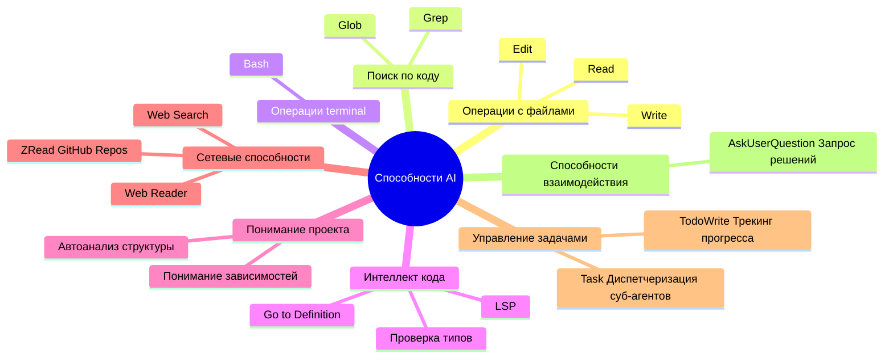
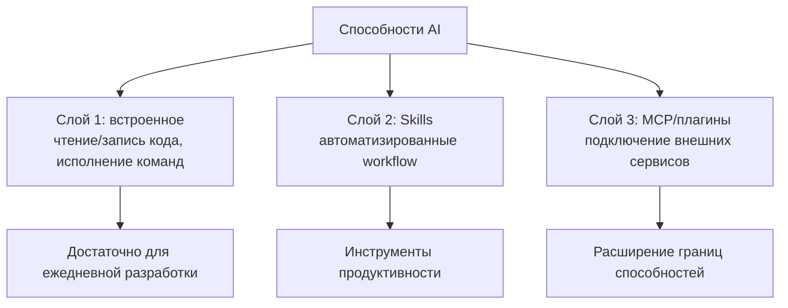

# 2.3 MCP, плагины и Skills 🟡

> **Прочитав этот раздел, вы узнаете:**
> - Различия и сценарии применения MCP, плагинов и Skills — и как выбирать под свои потребности
> - Способы установки из магазина плагинов и обзор частых плагинов (typescript-lsp, frontend-design, feature-dev и др.)
> - Настройку и аутентификацию MCP-серверов: подключение к базам данных, API, GitHub
> - Как работают Skills и ключевые моменты их создания: умение собирать переиспользуемые skill-пакеты
> - Развитие security-сознательности и умение настраивать разумные ограничения прав для MCP и плагинов

Проект «Personal Douban» Сяомина уже работает. Но он заметил несколько проблем: каждый раз, когда просит AI проверить код, приходится заново описывать процесс ревью; он хочет, чтобы AI напрямую запрашивал данные из базы, но AI говорит, что не может; друг порекомендовал плагин `frontend-design`, помогающий AI генерировать более красивые интерфейсы, но как его установить — непонятно.

Этот раздел решает эти три проблемы. Им соответствуют три способа расширения: **Skills** (пусть AI запоминает workflow), **MCP** (пусть AI подключается к внешним сервисам) и **плагины** (готовые наборы первых двух, ставящиеся одним кликом).

> Как говорилось в предисловии: «Skills определяют кастомные инструкции» и «MCP позволяет AI подключать внешние инструменты». В большинстве случаев нужно лишь **установить и использовать готовые MCP-серверы**, а не разрабатывать свои.

::: tip 🎯 Обзор возможностей Claude Code
Хотите понять все возможности Claude Code в части MCP, плагинов и Skills? Загляните на **[cclog.vibevibe.cn](https://cclog.vibevibe.cn)** — там вся история фич с v0.2 до v2.1, включая эволюцию экосистемы MCP, развитие системы плагинов и улучшения механики Skills.
:::

::: tip Путь обучения новичка

**Если вы новичок**, рекомендуется учиться в таком порядке:

1. Сначала разберитесь со встроенными способностями (следующий раздел главы) → покрывают большинство сценариев
2. Когда понадобятся внешние сервисы, приоритет — установка плагинов (проще настройки MCP)
3. Освоившись, настраивайте MCP под конкретные потребности
4. И только потом создавайте собственные Skills (продвинутый контент)

**Ключевой принцип**: по возможности встроенное, расширения — только по необходимости; по возможности плагины вместо ручной настройки.

:::

**Навигация по ресурсам**:
- Маркетплейс плагинов: [claude-plugins.dev](https://claude-plugins.dev/) — обзор и поиск плагинов
- Маркетплейс Skills: [skillsmp.com](https://skillsmp.com/zh) — каталог с поиском по 2300+ Skills
- Agent Skills: [agentskills.io](https://agentskills.io/home) — спецификация и маркетплейс Agent Skills
- Официальная библиотека плагинов: [GitHub - anthropics/claude-code/plugins](https://github.com/anthropics/claude-code/tree/main/plugins)
- Официальная библиотека Skills: [GitHub - anthropics/skills](https://github.com/anthropics/skills)

## Пререквизиты

Сяомин хочет, чтобы AI запрашивал базу данных. Для этого нужен «провод», соединяющий AI и базу—

::: tip Что такое MCP

**MCP** = подключение внешних инструментов

MCP (Model Context Protocol) позволяет AI подключаться к внешним сервисам (базы данных, API, файловые системы и др.). MCP можно настроить отдельно или упаковать в плагин.

:::

Но ручная проводка довольно муторна. Есть ли способ проще? Да—

::: tip Что такое плагины

**Плагины** = контейнеры расширений (единицы дистрибуции)

Плагины — пакеты возможностей, которые могут включать Skills, Commands, Agents, Hooks и MCP-серверы. Установка через магазин плагинов одним кликом — проще ручной настройки MCP.

| Потребность | Рекомендуемый подход |
|------|-------------------|
| Интеллект кода (LSP) | Установить плагин |
| Подключение к внешним сервисам | Настроить MCP или установить плагин с MCP |
| Автоматизированные workflow | Создать или установить Skills |
| Установка нескольких функций одним кликом | Установить плагин |

**Ключевой принцип**: по возможности плагины вместо ручной настройки MCP; по возможности встроенное вместо расширений.

:::

Проблема подключения к внешним сервисам решена. Но есть и другой тип потребностей: чтобы AI запомнил ваш workflow—

::: tip Что такое Skills

**Skills** = переиспользуемые пакеты AI-навыков

Skills определяют конкретные способности через файлы `SKILL.md`. Claude автоматически решает, использовать ли их, по содержанию запроса.

**Способы вызова**:
- **Skills**: вызов моделью — AI решает сам на основе описания
- **Slash-команды**: вызов юзером — пользователь печатает явно

:::

**Не уверены, что выбрать? Попробуйте этот гайд решений:**

<MCPDecisionTree />

### Границы способностей AI, которые нужно знать

Прежде чем ставить расширения, поймите одно: AI уже многое умеет из коробки. Многие спешат ставить плагины, когда встроенного достаточно. Таблица ниже поможет быстро оценить—

**Что AI умеет**:

| AI умеет | AI не умеет |
|-----------|--------------|
| Читать любой файл вашего проекта | Получать доступ к произвольным путям компьютера |
| Запускать разрешённые вами команды | Исполнять операции, требующие GUI |
| Понимать структуру и логику кода | «Помнить» содержание прошлых бесед |
| Подключаться к настраиваемым вами сервисам | Обходить системные security-ограничения |
| Автоматически выбирать подходящие инструменты | Угадывать ваши мысли (поэтому формулируйте явно) |

:::tip Ключевой инсайт
**Вам нужно лишь сказать AI, что вы хотите сделать — AI сам выберет подходящий метод. Не нужно знать, использует ли AI Read (чтение файла), Edit (правка файла), Grep (поиск контента), Glob (поиск файлов) или Bash (запуск команд), и даже Python (запуск скриптов).**
:::
**Детали инструментов запоминать не нужно**

| Не нужно помнить | Причина |
|------------------------|--------|
| Имена инструментов (Read, Edit, Grep...) | AI выбирает автоматически |
| Специфичный синтаксис конфигурации | Пусть AI сверится с официальной докой и сгенерирует |
| Все доступные MCP/plugин-серверы | Поиск и установка по мере надобности |

**Достаточно ясно описать желаемое на естественном языке.**

## Какими способностями обладает AI

Прежде чем настраивать MCP или Skills, помните: **у AI уже много встроенных способностей**.

::: details Посмотреть полный список встроенных инструментов



### Инструменты по категориям

**1. Инструменты работы с файлами** — фундамент чтения/записи кода

| Способность | Инструмент | Пример |
|------------|------|---------|
| Прочитать файл | Read | «Прочитай package.json» |
| Изменить файл | Edit | «Переименуй функцию в xxx» |
| Создать файл | Write | «Создай новый компонент» |

**2. Инструменты поиска** — найти нужное

| Способность | Инструмент | Пример |
|------------|------|---------|
| Искать по содержимому кода | Grep | «Найди все TODO» |
| Найти файлы | Glob | «Найди все .ts файлы» |

**3. Terminal-инструменты** — исполнение команд

| Способность | Инструмент | Пример |
|------------|------|---------|
| Запустить команды | Bash | «Запусти pnpm test» |

**4. Интеллект кода** — требует дополнительного плагина

| Способность | Плагин | Пример |
|------------|--------|---------|
| Проверка типов TypeScript/JavaScript, go-to-definition | typescript-lsp | «Где определена эта функция?» |
| Проверка типов Python, автодополнение | pyright-lsp | «Какой тип у этого класса?» |


Способности LSP (Language Server Protocol) **не встроены** и требуют установки плагина:

```bash
# Открыть интерфейс управления плагинами
/plugin

# Найти typescript-lsp или pyright-lsp и установить
```

Поддерживаемые языки: TypeScript, JavaScript, Python, Rust, Go, C/C++, C#, PHP, Java, Ruby, Swift и др.


**5. Понимание проекта** — автоматический анализ

| Способность | Инструмент | Пример |
|------------|------|---------|
| Анализ структуры, понимание зависимостей | Автоанализ | «Проанализируй структуру проекта» |

**6. Сетевые способности** — требуют настройки MCP/плагина

| Способность | Инструмент | Нужна настройка |
|------------|------|------------------------|
| Читать содержимое веб-страниц | Web Reader MCP | ✅ |
| Поиск в интернете | Web Search MCP | ✅ |
| Читать repository GitHub | ZRead MCP | ✅ |


**Что AI может читать**:
- ✅ Публичные веб-ссылки (через MCP/плагины)
- ✅ Файлы repository GitHub (через ZRead MCP)
- � Сайты документации (через Web Reader MCP)

**Что AI не может читать**:
- ❌ Страницы, требующие логина
- ❌ Локальные пути файлов (вне каталога проекта)
- ❌ Сайты за firewall'ами


**7. Управление задачами** — AI использует автоматически, вы видите результат

| Способность | Инструмент | Нужно ли вам знать? |
|------------|------|----------------------|
| Трекинг прогресса многошаговых задач | TodoWrite | ❌ AI использует сам, вы видите прогресс |
| Вызов general суб-агента для сложных задач | Task | ❌ AI вызывает сам, знать не нужно |

**8. Способности взаимодействия** — AI использует автоматически, вы просто отвечаете

| Способность | Инструмент | Нужно ли вам знать? |
|------------|------|----------------------|
| Задавать вам вопросы для решений | AskUserQuestion | ❌ AI использует сам, вы просто отвечаете |


### Критерий решения: встроенные инструменты или расширения?

```bash
# ✅ Сценарии, где достаточно встроенных инструментов
"Прочитать и проанализировать файл"      → Инструмент Read
"Запустить команду и обработать результат"   → Инструмент Bash
"Реализовать функцию"        → Просто опишите задачу, AI спланирует сам

# ❌ Сценарии, требующие расширений
"Запросить базу PostgreSQL"     → Нужен MCP/плагин
"Прочитать документ Google Drive"     → Нужен MCP/плагин
"Вызвать Slack API для отправки сообщений"    → Нужен MCP/плагин
```

**Когда использовать расширения**:

| Потребность | Подход |
|------|----------|
| ✅ Запросы к базе данных | MCP/плагин |
| ✅ Веб-поиск | MCP/плагин |
| ✅ Чтение внешних API | MCP/плагин |
| ✅ Повторяющиеся сложные workflow | Skills |
| ❌ Разовые задачи | Просто естественный язык |

Если ваша потребность на стороне «нужно расширение» — простейший путь это установка плагина.

:::

## Плагины: простейший способ расширения

Сяомин увидел, как кто-то в сообществе генерирует через Claude Code красивые frontend-интерфейсы. Расспросив, узнал: установлен плагин `frontend-design`. Он тоже хочет попробовать.

::: tip Плагин или MCP?

Вы хотите, чтобы AI подключился к базе PostgreSQL.

**Через плагин**:
```bash
/plugin
# Ищем postgres, Space — выбрать, i — установить
# Готово, сразу используем
```

**Через MCP**:
```bash
# Найти документацию по настройке
# Отредактировать .mcp.json
# Проверить корректность формата
# Перезапустить Claude Code
```

**Функционально одно и то же**, но плагин экономит 5 минут.

| Ваша ситуация | Выбор | Причина |
|---------|--------|------|
| Хотите быстро попробовать | **Плагин** | Установка одним кликом, ноль настройки |
| Нужно кастомизировать параметры | MCP | Ручное редактирование, гибкий контроль |
| Командная работа | Любой | Плагин прост, MCP прозрачен |

**Рекомендация**: начните с плагинов, переходите на MCP, если их не хватит.

:::

### Способы установки

**Способ 1: через магазин плагинов (рекомендуется)**

```bash
/plugin 
# Открыть интерфейс управления плагинами, найти нужный, Space — выбрать, i — установить
```

**Способ 2: установка командой**

```bash
# Пример
/plugin install frontend-design@anthropics
```

**Если не нашли нужный плагин — попробуйте добавить маркетплейс, где он размещён**

```bash
# Добавить маркетплейс
/plugin marketplace add your-org/claude-plugins

# Обзор доступных плагинов
/plugin
```

### Рекомендуемые плагины

::: tip Рекомендуемые плагины (обязательно к прочтению новичками)

Новикам стоит начать с этих плагинов:

**Базовая разработка**:
- `typescript-lsp` - проверка типов TypeScript/JavaScript, автодополнение, go-to-definition
- `pyright-lsp` - проверка типов и интеллект кода Python
- `frontend-design` - генерация качественных frontend-интерфейсов

**Workflows**:
- `feature-dev` - полный workflow разработки функций
- `pr-review-toolkit` - набор для ревью PR
- `commit-commands` - workflow Git-коммитов

**Установка**:
```bash
# Открыть интерфейс управления плагинами, найти и установить перечисленные
/plugin
```

:::


::: details Полный список рекомендаций плагинов

#### LSP-серверы языков (интеллект кода)

| Плагин | Функция |
|------|------|
| **typescript-lsp** | Проверка типов TS/JS, автодополнение, go-to-definition |
| **pyright-lsp** | Проверка типов и интеллект кода Python |
| **rust-analyzer-lsp** | Языковой сервер Rust, интеллект и анализ кода |
| **gopls-lsp** | Языковой сервер Go, интеллект кода и рефакторинг |
| **clangd-lsp** | Языковой сервер C/C++, интеллект кода |
| **csharp-lsp** | Языковой сервер C#, интеллект кода |
| **php-lsp** | Языковой сервер PHP (Intelephense), интеллект кода |
| **swift-lsp** | Языковой сервер Swift (SourceKit-LSP), интеллект кода |
| **jdtls-lsp** | Языковой сервер Java, интеллект кода |
| **lua-lsp** | Языковой сервер Lua, интеллект кода |

#### Workflows разработки

| Плагин | Функция |
|------|------|
| **frontend-design** | Генерация качественных frontend-интерфейсов без «типовой AI-эстетики» |
| **feature-dev** | Полный workflow разработки функций (7 фаз: discovery, исследование, уточнение, дизайн, реализация, ревью, итоги) |
| **pr-review-toolkit** | Набор ревью PR: качество кода, тестирование, обработка ошибок |
| **commit-commands** | Упрощённый Git-workflow: commit, push, PR одной командой |
| **ralph-wiggum** | Техника итеративного AI-цикла разработки |

#### Качество кода и security

| Плагин | Функция |
|------|------|
| **code-review** | Автоматизированное code review: мульти-специалисты анализируют параллельно, фильтрация ложных срабатываний по скорингу уверенности |
| **security-guidance** | Security-хуки напоминаний: предупреждения об инъекциях команд, XSS, небезопасных паттернах кода |
| **hookify** | Автосоздание hooks, предотвращение плохого поведения через анализ паттернов беседы или явных инструкций |

#### Наборы инструментов разработки

| Плагин | Функция |
|------|------|
| **agent-sdk-dev** | Набор разработки Agent SDK: создание и валидация приложений Python/TypeScript Agent SDK |
| **plugin-dev** | Набор разработки плагинов: hooks, интеграция MCP, структура плагина, публикация в маркетплейс |

#### Стили вывода

| Плагин | Функция |
|------|------|
| **explanatory-output-style** | Объяснительный стиль вывода: детальный разбор мышления и решений AI |
| **learning-output-style** | Обучающий вывод: интерактивное обучение с образовательными инсайтами |

#### Примеры и шаблоны

| Плагин | Функция |
|------|------|
| **example-plugin** | Шаблон-пример разработки плагина |

**Установка**: введите `/plugin`, найдите и установите нужные плагины.

:::


После установки плагина просто опишите потребность естественным языком — дополнительная настройка не нужна. Но если в магазине нет нужной функциональности — например, подключения к конкретной базе или API — придётся настроить MCP самостоятельно.

### Использование плагинов

После установки плагины автоматически встраиваются в способности AI, без лишней настройки:

```bash
# Frontend-дизайн (после установки frontend-design)
"Создай страницу логина юзера в современном дизайн-стиле"

# Разработка функций (после установки feature-dev)
"Разработай функцию комментариев по workflow feature-dev"

# Code review (после установки pr-review-toolkit)
"Проверь этот код набором PR-ревью"
```
### Структура плагина

::: details Структура каталога плагина

Плагин — npm-пакет, содержащий следующие компоненты:

```
my-plugin/
├── .claude-plugin/
│   ├── plugin.json          # Метаданные плагина
│   └── marketplace.json     # Листинг маркетплейса (опционально)
├── commands/                 # Кастомные slash-команды (опционально)
│   └── hello.md
├── agents/                   # Кастомные агенты (опционально)
│   └── helper.md
├── skills/                   # Skills агентов (опционально)
│   └── my-skill/
│       └── SKILL.md
├── hooks/                    # Обработчики событий (опционально)
│   └── hooks.json
└── .mcp.json                # Настройка MCP-серверов (опционально)
```

**Описание компонентов**:
- **plugin.json**: метаданные плагина (имя, описание, версия, автор)
- **commands/**: кастомные slash-команды (Markdown-файлы)
- **agents/**: определения суб-агентов
- **skills/**: skills агентов (файлы SKILL.md)
- **hooks/**: обработчики событий (hooks.json)
- **.mcp.json**: настройка MCP-серверов

:::

### Управление плагинами

::: details Команды управления

```bash
# Просмотр установленных плагинов
/plugin

# Включить отключённый плагин
/plugin enable plugin-name@marketplace-name

# Отключить без удаления
/plugin disable plugin-name@marketplace-name

# Удалить плагин
/plugin uninstall plugin-name@marketplace-name
```

:::

::: details Командная работа

Настраивайте плагины на уровне repository, чтобы вся команда работала единым инструментарием.

**Настройка командных плагинов**:

1. Добавьте конфигурацию маркетплейса и плагинов в `.claude/settings.json` вашего repository
2. Члены команды доверяют папке repository
3. Плагины автоматически устанавливаются для всех

**Пример настройки** (`.claude/settings.json`):

```json
{
  "pluginMarketplaces": [
    {
      "source": "your-org/claude-plugins"
    }
  ],
  "plugins": [
    {
      "name": "formatter",
      "marketplace": "your-org"
    }
  ]
}
```

:::

## MCP: подключение к внешним сервисам

Сяомин дошёл до backend-фазы проекта, и ему нужно, чтобы AI помог запрашивать данные юзеров из PostgreSQL. Он пробует: «проверь, сколько юзеров в базе» — и AI отвечает: «У меня нет способности доступа к базам».

Эту проблему и решает MCP. Представляйте MCP как **кабель данных**: один конец — в AI, другой — во внешний сервис (базы, GitHub, Figma...). Без этого кабеля AI, каким бы умным ни был, не дотянется до внешних данных.

::: warning Обязательно прочитать перед установкой

**Про совместимость**: MCP **не универсален** между разными CLI-инструментами, способы установки могут различаться.

**Про способы установки**:
- **Внутри IDE**: обычно есть MCP-маркетплейс для прямой установки
- **CLI-инструменты**: ручная настройка через конфиг-файлы
- **Инструменты one-click настройки**: например, конфиг-инструмент GLM, автоматически предустанавливающий некоторые MCP

**Про аутентификацию**: некоторым MCP нужен API Key (например, OpenAI, Stripe, GitHub) — его нужно предоставить при настройке.

:::

::: tip MCP, включённые по умолчанию в one-click конфиг-инструмент GLM

При использовании one-click конфиг-инструмента GLM автоматически устанавливаются:

| MCP | Функция |
|-----|----------|
| **Vision MCP** | Анализ изображений (скриншоты, дизайн-макеты и др.) |
| **Web Search MCP** | Веб-поиск для получения свежей информации |
| **Web Reader MCP** | Чтение контента веб-ссылок |
| **ZRead MCP** | Чтение файлов и каталогов repository GitHub |

Это самые частые сетевые способности в разработке — готовы к использованию из коробки.

:::

### Популярные MCP-серверы

| Категория | MCP | Функция |
|----------|-----|----------|
| **Разработка и отладка** | [GitHub MCP](https://github.com/github/github-mcp-server) | Операции с repository, PR, Issues и CI-workflows |
| | [Chrome DevTools MCP](https://github.com/ChromeDevTools/chrome-devtools-mcp) | Управление браузером: отладка страниц, анализ сети, автопроверки |
| | [ShadCN MCP](https://www.shadcn.com.cn/docs/mcp) | Генерация готовых React + Tailwind UI-компонентов |
| | [Semgrep MCP](https://semgrep.dev/docs/mcp) | Статическое security-сканирование кода и проверка правил |
| **Базы данных** | [PostgreSQL MCP](https://github.com/crystaldba/postgres-mcp) | Настраиваемый доступ на чтение/запись и анализ производительности |
| | [Neon MCP](https://neon.com/docs/ai/neon-mcp-server) | Создание и управление serverless PostgreSQL-базами по запросу |
| | [Supabase MCP](https://supabase.com/docs/guides/getting-started/mcp) | Комбинированный backend: auth, база, storage и real-time |
| **Deploy и хостинг** | [Vercel MCP](https://vercel.com/docs/mcp) | Автоматический deploy frontend-приложений и генерация preview-окружений |
| | [Cloudflare MCP](https://github.com/cloudflare/mcp-server-cloudflare) | Управление ресурсами edge-компьютинга (Workers, KV, R2) |
| **Дизайн и медиа** | [Figma MCP](https://developers.figma.com/docs/figma-mcp-server/remote-server-installation/) | Чтение и модификация Figma-файлов: автоматизация design-to-code |
| | [Replicate MCP](https://mcp.replicate.com/) | Вызов API генерации изображений для создания иллюстраций |
| **Документация и контекст** | [Context7 MCP](https://context7.com/docs/overview) | Превращение свежей официальной документации в надёжный контекст |
| | [Ref MCP](https://ref.tools/mcp) | Аналог Context7, снижает галлюцинации AI |
| **Платежи** | [Stripe MCP](https://docs.stripe.com/mcp) | Автоматизация создания платежей, подписок и Webhooks |

**Заметка**: некоторым MCP нужен API Key. Больше MCP-серверов — в [коллекции MCP](https://github.com/modelcontextprotocol/servers).

:::
Поскольку MCP-серверы часто обновляются, рекомендуется переходить по ссылкам выше или искать актуальные инструкции на официальных сайтах.
:::

### Использование MCP

```bash
# Запрос к базе
"Запроси PostgreSQL: количество регистраций юзеров за последние 7 дней"

# Чтение из GitHub
"Проверь состояние repository: последние 5 PR"

# Веб-поиск
"Поищи: что нового в Next.js 16"

# Чтение файлов
"Прочитай /path/to/file.md и суммируй содержание"
```

Когда MCP настроен, AI может напрямую оперировать внешними сервисами. Но, возможно, вы заметили: MCP решает проблему «подключения» — позволяет AI дотянуться до внешних данных. Есть и другой тип потребностей, который он не решает: **заставить AI запомнить ваши workflow**. Каждый раз заново описывать процесс ревью кода неэффективно. Это проблема, которую решают Skills.

### Другие способы установки

::: details Добавление из JSON-конфигурации

Если у вас есть JSON-конфигурация MCP-сервера, можно добавить её напрямую:

```bash
# Базовый синтаксис
claude mcp add-json <name> '<json>'

# Пример: добавить HTTP-сервер с JSON-конфигурацией
claude mcp add-json weather-api '{"type":"http","url":"https://api.weather.com/mcp","headers":{"Authorization":"Bearer token"}}'

# Пример: добавить stdio-сервер с JSON-конфигурацией
claude mcp add-json local-weather '{"type":"stdio","command":"/path/to/weather-cli","args":["--api-key","abc123"],"env":{"CACHE_DIR":"/tmp"}}'
```

:::


::: details Просмотр установки и настройки

### Три способа установки


#### Вариант 1: добавить удалённый HTTP-сервер (рекомендуется)

HTTP-серверы — рекомендуемый вариант подключения к удалённым MCP. Это самый широко поддерживаемый транспорт для облачных сервисов.

```bash
# Базовый синтаксис
claude mcp add --transport http <name> <url>

# Реальный пример: подключение к Notion
claude mcp add --transport http notion https://mcp.notion.com/mcp

# Пример с Bearer-токеном
claude mcp add --transport http secure-api https://api.example.com/mcp \
  --header "Authorization: Bearer your-token"
```


#### Вариант 2: добавить локальный stdio-сервер

Stdio-серверы запускаются как локальные процессы на вашем компьютере. Идеальны для инструментов, которым нужен прямой системный доступ или кастомные скрипты.

```bash
# Базовый синтаксис
claude mcp add --transport stdio <name> <command> [args...]

# Реальный пример: добавить сервер Airtable
claude mcp add --transport stdio airtable --env AIRTABLE_API_KEY=YOUR_KEY \
  -- npx -y airtable-mcp-server
```


##### tip Понимание аргумента «--»

`--` (двойное тире) отделяет флаги CLI-инструмента от команды и аргументов, передаваемых MCP-серверу. Всё до `--` — опции инструмента (вроде `--env`, `--scope`), всё после `--` — команда запуска MCP-сервера.

Например:
- `claude mcp add --transport stdio myserver -- npx server` → запускает `npx server`
- `claude mcp add --transport stdio myserver --env KEY=value -- python server.py --port 8080` → запускает `python server.py --port 8080` с `KEY=value` в окружении

Это предотвращает конфликты между флагами инструмента и флагами сервера.


##### Пользователям Windows

На нативном Windows (не WSL) локальным MCP-серверам на `npx` нужна обёртка `cmd /c` для корректного исполнения.

```bash
# Это создаст command="cmd", который Windows сможет исполнить
claude mcp add --transport stdio my-server -- cmd /c npx -y @some/package
```

Без обёртки `cmd /c` вы получите ошибки «connection closed», потому что Windows не может напрямую исполнить `npx`.


:::

### Управление MCP-серверами

Просто введите `/mcp` и следуйте подсказкам.

:::

### Аутентификация MCP

::: details Настройка OAuth-аутентификации

Многим облачным MCP-серверам нужна аутентификация. Claude Code поддерживает OAuth 2.0 для безопасного подключения.

```bash
# 1. Добавить сервер, требующий аутентификации
claude mcp add --transport http sentry https://mcp.sentry.dev/mcp

# 2. Использовать команду /mcp в Claude Code
> /mcp

# 3. Следовать шагам входа в браузере
```
:::
- Токены аутентификации хранятся безопасно и обновляются автоматически
- «Clear Authentication» в меню `/mcp` отзывает доступ
- Скопируйте выданный URL, если браузер не открылся автоматически
- OAuth-аутентификация работает для HTTP-серверов
:::


### Промпты MCP

::: details @ MCP 

Можно использовать @-упоминания для ссылок на MCP-ресурсы — как на файлы.

**Формат ссылки**: `@server:protocol://resource/path`

```bash
# Ссылка на конкретный ресурс
> "Можешь проанализировать @github:issue://123 и предложить фикс?"
> "Проверь документацию API: @docs:file://api/authentication"

# Несколько ссылок на ресурсы
> "Сравни @postgres:schema://users и @docs:file://database/user-model"
```
:::
- Ресурсы автоматически подтягиваются при упоминании
- Пути ресурсов поддерживают нечёткий поиск в автодополнении @
- Claude Code автоматически предоставляет инструменты листинга и чтения MCP-ресурсов, когда сервер их поддерживает


:::

::: details Использование MCP-промптов как slash-команд

MCP-серверы могут предоставлять промпты, появляющиеся в Claude Code как slash-команды.

**Формат команды**: `/mcp__servername__promptname`

```bash
# Исполнить промпт без параметров
> /mcp__github__list_prs

# Исполнить промпт с параметрами
> /mcp__github__pr_review 456
> /mcp__jira__create_issue "Bug в flow логина" high
```
:::
- MCP-промпты динамически обнаруживаются на подключённых серверах
- Параметры парсятся по аргументам, определённым в промпте
- Результаты промптов инжектятся напрямую в беседу
- Имена серверов и промптов нормализуются (пробелы становятся подчёркиваниями)
:::


## Skills: кастомные workflow

Сяомину приходилось каждый раз повторять одни и те же требования, прося AI поревьюить код: «Сначала запусти тесты, потом проверь типы, потом поищи забытые console.log, и в конце проверь security». После десяти повторений это стало раздражать.

Хуже того: в каждой новой сессии AI забывал этот workflow. Приходилось начинать с нуля.

Представьте: в компанию пришёл новый стажёр — способный, но с амнезией каждое утро. Процесс ревью, которому вы научили его вчера, придётся учить заново сегодня. Что делать? Написать чек-лист инструкций и повесить на стену: каждый день он заходит, бросает взгляд — и знает, что делать.

**Skills — это тот самый чек-лист на стене**, только не для человека, а для AI.

::: tip Сценарий: ежедневные повторяющиеся форматы

Вы пишете ежедневные отчёты в фиксированном формате: дата, сделанное, план на завтра. Описывать формат каждый раз надоедает.

**Skills решают это**: запишите требования к формату в `SKILL.md` — и дальше просто говорите «напиши ежедневный отчёт», AI автоматически выводит в правильном формате.

**Skills** = ваши персонализированные шаблоны инструкций

**Два способа использования**:

| Способ | Пример | Кто решает |
|--------|---------|-------------|
| **Автотриггер** | Сказать «напиши ежедневный отчёт» → AI автоматически использует Skill daily-report | AI решает |
| **Slash-команда** | Ввести `/daily-report` | Вы решаете |

**Рекомендации новичкам**:
1. Начните с готовых (встроенных в плагины или скачанных)
2. Создавайте свои, когда появятся повторяющиеся потребности
3. Для командного шаринга кладите в каталог проекта

:::

**Почему Skills особенно важны для Vibe Coders?**

Раньше вы учили AI что-то делать в беседе — и он забывал после раунда. В новой сессии всё заново. Skills меняют это: **ваш опыт больше не разовая беседа, а переиспользуемые интеллектуальные активы**. Накопленные вами workflow не исчезают с концом сессии.

Это и есть самое большое отличие Skills от традиционных скриптов автоматизации. Скрипты жёсткие: шаг 1, потом шаг 2, затык при сюрпризах. Skills гибкие — скорее набор направляющих принципов, которые AI подстраивает под обстоятельства. Например, ваш Skill ревью говорит «проверь покрытие тестами», а в этом проекте тестового фреймворка ещё нет — AI не зависнет с ошибкой, он скажет «предлагаю сначала настроить тестовый фреймворк» и продолжит остальные проверки.

**Когда создавать Skills**:

| Ваша ситуация | Решение |
|----------------|----------|
| Ежедневные повторяющиеся задачи в одном формате | Создайте Skill: настроил один раз — пользуешься вечно |
| Правила, которые должны жить между сессиями | Напишите как Skill — будет действовать автоматически |
| Команде нужен единый формат вывода | Skill уровня проекта, общий для всех |

**Ресурсы по Skills**:
- [skillsmp.com](https://skillsmp.com/zh) — каталог с поиском по 2300+ Skills (китайский)
- [agentskills.io](https://agentskills.io/home) — спецификация и маркетплейс Agent Skills
- [github.com/anthropics/skills](https://github.com/anthropics/skills) — официальная библиотека Skills


### Как получить Skills

**Из плагинов** (рекомендуется новичкам)

Многие плагины включают Skills, автоматически становящиеся доступными после установки:

```bash
# После установки плагина входящие в него Skills загружаются автоматически
/plugin install feature-dev@anthropics
```

**Создать свои** (продвинуто)

Два способа:

| Способ | Сценарий |
|--------|----------|
| Определить в беседе | Разовые потребности, быстрое тестирование |
| Создать файл SKILL.md | Долгосрочное использование, шаринг между проектами |

### Создание Skills

**Кодить не нужно — просто опишите словами**

Многие думают, что создание Skills требует программистских навыков. Нет: `SKILL.md` — это по сути естественный язык. Вы описываете workflow, и AI может исполнять по описанию.

Причём не нужно добиваться идеала с первой попытки. Посмотрите, как Сяомин итеративно создавал Skill code review:

**Раунд 1** — Сяомин говорит AI:
```
Помоги создать Skill code review, который проверяет type safety и покрытие тестами.
```
AI сгенерировал первый драфт `SKILL.md`. Сяомин протестировал и заметил: security-проверок нет.

**Раунд 2** — Сяомин продолжает:
```
Добавь security-проверки, особенно XSS и SQL-инъекции.
```
AI обновил Skill. Новая проверка: функционально верно, но вывод — плоский текст, некрасиво.

**Раунд 3** — Сяомин добавляет ещё одно:
```
Выводи результаты ревью таблицами Markdown с уровнем серьёзности для каждой проблемы.
```
Финальная версия готова. За весь процесс Сяомин не написал ни строки кода — всё устно, AI помог превратить естественный язык в исполняемый Skill.

**Ключевое мышление**: не гонитесь за идеалом с первой попытки. Сначала заставьте работать, потом скажите AI, что поправить. Подход «строим, тестируем, дотачиваем на ходу» эффективнее, чем пытаться спроектировать идеальный Skill с самого начала.

::: tip Структура файла SKILL.md

```yaml
---
name: your-skill-name
description: Краткое описание, что делает Skill и когда его использовать
---

# Название вашего Skill

## Instructions
Дайте AI ясные пошаговые указания.

## Examples
Покажите конкретные примеры использования Skill.
```

**Требования к полям**:

* `name`: только строчные буквы, цифры и дефисы (максимум 64 символа)
* `description`: краткое описание Skill и случаев применения (максимум 1024 символа)

**Советы по созданию**:

| Совет | Описание |
|-----|-------------|
| **Лаконичность** | Считайте, что AI уже умён — добавляйте только отсутствующий у него контекст |
| **Именование** | Используйте герундий: `testing-code`, `processing-files` |
| **Описание** | Третье лицо: функция и момент применения: «Использовать, когда...» |
| **Конкретность** | Включайте в description функцию Skill, момент применения и ключевые термины |
| **Гибкость** | Высокая (текстовые инструкции) → Средняя (псевдокод) → Низкая (точные скрипты) |

**Ограничение доступа к инструментам через allowed-tools**:

```yaml
---
name: safe-file-reader
description: Read files without making changes. Use when you need read-only file access.
allowed-tools: Read, Grep, Glob
---

# Safe File Reader

This Skill provides read-only file access.

## Instructions
1. Use Read to view file contents
2. Use Grep to search within files
3. Use Glob to find files by pattern
```

:::
**Места хранения Skills**:

```bash
# Персональные Skills (доступны во всех проектах)
~/.claude/skills/

# Проектные Skills (только текущий проект)
.claude/skills/

# Плагинные Skills (автодоступны при установленном плагине)
# каталог skills/ внутри пакета плагина
```

**Сценарии использования**:

| Место | Сценарий |
|----------|----------|
| **Персональные Skills** | Ваши личные workflow и предпочтения, экспериментальные Skills, инструменты личной продуктивности |
| **Проектные Skills** | Командные workflow и конвенции, специфика проекта, общие утилиты и скрипты |
| **Плагинные Skills** | Автодоступны при установленном плагине, каталог skills/ внутри пакета |### Шаринг Skills с командой ⭐

::: tip Рекомендуемый подход

**Шаринг через repository проекта** (проще всего):

Положите файлы Skill в каталог `.claude/skills/` проекта и закоммитьте в Git. После git pull у членов команды Skill сразу доступен.

**Конкретные шаги**:

1. Создайте папку `.claude/skills/` в корне проекта
2. Создайте в ней файл `SKILL.md` с содержанием Skill
3. Закоммитьте в Git и запушьте в удалённый repository
4. Члены команды делают `git pull` — Skill сразу доступен

**Почему рекомендуем**:

| Подход | Плюсы | Минусы |
|------|------|------|
| **Repository проекта** | Автосинхронизация, контроль версий, без лишних шагов | Нужны Git-коммиты |
| Дистрибуция плагином | Хорошо для больших команд, централизованное управление | Нужно создавать и поддерживать плагины |

Для большинства команд repository проекта — простейший подход.

:::

**Best practices**:

| Практика | Описание |
|---------|------|
| **Держите Skills сфокусированными** | Один Skill решает одну функцию |
| **Пишите ясные описания** | Помогайте AI обнаруживать, когда применять |
| **Тестируйте с командой** | Пусть коллеги используют и дают feedback |
| **Отслеживание версий** | Добавляйте историю версий в SKILL.md |

### Создание через беседу (временное решение)

```bash
# Определить в беседе
"Создай тест-workflow: запуск тестов, генерация покрытия, анализ падений"

# AI запомнит этот workflow на текущую сессию
# Для постоянного использования создайте файл SKILL.md
```

**А если возникнут проблемы?**

При создании и использовании Skills можно столкнуться с ситуациями:

- **AI не использует ваш Skill автоматически**: проверьте поле `description` в `SKILL.md` — чем конкретнее описание, тем легче AI определить момент применения. Разница между «инструмент code review» и «когда юзер отправляет код или просит ревью — запускай проверку типов, тесты и security-скан» огромна.
- **Skill прерывается на полпути**: обычно это сжатие контекста из-за длины. Не паникуйте — просто скажите AI «продолжи предыдущую задачу». Если сжатие случается часто, подумайте о разбиении одного большого Skill на несколько маленьких.
- **Результаты не соответствуют ожиданиям**: не переписывайте Skill с нуля — просто скажите AI, что не так и какого результата вы ждёте. AI поможет модифицировать `SKILL.md` — опять же, итерируйте, не гонясь за идеалом за один заход.

### Частые примеры Skills

| Skill | Функция | Сценарий |
|-------|------|----------|
| **Тест-workflow** | Запуск тестов и анализ | Ежедневное тестирование |
| **Code review** | Проверка типов и security | Ревью перед commit |
| **Генерация доков** | Генерация API-документации | После разработки интерфейсов |

### Использование готовых Skills

**Skills внутри плагинов**:

После установки плагина входящие в него Skills загружаются автоматически — доп настройка не нужна:

```bash
# Установить плагин
/plugin install feature-dev@anthropics

# AI автоматически распознаёт и использует Skills плагина
# Ручных действий не требуется
```

**Отладка Skills**:

```bash
# Проверить, загружены ли Skills
"Перечисли все доступные skills"

# Протестировать Skill
"Протестируй skill test-runner"
```

Теперь у вас полный набор расширений: плагины для установки одним кликом, MCP для внешних сервисов и Skills для закрепления workflow. Напоследок — вопросы безопасности.

## Вопросы безопасности

::: warning Security-настройка MCP

**MCP баз данных**:
- Используйте права read-only аккаунтов
- Не используйте права записи напрямую в production-окружении

**MCP файловой системы**:
- Ограничивайте пути доступа, открывайте только нужные каталоги
- Не разрешайте доступ к корневому каталогу `/`

**MCP GitHub**:
- Используйте токены с датой истечения
- Используйте минимальный scope прав (read-only или конкретные repository)
:::

::: warning Безопасность плагинов и Skills

**Безопасность плагинов**:
- Устанавливайте плагины только из доверенных источников
- Ревьюте исходный код плагина и запрашиваемые права
- Официальные плагины надёжнее

**Безопасность Skills**:
- Используйте `allowed-tools` для ограничения доступа к инструментам
- Read-only Skills стоит ограничить read-only инструментами
- Регулярно ревьюте и обновляйте Skills
:::

## FAQ

### Q1: Как выбирать между Skills, MCP и плагинами?

**О**: Зависит от потребностей.

| Потребность | Выбор |
|------|------|
| Автоматизировать workflow | Skills |
| Подключить внешние сервисы | MCP или плагин |
| Быстрые команды | Skills |
| Читать базы данных | MCP или плагин |
| Установка одним кликом | Плагин (проще) |
| Полный пакет функций | Плагин (включает commands+tools+workflows) |

**Приоритет**: плагин > MCP > Skills (от простого к сложному)

### Q2: Настройка MCP/плагина не работает?

**О**: Проверьте:

1. **Перезапустите инструмент**: настройка требует полного выхода и повторного запуска
2. **Проверьте npx**: убедитесь, что Node.js установлен и `npx` доступен
3. **Посмотрите логи**: Claude Desktop → Help → Developer → Toggle Logs
4. **Проверьте подключение**: строки подключения к базе, GitHub-токены корректны

### Q3: Как найти больше MCP/плагинов?

**О**: Официальные ресурсы:

- Repository MCP (https://github.com/modelcontextprotocol/servers)
- Команда `/plugin` для обзора магазина плагинов

### Q4: Могут ли MCP/плагины утечь мои данные?

**О**:

**Официальные MCP/plagин-серверы**:
- Открытый код, можно аудировать
- Обычно подключаются напрямую к целевым сервисам (например, GitHub API)
- Не маршрутизируются через сторонние серверы

**Сторонние MCP/plagин-серверы**:
- Ревьюте исходный код, чтобы понять обработку данных
- Аккуратно выдавайте права
- Используйте read-only токены

### Q5: AI не использует мой Skill?

**О**: Проверьте:

1. **Конкретно ли описание?**: размытые описания затрудняют обнаружение
2. **Валиден ли YAML?**: запустите валидацию на синтаксические ошибки
3. **Skill в правильном месте?**: проверьте путь файла
4. **Конфликтуют ли Skills?**: используйте разные триггер-слова, чтобы AI выбирал правильный Skill

## Ключевая философия

**Слои расширения способностей AI**:



**Помните**:
1. **Сначала встроенное**: пусть AI сначала использует встроенные способности
2. **Расширяйте по необходимости**: думайте о MCP/Skill только упершись в ограничения
3. **Сначала безопасность**: ограничивайте права, используйте read-only аккаунты
4. **Не усложняйте**: не перенастраивайте сверх меры

## Связанное

- Пререквизит: 2.2 VibeCoding Workflow
- Подробности: 2.4 Настройка правил проекта
- Расширение: [официальный repository MCP](https://github.com/modelcontextprotocol/servers)
- Расширение: [официальная документация плагинов](hhttps://github.com/anthropics/claude-plugins-official)
- Расширение: [официальная документация Agent Skills](https://code.claude.com/docs/zh-CN/skills)
