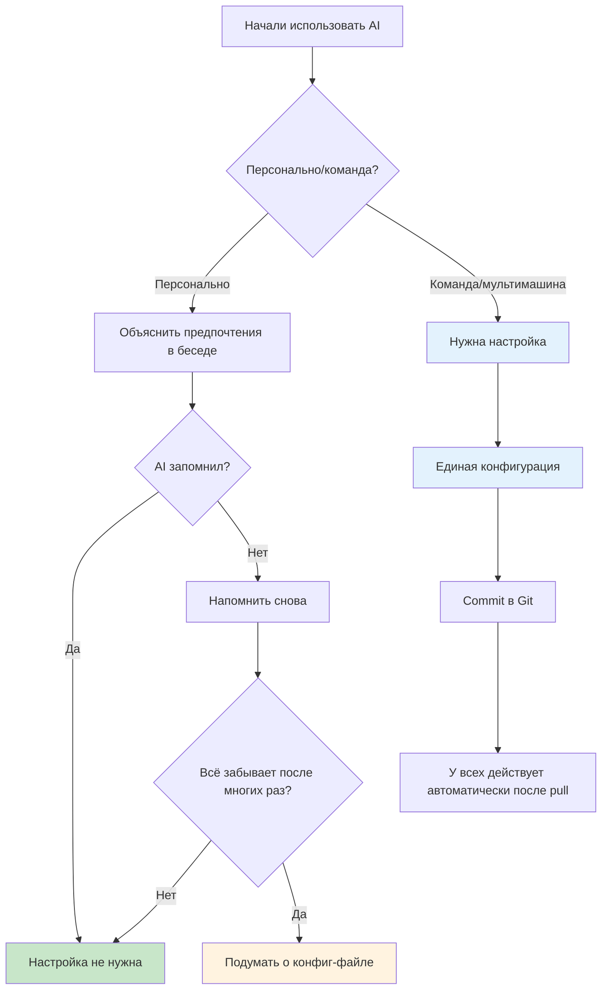
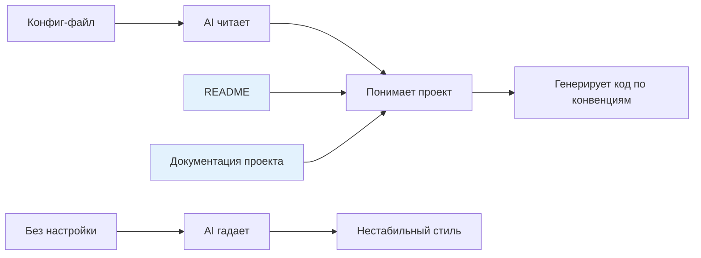
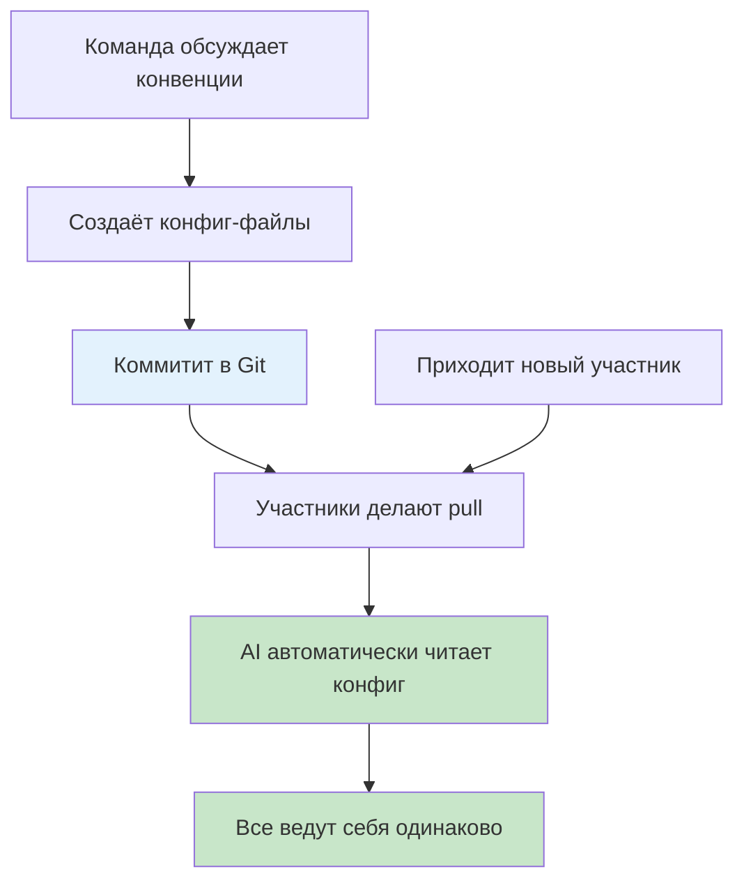
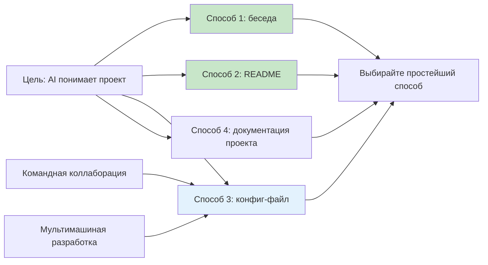

# 2.4 Настройка правил проекта 🟡

> **Прочитав этот раздел, вы получите:**
>
> - Понимание назначения и сценариев применения конфиг-файлов проекта
> - Освоение способов настройки CLAUDE.md и settings.json
> - Решения для шаринга конфигурации при командной работе/мультимашиныой разработке
> - Понимание, как работать с чувствительной информацией в конфигурации

> **Этот раздел обычно можно пропустить**. При персональной разработке AI поймёт проект из беседы и документации без дополнительной настройки.
>
> **Командная работа/мультимашиная разработка**: раздел очень полезен, когда нужно унифицировать окружение, конвенции, MCP, плагины и другие настройки.

::: warning Персональная разработка обычно не требует настройки

Прежде чем углубляться в конфиг-файлы, поймите:

1. **У AI есть память**: предпочтения, о которых вы говорите в беседе, будут запомнены
2. **Документации проекта достаточно**: README + проектная документация главы 3 обычно помогают AI понять проект
3. **Настройка — вспомогательна**: писать в конфиг-файлы стоит, только когда AI раз за разом забывает определённые правила

:::

## Когда нужна настройка

**Сценарий: AI опять забыл**

В 5-й раз вы напоминаете AI: «Не используй npm, используй pnpm». Он всё равно использует npm.

Вы понимаете: устные напоминания ненадёжны, нужны **писаные правила**.

**Флоу решения**:



**Быстрая оценка**:

| Ваша ситуация | Нужна настройка? | Почему |
|---------------|---------------------|-----|
| Персональный проект, AI помнит | ❌ Нет | Беседа — проще всего |
| Персональный проект, AI всё время забывает | ✅ Рекомендуется | Написать в CLAUDE.md — и готово раз навсегда |
| Разработка на нескольких компьютерах | ✅ Нужна | Синхронизация конфигурации, без повторной настройки |
| Командная работа | ✅ **Обязательна** | Единые конвенции, чтобы не было «почему у твоего AI всё по-другому» |

**Фокус раздела**: для командной работы/мультимашиныой разработки конфиг-файлы обеспечивают всем одинаковые правила.

:::

## Способ проще: пусть AI напишет

**Сценарий: нужно написать конфиг-файл, но формат незнаком**

Вы открываете документацию и видите кучу конфиг-пунктов. Головокружение.

**Просто попросите AI сгенерировать**:

```
Создай конфиг-файлы для моего командного проекта
по разделу 2.4 «AI Tuning Guide».

Инфо о проекте:
- Next.js 16 + TypeScript
- Используется библиотека компонентов shadcn/ui
- Менеджер пакетов pnpm
- Команда из 5 человек, нужны единые конвенции

Сгенерируй:
1. Описание проекта CLAUDE.md
2. Настройку прав .claude/settings.json
```

**Через 30 секунд** AI выдаст готовые конфиг-файлы — просто скопируйте.

**Почему быстрее, чем писать самому**:

| Вы пишете | AI генерирует |
|-----------|--------------|
| Смотреть доку → понять формат → писать руками → проверять | Описать потребности → скопировать результат |
| 15 минут | 30 секунд |

**Пререквизит**: дайте AI достаточно информации о проекте (tech stack, размер команды, спецтребования).

AI умеет писать конфиг-файлы — вам нужно лишь дать информацию о проекте.

:::

## Природа конфиг-файлов



**Ключевой принцип**: конфиг-файлы, README, документация проекта — всё это по сути **способы помочь AI понять проект**.

| Способ | Файл | Назначение | Необходимость |
|--------|------|---------|-----------|
| **Документация проекта** | README, дока главы 3 | Полное описание проекта | ✅ Рекомендуется |
| **Конфигурация** | CLAUDE.md, .cursorrules | Сжатое описание конвенций | ⚠️ Опционально персонально, нужно командам |
| **Беседа** | Сказать AI напрямую | Быстрое выражение предпочтений | ✅ Проще всего |

::: tip Ключевой инсайт

**Конфиг-файлы проекта** (как бы они ни назывались) — по сути одно и то же:

- Все это мануалы проекта, написанные для чтения AI
- Ядро контента: tech stack + конвенции кодинга + запрещённое поведение
- Различны лишь имена файлов у разных инструментов

| Инструмент | Имя файла |
|------|----------|
| Claude Code | `CLAUDE.md` |
| Cursor | `.cursorrules` |
| Qoder/Trae | `.iderules` |

:::

## Шаблон CLAUDE.md

Если конфиг-файл всё же нужен — держите его лаконичным:

```markdown
# Project: [Название проекта]

## Tech Stack
Next.js 16 + TypeScript + Tailwind + shadcn/ui

## Conventions
- No any, strict mode
- PascalCase для компонентов
- Use pnpm

## Prohibited
- No new dependencies
- Don't modify .env
```

**Способы создания**:

- Claude Code: создайте `CLAUDE.md` в корне проекта
- Cursor/Qoder/Trae: настройте файл правил в настройках IDE

::: details Полный шаблон

```markdown
# Описание проекта

## Project Overview
[Одно предложение о том, что делает проект]

## Tech Stack
- **Framework**: Next.js 16 (App Router)
- **Language**: TypeScript (strict mode)
- **Database**: Drizzle ORM + PostgreSQL
- **Styling**: Tailwind CSS
- **Components**: shadcn/ui

## Coding Conventions
- No `any` type
- PascalCase для компонентов, camelCase для функций
- Использовать pnpm (не npm/yarn)

## Prohibited Behaviors
- ❌ Не устанавливать новые зависимости без явной просьбы
- ❌ Не менять файлы .env
- ❌ Не удалять тестовые файлы

## Directory Structure
app/         # Страницы и API
components/  # Компоненты
lib/         # Утилитарные функции
```

:::

### Продвинутое использование CLAUDE.md ⭐

::: tip Фокус раздела

Освойте продвинутые возможности CLAUDE.md для более модульной и поддерживаемой конфигурации проекта.

:::

#### Команды памяти: пусть AI автообновляет конфигурацию

Используйте префикс `#` в беседе — Claude Code автоматически запишет контент в CLAUDE.md:

```bash
# Введите в беседе:
"# Этот проект использует pnpm как менеджер пакетов, не используй npm"
"# База данных использует PostgreSQL + Drizzle ORM"
"# Библиотека компонентов — shadcn/ui, не ставь другие UI-библиотеки"

# Claude Code автоматически допишет в CLAUDE.md, ручное редактирование не нужно
```

::: warning Заметка
Контент, записанный командами памяти, дописывается в конец CLAUDE.md. Если он накопился — периодически реорганизуйте и категоризируйте.
:::

#### Модульные правила: каталог `.claude/rules/`

Когда CLAUDE.md становится слишком длинным, разбейте его в каталог `.claude/rules/`:

```
.claude/
├── CLAUDE.md              # Обзор проекта и базовые правила
└── rules/
    ├── coding-style.md    # Конвенции стиля кода
    ├── git-workflow.md    # Git workflow
    ├── testing.md         # Требования к тестам
    └── security.md        # Правила security
```

Claude Code автоматически загружает все `.md`-файлы каталога `rules/`, объединяя с CLAUDE.md.

**Когда использовать каталог `rules/` vs одиночный CLAUDE.md**:

| Сценарий | Рекомендация | Причина |
|----------|-------------|--------|
| Малый проект, правила до 50 строк | Одиночный CLAUDE.md | Просто и прямо |
| Командный проект, коллаборация нескольких людей | Каталог `rules/` | Разные люди ведут разные файлы правил — меньше конфликтов |
| Правила превышают 100 строк | Каталог `rules/` | Разбивка по темам, легко искать и поддерживать |
| Нужно условное включение правил | Каталог `rules/` | Можно управлять активностью правил через `.gitignore` |

#### Команды Build/Test/Lint

::: warning Важно

Объявление build-команд проекта в CLAUDE.md — ключ к предотвращению «угадывания AI неправильного менеджера пакетов».

:::

```markdown
## Common Commands
- Установка зависимостей: `pnpm install`
- Dev-сервер: `pnpm dev`
- Build: `pnpm build`
- Тесты: `pnpm test`
- Lint: `pnpm lint`
- Проверка типов: `pnpm typecheck`
```

Без объявления AI может использовать `npm run build` или `yarn test` — это вызывает ошибки резолва зависимостей в pnpm-проектах.

## Конфигурация командной коллаборации ⭐

::: tip Фокус раздела

Командная работа/мультимашиная разработка — важнейший сценарий конфиг-файлов. Коммитя конфигурацию в Git, вы обеспечиваете единообразное поведение AI у всех участников.

:::

### Что коммитить в Git

```bash
# ✅ Коммитить
.claude/settings.json      # Системный конфиг уровня проекта (без секретов)
.mcp.json                   # Настройка MCP-серверов (без секретов)
CLAUDE.md                  # Описание проекта (Claude Code)
.cursorrules               # Конвенции кодинга (Cursor)
.iderules                  # Конвенции кодинга (Qoder/Trae)
.claude/skills/            # Командные Skills (см. раздел 2.3)

# ❌ Не коммитить
.env                       # Переменные окружения (содержат секреты)
node_modules/              # Зависимости
~/.claude/settings.json    # Конфиг уровня юзера (личные ключи)
```

### Работа с чувствительной информацией

**Метод: слоистая конфигурация**

- **Конфиг уровня проекта** (`.claude/settings.json`): коммитить в Git, без секретов
- **Конфиг уровня юзера** (`~/.claude/settings.json`): не коммитить, содержит личные ключи

::: details Пример конфигурации

**Конфиг уровня юзера** (`~/.claude/settings.json`, не коммитить):

```json
{
  "env": {
    "GITHUB_TOKEN": "ghp_xxx",
    "OPENAI_API_KEY": "sk_xxx"
  }
}
```

**Конфиг уровня проекта** (`.claude/settings.json`, коммитить в Git):

```json
{
  "permissions": {
    "defaultMode": "plan"
  }
}
```

:::

::: tip Принципы безопасности

- ✅ Конфиг проекта: коммитить в Git, без секретов
- ✅ Конфиг юзера: не коммитить, содержит личные ключи
- ❌ Никогда не пишите какие-либо секреты в конфиг-файлы проекта

:::

## Подробности настройки settings.json

::: details Что такое settings.json

settings.json — системный конфиг-файл Claude Code, управляющий режимами разрешения, переменными окружения, Hooks, MCP-серверами и др.

**Отличие от CLAUDE.md**:

- `CLAUDE.md`: мануал проекта для чтения AI
- `settings.json`: системная конфигурация, управляющая поведением инструментов

**Места конфиг-файлов**:

| Уровень | Место | Scope | Приоритет |
|-------|----------|-------|----------|
| **Проект** | `.claude/settings.json` | Текущий проект | Высокий |
| **Юзер** | `~/.claude/settings.json` | Все проекты | Низкий |
| **Локальный** | `.claude/settings.local.json` | Локальная разработка | Высший |

**Правило приоритета**: Local > Project > User.

:::

::: details Структура конфигурации

```json
{
  "permissions": {
    "defaultMode": "plan"
  },
  "hooks": {},
  "env": {}
}
```

**Выбор режима разрешения**:

| Режим | Описание | Сценарий |
|------|-------------|----------|
| `plan` | Режим Plan, read-only анализ | Code review, обучение |
| `acceptEdits` | Автопринятие правок | Быстрая разработка |
| `bypassPermissions` | Обход проверок разрешения | Полное доверие |

:::

::: details Настройка Hooks

Hooks автоматически исполняют скрипты при определённых событиях — см. 2.2 VibeCoding Workflow - Автоматизация Hooks (./02-vibecoding-workflow.md).

**Базовая структура**:

```json
{
  "hooks": {
    "PostToolUse": [
      {
        "matcher": "Write|Edit",
        "hooks": [
          {
            "type": "command",
            "command": "\"$CLAUDE_PROJECT_DIR\"/.claude/hooks/format.sh"
          }
        ]
      }
    ]
  }
}
```

**Частые события**:

| Событие | Момент срабатывания | Нужен matcher |
|-------|----------------|---------------|
| `PreToolUse` | Перед вызовом инструмента | ✅ Обязателен |
| `PostToolUse` | После вызова инструмента | ✅ Обязателен |
| `PostToolUseFailure` | После сбоя исполнения инструмента | ✅ Обязателен |
| `Notification` | При отправке уведомления | ❌ Не обязателен |
| `UserPromptSubmit` | При отправке промпта юзером | ❌ Не обязателен |
| `Stop` | По завершении ответа главного агента | ❌ Не обязателен |

:::

::: details Настройка MCP-серверов

Настройка MCP-серверов позволяет AI подключаться к внешним сервисам.

**Конфиг уровня проекта** (`.mcp.json`, рекомендуется):

```json
{
  "mcpServers": {
    "github": {
      "type": "http",
      "url": "https://api.githubcopilot.com/mcp/"
    },
    "postgres": {
      "type": "stdio",
      "command": "npx",
      "args": ["-y", "@modelcontextprotocol/server-postgres"],
      "env": {
        "DATABASE_URL": "${DATABASE_URL}"
      }
    }
  }
}
```

**Настройка в settings.json** (легаси-метод, всё ещё поддерживается):

```json
{
  "mcpServers": {
    "github": {
      "type": "http",
      "url": "https://api.githubcopilot.com/mcp/"
    }
  }
}
```

**Частые MCP-серверы**:

| MCP | Функция | Нужна настройка |
|-----|----------|---------------------|
| **GitHub** | Операции с repository | GitHub Token |
| **PostgreSQL** | Запросы к базе | Строка подключения |
| **Brave Search** | Веб-поиск | API Key |
| **Filesystem** | Доступ к файловой системе | Разрешённые пути |

:::

### Шаблоны командной конфигурации

::: details Шаблон frontend-команды

```json
// .claude/settings.json
{
  "permissions": {
    "defaultMode": "acceptEdits",
    "disallowedTools": ["Bash(rm -rf:*)", "Bash(write .env:*)"]
  },
  "env": {
    "PACKAGE_MANAGER": "pnpm"
  },
  "hooks": {
    "PostToolUse": [
      {
        "matcher": "Write|Edit",
        "hooks": [
          {
            "type": "command",
            "command": "pnpm format --write \"$CLAUDE_PROJECT_DIR\"/@file_path"
          }
        ]
      }
    ]
  }
}
```

```json
// .mcp.json
{
  "mcpServers": {
    "filesystem": {
      "type": "stdio",
      "command": "npx",
      "args": ["-y", "@modelcontextprotocol/server-filesystem", "$CLAUDE_PROJECT_DIR"]
    }
  }
}
```

:::

::: details Шаблон backend-команды

```json
// .claude/settings.json
{
  "permissions": {
    "defaultMode": "plan",
    "disallowedTools": ["Bash(DROP TABLE:*)", "Bash(DELETE FROM:*)"]
  }
}
```

```json
// .mcp.json
{
  "mcpServers": {
    "postgres": {
      "type": "stdio",
      "command": "npx",
      "args": ["-y", "@modelcontextprotocol/server-postgres"],
      "env": {
        "DATABASE_URL": "${DATABASE_URL}",
        "PG_READONLY": "true"
      }
    }
  }
}
```

:::

## Workflow командной коллаборации



**Реальные операции**:

```bash
# 1. Тимлид создаёт конфигурацию
vim CLAUDE.md
vim .claude/settings.json
vim .mcp.json

# 2. Коммитит в Git
git add CLAUDE.md .claude/ .mcp.json
git commit -m "docs: добавить командную AI-конфигурацию"
git push origin main

# 3. Участники делают pull
git pull origin main

# 4. AI читает автоматически, лишних действий не нужно
```

## Ключевая философия

**Конфигурация — средство, а не цель**



**Помните**:

1. **Сначала беседа**: общайтесь до настройки
2. **Документация первична**: README и дока проекта полнее
3. **Конфигурация вспомогательна**: обязательна только для командной работы
4. **Пусть AI поможет**: дайте документацию AI, пусть он сгенерирует конфигурацию

## FAQ

### Q1: В чём разница между CLAUDE.md и .cursorrules?

**О**: По сути одно и то же, различны лишь имена файлов.

| Инструмент | Имя файла |
|------|----------|
| Claude Code | `CLAUDE.md` |
| Cursor | `.cursorrules` |
| Qoder/Trae | `.iderules` |

**Ядро контента**: tech stack + конвенции кодинга + запрещённое поведение

### Q2: Изменения settings.json не применяются?

**О**: Проверьте:

1. **Формат JSON**: убедитесь в корректности
2. **Место файла**: уровень проекта или юзера
3. **Приоритет**: Local переопределяет уровень проекта

### Q3: Как унифицировать конфигурацию для команды?

**О**: Коммитить в Git — у всех применится автоматически после pull.

```bash
# Закоммитить конфигурацию
git add CLAUDE.md .claude/settings.json .mcp.json
git commit -m "docs: добавить командную AI-конфигурацию"
git push

# Участники делают pull
git pull
```

### Q4: Как быть с личными ключами?

**О**: Используйте слоистую конфигурацию.

- **Уровень проекта** (`.claude/settings.json`): коммитить в Git, без секретов
- **Уровень юзера** (`~/.claude/settings.json`): не коммитить, содержит личные ключи
- Используйте `${VAR_NAME}` для ссылок на переменные окружения

## Связанное

- Пререквизит: подробности 2.2 VibeCoding Workflow
- См. также: 2.3 MCP, плагины и Skills
- См. также: 10.10 Командный шаринг знаний через Skills
- См. также: 10.11 Командная коллаборация Agent Skills
- Далее: глава 3 PRD и документ-ориентированная разработка
