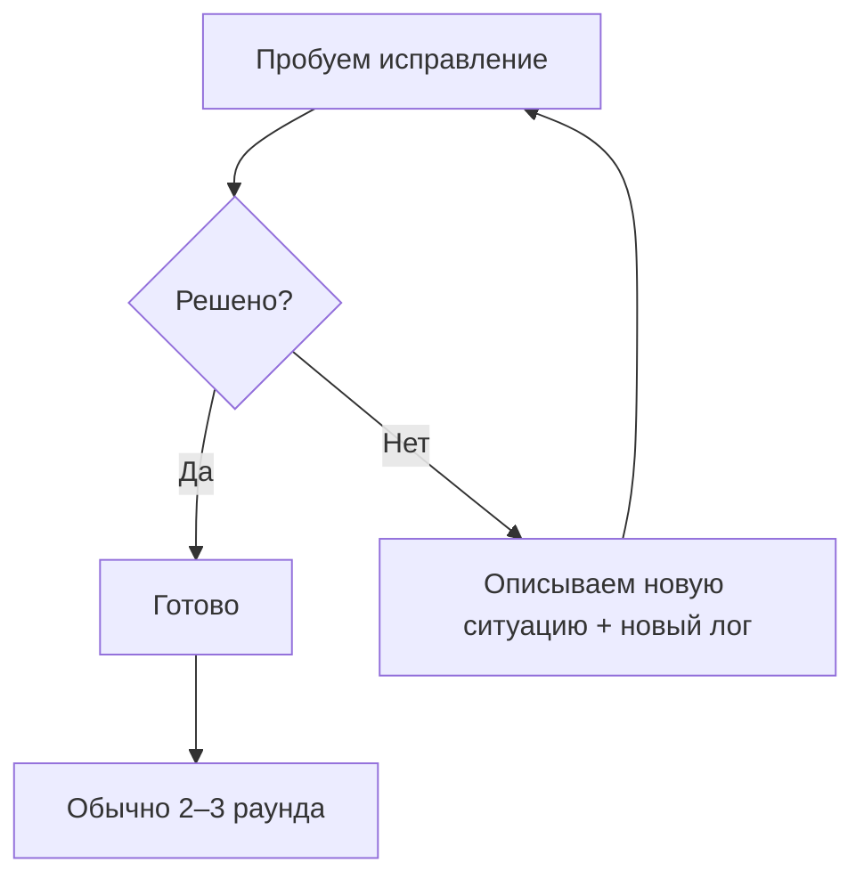
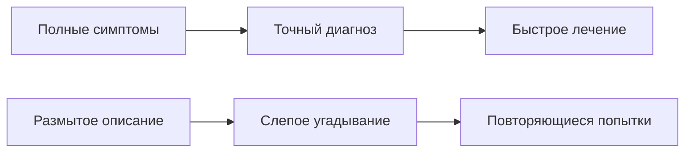

# 2.5 Эффективное мышление debugging'а 🟢

> **Прочитав этот раздел, вы получите:**
>
> - Формулу эффективного общения с AI при отладке
> - Умение предоставлять полные логи ошибок и контекст
> - Понимание паттерна итеративных исправлений: уточнять, пока проблема не решена
> - Освоение коронного приёма: «пусть AI соберёт сам»

> «Мышление debugging'а» из введения: предоставляйте полные логи ошибок и используйте паттерн итеративных исправлений.

## Пререквизиты

::: tip Что такое debugging

Debugging — процесс поиска и исправления ошибок в коде.
:::

::: tip Что такое лог ошибки

Лог ошибки — детальная информация, выводимая при падении программы или исключении: тип ошибки, местоположение, stack trace и др.
:::

::: tip Что такое stack trace

Stack trace — цепочка вызовов функций в момент ошибки. Он показывает, какая строка кода, какая функция и какие уровни вызовов привели к ошибке. Он помогает дойти до первопричины.
:::

---

## Формула общения при отладке: полный лог + шаги воспроизведения + ожидаемый результат

**Сценарий: проект выдаёт ошибку, и вы не знаете, что делать**

Вы копируете AI только последнюю строку сообщения об ошибке: (❌ Неэффективно)

```
«Упало с ошибкой, посмотри»
```

AI спрашивает: «Какой ошибкой? Что вы делали?» — 3 раунда туда-сюда только чтобы выйти на суть.

**Эффективный подход**: выдайте всю информацию разом (✅)

```
Я запустил pnpm dev, и terminal показал такую ошибку:

[полный лог ошибки]

Мой ожидаемый результат: dev-сервер нормально стартует,
и я могу зайти на localhost:3000
Помоги проанализировать и починить
```

**Почему так лучше**:

| Информация, которую вы даёте | Что может AI | Сэкономленные раунды |
|-----------|----------|-----------|
| Только «упало» | Спрашивать детали | +2 раунда |
| Только последняя строка | Угадывать контекст | +1 раунд |
| **Полный лог** | **Сразу указать на проблему** | **0 раундов** |

**Паттерн итеративных исправлений**:

Первый раунд не решил? Это нормально. Продолжайте с новым логом:

```
Я сделал, как вы предлагали, и теперь вижу новую ошибку:

[новый лог ошибки]

Продолжай анализировать
```

**Обычно хватает 2–3 раундов** — не сдавайтесь.

**Паттерн итеративных исправлений**:



**Попробуйте грейдер качества отладочных промптов — проверьте, достаточно ли хорош ваш промпт:**

<PromptOptimizer />

---

## Коронный приём: пусть AI соберёт сам

**Сценарий: ошибок слишком много, и разбирать их по одной не хочется**

Вы поменяли код, build упал, и вывод ошибки длиной 50 строк. Непонятно, за что браться.

**Просто отдайте это AI напрямую**:

```bash
«Запусти pnpm install && pnpm build. Если встретишь ошибки —
сам исправляй их, пока build не пройдёт»
```

**А сами идите за кофе**.

**Почему это работает**:

- AI видит реальные ошибки напрямую, не полагаясь на ваш пересказ
- AI может сам закрыть мелкие вопросы (конфликты версий, отсутствующие зависимости)
- Вам остаётся только проверить результат

**Лучшие сценарии применения**:

| Сценарий | Почему подходит |
|------|-----------|
| Новый проект на руках | Вы не знаете структуру — пусть AI исследует сам |
| Слишком много ошибок | Разбирать по одной медленно — пусть AI разбирает параллельно |
| Упал CI/CD | Локально не воспроизводится — пусть AI прогонит локально |

**Обратите внимание**:

- ✅ Сначала `git commit` — чтобы можно было откатиться, если AI что-то сломает
- ✅ Первый прогон может быть медленным — наберитесь терпения
- ⚠️ Если AI зациклился (правит одно и то же место туда-сюда) → вовремя прервите

---

## Практические примеры

### Пример 1: Ошибка типов

**Лог ошибки**:

```
Type error: 'user' is possibly 'undefined'.
  at App (app/page.tsx:15:10)
```

**❌ Плохое описание**:

```
«Ошибка типов, посмотри»
```

**✅ Хорошее описание**:

```
Ошибка TypeScript:

Файл: app/page.tsx
Строка: 15
Ошибка: 'user' is possibly 'undefined'

Код:
const user = await getUser();
return <div>{user.name}</div>;  // строка 15

Как обработать возможность undefined?
```

**Анализ AI**:

```
user может быть undefined, поэтому нужно:
1. Добавить проверку типа
2. Дать значение по умолчанию
3. Или использовать optional chaining
```

---

### Пример 2: Runtime-ошибка

**Лог ошибки**:

```
Error: connect ECONNREFUSED 127.0.0.1:5432
    at Connection.<anonymous> (node_modules/pg/lib/client.js:89:17)
    at Socket.emit (events.js:315:13)
```

**❌ Плохое описание**:

```
«Не подключается к базе»
```

**✅ Хорошее описание**:

```
Ошибка подключения к базе:

Error: connect ECONNREFUSED 127.0.0.1:5432

Окружение:
- Dev-окружение
- PostgreSQL должен работать локально
- DATABASE_URL="postgresql://localhost:5432/mydb" в .env

Возможные причины:
1. PostgreSQL не запущен?
2. Неверный порт?
3. Неверная конфигурация .env?
```

**Анализ AI**:

```
ECONNREFUSED означает, что сервис не запущен.
Проверить:
1. Запущен ли PostgreSQL
2. Верен ли порт (дефолт 5432)
3. Выполнить команды проверки:
   Mac/Linux: brew services list
   Windows: sc query postgresql-x64-[version]
```

---

### Пример 3: Ошибка build

**Лог ошибки**:

```
✘ [ERROR] Could not resolve "./components/Button"

    app/page.tsx:3:24:
      3 │ import { Button } from "./components/Button";
        ╩                         ~~~~~~~~~~~~~~~~~~~~
    This file does not exist.
```

**❌ Плохое описание**:

```
«Build упал»
```

**✅ Хорошее описание**:

```
Ошибка build:

Could not resolve "./components/Button"

Место: app/page.tsx:3:24
import { Button } from "./components/Button";

Реальная ситуация:
- Проект использует shadcn/ui
- Компонент Button должен лежать в components/ui/button.tsx

Как исправить путь импорта?
```

---

## Шпаргалка частых паттернов ошибок

| Тип ошибки | Типичное сообщение | Направление исправления |
|---------|---------|---------|
| Ошибка типов | `Type 'X' is not assignable to type 'Y'` | Проверьте определения типов, используйте type assertion или исправьте типы |
| Null/undefined | `Cannot read property 'X' of undefined` | Добавьте null-проверки, optional chaining или значения по умолчанию |
| Ошибка импорта | `Module not found: Can't resolve 'X'` | Установите зависимости, исправьте путь, проверьте exports |
| Сетевая ошибка | `ECONNREFUSED / ENOTFOUND` | Проверьте статус сервиса, URL и сетевое подключение |
| Порт занят | `Address already in use :3000` | Остановите процесс на порту или смените порт |
| Ошибка прав | `EACCES / Permission denied` | Проверьте права файла, используйте sudo или смените права |
| Синтаксическая ошибка | `Unexpected token / SyntaxError` | Проверьте синтаксис и написание; скобки и кавычки должны совпадать |

---

## Ключевые идеи

**Debugging — как процесс врачебной диагностики**.



**Запомните**:

1. **Полные логи**: не обрезайте их — информация stack trace очень важна
2. **Шаги воспроизведения**: объясните, что вы сделали, что triggered ошибку
3. **Ожидаемый результат**: скажите AI, чего вы хотите
4. **Итеративные исправления**: не сдавайтесь — обычно 2–3 раунда
5. **Отчёт о результате**: после каждого исправления сообщайте AI, что произошло дальше

**Формула debugging'а**:

```
Полный лог ошибки
+ Шаги воспроизведения (что вы делали)
+ Ожидаемый результат (что вы хотите)
= Быстрое решение
```

**Формула коронного приёма**:

```
git commit для сохранения текущего состояния
+ Пусть AI сам запускает build
+ Если падает — пусть сам исправляет
= Меньше стресса, меньше усилий
```

---

## Связанное

- Пререквизит: разбор VibeCoding workflow из 2.2
