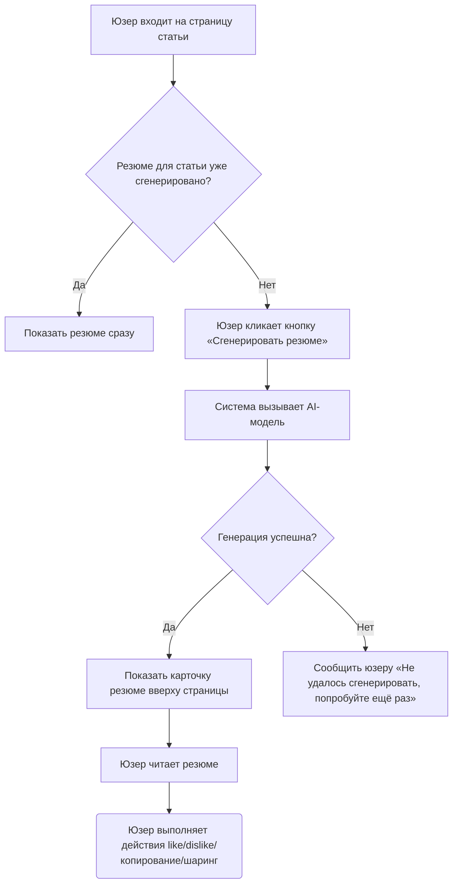

# 3.0 Шаблон PRD

> - Шаблон PRD, который можно скопировать и сразу использовать

---

# [Название продукта/функции] - Документ продуктовых требований (PRD)

# 0. Информация о документе

### 0.1 Статус документа

- **Текущая версия**: `[например: Draft 5.1]`
- **Текущая стадия**: `[например: Ревью требований / Идёт UI-дизайн / В разработке / Запущено]`
- **Автор**: `[Ваше имя]`
- **Дата создания**: `[ГГГГ-ММ-ДД]`
- **Последнее обновление**: `[ГГГГ-ММ-ДД]`
- **Ключевые стейкхолдеры**: `[Имена лидов ключевых ролей: продукт, разработка, дизайн, тестирование, бизнес и др.]`

### 0.2 История ревизий

*Следуя принципу «трёхстадийной итерации», ясно документируйте эволюцию документа, чтобы члены команды понимали, как требования менялись со временем.*

| Версия | Статус версии | Обновил | Дата | Ключевые обновления                                       |
| ------ | ---------- | ------ | ---------- | -------------------------------------------------- |
| 1.1    | Первичный драфт требований | [Имя] | ГГГГ-ММ-ДД | Первичное описание фона требований, целей и ключевой ценности |
| 2.1    | Драфт ревью решения | [Имя] | ГГГГ-ММ-ДД | Добавлены ключевой бизнес-флоу, диаграммы флоу функций и заметки по интеракциям прототипа |
| 2.2    | Драфт ревью решения | [Имя] | ГГГГ-ММ-ДД | Пересмотрена логика функции XX по замечаниям проектного ревью |
| 3.1    | Драфт передачи в разработку | [Имя] | ГГГГ-ММ-ДД | Включён финальный UI-дизайн, добавлены edge cases, план трекинга и план запуска |
| ...    | ...        | ...    | ...        | ...                                                |

### 0.3 Связанные документы

*Перечислите все справочные материалы по проекту для удобного доступа участников команды.*

- **Отчёт о рыночном исследовании**: `[Ссылка]`
- **Документ конкурентного анализа**: `[Ссылка]`
- **Заметки пользовательских исследований/интервью**: `[Ссылка]`
- **Проектное предложение (если применимо)**: `[Ссылка]`
- **Интерактивный прототип (Figma/Axure и др.)**: `[Ссылка]`
- **UI-дизайн-файлы (MasterGo/Figma и др.)**: `[Ссылка]`
- **Документ требований аналитического трекинга (если ведётся отдельно)**: `[Ссылка]`
- **Документ технического решения**: `[Ссылка]`

### 0.4 Глоссарий

*Объясните термины в документе, которые могут быть двусмысленными или незнакомыми команде.*

| Термин            | Определение                                 |
| --------------- | ------------------------------------------ |
| **[например: UGC]** | **[User Generated Content — пользовательский контент]** |
| **[например: CTR]** | **[Click-Through Rate — кликабельность]**           |
| ...             | ...                                        |

## I. Предпосылки и цели требований (соответствует ключевому содержимому «первичного драфта требований»)

### 1.1 Обзор проекта

*Одним-двумя предложениями резюмируйте, что делает этот продукт/функция, чтобы читатель быстро составил первичное понимание.*

> [Пример: этот проект добавляет на платформу XX функцию «AI Smart Summary», автоматически генерирующую сжатые резюме длинных статей, чтобы юзеры улавливали суть за 30 секунд.]

### 1.2 Ключевая решаемая проблема (Problem Statement)

*Подробно опишите, зачем мы делаем это требование. Кто целевые юзеры? С какими конкретными проблемами или болями они сталкиваются и в каких сценариях? Какой негативный эффект создают эти проблемы?*

- **Портреты целевых юзеров**: [Опишите характеристики 1–3 ключевых групп: например, knowledge workers, студенты, создатели контента и др.]
- **Сценарий использования**: [Опишите, когда, где и в каком контексте юзеры будут пользоваться продуктом]
- **Ключевые боли**:
  1. **Боль 1**: [Пример: информационная перегрузка. Юзеру нужно читать множество отраслевых отчётов ежедневно, но времени мало и всё глубоко не прочитать — ключевые факты теряются.]
  2. **Боль 2**: [Пример: низкая эффективность чтения. Статьи не на родном языке юзера или высокоспециализированные — барьер понимания высок, чтение занимает долго.]
  3. **Боль 3**: [...]

### 1.3 User stories

*Опишите конкретные требования с точки зрения юзера в формате: «Как `<роль>`, я хочу `<выполнить задачу>`, чтобы `<достичь ценности>`.»*

- **Story 1**: Как **специалист контент-операций**, я хочу **генерировать резюме длинных статей одним кликом**, чтобы **быстро готовить соцсетевые тексты и повышать эффективность работы**.
- **Story 2**: Как **обычный читатель**, я хочу **быстро просматривать ключевые тезисы статьи перед чтением**, чтобы **решить, стоит ли тратить время на глубокое чтение**.
- **Story 3**: [...]

### 1.4 Цели и ценность проекта

*Объясните бизнес-ценность и ценность для юзеров этого проекта и какие конкретные цели мы ожидаем достичь.*

- **Ценность для юзеров**: [Какую пользу функция даёт юзерам? Например: экономит время чтения, повышает эффективность доступа к информации и т.д.]
- **Бизнес-ценность**: [Какую пользу функция даёт компании? Например: рост активности юзеров, улучшение retention, построение технического рва и т.д.]
- **Цели проекта (принцип SMART)**:
  - **[S] Specific (конкретная)**: [Пример: после запуска usage-рейт функции XX достигает XX%]
  - **[M] Measurable (измеримая)**: [Пример: отслеживать CTR функции, успешность генерации резюме, оценку удовлетворённости юзеров через аналитический трекинг]
  - **[A] Achievable (достижимая)**: [Исходя из существующих ресурсов и техвозможностей, цель достижима]
  - **[R] Relevant (уместная)**: [Цель соответствует стратегическому направлению компании «повышение эффективности юзеров»]
  - **[T] Time-bound (ограниченная во времени)**: [Должно быть достигнуто в течение 3 месяцев после запуска]

### 1.5 Scope

*Чётко определите, что входит и не входит в эту итерацию, чтобы эффективно управлять ожиданиями команды и избегать scope creep.*

- **In-Scope**:
  1. [Пункт функции 1]
  2. [Пункт функции 2]
  3. ...
- **Out-of-Scope**:
  1. [Пункт функции, не включённый сейчас, но возможный в будущем 1]
  2. [Пункт функции, не включённый сейчас, но возможный в будущем 2]
  3. ...

### 1.6 Список требований

*Разбейте высокоуровневые требования на конкретные пункты и приоритизируйте их.*

| ID требования | Модуль     | Описание требования                               | Приоритет | Статус   | Примечания         |
| ------ | -------- | -------------------------------------- | ------ | ------ | ------------ |
| R001   | Генерация резюме | Юзер может кликнуть кнопку «Сгенерировать резюме» на странице статьи     | **Высокий** | Planned | Ключевая функция     |
| R002   | Отображение резюме | Сгенерированное резюме показывается карточкой вверху статьи     | **Высокий** | Planned |              |
| R003   | Feedback юзеров | Юзеры могут оценивать качество резюме «Like» или «Dislike» | **Средний** | Planned | Для итерации модели |
| R004   | Копирование и шаринг | Юзеры могут копировать резюме одним кликом или делиться с друзьями   | **Средний** | Planned | Повышение шаребельности   |
| R005   | История | Юзеры могут смотреть ранее сгенерированные резюме в личном центре   | **Низкий** | Planned | Рассмотреть для V2.0     |
| ...    | ...      | ...                                    | ...    | ...    |              |

## II. Обзор решения (соответствует ключевому содержимому «драфта ревью решения»)

*Этот раздел представляет продуктовое решение с высокой точки зрения, чтобы команда ясно понимала общую структуру и флоу продукта.*

### 2.1 Ключевая диаграмма бизнес-флоу (Business Flow)

*Опишите полный процесс, в котором юзер проходит ключевую задачу через серию действий, отражая бизнес-логику.*

**Подпись**: [Добавьте необходимые пояснения к диаграмме выше]

### 2.2 Ключевая диаграмма флоу функций (Function Flow)

*Покажите, как главные страницы и модули продукта организованы и связаны, отражая информационную архитектуру.*

> **Подпись**: [Добавьте необходимые пояснения к диаграмме выше]

### 2.3 Диаграмма информационной архитектуры (IA)

*Покажите всё информационное содержимое продукта и иерархические/организационные связи между ними.*

- **Главная**
  - Навигация
  - Список рекомендаций
- **Страница статьи**
  - Контент статьи
  - Модуль AI-резюме
  - Комментарии
- **Личный центр**
  - Личная информация
  - История
    - История резюме
  - Настройки

## III. Детальное решение (соответствует ключевому содержимому «драфта передачи в разработку»)

*Этот раздел — самое детальное описание решения и прямая основа работы команд разработки, дизайна и тестирования.*

### 3.1 Детали функции: [Модуль/пункт функции 1, например: генерация и отображение AI-резюме]

*Разбейте по модулям функций или страницам и объясните каждый отдельно.*

#### 3.1.1 Прототип страницы и заметки по интеракциям

- **UI-дизайн-файл**: `[Приложите скриншот или ссылку на финально подтверждённый UI-дизайн этой функции]`
- **Логика интеракций**:
  1. **Начальное состояние**:
     - По умолчанию модуль резюме под заголовком статьи не показан.
     - Справа на странице виден плавающий значок-кнопка «Сгенерировать резюме».
  2. **Триггерное действие**:
     - Юзер кликает кнопку «Сгенерировать резюме».
     - Кнопка переходит в loading-состояние «Генерирую...» с анимацией и повторно не кликается.
  3. **Состояние успеха**:
     - После завершения загрузки плавающая кнопка исчезает.
     - Карточка резюме плавно разворачивается под заголовком статьи.
     - Карточка включает: текст резюме и четыре кнопки действий: «Like», «Dislike», «Копировать» и «Поделиться».
  4. **Состояние сбоя (сетевой/сервисный сбой)**:
     - Кнопка возвращается в исходное состояние «Сгенерировать резюме».
     - Вверху страницы появляется Toast: «Не удалось сгенерировать резюме. Проверьте сеть и попробуйте снова».
  5. **Empty state (статья слишком коротка для резюме)**:
     - После клика по кнопке вверху страницы появляется Toast: «Эта статья слишком коротка. Резюме не нужно».
- **Требования к данным**:
   - Frontend должен передать `Article_ID` текущей статьи на backend.
   - Backend возвращает контент резюме `Summary_Text` и `Summary_ID` резюме.

#### 3.1.2 Обработка edge cases

- Что если юзер уйдёт со страницы во время генерации резюме? [Определите логику обработки, например: отменить запрос генерации]
- Что если юзер быстро и многократно кликает «Сгенерировать резюме»? [Определите логику, например: применить debouncing]
- Если контент резюме слишком длинный, как отображать его в карточке? [Определите логику, например: показывать до N строк, остальное разворачивать...]

### 3.2 Детали функции: [Модуль/пункт функции 2, например: feedback юзеров]

... (Повторите структуру 3.1 для следующего пункта функции) ...

### 3.3 Нефункциональные требования

- **Требования к производительности**:
- **Требования к совместимости**: [Пример: должны поддерживаться последние две версии трёх браузеров Chrome, Safari и Firefox, а также iOS и Android]
- **Требования к аналитике/трекингу данных**:

| Название события                   | Момент триггера             | Страница/место           | Отправляемые параметры                 | Примечания                 |
| -------------------------- | -------------------- | ------------------- | ------------------------ | -------------------- |
| `click_generate_summary`   | Клик по кнопке «Сгенерировать резюме» | Страница статьи — плавающая кнопка | `article_id`             |                      |
| `summary_generate_success` | Успешная генерация резюме       | -                   | `article_id`, `duration` | `duration` — время (мс) |
| `click_summary_like`       | Клик по кнопке «Like» резюме   | Страница статьи — карточка резюме | `summary_id`             |                      |

## IV. План запуска и эксплуатация

*Определите жизненный цикл требования и связанные послезапускные планы.*

### 4.1 Таймлайн запуска (Roadmap)

- **Ревью требований**: `[ГГГГ-ММ-ДД]`
- **UI/UX-дизайн**: `[ГГГГ-ММ-ДД] ~ [ГГГГ-ММ-ДД]`
- **Фаза разработки**: `[ГГГГ-ММ-ДД] ~ [ГГГГ-ММ-ДД]`
- **Фаза тестирования**: `[ГГГГ-ММ-ДД] ~ [ГГГГ-ММ-ДД]`
- **Ожидаемая дата запуска**: `[ГГГГ-ММ-ДД]`

### 4.2 План A/B-теста (если нужен)

- **Цель теста**: [Пример: проверить, повышает ли новый UI карточки резюме rate feedback юзеров]
- **Группы эксперимента**:
  - **Группа A (контроль)**: старый UI
  - **Группа B (эксперимент)**: новый UI
- **Распределение трафика**: [Группа A 50%, группа B 50%]
- **Ключевая метрика**: [Rate feedback юзеров (like + dislike / показы резюме)]
- **Критерии запуска/отката**: [Если группа B значимо превосходит A по ключевой метрике без негативных индикаторов — раскатить на всех]

### 4.3 План постепенного раскатывания (если нужен)

- **Фаза 1**: `[ГГГГ-ММ-ДД]`, только для внутренних сотрудников.
- **Фаза 2**: `[ГГГГ-ММ-ДД]`, для 1% seed-юзеров.
- **Фаза 3**: `[ГГГГ-ММ-ДД]`, постепенно поднять трафик до 10%, 50% и в итоге 100%.

## V. Приложение

*Храните здесь информацию, не входящую в основную часть, но дающую важную справочную ценность для проекта.*

- **Заметки встреч**: `[Ссылка]`
- **Сырые записи feedback юзеров**: `[Ссылка]`
- **Q&A**:
  - **Q1: [Вопрос от разработки/тестирования]**
  - **A1: [Ответ продакт-менеджера]**
