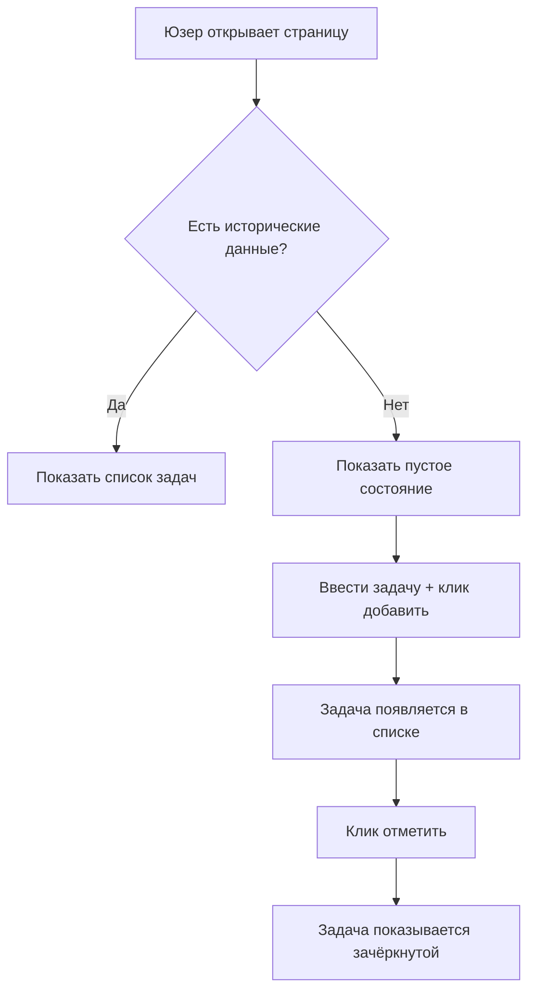

# 3.3 Практика написания PRD 🔴

> **Прочитав этот раздел, вы получите:**
>
> - Понимание пятничастной структуры PRD и её назначения
> - Освоение принципа итерации «драфт-средняя-финал»
> - Способность писать AI-friendly PRD с Markdown и Mermaid
> - Методы работы с edge cases и управления scope

> Как говорилось в предисловии: PRD — спека исполнения для AI и отражение способности определять проблемы.

---

## Ценность PRD

В AI-разработке роль PRD отличается от традиционной. Традиционно PRD пишется для команды; в AI-разработке PRD важнее как полный контекст для AI, чтобы не гадать о намерениях раз за разом.

PRD — «единый источник истины». Когда идеи ясно описаны в PRD, вывод AI становится стабильнее, а проблемы взрыва scope избегаются.

Процесс написания PRD — и тренировка способности определять проблемы. Многие напрямую просят AI «помоги собрать функцию» — и получают множество раундов переделок. Но когда вы сначала проясняете цель, юзера, бизнес-сценарий и логику интеракций, AI часто попадает в точку с первого раза.

Эта тренировка ценна вне одного цикла разработки. Когда вас заставляют описать требование письменно ясно, вы обнаруживаете множество ранее размытых зон. Возможно, вы думали, что у вас ясное видение продукта, но стоит взять ручку — и выясняется, что многие детали никогда серьёзно не продумывались. Написание PRD заставляет столкнуться с этими пробелами: либо принять явное решение, либо признать, что нужно больше информации. Эта ментальная тренировка сделает вас острее и решительнее в последующих продуктовых решениях.

---

## Пятичастная структура PRD

PRD делится на пять ключевых частей, соответствующих принципу итерации «драфт-средняя-финал»:

| Часть | Соответствующая стадия | Ключевое содержимое |
|------|---------------------|--------------|
| **Часть 0: Информация о документе** | Всегда ведётся | Версия, стадия, история обновлений |
| **Часть 1: Предпосылки и цели** | Драфт | Зачем строить, для кого, какую проблему решить |
| **Часть 2: Обзор решения** | Средняя | Бизнес-флоу, флоу функций, информационная архитектура |
| **Часть 3: Детальное решение** | Финал | Детали интеракций, edge cases, нефункциональные требования |
| **Часть 4: План запуска** | Финал | График, постепенное раскатывание |

**Принцип итерации**: драфт проясняет «зачем», средняя — «что», финал — «как». Каждый шаг включает ревью и ревизии, чтобы не обнаружить большие проблемы в конце.

Этот итерационный ритм имеет психологические основания. Сталкиваясь со сложными проблемами, люди часто впадают в «аналитический паралич» — хотят продумать все детали разом, не продвигаясь никуда. Поэтапная итерация позволяет фокусироваться на конкретных измерениях: в драфте не нужно думать о технической реализации — только подтвердить направление; в средней — не спорить о цвете кнопок, только подтвердить разумность флоу. Этот слоистый подход делает обработку сложных проблем управляемой.

Ещё одна недооценённая выгода: каждая версия — «checkpoint отката». Если в средней стадии найдены проблемы направления, можно вернуться к драфту и переосмыслить; если в финале техрешение неосуществимо — вернуться к средней и скорректировать флоу. Эта структурированная итерация позволяет ошибкам обнаруживаться и исправляться рано, а не накапливаться до взрыва в конце.

<PRDIterationTimeline />

---

## Часть 0: Информация о документе

Этот раздел ведёт статус версии документа и историю итераций.

### Статус документа

- **Текущая версия**: например, «Внутреннее ревью-ревизия 1» — фиксирует стадию и номер ревизии
- **Текущая стадия**: Ревью требований / UI-дизайн / В разработке / Запущено
- **Ключевые стейкхолдеры**: лиды продукта, разработки, дизайна, QA и др.

Информация о версии даёт AI понять: это «драфт» или «финал». Финалы должны быть детальнее; драфты могут оставлять TBD (to be determined).

#### Семантическое версионирование

Помимо описательных имён, можно использовать **Semantic Versioning** для управления версиями документа. Формат — `MAJOR.MINOR.PATCH` (например, `1.2.3`):

- **MAJOR**: ломающие изменения, несовместимые с прошлыми версиями (например, смена направления продукта)
- **MINOR**: новые функции, обратная совместимость (например, добавление модуля)
- **PATCH**: исправления багов или мелкие изменения (например, правка опечаток, дополнение деталей)

Пример: `1.0.0` — первая стабильная, `1.1.0` — добавлены функции, `1.1.1` — исправлены описания.

Версионирование применимо не только к коду, но и к документам, API и любым ресурсам, требующим управления версиями.

### История обновлений

Фиксируйте процесс итераций:

| Версия | Статус | Обновления |
|---------|--------|---------|
| Внутреннее ревью | Драфт | Первичное описание фона, целей и ключевой ценности |
| Проектное ревью | Средняя | Добавлены ключевой бизнес-флоу и диаграммы флоу функций |
| Финал до разработки | Финал | Включены UI-дизайны, добавлены edge cases, план трекинга |

История обновлений даёт AI понять, что стабильно, а что может ещё меняться.

---

## Часть 1: Предпосылки и цели

Это душа PRD, соответствующая ключевому содержимому стадии драфта.

### Обзор проекта

Резюмируйте, что есть продукт, одним-двумя предложениями.

| Хороший обзор | Плохой обзор |
|---------------|---------------|
| Минималистичная веб-страница todo-списка для личного использования | Приложение todo-списка |

Размытые обзоры ведут AI к сложной версии. Конкретные обзоры быстро задают границы.

Написание обзора — искусство сжатия. Нужно передать сущностные характеристики продукта в крайне ограниченном пространстве. «Минималистичная веб-страница todo-списка для личного использования» содержит несколько ключевых кусков: «для личного использования» указывает личный инструмент, а не командную коллаборацию; «минималистичная» — ограниченные функции и чистый интерфейс; «веб-страница» — техническая форма. Вместе они образуют ясную границу, давая AI понять, что делать и чего не делать.

### Ключевая проблема

Ответьте на три вопроса:

1. **Портрет целевого юзера**: Кто пользуется? (Конкретные характеристики, не «все»)
2. **Сценарий юзера**: В какое время, месте и ситуации будут пользоваться?
3. **Ключевая боль**: Что не так с существующими решениями?

| Чего не хватает | Последствие |
|---------|-------------|
| Не сказали, кто юзер | Может быть построена сложная «для всех» версия |
| Не сказали сценарий | Может быть выбрана неподходящая технология (мобильное собрано как десктоп) |
| Не сказали боль | Могут быть построены «идеальные» функции, решающие псевдопотребности |

### User stories

Опишите требования с точки зрения юзера:

> Как **[роль]**, я хочу **[выполнить задачу]**, чтобы **[достичь ценности]**

Это ближе к юзеру, чем «хочу собрать функцию». Формат user story заставляет думать с угла юзера, а не функции.

Ценность user stories — в построении «рамки эмпатии». Когда вы пишете «Как менеджер продаж, я хочу быстро готовить еженедельные отчёты, чтобы экономить время в пятницу», вы вынуждены представить конкретного человека в конкретном сценарии с конкретной болью. Это воображение выводит вас из угла технической реализации и позволяет думать о решении из реального положения юзера. Часто мы думаем, что юзерам нужна функция, а на деле нужна ценность за функцией. User stories помогают обнаружить эту истинную потребность.

### Управление scope

Проясните «что строим» и «что не строим».

**In-Scope**: явно перечислите функции, которые будут построены

**Out-of-Scope**: явно перечислите, что строить **не** нужно

Управление scope должно быть завершено в [3.2 Обсуждение требований с AI](./02-discuss-with-ai.md). Здесь вы лишь фиксируете результаты обсуждения.

| Без Out-of-Scope | С Out-of-Scope |
|----------------------|-------------------|
| AI может сам добавить «типовые функции» | AI ясно знает границы |
| Scope разрастается | Продукт сохраняет фокус |

### Список требований и приоритеты

Разбейте макро-требования на конкретные пункты с приоритетами:

| ID | Модуль | Описание | Приоритет | Статус |
|--------|--------|-------------|----------|--------|
| R001 | Добавление задачи | Юзер может добавлять todo-пункты | Высокий | Planned |
| R002 | Удаление задачи | Юзер может удалять задачи | Высокий | Planned |
| R003 | История | Просмотр исторических задач | Низкий | Рассмотреть для V2.0 |

Приоритеты дают AI понять, что ключевое (P0), а что можно отложить.

---

## Часть 2: Обзор решения

Соответствует средней стадии: визуальные методы показывают полную картину продукта.

### Ключевая диаграмма бизнес-флоу

Используйте Mermaid для описания полного флоу завершения юзером ключевой задачи.



| Только текст | С диаграммой флоу |
|-----------|-------------------|
| AI может неверно понять порядок шагов | AI понимает флоу с одного взгляда |
| Возможна двусмысленность | Визуализация устраняет двусмысленность |

Диаграммы флоу дают AI точно понять бизнес-логику и сокращают недопонимание.

Ещё одна ценность диаграмм флоу — они обнажают слепые зоны вашего мышления. Пытаясь описать процесс графически, «очевидные» шаги становятся конкретными и видимыми. Вы можете обнаружить, что никогда серьёзно не думали «а если юзер не залогинен» или «что показывать, когда данные не загрузились». Диаграммы флоу заставляют рассматривать каждую ветку, каждую точку решения — эта структурированная проверка часто выявляет важные детали, упущенные в тексте.

### Информационная архитектура

Перечислите структуру страниц продукта и иерархию:

- **Главная**
  - Навигация
  - Список задач
- **Настройки**
  - Настройки темы
  - Управление данными

Информационная архитектура даёт AI понять, какие страницы есть и как они организованы.

---

## Часть 3: Детальное решение

Соответствует финальной стадии — самая детальная часть и прямая основа для кода AI.

### Прототипы страниц и детали интеракций

Опишите полный флоу интеракций для каждой страницы:

1. **Начальное состояние**: как выглядит страница при первой загрузке
2. **Триггерное действие**: что делает юзер
3. **Состояние успеха**: что показывается после успеха
4. **Состояние сбоя**: что показывается после сбоя
5. **Пустое состояние**: что показывается при отсутствии данных

| Только «юзер может добавлять задачи» | Полная логика интеракций |
|-----------------------------------|------------------------------------|
| AI не знает, куда и как показывать | AI знает место ввода, стиль кнопки, обновление списка |

### Обработка edge cases

Это то, что новички упускают легче всего.

Пропуск edge cases — часто не небрежность, а «смещение happy path». Воображая юзерские сценарии, мозг автоматически достраивает идеальный флоу: юзер открыл приложение, завершил действие, ушёл довольным. Но реальный опыт юзера полон сюрпризов: сетевые колебания, случайные касания, внезапные звонки. Эти ненормальные ситуации — не «исключения», а нормальные составляющие опыта. Система, обрабатывающая только нормальные случаи, ведёт себя крайне хрупко в реальных средах.

| Edge case | Что будет, если не написать |
|-----------|-----------------------------|
| Юзер быстро кликает кнопку дважды | Возможен дубль отправки |
| Сетевая ошибка | Юзер не понимает, что произошло |
| Данных нет | Может показаться пустота или ошибка |
| Юзер выходит на полпути | Возможна потеря данных |

Частая обработка edge cases:

- Быстрый клик «Добавить» → Debounce: отклик только раз в 0,5 секунды
- Сетевой запрос упал → Toast: «Сетевая ошибка, попробуйте снова»
- Список задач пуст → Иллюстрация пустого состояния: «Задач пока нет, добавьте первую»

### Нефункциональные требования

| Тип требования | Почему важно |
|------------------|----------------|
| Производительность | Не написано → AI может собрать тяжёлое с медленной загрузкой |
| Совместимость | Не написано → Может поддерживаться только Chrome, юзеры Safari не смогут |
| Трекинг данных | Не написано → Невозможно отслеживать использование после запуска |

---

## Часть 4: План запуска

Определяет жизненный цикл требования.

### График запуска

| Стадия | Дата |
|-------|------|
| Ревью требований | ГГГГ-ММ-ДД |
| UI/UX-дизайн | ГГГГ-ММ-ДД ~ ГГГГ-ММ-ДД |
| Разработка | ГГГГ-ММ-ДД ~ ГГГГ-ММ-ДД |
| Целевой запуск | ГГГГ-ММ-ДД |

График даёт AI понять таймлайн проекта и разумно спланировать порядок разработки.

---

## Markdown и Mermaid

PRD следует писать на Markdown, с Mermaid для диаграмм.

**Преимущества Markdown**:

- Единый формат, легко управлять версиями
- AI лучше всего понимает Markdown
- Поддерживает богатое форматирование: блоки кода, таблицы, списки и др.

**Преимущества Mermaid**:

- Текст — это диаграмма, легко менять
- AI может точно читать диаграммы флоу
- Поддерживает flowchart, sequence diagram, state diagram и др.

Просто скажите AI «нарисуй диаграмму флоу на Mermaid» — синтаксис учить не нужно.

---

## Поручение генерации PRD AI

После подтверждения правильного понимания AI в 3.2, попросите его сгенерировать PRD по шаблону:

> Сгенерируй документ по шаблону PRD на основе нашего обсуждения.
> Если какое-то поле мы не обсуждали — пометь его TBD (to be determined).

Обязанности после генерации:

1. **Отревьюить PRD от AI** — убедиться, что каждое поле основано на обсуждении, а не на догадках AI
2. **Заполнить поля TBD** — для «будет определено» добавить детали или явно пометить «не нужно»
3. **Исправить недопонимания** — всё, что противоречит обсуждению, корректировать немедленно

---

## Хороший PRD vs плохой PRD

<GoodBadPRDCompare />

### Плохой PRD

```markdown
# Todo List

Собрать функцию todo-списка: юзеры могут добавлять задачи и отмечать выполненными.
```

**Проблемы**:

- Не сказано, кто юзер → может быть собрана командная версия
- Не сказаны ключевые функции → могут быть добавлены лишние
- Не сказан Out-of-Scope → могут быть добавлены логин, облачная синхронизация
- Не сказаны edge cases → быстрый клик вызывает дубль отправки
- Нет диаграммы флоу → AI может неверно понять бизнес-логику

### Хороший PRD

```markdown
# Минималистичный Todo List

## 1.1 Обзор проекта
Минималистичная веб-страница todo-списка для личного использования,
только функции добавления и отметки.

## 1.2 Ключевая проблема
- **Целевой юзер**: Я сам (офисный специалист, 5–10 задач ежедневно)
- **Сценарий юзера**: Открыть компьютер утром, быстро увидеть,
  что делать сегодня
- **Ключевая боль**: Стикеры теряются, заметка в телефоне
  слишком долго открывается

## 1.5 Scope
**In-Scope**: Добавление задач, просмотр списка, отметка выполнения,
удаление задач
**Out-of-Scope**: Логин/регистрация, облачная синхронизация, теги категорий

## 2.1 Ключевой бизнес-флоу
[Mermaid-диаграмма]

## 3.1 Обработка edge cases
- Быстрый клик «Добавить» → debounce 0,5 с
- Пустой список → Показать «Задач пока нет»
- Обновление страницы → Данные не теряются (localStorage)
```

---

## FAQ

### Q1: Насколько детальным должен быть PRD?

**О**: Драфт может быть кратким, средняя требует диаграмм флоу, финал — edge cases. Принцип: после прочтения AI не должен спрашивать «где эта кнопка» или «что при сбое».

### Q2: Можно ли писать PRD параллельно с разработкой?

**О**: Не рекомендуется. PRD — воплощение идей; написание до разработки — это продуманность. Писать в процессе часто ведёт к «обнаружению ошибки по ходу письма» с более дорогими переделками.

### Q3: Разве PRD нельзя менять после написания?

**О**: Нет. PRD должен обновляться с изменением требований. Каждое крупное изменение должно обновлять номер версии и историю.

### Q4: Малым проектам тоже нужен PRD?

**О**: Да. Малые могут быть проще, но структура должна быть полной. PRD простого проекта — пара сотен слов, но содержит все пять частей.

---

## Ключевые выводы

- ✅ PRD имеет пять частей, соответствующих принципу итерации «драфт-средняя-финал»
- ✅ **Ключевая диаграмма бизнес-флоу** даёт AI точно понять бизнес-логику
- ✅ **Обработка edge cases** — то, что новички упускают легче всего
- ✅ **Out-of-Scope** предотвращает самодеятельность AI
- ✅ Ревьюте PRD от AI: он основан на обсуждении, а не на догадках
- ✅ Просите AI помечать неописанное как TBD, а не слепо догадываться

После написания PRD следующий шаг — понять, как AI его исполняет.

---

## Связанное

- Пререквизит: [3.2 Обсуждение требований с AI](./02-discuss-with-ai.md)
- Далее: [3.4 От PRD к коду](./04-coding-agents.md)
