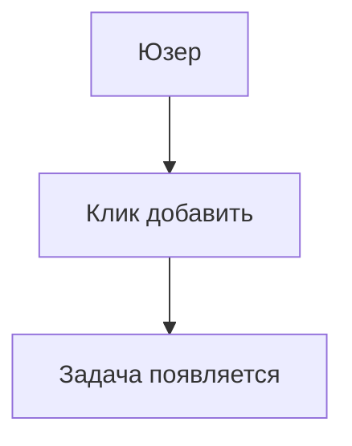

# 3.4 От PRD к коду 🟡

> **Прочитав этот раздел, вы получите:**
>
> - Понимание того, как AI «читает» и исполняет PRD
> - Освоение того, как детали PRD влияют на качество генерации кода
> - Умение использовать визуализацию для сокращения недопонимания
> - Усвоение workflow-подхода «сначала решение»

> Как говорилось в предисловии: понимание того, как AI исполняет PRD, помогает писать более эффективные PRD.

---

## Как AI «читает»

PRD пишется не для людей — для AI. Способ, которым AI «читает» PRD, фундаментально отличается от человеческого чтения.

### Чтение человека vs чтение AI

| Как читают люди | Как читает AI |
|-----------------|--------------|
| Читают от начала до конца | Разбивает PRD на «информационные чанки» |
| Пропускают повторяющееся | Обрабатывает каждое поле |
| «Додумывают» размытые места | Трактует строго по буквальному смыслу |
| Спрашивают, если неясно | Может применить дефолтные допущения или уточнить |

**Ключевое различие**: AI не «додумывает». Каждое написанное слово влияет на генерируемый код. Если PRD двусмыслен, AI либо гадает (и может ошибиться), либо останавливается спросить (добавляя раунды беседы).

Это различие имеет глубокие следствия для написания PRD. Пишя для людей, вы можете полагаться на «здравый смысл»: вы знаете, что читатели понимают, что «функция логина» обычно включает поля username и password и кнопку входа, без перечисления. Но у AI нет этого «здравого смысла» — или, точнее, его «здравый смысл» приходит из статистических паттернов тренировочных данных, которые могут не совпадать с вашими ожиданиями. Для AI «функция логина» может означать простую валидацию в localStorage или полный OAuth со сторонней аутентификацией. Без явной спецификации AI выбирает по частым паттернам — но какой именно вариант он «угадал», вы узнаёте только по результату.

### Флоу исполнения AI

Отдавая PRD AI, вы запускаете внутренние шаги:


Этот флоу происходит автоматически. Качество PRD напрямую определяет точность каждого шага.

<PRDToCodeFlow />

Понимание флоу помогает предвидеть поведение AI. Зная, что AI сначала извлекает ключевую информацию, вы уделите особое внимание ясности вводных разделов PRD; зная, что он строит модели данных, вы обеспечите полноту и согласованность описаний данных. Каждый шаг — потенциальная точка сбоя и возможность оптимизации через лучший PRD. Если у сгенерированного кода проблемы, трассировка флоу помогает найти, где они возникли: недопонимание при извлечении информации или отклонение при дизайне модели данных.

---

## Как детали PRD влияют на код

### Фаза извлечения информации

AI извлекает из вашего PRD:

- Кто юзер → влияет на стиль UI-дизайна
- Ключевые функции → определяют структуру кода
- Бизнес-процессы → определяют последовательность логики
- Out-of-Scope → предотвращает «творческую трактовку»

Если PRD слишком размыт, AI гадает по «обычной практике» — и может ошибиться.

### Фаза построения модели данных

AI проектирует структуры данных по описаниям «данных» в PRD:

| Описание в PRD | Понимание структуры данных AI |
|-----------------|-----------------------------------|
| «Задачи имеют заголовок, статус выполнения» | `{ title: string, completed: boolean }` |
| «Юзеры могут добавлять несколько задач» | `tasks: Array<Task>` |
| «Данные нужно сохранять» | Нужен localStorage или база |

**Заметка: в этой главе PRD должны лишь описывать «какие данные нужны» — AI разработает предварительные модели данных. Детальный дизайн базы (структуры таблиц, связи, оптимизация индексов) — в главе 8; тогда вы сможете вернуться и уточнить дизайн с новыми знаниями.**

Если PRD не указывает, какие данные сохранять, AI может упустить критичные поля — и позже потребуется структурный рефакторинг.

Дизайн модели данных — архитектурный фундамент. Как только он установлен, последующие решения строятся вокруг него. Если AI ошибается здесь — проектируя связанные данные отдельными таблицами или упуская ключевые поля — ошибка усиливается вниз по потоку. Frontend-код рендерит по неверным структурам, backend-API запрашивает по неверным моделям — страдает весь поток данных. Исправление — это не смена пары строк: часто требуется переработать схемы базы, изменить API-контракты, скорректировать frontend-компоненты. Стоимость рефакторинга куда выше пары уточняющих предложений в PRD.

### Фаза дизайна бизнес-логики

AI пишет логику кода по диаграммам флоу и описаниям интеракций:

| Описание интеракции | Логика кода, сгенерированная AI |
|-------------------------|------------------------|
| «Клик по кнопке добавления — задача появляется в списке» | функция `handleAddTask()` |
| «Клик по чекбоксу — задача зачёркнута» | `toggleTask()` + CSS-стили |
| «Debounce быстрых кликов» | `debounce()` или состояние `disabled` |

Если PRD опускает edge cases, AI может пропустить debouncing и обработку ошибок.

---

## Качество PRD определяет качество кода

### Пример 1: Отсутствие Out-of-Scope

**PRD**:

```markdown
# Todo List
Юзеры могут добавлять задачи и отмечать выполненными.
```

**AI может сгенерировать**:

- Функцию логина
- Облачную синхронизацию
- Теги категорий

Итог: код куда сложнее задуманного.

Такое over-engineering — среди самых частых проблем AI-разработки. Тренировочные данные AI содержат бесчисленные функционально полные enterprise-приложения; он выучил «что должен иметь todo-список». Когда вы явно не говорите «нет», AI по умолчанию собирает «полную версию». Это не вина AI — он изо всех сил исполняет ваш запрос. Проблема в недостающей граничной информации в требованиях. Ценность Out-of-Scope не только в сообщении AI, чего не делать, но и в помощи понять ваши истинные намерения. Говоря «без логина/регистрации», вы даёте AI понять: это локальный инструмент; говоря «без облачной синхронизации» — что данным не нужен кросс-девайс доступ. Эти негативные ограничения фактически задают AI ясное творческое пространство.

**Исправленный PRD**:

```markdown
# Todo List

## Core Features
- Добавление задач
- Отметка выполнения

## Out-of-Scope
- Без логина/регистрации
- Без облачной синхронизации
- Без тегов категорий
```

### Пример 2: Отсутствие edge cases

**PRD**:

```markdown
Юзеры могут кликать кнопку добавления, чтобы добавлять задачи.
```

**Код, сгенерированный AI**:

```javascript
function addTask() {
  tasks.push(newTask);
}
```

Проблема: быстрые клики создают дубли.

**Исправленный PRD**:

```markdown
Юзеры кликают кнопку добавления, чтобы добавить задачи.

Edge case: debounce быстрых кликов — отклик только раз в 0,5 секунды.
```

**Код, сгенерированный AI**:

```javascript
function addTask() {
  if (isAdding) return; // debounce
  isAdding = true;
  tasks.push(newTask);
  setTimeout(() => isAdding = false, 500);
}
```

---

## Слепые зоны AI в понимании PRD

У AI есть слепые зоны понимания, которые нужно учитывать при написании PRD.

### Слепая зона 1: Дефолтные значения

| Что вы пишете | Дефолтное допущение AI |
|----------------|------------------------|
| «Показать список задач» | Сколько пунктов максимум? AI может гадать 10, 50, 100 |
| «После клика кнопки...» | Деактивировать ли кнопку? AI может не обработать |
| «Сохранить данные» | Насколго? AI может допустить «навсегда» |

**Решение**: явно указывайте ожидаемые дефолты.

Дефолты важны, потому что обнажают различия «здравого смысла» между AI и человеком. Для человека «показать список задач» значит «показать все задачи», «сохранить данные» — «сохранить навсегда». У AI этих дефолтных допущений нет — или его дефолты приходят из статистического обучения и могут отличаться от вашей интуиции. Гадая «сколько пунктов максимум», AI может выбрать 10 (часто на мобильных), 50 («разумное» число) или 100 («безопасный» потолок). Всё «разумно», но возможно не то, что вы хотите. Явные дефолты передают ваш «здравый смысл» AI.

### Слепая зона 2: Смены состояний

| Что вы пишете | AI может понять неверно |
|----------------|------------------------|
| «Задачи можно отмечать выполненными» | Зачеркнуть? Сдвинуть вниз? Скрыть? |
| «Загрузка...» | Деактивировать кнопку при загрузке? Показать спиннер? |

**Решение**: используйте описания состояний: «Начальное → Триггер → Loading → Успех/Сбой».

### Слепая зона 3: Приоритеты

| Что вы пишете | AI может понять неверно |
|----------------|------------------------|
| Список функций | AI может реализовать всё в порядке перечисления |
| Без указания важности | AI может over-engineerить второстепенное |

**Решение**: помечайте приоритеты P0/P1/P2.

---

## Помощь AI в понимании вашего PRD

### Приём 1: Структурированное форматирование

AI хорошо понимает структуру Markdown.

Структурированные списки:

```markdown
## Core Features
- Функция 1
- Функция 2

## Out-of-Scope
- Без функций соцшеринга
- Без мультиязычности
```

Яснее, чем плоские текстовые абзацы.

### Приём 2: Конкретное вместо абстрактного

Не говорите «интерфейс должен быть красивым»; говорите «белый фон, синие кнопки, скруглённые углы без рамки».

Не говорите «должно быть плавно»; говорите «отклик в течение 0,5 секунды после клика».

Конкретные описания не допускают многозначных трактовок.

Абстрактные прилагательные — ловушка в написании PRD. «Красивый», «плавный», «чистый» звучат профессионально, но каждый трактует их по-своему. Ваш «красивый» может значить минимализм чёрного на белом; AI может понять градиентные фоны и скруглённые карточки. Ваш «плавный» — отклик за 0,5 секунды; AI — элегантные анимации переходов. Эти различия трактовки не вызывают багов кода, но вызывают несоответствие ощущения продукта. Конкретные описания устраняют пространство трактовок. Когда вы говорите «белый фон, синие кнопки, скруглённые углы без рамки», AI переводит точно в CSS; когда «отклик за 0,5 секунды» — AI знает, что оптимизировать производительность или добавлять loading-состояния.

### Приём 3: Диаграммы Mermaid

AI может «читать» Mermaid-диаграммы:



Это точнее текстовых описаний.

---

## Сначала решение, потом реализация

Эффективная практика: **пусть AI сначала выдаст техническое решение, потом пишет код**.

> Сначала дай технический план реализации этой функции: структуры данных,
> определения интерфейсов и главные шаги. Я подтвержу, потом пиши код.

Выгоды:

| Сразу в код | Сначала решение |
|----------------|----------------|
| Ошибки направления обнаруживаются поздно | Коррекция курса на этапе планирования |
| Недопонимание требует крупного рефакторинга | Проблемы ловятся на планировании |
| Результаты непредсказуемы | Ясные ожидания после подтверждения |

Это применяет «chain of thought» — разбиение сложных задач на шаги «сначала подумай, потом сделай».

«Сначала решение» разделяет сложную задачу: фаза 1 фокусируется на «что» и «как»; фаза 2 — на «как написать». Важнее, что фаза планирования даёт checkpoint: поймать и исправить ошибки направления до крупных временных вложений.

---

## Частые вопросы

### Q1: AI не сгенерировал код по PRD

**О**: Проверьте, отдан ли PRD AI, верен ли путь к PRD, не обрезан ли контент. AI мог «видеть» только часть PRD.

### Q2: Сгенерированный код не совпадает с PRD

**О**: Это сигнал отклонения понимания. Используйте шаблон подтверждения из 3.2, чтобы AI переподтвердил понимание, либо примените метод «сначала решение».

### Q3: Насколько детальным должен быть PRD для точного понимания AI?

**О**: Принцип: после прочтения AI не должен спрашивать «где эта кнопка» или «как обрабатывать сбои». Уровень детальности варьируется по стадии драфта — см. 3.3.

### Q4: Можно ли просить AI дополнять PRD по ходу кодинга?

**О**: Не рекомендуется. Это вызывает расхождение PRD и кода, усложняя поддержку. Правильно: финализировать PRD, потом генерировать код.

---

## Ключевые выводы

- ✅ AI трактует PRD буквально, без «додумывания»
- ✅ Каждое поле PRD влияет на сгенерированный AI код
- ✅ Отсутствие Out-of-Scope → AI может «творчески трактовать»
- ✅ Отсутствие edge cases → AI может пропустить обработку ошибок
- ✅ У AI есть слепые зоны: дефолты, смены состояний, приоритеты
- ✅ Структурированное форматирование, конкретные примеры и Mermaid-диаграммы дают AI более ясное понимание
- ✅ **Сначала решение** — пусть AI выдаёт техплан, подтверждение до кода

Глава 3 завершена. Дальше:

- **Глава 4**: Основы разработки и tech stack
- **Глава 8**: Персистентность данных и базы (вернитесь к дизайну моделей данных с новыми знаниями)

---

## Связанное

- Пререквизит: [3.3 Практика написания PRD](./03-prd-template-guide.md)
- См. также: [Глава 4: Основы разработки и tech stack](../04-dev-fundamentals/index.md)
