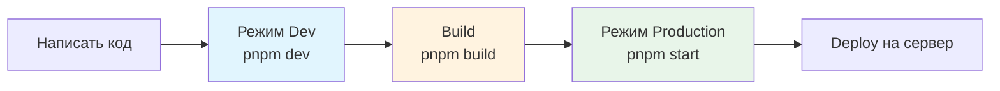

# 4.0 Три состояния работы кода 🟢

> **Прочитав этот раздел, вы получите:**
> - Понимание трёх режимов работы кода
> - Крепкое представление о назначении `package.json`
> - Знакомство с механикой hot reload и кэширования
> - Умение избегать частых ошибок runtime-окружения

> У кода три «жизненных состояния»: Dev, Build и Production. Понимание различий — ключ к избеганию путаницы вроде «я поменял код, а ничего не произошло».

---

## Три состояния

<BuildModesSimulator />

### Dev (режим разработки)

`pnpm dev` запускает режим разработки. Считайте это **черновиком**:

- Браузер обновляется сам после сохранения кода
- Поддерживается hot reload — содержимое форм не теряется
- Включает детальные сообщения об ошибках для лёгкой отладки
- Работает медленнее

**Лучше всего для**: ежедневной разработки и отладки

### Build (режим сборки)

`pnpm build` запускает сборку. Процесс — как **вёрстка и печать черновика в книгу**:

- Сжимает размер кода
- Оптимизирует производительность
- Генерирует папку `.next` или `dist`
- Убирает отладочную информацию

**Лучше всего для**: непосредственно перед deploy

### Production (боевой режим)

`pnpm start` (или `next start`) запускает собранную версию. Он **симулирует реальное production-окружение локально**:

- Запускает собранный код
- Даёт лучшую производительность
- Не поддерживает hot reload

**Лучше всего для**: финальных проверок перед выкаткой



---

## Hot Reload

В режиме Dev браузер обновляется сам после сохранения файла. Это называется **Hot Reload**.

Инструменты разработки следят за изменениями файлов в фоне. Обнаружив изменение, они автоматически обновляют браузер или обновляют только изменённые части. Значит, вручную обновлять каждый раз не нужно.

Но в режиме Build или Production код уже сбандлен и механизма слежения за файлами нет — изменения требуют пересборки.

---

## package.json

**Почему проект запускается просто по команде `pnpm dev`?**

Откройте файл `package.json` в корневом каталоге. Это **ключевой конфиг-файл** Node.js-проекта:

### Scripts

Здесь определяются частые команды запуска проекта:

```json
{
  "scripts": {
    "dev": "next dev",
    "build": "next build",
    "start": "next start"
  }
}
```

Когда вы вводите `pnpm dev`, менеджер пакетов находит запись, видит, что она соответствует команде `next dev`, и запускает её.

Можно определять и свои команды — например, сменить порт, чтобы уйти с перегруженного дефолтного 3000:

```json
{
  "dev": "next dev -p 4000"
}
```

### Dependencies

Здесь записаны сторонние библиотеки, нужные проекту, с номерами версий:

```json
{
  "dependencies": {
    "next": "^16.0.0",
    "react": "^19.0.0",
    "drizzle-orm": "^0.36.0"
  }
}
```

Это гарантирует: другие смогут через `pnpm install` поставить ровно те же библиотеки и идеально воспроизвести dev-окружение.

---

## Результат сборки

После завершения сборки файлы вывода генерируются в папке `.next` (Next.js) или `dist` (Vite).

Но эти файлы нельзя просто открыть двойным кликом. По сути, Next.js — это **программа**, работающая на Node.js и требующая серверного окружения: подключения к базам, обработки API-запросов и серверного рендеринга страниц.

Даже чисто статические проекты (собранные Vite) обычно нельзя открыть двойным кликом. Современные приложения используют **абсолютные пути** для ассетов, а открытие двойным кликом задействует **протокол file://**, из-за чего браузер не может найти эти ассеты.


::: tip Правильный способ доступа

Всегда заходите в приложение через Web-сервер:
- Next.js: `pnpm start`
- Vite: `pnpm preview`

Не открывайте собранные файлы двойным кликом напрямую.

:::

---

## Проблемы кэша

### Кэш браузера

В режиме Production или при посещении задеплоенного сайта можно столкнуться со странным поведением из-за кэширования. Например, вы поменяли цвет кнопки, но после обновления ничего не меняется.

**Решения**:
- Принудительное обновление: `Ctrl + Shift + R`
- Открыть в режиме инкогнито
- В Developer Tools включить «Disable cache» на вкладке Network


### Кэш сборки

Если принудительное обновление не помогает — возможно, проблема в кэше сборки. Удалите каталог `.next` и запустите `pnpm build` заново.

### Кэш переменных окружения

Переменные окружения — конфиг-значения, хранящиеся вне кода — как «Настройки» в телефоне: само приложение не меняется, но через настройки можно менять его поведение (тёмная тема, язык и т.д.). При разработке переменные окружения обычно хранятся в файле `.env` и читаются при старте программы.

После изменения файла `.env` вы **обязаны перезапустить сервис** (`Ctrl+C`, затем `pnpm dev`), чтобы переменные вступили в силу. Причина: переменные загружаются при старте процесса, и изменение файла во время работы не обновит их автоматически.

---

## Ключевые выводы

- ✅ Режим Dev — для ежедневной разработки, поддерживает hot reload
- ✅ Build создаёт production-версию и оптимизирует производительность
- ✅ Режим Production симулирует реальное production-окружение
- ✅ package.json управляет скриптами и зависимостями
- ✅ Результаты сборки нельзя открывать двойным кликом напрямую
- ✅ Когда что-то не так — сначала подумайте о кэше
- ✅ Изменение переменных окружения требует перезапуска сервиса

Теперь, когда вы понимаете три состояния работы кода, следующий шаг — фреймворк решений для выбора tech stack.

---

## Связанное

- См. также: [4.1 Фреймворк решений для выбора tech stack](./01-tech-stack-decision.md)
