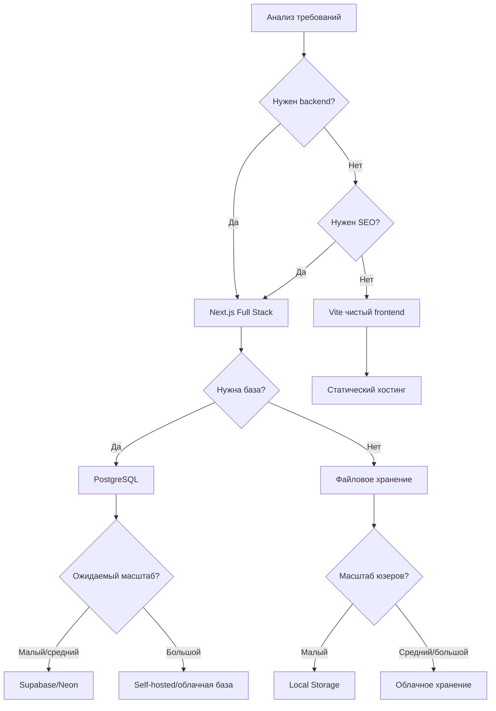

# 4.1 Фреймворк решений для выбора tech stack 🟡

> **Прочитав этот раздел, вы получите:**
>
> - Понимание ключевых принципов решений о tech stack
> - Освоение мышления выбора «сначала требования»
> - Способность оценивать осуществимость и сложность техрешений
> - Знание частых техрешений и их применимых сценариев

> Выбирайте tech stack после финализации PRD. Сначала поймите, что строить, потом решайте, как строить.

---

## Ключевые принципы решений о tech stack

Решения о tech stack — критичная веха продуктов в разработки. Правильная технология умножает продуктивность, неправильная добавляет ненужную сложность.

Многие впадают в «технологическое поклонение» — гоняются за новейшими и крутыми инструментами, игнорируя реальные требования. Это особенно опасно в эпоху AI: у AI лучшая поддержка для мейнстримных, зрелых технологий. Нишевые технологии могут привести к тому, что AI неправильно понимает код или генерирует некорректные реализации.

Ключевой принцип решений о tech stack: **уяснить требования → оценить сложность → выбрать минимально жизнеспособное решение**.

Понимание логики эволюции технологических стеков помогает делать более мудрый выбор. Развитие языков программирования и фреймворков показывает чёткую характеристику «слоистого наложения»: каждый слой даёт более мощные абстракции поверх предыдущего.

### Мир языков программирования

Представьте ресторан с десятками блюд в меню. Мир языков программирования схож: десятки языков, у каждого свои характеристики и сценарии. Понимание их историй помогает понять, почему определённые технологии становятся предпочтительными в конкретных доменах.

**C и C++** — фундамент вычислительного мира. Они родились в эпоху, когда операционным системам нужно было говорить с железом напрямую. Если вы разрабатываете игровой движок, требующий предельной производительности, или пишете код для встраиваемых устройств, C/C++ остаётся лучшим выбором. Linux, ядро Windows и большинство игровых движков построены на них. Но цена — низкая эффективность разработки: нужно вручную управлять памятью и обрабатывать множество низкоуровневых деталей.

**Java** доминирует в enterprise-мире. Обещание «write once, run anywhere» сделало её первым выбором для больших систем. Alibaba, backend-системы JD и core-banking в основном работают на Java. Она даёт зрелую экосистему и строгую типобезопасность, но также означает более многословный код и медленные циклы разработки.

**Python** — любимец data-сайентистов. Лаконичный и элегантный синтаксис позволяет учёным и исследователям быстро проверять идеи. Backend Instagram и YouTube на Python, и тренировка моделей OpenAI сильно полагается на Python. Но frontend-способности Python слабы: для full-stack разработки придётся учить другой набор технологий.

**Go**, созданный Google, спроектирован для эпохи cloud-native. Docker и Kubernetes написаны на Go. Модель конкурентности элегантна, компиляция быстрая — подходит для высокопроизводительных сетевых сервисов. ByteDance и другие компании активно используют Go в backend.

**Rust** — восходящая звезда системного программирования. Он обещает производительность уровня C++ с гарантией безопасности памяти. Браузер Firefox, некоторые компоненты Discord и инфраструктура Cloudflare используют Rust. Но кривая обучения крутая.

**JavaScript и TypeScript** правят Web-миром. Изначально просто скриптовый язык браузеров, с появлением Node.js они расширились на серверную сторону. TypeScript добавляет систему типов поверх JavaScript (явно помечает, являются ли данные текстом, числом или датой, чтобы компилятор ловил ошибки «несовпадения типов» до запуска), что сильно упрощает поддержку больших проектов. Netflix, Stripe и Vercel построены на экосистеме TypeScript.

### Наш выбор: почему TypeScript + Next.js?

Столкнувшись с таким выбором, вы можете спросить: почему этот туториал выбирает TypeScript + Next.js?

Начнём с реальных требований. Допустим, вы инди-разработчик или маленькая команда, цель — быстро проверить продуктовую идею. Нужен tech stack, покрывающий и frontend-интерфейсы, и backend-логику, с пологой кривой обучения и богатой поддержкой сообщества.

C/C++/Rust отпадают первыми. Они слишком низкоуровневые: управление памятью, оптимизация компиляции и другие детали — огромные временные затраты для быстрой продуктов в разработки.

Java и Go — отличные backend-языки, но frontend-технологии придётся учить отдельно. Это две инструментальные цепочки, два образа мышления, два процесса deploy. Для маленьких команд эта сложность — лишний груз.

Python — первый выбор data science, но в браузерах он не работает. Для web-приложений придётся дополнительно учить JavaScript для frontend — снова проблема двух технологий.

PHP и Ruby были популярны для web-разработки, но их экосистемы сжимаются. Важнее: у AI меньше тренировочных данных по ним в сравнении с JavaScript — качество AI-генерируемого кода может быть менее стабильным.

Уникальное преимущество TypeScript — унификация frontend и backend. Вы пишете интерфейсы и API на одном языке, определения типов разделяются между обеими сторонами. Просьба AI сгенерировать код не требует переключения между языковыми парадигмами — код выходит более консистентным и точным.

Next.js дополнительно упрощает full-stack разработку. Он интегрирует React frontend, API-роуты, подключения к базам и workflow деплоя. Не нужно настраивать сложные build-инструменты, решать cross-origin вопросы и даже управлять серверами — Vercel даёт deploy одним кликом.

Вот почему мы выбираем TypeScript + Next.js. Это не просто выбор технологии, а самый эффективный способ производства для индивидуальных разработчиков в эпоху AI.

---

## Выбор tech stack в эпоху AI

В эпоху AI-ассистированной разработки выбор tech stack имеет новые измерения. AI-friendliness описывает покрытие тренировочными данными AI конкретной технологии. Мейнстримные JavaScript и Python имеют массивные данные — AI знает их best practices и частые ловушки. Нишевые технологии и новые фреймворки покрыты меньше, и сгенерированный код может требовать больше проверок.

Когда вы используете единый tech stack, контекстное понимание AI становится более связным. Если frontend на React, backend на Python, база MongoDB — три разные технологические парадигмы вперемешку — больше переключений контекста, стили кода склонны к несогласованности. Но единая экосистема TypeScript — Next.js для frontend и backend, PostgreSQL для базы — позволяет AI работать в связном контексте, выдавая более согласованный и точный код. Общие определения типов между frontend и backend означают, что AI не перепутает имена полей; AI может понять весь проект разом и генерировать код между компонентами. Эти мелкие улучшения накапливаются и заметно повышают эффективность разработки.

Раньше выбор технологий часто был игрой компромиссов: Java — enterprise-стабильность, но медленная разработка; Python — быстрая разработка, но ограничения производительности; JavaScript — full-stack унификация, но без типобезопасности. Комбинация TypeScript и Next.js ломает эти компромиссы: enterprise-типобезопасность, унификация языка full-stack, адаптация к эпохе AI и разблокировка продуктивности индивидуальных разработчиков. Поэтому этот туториал выбирает TypeScript + Next.js как ядро tech stack.

---

## Фреймворк решений: три вопроса

Столкнувшись с выбором технологий, ответьте на три вопроса — и быстро сузите варианты:

**Вопрос 1: Что по сути должен делать этот проект?**

- Фокус на показе контента → статический сайт или чистый frontend-фреймворк
- Нужен логин юзеров → нужны backend-способности
- Нужна персистентность → нужна база
- Нужны AI-способности → нужна интеграция AI API

**Вопрос 2: Каков ожидаемый масштаб юзеров и конкурентность?**

- Личное использование или малый масштаб → можно выбрать простые решения
- Ожидается средний масштаб → нужно думать о масштабируемости
- Ожидается большой масштаб → нужен архитектурный дизайн

**Вопрос 3: Каков технический бэкграунд команды (или человека)?**

- Знакомы с JavaScript/TypeScript → выбирайте Next.js
- Знакомы с Python → выбирайте FastAPI/Flask
- Учитесь с нуля → выбирайте tech stack с лучшей поддержкой AI

---

## Краткий справочник частых техрешений

### Frontend-фреймворки

| Решение | Применимые сценарии | Неприменимые сценарии |
|----------|---------------------|--------------------------|
| **Next.js** | Нужен backend, SEO, full-stack разработка | Чисто статический показ |
| **Vite + React** | Чистый frontend, SPA-приложения | Нужны SSR/SEO |
| **Чистые HTML/CSS** | Минималистичные статические страницы | Сложные интерактивные приложения |

::: tip Почему рекомендуем Next.js?

- AI глубоко понимает структуру его проектов и генерирует точный код
- Поддерживает full-stack разработку с единым tech stack frontend и backend
- Лёгкий deploy (Vercel one-click deploy)
- Зрелая экосистема с богатыми ресурсами решений проблем

:::

### Базы данных

| Решение | Применимые сценарии | Неприменимые сценарии |
|----------|---------------------|--------------------------|
| **PostgreSQL** | Реляционные данные, нужны транзакции | Минималистичное key-value хранение |
| **Supabase** | Быстрая разработка, нужны auth/storage | Нужен полностью кастомный backend |
| **Neon** | Serverless-архитектура, лёгкие потребности | Нужна полная backend-функциональность |
| **SQLite** | Локальная разработка, минимализм | Многouserная конкурентная запись |

::: tip Почему рекомендуем PostgreSQL?

PostgreSQL — самая мощная open-source база:

- Реляционная + JSONB + расширение pgvector
- Обрабатывает и структурированные, и полуструктурированные данные
- Поддерживает векторный поиск — подходит для AI-приложений
- AI глубоко понимает её и генерирует точный код моделей данных

:::

### Решения для deploy

| Решение | Применимые сценарии | Характеристики |
|----------|---------------------|-----------------|
| **Vercel** | Next.js-проекты, глобальное распределение | Zero-config deploy, автоматический CI/CD, поддержка Edge Functions |
| **EdgeOne Pages** | Нужны узлы в Китае, edge-компьютинг | Глобальное ускорение Tencent Cloud, поддержка Pages Functions и Node.js runtime |
| **Облачный сервер** | Полный контроль, сложные приложения | Требует самостоятельной настройки и эксплуатации |
| **Docker** | Нужна консистентность окружения, мультисервисная архитектура | Контейнерная упаковка, гарантирует одинаковость dev и production |

::: tip Vercel vs EdgeOne Pages

**Vercel** — нативная платформа deploy для Next.js, дающая:

- Zero-config автодеплой, бесшовная интеграция с Git repository
- Глобальное CDN-ускорение, автоматическое распределение статических ассетов
- Поддержка Serverless Functions и Edge Functions
- Щедрый free tier для личных проектов и малых команд

**EdgeOne Pages** — edge-платформа deploy Tencent Cloud:

- Покрытие узлами в Китае, подходит для сценариев с ускорением на материковом Китае
- Поддержка Pages Functions (edge-компьютинг) и Node.js runtime
- Даёт KV-хранилище, поддерживает разработку full-stack приложений
- Глубокая интеграция с экосистемой Tencent Cloud (SSL-сертификаты, CDN и др.)

Совет по выбору: в основном китайские юзеры — EdgeOne Pages; глобальное распределение или глубокий Next.js — Vercel.

:::

---

## Выбор tech stack для компаний разных масштабов

Выбор технологий часто связан с масштабом компании и характеристиками бизнеса:

<ScaleComparison />

| Масштаб компании | Tech stack | Причина выбора |
|--------------|------------|-------------------|
| **Стартап** (0–50 человек) | Next.js + PostgreSQL + Vercel | Быстрая разработка, единый tech stack, AI-friendly, простой deploy |
| **Средняя компания** (50–500 человек) | Java/Go backend + React frontend + облачная база | Контролируемая производительность, достаточный кадровый пул, хорошая поддерживаемость |
| **Крупная компания** (500+ человек) | Сосуществование языков: Java (e-commerce), Go (cloud-native), C++ (чувствительное к производительности) | Разные бизнес-линии выбирают самое подходящее, команда инфраструктуры разрабатывает кастомные фреймворки |

---

## Дополнение о технических принципах (опционально)

Если хотите глубже понять принципы за технологиями — прочитайте следующий контент. Он не обязателен для разработки, но помогает понять логику выбора технологий.

### Компилируемые vs интерпретируемые

Понимание исполнения языков помогает выбирать подходящие технологии. Приложения из сторов — компилируемые продукты: код переводится в инструкции, исполняемые телефоном напрямую, до релиза. Веб-страницы в браузерах — интерпретируемые: браузер читает и исполняет код построчно.

<CompileVsInterpret />

| Тип | Представители | Способ исполнения | Характеристики |
|------|-------------------------|------------------|-----------------|
| **Компилируемые** | C, C++, Go, Rust | Сначала компиляция в машинный код, затем исполнение | Быстрое исполнение, простой deploy |
| **Интерпретируемые** | Python, Ruby, JavaScript | Интерпретатор исполняет построчно | Высокая эффективность разработки, сильная гибкость |
| **Гибридные** | Java, C# | Компиляция в байткод, работа на виртуальной машине | Баланс производительности и кроссплатформенности |

### Виртуальные машины и кроссплатформенность

Гибридные языки (вроде Java) сначала компилируются в промежуточный код, затем работают на **виртуальной машине (VM)**. ВМ — как мост: один и тот же промежуточный код работает на Windows, Mac или Linux, если на этих системах установлена соответствующая VM. В этом принцип «write once, run anywhere».

Эта концепция распространяется на домен deploy. **Docker** принимает похожую идею: он упаковывает код приложения, runtime, зависимости и конфигурацию в «контейнер». Где бы ни был развёрнут — в dev, тестовом или production окружении — поведение приложения внутри контейнера одинаково.

Для full-stack разработчиков ценность Docker проста: **он решает проблему «у меня же работало»**. В командной работе больше не нужно переживать «у тебя окружение настроено иначе, чем у меня». Пока все используют один Docker-образ, runtime-окружение у всех одинаково.

В современной web-разработке JavaScript/TypeScript использует гибкий подход: в разработке — удобства интерпретируемого исполнения, при deploy — компиляция и оптимизация через build-инструменты (Webpack, Vite) с генерацией production-кода.

### Инсайты эволюции технологий

Эта слоистая эволюция — не простая замена, а наложение способностей. Каждый новый слой технологии строится на предыдущем, решая то, что предыдущий слой не мог эффективно решить. Выбирая технологии, это слоистое мышление помогает судить: новая технология — подлинная инновация или просто переупаковка существующего? Первая может принести долгосрочную ценность; вторая часто лишь добавляет стоимость обучения.

Например, TypeScript не заменяет JavaScript, а добавляет «страховочную сетку» системы типов поверх; Next.js не заменяет React, а добавляет серверный рендеринг, управление роутингом и другие способности поверх React. По-настоящему ценные новые технологии — часто инновации на плечах гигантов, а не изобретение велосипеда с нуля.

---

## Процесс решений

<TechStackDecisionTree />

---

## Частые вопросы

### Q1: Нужно ли определять все технические детали на стадии PRD?

Нет. На стадии PRD достаточно общего направления: какой фреймворк (Next.js), какая база (PostgreSQL), куда deploy (Vercel). Конкретный выбор библиотек и дизайн компонентов можно корректировать в разработке. Чрезмерное планирование тратит время — требования могут измениться в реальной разработке.

### Q2: Что если я не уверен, осуществима ли функция, которую хочу построить?

Спросите AI. Отправьте описание функции и спросите: «Можно ли реализовать эту функцию на Next.js? Какие технологии понадобятся примерно?» AI скажет осуществимость и возможные техпути. Если AI говорит «нужен WebRTC» или «нужны сторонние картографические сервисы» — вы знаете, что по этим технологиям нужно дополнительное исследование.

### Q3: Нужно ли учить TypeScript до старта?

Нет. Учите по ходу. Спрашивайте AI при незнакомом синтаксисе: «Что значит эта строка кода?» «Как добавить типы к этой переменной?» Реальные проекты — лучший учитель: вы учитесь, строя функциональность, что эффективнее, чем сначала читать туториалы, потом кодить. Этот туториал предполагает старт с нуля — весь код будет объяснён.

### Q4: Может ли этот tech stack строить мобильные приложения?

Next.js сам — для web-страниц, но web-страницы открываются в мобильных браузерах. Если нужны нативные приложения (те, что из сторов), есть варианты:

- **Capacitor**: упаковка web-страниц в нативные приложения, поддержка iOS и Android, код почти не меняется
- **PWA**: Progressive Web App, нативно поддерживается Next.js, юзеры могут «установить» страницу на домашний экран
- **React Native**: нужно учить новую технологию, но производительность лучше

Для MVP-валидации обычно достаточно web-версии. Нативные приложения — после успешной валидации.

---

## Ключевые выводы раздела

- ✅ Ядро решений о tech stack — «сначала требования», а не «сначала технология»
- ✅ Ответы на три вопроса быстро определяют техническое направление
- ✅ Выбирайте AI-friendly, зрелые, стабильные мейнстрим-технологии
- ✅ Избегайте overengineering и гонки за новейшим
- ✅ Единый tech stack повышает точность понимания AI
- ✅ Завершайте выбор tech stack на фазе PRD, избегая переделок

Tech stack определён — следующий шаг: связь PRD и технической документации.

---

## Связанное

- Пререквизит: [3.4 От PRD к коду](../03-prd-doc-driven/04-coding-agents.md)
- Далее: [4.2 Связь PRD и технической документации](./02-prd-and-tech-docs.md)
