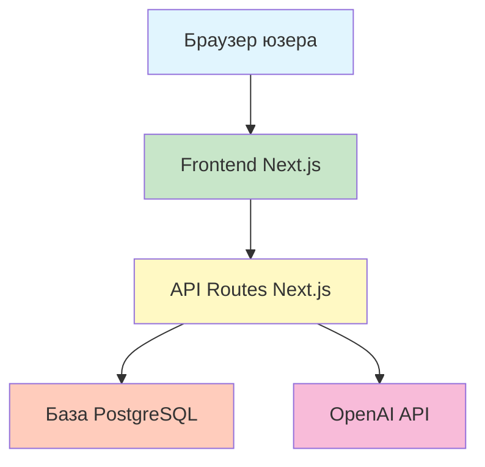
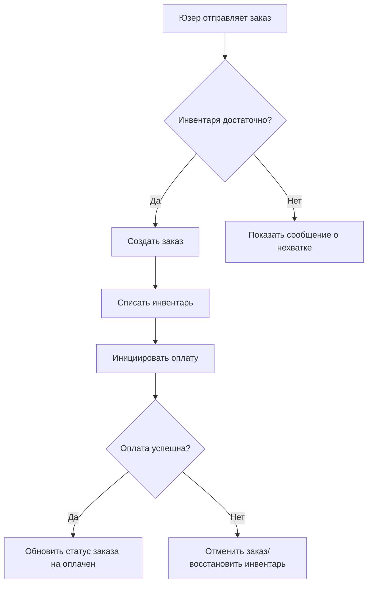

# 4.2 От PRD к технической документации 🟢

> **Прочитав этот раздел, вы получите:**
>
> - Понимание чёткого разделения труда PRD и технической документации
> - Освоение пяти компонентов технической документации
> - Умение документировать технические решения
> - Понимание ценности документации в AI-ассистированной разработке

> После итерации PRD до пятого драфта и финализации продуктового подхода, помимо бизнес-логики нужно задокументировать конкретный план технической реализации — это и есть техническая документация.

---

## Введение

PRD отвечает «что строить», но код не вырастает из него напрямую. Перед написанием кода нужна **техническая документация** — мост от PRD к коду и «мануал», помогающий AI понять структуру вашей системы.

Полная техническая документация даёт AI знать:

- Какие данные есть в системе и как они связаны
- Через какие интерфейсы общаются frontend и backend
- Из каких компонентов состоит система и как текут бизнес-процессы
- От каких внешних сервисов она зависит

Без этого контекста AI может только гадать, и генерируемый код часто мимо.

---

## Разделение труда: PRD vs техническая документация

Роли определены ясно: PRD отвечает «что делать», техдокументация — «как делать».

### PRD (документ продуктовых требований)

| Содержимое | Описание |
|---------|-------------|
| Целевые юзеры | Кто будет пользоваться продуктом |
| Ключевые функции | Какая функциональность нужна продукту |
| Интеракции юзеров | Как юзеры завершают операции |
| Edge cases | Как обрабатывать исключительные сценарии |
| Бизнес-процессы | Полные флоу операций юзера |

### Техническая документация

| Содержимое | Описание |
|---------|-------------|
| Модели данных | Таблицы, поля и связи |
| Дизайн API | Список интерфейсов и их ответственности |
| Архитектурные/флоу-диаграммы | Связи компонентов системы и бизнес-процессы |
| Сторонние интеграции | Внешние сервисы и способы интеграции |
| Технические решения | Обоснование выбора и ключевые trade-offs |

### Связь между ними


Каждая бизнес-сущность в PRD должна иметь соответствующую запись в модели данных; каждая функциональная точка PRD — соответствующий интерфейс в дизайне API. Это соответствие — стандарт проверки полноты техдокументации.

---

## Пять компонентов технической документации

Техдокументация — не заполнение шаблона, а запись процесса вашего мышления. Пять компонентов ниже покрывают полную техническую перспективу — от данных до интерфейсов, от архитектуры до зависимостей. Вместе они образуют контекстный фундамент для понимания AI вашей системы.

### 1. Модель данных

Модель данных — техническое отображение бизнес-концепций PRD. Она описывает, какие данные хранит система, структуру данных и связи между ними.

**Зачем нужна:**

- Фундаментальный контекст для генерации AI кода базы
- Контракт данных для коллаборации frontend-backend
- Определяет расширяемость системы

**Что документировать:**

- Какие таблицы есть (соответствуют бизнес-сущностям PRD)
- Поля каждой таблицы (соответствуют атрибутам сущностей)
- Связи между таблицами (один-ко-многим, многие-ко-многим)

**Пример:**

```markdown
## Модель данных

### Таблица юзеров (users)
- id: Первичный ключ
- email: Email (уникальный)
- name: Отображаемое имя
- created_at: Timestamp создания

### Таблица постов (posts)
- id: Первичный ключ
- title: Заголовок
- content: Контент
- author_id: ID автора (внешний ключ, ссылается на users)
- created_at: Timestamp создания

Связь: у одного юзера может быть много постов (один-ко-многим)
```

<DataModelER />

Когда вы смотрите комментарии на Bilibili и кликаете аватар комментатора для перехода на его страницу — сам комментарий не хранит всю информацию о человеке, только user ID. Система идёт по этому ID и ищет полную информацию в таблице юзеров. `author_id` — такой «внешний ключ»: таблица постов записывает только ID автора и при необходимости находит соответствующего юзера.

::: tip ORM-схема как документация

ORM позволяет определять и оперировать базой через код, а не SQL-выражения. Schema — «шаблон таблицы», написанный кодом: как называется каждая колонка и какие типы данных она может хранить. При использовании ORM вроде Drizzle файл определения схемы сам служит документацией модели данных — наглядно показывает структуру таблиц, типы полей и связи таблиц, что и AI точно понимает.

Конкретный дизайн и реализацию базы смотрите в главе 8.

:::

### 2. Дизайн API

Дизайн API определяет интерфейсы, которые система предоставляет наружу — контракт коллаборации frontend-backend.

**Зачем нужен:**

- Граница разделения труда frontend-backend
- Основа генерации AI интерфейсного кода
- Ясные определения API сокращают стоимость коммуникации

**Что документировать:**

- Пути интерфейсов и HTTP-методы
- Ответственности интерфейсов (что делает)
- Параметры запросов и возвращаемые значения (кратко)

**Пример:**

```markdown
## Дизайн API

### Связанное с постами
- GET /api/posts - Получить список постов
- GET /api/posts/:id - Получить один пост
- POST /api/posts - Создать пост (нужен логин)
- PATCH /api/posts/:id - Обновить пост (нужен владелец)
- DELETE /api/posts/:id - Удалить пост (нужен владелец)

### Связанное с комментариями
- GET /api/posts/:id/comments - Получить комментарии поста
- POST /api/posts/:id/comments - Опубликовать комментарий (нужен логин)
```

::: tip Подробнее

Детали протокола HTTP, RESTful-конвенции и значения статус-кодов подробно разобраны в 4.4 Основы API и HTTP.

:::

### 3. Архитектурные/флоу-диаграммы

Архитектурные диаграммы показывают связи компонентов системы; флоу-диаграммы — течение бизнес-логики.

**Зачем нужны:**

- Помогают AI быстро понять общую структуру системы
- Помогают членам команды создать общее понимание
- Выявляют упущения или противоречия в дизайне

**Пример архитектурной диаграммы:**



**Пример флоу-диаграммы (процесс заказа юзера):**



::: tip Подробнее

Архитектуру разделения frontend-backend и работу full-stack фреймворков подробно разбирает 4.5 Концепция разделения frontend и backend.

:::

### 4. Сторонние интеграции

Документируйте внешние сервисы, от которых зависит система, и способы интеграции.

**Зачем нужно:**

- Внешние сервисы расширяют способности системы
- Нужно записывать ключевые конфигурации и ограничения (например, rate limits)
- Упрощает разбор проблем интеграции

**Что документировать:**

- Какие внешние сервисы используются
- Для чего они нужны
- Ключевые конфиг-пункты (имена переменных окружения)
- Ограничения: rate limiting, timeouts

**Пример:**

```markdown
## Сторонние интеграции

### OpenAI API
- Назначение: функции AI-беседы
- Переменная окружения: OPENAI_API_KEY
- Ограничение: 60 запросов в минуту

### Amap (Gaode Maps)
- Назначение: отображение локаций
- Переменная окружения: AMAP_KEY
```

::: tip Подробнее

Конкретные шаги интеграции API, обработка ошибок и практики security подробно разобраны в 4.7 Интеграция API на практике.

:::

### 5. Записи технических решений

Документируйте ключевые выборы технологий и обоснование решений.

**Зачем нужно:**

- Избегает пересмотра одних и тех же вопросов позже
- Помогает новым членам понять, почему система устроена так
- Даёт контекст для будущего рефакторинга или расширения

**Что документировать:**

- Выбор tech stack (связь с 4.1 Фреймворк решений для выбора tech stack)
- Ключевые trade-offs (например, Supabase vs Neon)
- Отвергнутые альтернативы и причины

**Пример:**

```markdown
## Технические решения

### Стек: Next.js + PostgreSQL
- Обоснование: full-stack фреймворк даёт высокую эффективность; AI лучше всего понимает Next.js
- Альтернатива: Vite + Express (отвергнуто: нужно поддерживать два отдельных проекта)

### Хостинг базы: Neon
- Обоснование: легковесный, serverless-архитектура, хорошо работает с Drizzle
- Альтернатива: Supabase (отвергнуто: Auth и другие доп. функции пока не нужны)
```

---

## Ценность документации в эпоху AI

В эпоху AI-ассистированной разработки ценность техдокументации усиливается. Раньше документация была в основном для людей: помогала команде понять систему или служила заметками для себя. Теперь у неё есть ещё один важный читатель: AI.

AI нужен контекст для точной работы. Когда вы говорите «помоги написать функцию логина юзера», без документации, объясняющей, какие поля в таблице юзеров и какой формат возвращает интерфейс логина, AI может только гадать. Гадание — это trial and error, а trial and error — потерянное время.

Ясная техдокументация — как «мануал системы» для AI. Зная структуру данных, он генерирует код, подходящий вашей архитектуре; зная спецификации API — пишет интерфейсы, которые frontend и backend смогут интегрировать. Чем яснее документация, тем меньше AI гадает и выше эффективность разработки.

::: tip Документация — контекст для AI

Техдокументация даёт структурированный контекст, сообщая AI, «какую технологию использовать», «какова структура данных» и «как определены интерфейсы». Без документации AI может только реверс-инжинирить из кода — менее эффективно и более ошибкоопасно.

:::

---

## Синхронизация документации и кода

Техдокументация написана — но работа не окончена. Главный враг документации — устаревание: спека, написанная сегодня, становится «историческим архивом», когда код меняется на следующей неделе. Синхронность документации с кодом — предпосылка её ценности.

Приём поддержания синхронности — «обновляй при изменении»: каждый раз, меняя код, спросите себя, влияет ли изменение на описания в документации? Если да — обновите сразу. Когда привычка сформирована, стоимость поддержки документации куда ниже, чем разбор проблем от рассинхрона.

Последствия расхождения документации и кода:

- Новые члены понимают архитектуру из документации — и обнаруживают совершенно другую структуру кода
- AI генерирует код по устаревшему дизайну API, вызывая провалы интеграции
- Просматривая проект месяцы спустя, вы сами путаетесь в своей документации

**Рекомендуемые практики:**

1. Документируйте до кодинга — документация это процесс мышления
2. Обновляйте при изменениях — синхронизируйте документацию после правок кода
3. Регулярное ревью — проверяйте соответствие документации реальному коду

---

## Упрощённая практика: минимально жизнеспособная документация

Для индивидуумов и малых команд не упирайтесь в форму — можно объединить PRD и техдокументацию в **проектную документацию**. Но чётко различайте: какие части — продуктовое мышление, какие — технические решения.

**Независимо от размера проекта, эти пять компонентов опускать нельзя:**

| Компонент | Почему нельзя опустить |
|-----------|--------------------------|
| Модель данных | AI нужно знать, какие данные хранить |
| Дизайн API | Frontend и backend должны знать, как общаться |
| Архитектурные/флоу-диаграммы | AI должен понимать структуру системы и бизнес-логику |
| Сторонние интеграции | AI должен знать внешние зависимости и конфигурации |
| Технические решения | AI должен понимать обоснование выбора, чтобы не сойти с рельсов |

**Что можно упростить:**

- Уровень детальности: малые проекты могут использовать таблицы вместо длинных текстов
- Формат документации: можно использовать комментарии, README вместо отдельных документов
- Инструменты диаграмм: можно использовать текстовые описания вместо сложных диаграмм

**Простая организация:**

```markdown
# Проектная документация

## 1. Продуктовая часть
### 1.1 Предпосылки
### 1.2 Ключевые функции
### 1.3 User stories

## 2. Техническая часть
### 2.1 Tech stack
### 2.2 Модель данных
### 2.3 Дизайн API
### 2.4 Архитектурная диаграмма
### 2.5 Сторонние интеграции
### 2.6 План deploy
```

---

## Частые вопросы

### Q1: Насколько детальной должна быть документация?

Стандарт — «может ли AI это понять». Модели данных должны прояснять таблицы и поля; API — перечислять интерфейсы и ответственности; архитектурные диаграммы — показывать связи компонентов. Детали реализации (синтаксис Drizzle, HTTP-статус-коды) не обязаны покрываться в 4.2 — последующие главы их закроют.

### Q2: Может ли AI генерировать техдокументацию?

Да. После финализации PRD пусть AI сгенерирует каркас техрешения по требованиям, затем ревьюте и дополняйте вручную. Раздел технических решений требует личного подтверждения — он связан с бизнес-пониманием и trade-offs.

### Q3: Что если код меняется, а я забываю обновить документацию?

Выработайте привычку обновления при изменении. Или попросите AI: «Я поменял модель данных — обнови техдокументацию».

### Q4: Нужны ли профессиональные инструменты для архитектурных и флоу-диаграмм?

Нет. Текстовые описания, ASCII-арт или простой синтаксис Mermaid — всё работает. Ключ — ясно выразить структуру системы и бизнес-процессы.

---

## Ключевые выводы

- ✅ PRD отвечает «что строить», техдокументация — «как строить»
- ✅ Пять компонентов техдокументации: модель данных, дизайн API, архитектурные/флоу-диаграммы, сторонние интеграции, техрешения
- ✅ Пять компонентов опускать нельзя, но уровень детальности упрощается
- ✅ Держите документацию синхронной с кодом, избегая «устаревших карт»
- ✅ Документация — важный источник контекста для AI
- ✅ Детали реализации закрываются последующими главами

Поняв роль и компоненты техдокументации, дальше исследуем базовые кирпичики программирования.

---

## Связанное

- Пререквизит: [3.3 Практика написания PRD](../03-prd-doc-driven/03-prd-template-guide.md)
- Пререквизит: [4.1 Фреймворк решений для выбора tech stack](./01-tech-stack-decision.md)
- Подробности: [4.3 Как читать AI-сгенерированный код](./03-programming-basics.md)
- Подробности: [4.4 Основы API и HTTP](./04-api-and-http.md)
- Подробности: [4.5 Концепция разделения frontend и backend](./05-frontend-backend-separation.md)
- Подробности: [4.6 Форматы конфиг-файлов](./06-config-formats.md)
- Подробности: [4.7 Интеграция API на практике](./07-api-integration.md)
