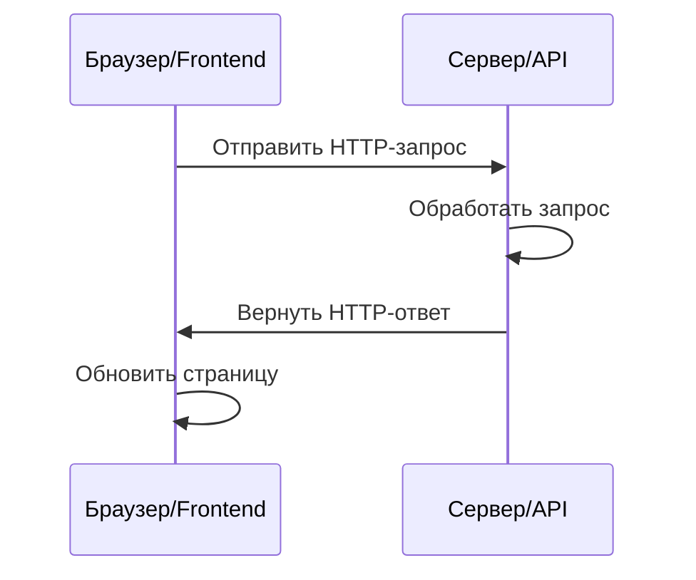
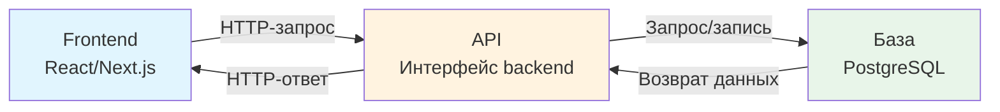

# 4.4 Основы API и HTTP 🟢

> **Прочитав этот раздел, вы получите:**
>
> - Понимание концепции и роли API
> - Знание базовых принципов протокола HTTP
> - Способность понимать структуру HTTP-запросов и ответов
> - Понимание значений частых HTTP-статус-кодов
> - Базовое понимание флоу взаимодействия frontend-backend

> Протокол HTTP — «язык» общения frontend и backend. Понимание его работы поможет быстрее разбирать проблемы.

---

## Введение

В предыдущем разделе вы узнали, как понимать базовую логику кода. Но полноценное приложение — больше, чем локальный код: ему нужно общаться с серверами, получая данные и отправляя действия. Этим общением управляют **API** и **протокол HTTP**.

Понимание работы HTTP поможет точнее описывать требования при коллаборации с AI и даст способность troubleshot'ить при проблемах.

---

## Что такое API

**API (Application Programming Interface)** — соглашение, позволяющее разным софт-системам общаться друг с другом.

В Web-разработке API обычно означает **Web API** или **HTTP API** — интерфейс, общающийся по протоколу HTTP. Frontend вызывает backend-API для получения данных или отправки действий.

::: tip API — как функции

Помните функции из предыдущего раздела? API — по сути **удалённая функция**.

- **Функция**: определена в коде, принимает параметры, возвращает результат
- **API**: определена на сервере, принимает HTTP-запрос (параметры), возвращает HTTP-ответ (результат)

Вызов API — как вызов функции:

- Вызов функции: `calculatePrice(100, 2)` → возвращает `200`
- Вызов API: `GET /api/price?unit=100&quantity=2` → возвращает `{ "total": 200 }`

Разница одна: функции работают локально, API — на удалённых серверах.
:::

::: tip Аналогия API с рестораном

Представьте API как меню ресторана:

- Frontend — клиент
- Backend — кухня
- API — меню: говорит клиенту, что можно заказать и как называется каждое блюдо
- HTTP-запрос — официант: относит заказ клиента на кухню и приносит блюдо обратно

:::

---

## Флоу HTTP-коммуникации

<HttpRequestFlow />

HTTP-коммуникация построена на модели **запрос-ответ**. Представьте HTTP-запрос как конверт, отправляемый в далёкое место: на конверте написан адрес получателя (URL), внутри — сообщение (тело запроса), и есть этикетки, описывающие характер письма (Headers). Сервер получает письмо, открывает и читает его, пишет ответ (response) и отправляет обратно вам.

Эта аналогия объясняет суть HTTP: это **текстовый протокол**, где вся информация передаётся в читаемом человеком текстовом виде. Открыв панель Network в developer tools браузера и видя записи запросов, вы смотрите на детальный список этих «конвертов».



1. Frontend отправляет HTTP-запрос
2. Сервер получает и обрабатывает запрос
3. Сервер возвращает HTTP-ответ
4. Frontend обновляет страницу по ответу

---

## Компоненты HTTP-запроса

Полный HTTP-запрос содержит четыре ключевые части:

### Метод запроса

Он говорит серверу, какое действие вы хотите выполнить:

| Метод | Назначение | Пример |
|------|------|------|
| **GET** | Чтение данных | Получить список статей |
| **POST** | Создание данных | Отправить форму регистрации |
| **PUT/PATCH** | Обновление данных | Обновить профиль юзера |
| **DELETE** | Удаление данных | Удалить статью |

### URL (путь)

Указывает адрес ресурса, над которым выполняется операция:

```
https://api.example.com/users/123
│       │                │      │
│       │                │      └── ID юзера
│       │                └── Путь ресурса
│       └── Доменное имя
└── Протокол
```

### Headers

Несут метаданные вроде аутентификации и формата данных:

| Частый Header | Описание |
|------------|------|
| Authorization | Токен аутентификации |
| Content-Type | Формат данных тела запроса |
| Accept | Ожидаемый формат данных ответа |

### Body

Фактические отправляемые данные, обычно в формате JSON:

```json
{
  "title": "Заголовок статьи",
  "content": "Контент статьи..."
}
```

---

## Компоненты HTTP-ответа

HTTP-ответ тоже содержит несколько частей:

### Статус-код

Трёхзначное число, показывающее результат обработки запроса. Статус-коды следуют простому паттерну: первая цифра указывает категорию ответа, последние две — конкретные детали. Этот дизайн означает: даже увидев незнакомый статус-код, можно вывести общую ситуацию по первой цифре.

| Статус-код | Значение | Частый сценарий |
|--------|------|---------|
| **200 OK** | Успех | Запрос завершён успешно |
| **201 Created** | Создано | POST успешно создал ресурс |
| **204 No Content** | Нет контента | DELETE прошёл успешно |
| **400 Bad Request** | Плохой запрос | Неверный формат параметров |
| **401 Unauthorized** | Не аутентифицирован | Токен отсутствует или невалиден |
| **403 Forbidden** | Запрещено | Токен есть, но не хватает прав |
| **404 Not Found** | Не найдено | Ресурс не существует |
| **429 Too Many Requests** | Слишком много запросов | Сработал rate limit |
| **500 Internal Server Error** | Ошибка сервера | Внутренний сбой сервера |

::: tip Быстрая шпаргалка статус-кодов

- **2xx**: успех
- **4xx**: проблема на стороне клиента (с вашим запросом что-то не так)
- **5xx**: проблема на стороне сервера (backend упал)

:::

<StatusCodeExplorer />

### Headers (заголовки ответа)

Содержат метаданные об ответе:

| Частый Header | Описание |
|------------|------|
| Content-Type | Формат данных тела ответа |
| Content-Length | Длина тела ответа в байтах |

### Body (тело ответа)

Данные, возвращаемые сервером:

```json
{
  "id": "123",
  "title": "Заголовок статьи",
  "content": "Контент статьи...",
  "createdAt": "2025-01-28T10:00:00Z"
}
```

---

## Полный пример: обновление ника юзера

Ниже — полный пример HTTP-запроса и ответа:

**Запрос:**

```http
PATCH /api/users/123 HTTP/1.1
Host: api.example.com
Authorization: Bearer your_token_here
Content-Type: application/json

{
  "nickname": "Новый ник"
}
```

**Ответ:**

```http
HTTP/1.1 200 OK
Content-Type: application/json

{
  "id": "123",
  "nickname": "Новый ник",
  "updatedAt": "2025-01-28T10:00:00Z"
}
```

---

## Частые проблемы и их разбор

Понимание структуры HTTP помогает быстро локализовать проблемы:

| Проблема | Возможная причина | Как проверить |
|---------|---------|---------|
| 401 Unauthorized | Токен невалиден или истёк | Проверьте Header Authorization |
| 404 Not Found | Неверный путь URL | Проверьте корректность пути запроса |
| Данные отображаются неверно | Несовпадение имён полей | Проверьте, соответствует ли формат ответа коду frontend |
| 429 Too Many Requests | Сработал rate limit | Уменьшите частоту запросов или добавьте логику повторов |
| Сетевая ошибка | Сервер не отвечает или сеть недоступна | Проверьте сетевое соединение и статус сервера |

### Несовпадение формата данных

Даже при статус-коде 200 OK проблемы формата данных могут ломать код:

- Несогласованные имена полей: backend возвращает `userName`, а frontend ожидает `username`
- Несогласованные типы: backend возвращает строку `"123"`, а frontend ожидает число `123`
- Несогласованная структура: backend возвращает массив, а frontend ожидает объект

AI знает, как обрабатывать конвертацию форматов и маппинг полей. Столкнувшись с такой проблемой, просто скажите ему «форматы данных не совпадают».

Понимание текстовой природы HTTP очень помогает при отладке. Когда вы смотрите запрос в developer tools браузера, Headers, статус-код и тело ответа — всё это части протокола HTTP. По сети они передаются как простой текст, просто браузер организует их в более читаемый вид. Если использовать CLI-инструмент вроде curl, вы увидите их сырую форму — строки простого текста, разделённые переносами строк, с пустой строкой между Headers и Body. Эта прозрачность позволяет точно видеть каждый бит информации, которой обмениваются frontend и backend, — чёрного ящика нет.

---

## Формат данных JSON

JSON (JavaScript Object Notation) — самый частый формат данных Web API.

**Характеристики JSON**:

- Фигурные скобки `{}` представляют объекты
- Квадратные скобки `[]` представляют массивы
- Данные организованы парами «ключ: значение»
- Ключи обязаны быть в двойных кавычках

**Пример**:

```json
{
  "users": [
    {
      "id": "1",
      "name": "John",
      "email": "john@example.com"
    },
    {
      "id": "2",
      "name": "Jane",
      "email": "jane@example.com"
    }
  ],
  "total": 2,
  "page": 1
}
```

::: tip JSON — универсальный язык

JSON — «лингва франка» разных языков программирования. Python, JavaScript, Java, Go и другие легко парсят и генерируют JSON — потому он и стал стандартным форматом данных Web API.

:::

---

## Диаграмма взаимодействия frontend-backend



---

## Частые вопросы

### Q1: Нужно ли заучивать все HTTP-статус-коды?

Нет. Достаточно помнить самые частые (200, 401, 404, 500). Остальные можно смотреть по мере необходимости.

### Q2: В чём разница между GET и POST?

GET используется для чтения данных, его параметры обычно в URL; POST — для создания данных, его параметры в Body. GET может кэшироваться, POST — нет.

### Q3: Как протестировать API?

Можно использовать инструменты:

- Developer tools браузера (панель Network)
- Инструменты тестирования API вроде Postman или Insomnia
- CLI-инструмент curl
- Попросить AI написать тестовый код


### Q4: В чём разница между HTTPS и HTTP?

HTTPS — зашифрованный HTTP. Данные шифруются при передаче, что безопаснее. Современные сайты должны использовать HTTPS.

---

## Ключевые выводы

- ✅ API — интерфейс общения frontend-backend
- ✅ HTTP построен на модели «запрос-ответ»
- ✅ HTTP-запрос включает: метод, URL, Headers, Body
- ✅ HTTP-ответ включает: статус-код, Headers, Body
- ✅ 2xx = успех, 4xx = ошибка клиента, 5xx = ошибка сервера
- ✅ JSON — стандартный формат данных Web API
- ✅ Понимание структуры HTTP помогает быстро локализовать проблемы

Поняв основы HTTP-коммуникации, следующий шаг — концепция разделения frontend и backend.

---

## Связанное

- Пререквизит: [1.3 Основы браузера и сервера](../01-environment-setup/03-browser-server.md)
- Пререквизит: [4.3 Как читать AI-сгенерированный код](./03-programming-basics.md)
- См. также: [4.5 Концепция разделения frontend и backend](./05-frontend-backend-separation.md)
