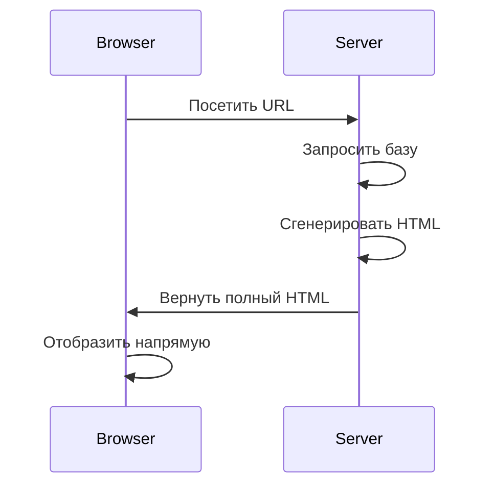
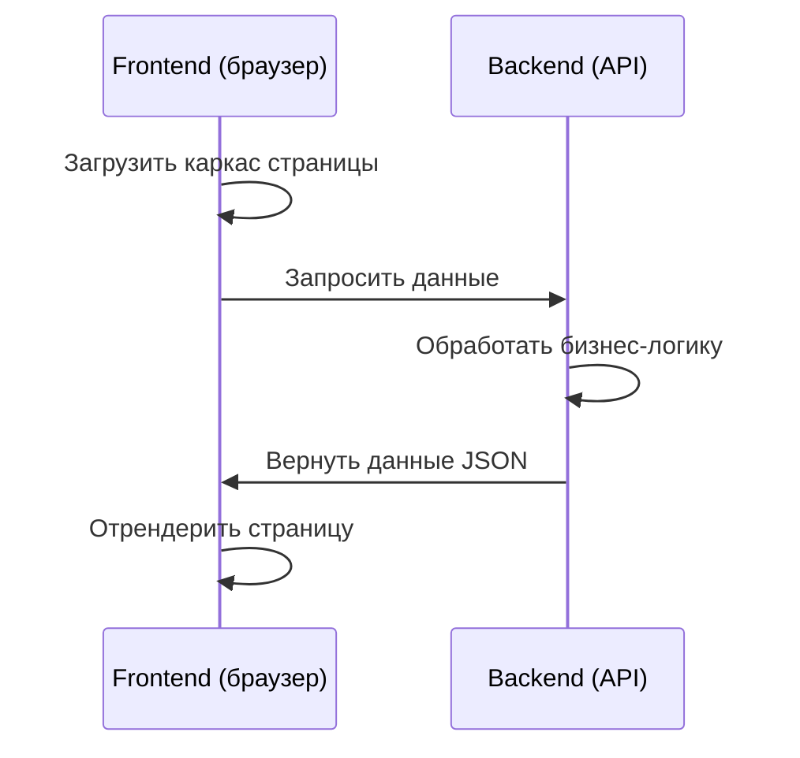
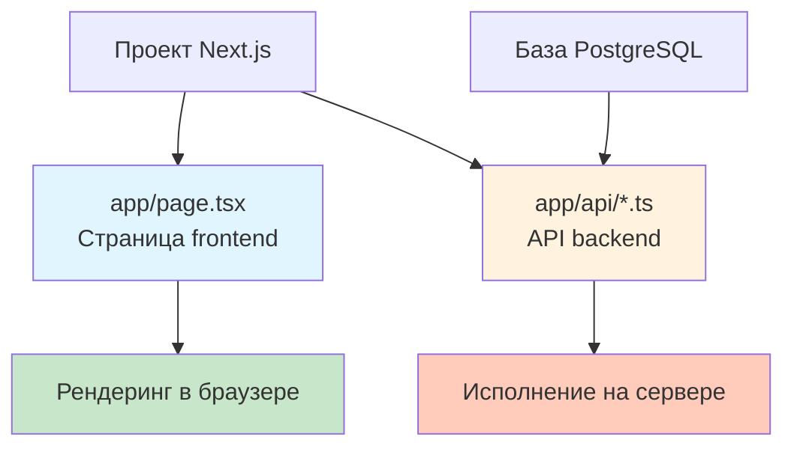
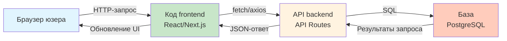

# 4.5 Концепция разделения frontend и backend 🟢

> **Прочитав этот раздел, вы получите:**
>
> - Понимание разделения ответственности frontend и backend
> - Освоение паттерна архитектуры разделения frontend-backend
> - Инсайт, как full-stack фреймворки упрощают разработку
> - Понимание важности модульного мышления

> Frontend отвечает за «представление», backend — за «обработку»; общаются они через API.

---

## Ответственности frontend и backend

### Frontend

Frontend работает в браузере юзера и отвечает за всё, что юзер видит и с чем взаимодействует:

| Ответственность | Описание |
|------|------|
| Рендеринг страниц | Конвертирует HTML и CSS в визуальный интерфейс |
| Интеракции юзера | Отвечает на действия юзера: клики, ввод |
| Отображение данных | Показывает юзеру данные, возвращённые backend |
| Сбор данных | Собирает ввод юзера и отправляет на backend |

### Backend

Backend работает на сервере и отвечает за бизнес-логику, которую юзеры не видят:

| Ответственность | Описание |
|------|------|
| Бизнес-логика | Обрабатывает ключевые бизнес-правила |
| Хранение данных | Взаимодействует с базой: хранение и запросы |
| Аутентификация | Проверяет личность и права юзера |
| Внешние сервисы | Вызывает сторонние API |

Это разделение труда frontend-backend имеет исторические корни. В ранней Web-разработке сервер напрямую генерировал полные HTML-страницы и отправлял их в браузер — браузер отвечал только за отображение. С усилением JavaScript и появлением AJAX (позволяющего браузеру тихо запрашивать данные у сервера в фоне, не обновляя всю страницу) браузер начал брать на себя больше рендеринга, а backend сфокусировался на выдаче данных. Эта эволюция превратила Web-опыт из «страниц» в «приложения» — ближе к нативному софту, с плавными интеракциями и мощной функциональностью. Понимание этой эволюции помогает уловить суть разделения frontend-backend: это не конкретный технический выбор, а архитектурная идея — позволить каждой стороне сфокусироваться на том, что она делает лучше всего.

---

## Традиционный паттерн vs разделение frontend-backend

<FrontendBackendArchitecture />

### Традиционный паттерн (серверный рендеринг)

В ранние дни Web сервер напрямую генерировал полные HTML-страницы:



Характеристики паттерна:

- Сервер генерирует полный HTML
- Браузер отвечает только за отображение
- Переключение страниц требует перезагрузки
- Код frontend и backend жёстко связан

### Паттерн разделения frontend-backend

Современные Web-приложения используют архитектуру разделения frontend-backend:



Характеристики паттерна:

- Frontend отвечает за рендеринг страниц
- Backend только выдаёт данные API
- Коммуникация в формате JSON
- Frontend и backend разрабатываются и деплоятся независимо

---

## Преимущества разделения frontend-backend

| Преимущество | Описание |
|------|------|
| **Ясные ответственности** | Frontend фокусируется на представлении, backend — на логике |
| **Независимая разработка** | Frontend и backend могут разрабатываться параллельно, не блокируя друг друга |
| **Технологическое развязывание** | Frontend и backend могут использовать разные tech stack'и |
| **Высокая переиспользуемость** | Один набор API может обслуживать Web, App и других клиентов |
| **Лучший опыт** | Переключение страниц без перезагрузки — интеракции плавнее |

---

## Восхождение full-stack фреймворков

С эволюцией экосистемы JavaScript появились **full-stack фреймворки** вроде Next.js. Они позволяют коду frontend и backend жить в одном проекте и писаться на одном языке (TypeScript), при этом разделение ответственностей остаётся неизменным:



Преимущества full-stack фреймворков:

- **Единый язык**: и frontend, и backend используют TypeScript
- **Общие типы**: frontend и backend могут разделять определения типов
- **Упрощённый deploy**: один проект содержит и frontend, и backend
- **Эффективность разработки**: меньше переключений контекста

::: tip Full-stack возможности Next.js

Next.js API Routes позволяют писать backend-код в том же проекте. Этот код работает на сервере, где может безопасно обращаться к базам и вызывать внешние API, а frontend-код работает в браузере и отвечает за представление и интеракции.

:::

---

## Модульное мышление

Используете вы full-stack фреймворк или нет, держитесь модульного мышления: разбивайте функциональность на разные модули, вместо того чтобы запихивать весь код в один файл.

Ценность модульного мышления — снижение когнитивной сложности. Когда в проекте пара сотен строк кода, всё в одном файле может не казаться проблемой. Но с ростом функций кодовая база быстро расширяется до тысяч и десятков тысяч строк. Без ясных границ модулей понимание и поддержка кода становятся крайне трудными: приходится продираться через массу нерелевантного кода в поисках нужного, и каждое изменение рискует задеть другие части. По сути, модуляризация — стратегия «разделяй и властвуй»: разбить большую проблему на маленькие, дать каждому независимому модулю решить одну маленькую проблему, а модулям общаться через ясные интерфейсы. Это не только упрощает понимание кода, но и помогает AI точнее находить и работать с конкретной функциональностью.

### Типичная разбивка модулей

```
src/
├── app/              # Next.js App Router
│   ├── page.tsx      # Страница frontend
│   └── api/          # API-роуты
│       ├── auth/     # Связанное с аутентификацией
│       ├── posts/    # Связанное с постами
│       └── users/    # Связанное с юзерами
├── components/       # Переиспользуемые компоненты
├── lib/             # Утилитарные функции
└── db/              # Связанное с базой
```

### Преимущества модуляризации

| Преимущество | Описание |
|------|------|
| Лёгкость поддержки | У каждого модуля одна ответственность — влияние изменений ограничено |
| Лёгкость понимания | Ясная структура каталогов делает проект читаемее |
| Лёгкость тестирования | Малые модули проще покрывать юнит-тестами |
| Командная коллаборация | Разные люди работают над разными модулями |
| AI-friendly | AI быстрее находит релевантный код |

---

## Обзор коммуникации frontend-backend



---

## Клиентская и серверная сторона

Понимание того, где исполняется код, — ключ к построению хороших full-stack приложений:

| Расположение кода | Окружение исполнения | К чему есть доступ |
|---------|---------|-----------|
| **Клиентский код** | Браузер | DOM страницы, устройство юзера (ограниченно), Cookie |
| **Серверный код** | Сервер | Файловая система, база, все сетевые запросы, переменные окружения |

**Клиентская сторона (client)** — браузер юзера. Здесь работает frontend-код, отвечающий за рендеринг интерфейса и обработку интеракций юзера. Однако клиент не может напрямую обращаться к базе или чувствительной информации.

**Серверная сторона (server)** — удалённый сервер. Здесь работает backend-код, который может безопасно обращаться к базам, вызывать внешние API и работать с чувствительной информацией. Юзеры не видят серверный код.

Это разделение — фундамент Web-безопасности: нельзя класть пароль базы в клиентский код, потому что любой может посмотреть исходники браузера.

---

## Концепция шаблонного рендеринга

В традиционном серверном рендеринге (как во Flask и Django) **шаблонизатор** — техника генерации HTML на серверной стороне. Когда вы смотрите страницы личных профилей на Weibo или GitHub, у каждой страницы одинаков layout, но аватар, имя юзера и контент различаются — это и есть эффект шаблонизатора: определяется скелет страницы, для данных оставляются плейсхолдеры, и для разных юзеров подставляется разный контент:

```
Сервер: шаблон + данные → рендеринг → полный HTML → отправка в браузер
```

Шаблоны обычно включают:

- Статичную структуру HTML
- Плейсхолдеры (например, `{{ username }}`) для вставки динамических данных
- Простую логику (например, циклы и условия)

**React vs шаблоны**:

- **Традиционные шаблоны** (например, Jinja2): рендерятся на сервере, генерируя полный HTML до отправки в браузер
- **React-компоненты**: рендерятся на клиенте (или сервере), динамически обновляя интерфейс через JavaScript

Next.js объединяет оба паттерна:

- **Server Components**: похожи на традиционные шаблоны — рендерятся на сервере и могут обращаться к базе
- **Client Components**: похожи на React-приложения — работают в браузере и обрабатывают интеракции

Когда вы открываете новостную статью, текст и картинки появляются почти мгновенно — эта часть была предрендерена на сервере Server Components. А кнопка «Like», поле ввода комментария и меню шеринга на странице должны отвечать на клики и ввод — это Client Components, работающие в вашем браузере.

---

## Определение, где должен жить код

Пиша код, вы должны ясно понимать, где он исполняется:

| Расположение кода | Окружение исполнения | К чему есть доступ |
|---------|---------|-----------|
| **Frontend-код** | Браузер | DOM страницы, устройство юзера (ограниченно) |
| **Backend-код** | Сервер | Файловая система, база, все сетевые запросы |
| **API-роуты** | Сервер | Серверные ресурсы, база |
| **Server Components** | Сервер | База, файловая система |

::: tip Особенности Next.js

Next.js Server Components рендерятся на сервере и могут безопасно обращаться к базе. Client Components работают в браузере и могут общаться с backend только через API.

:::

---

## Частые вопросы

### Q1: Противоречат ли full-stack фреймворки разделению frontend-backend?

Нет. Full-stack фреймворк — подход к разработке, разделение frontend-backend — архитектурный паттерн. Full-stack фреймворки кладут код frontend и backend в один проект, но их ответственности по-прежнему разделены.

### Q2: Когда нужно разделение frontend-backend?

Оно ценнее при коллаборации нескольких людей, необходимости поддерживать несколько клиентов (Web + App) или значительных различиях tech stack frontend и backend. Для личных проектов эффективнее full-stack фреймворк.

### Q3: Насколько гранулярно разбивать модули?

Используйте принцип «единственной ответственности». Модуль должен покрывать одну функциональную область — например, модуль `auth` — только аутентификация, модуль `posts` — только посты. Избегайте излишней гранулярности (по несколько строк на файл) и излишней грубости (один файл со всей функциональностью).

### Q4: Как решить, должен ли код идти во frontend или в backend?

Код, которому нужен доступ к базе, вызов внешних API или работа с чувствительной информацией, обязан идти в backend. Код чистого рендеринга UI и интеракций юзера принадлежит frontend. Если не уверены — предпочитайте backend: это безопаснее.

---

## Ключевые выводы

- ✅ Frontend отвечает за представление, backend — за обработку
- ✅ Разделение frontend-backend повышает эффективность разработки и переиспользуемость кода
- ✅ Full-stack фреймворки дают frontend и backend один язык, но ответственности те же
- ✅ Модульное мышление — ключ к поддерживаемости проекта в долгую
- ✅ Знание того, где исполняется код, — предпосылка хорошего построения full-stack приложений

Поняв разделение frontend-backend, следующий шаг — интеграция внешних API.

---

## Связанное

- Пререквизит: [1.3 Основы браузера и сервера](../01-environment-setup/03-browser-server.md)
- Пререквизит: [4.4 Основы API и HTTP](./04-api-and-http.md)
- См. также: [4.6 Форматы конфиг-файлов](./06-config-formats.md)
