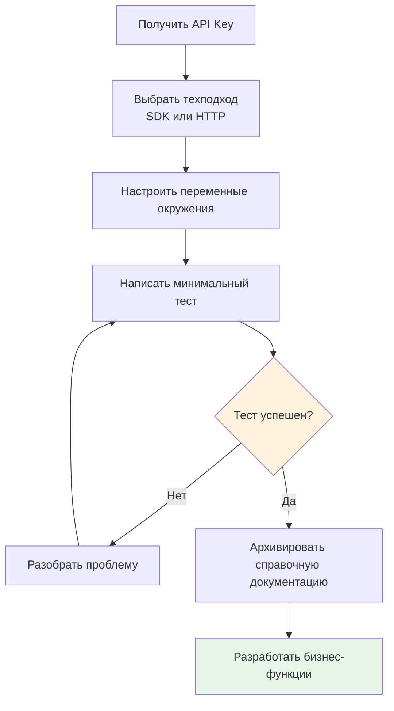

# 4.7 Интеграция API на практике 🟢

> **Прочитав этот раздел, вы получите:**
>
> - Полный workflow интеграции API
> - Различие между SDK и прямыми HTTP-запросами
> - Умение безопасно управлять API-ключами
> - Частые техники обработки ошибок
> - Стратегии rate limiting и timeout

> Интеграция внешних API — частый способ расширить возможности приложения: добавить AI-функции, картографические сервисы и т.д.

---

## Обзор интеграции API

Одно из прекрасных свойств современной разработки — не нужно всё строить с нуля. Что бы вы ни хотели — AI-беседы, карты, обработку платежей — есть сервисы, готовые взять тяжёлую работу на себя. Нужно лишь говорить с ними через **API**.

API (Application Programming Interface) — язык, которым приложения общаются друг с другом. Раньше «разговор» двух программ требовал сложных протоколов и специализированной интеграционной разработки. Теперь большинство сервисов дают стандартизированные API: отправляете запросы в оговорённом формате — получаете нужные результаты.

### Почему API так важны?

Представьте, что вы строите travel-приложение. Нужно отмечать достопримечательности на карте, показывать локальную погоду и обрабатывать платежи юзеров. До эры API пришлось бы строить свои картографические серверы, нанимать метеорологов и интегрироваться с банковскими системами. Теперь? Вызов API картографического сервиса, API погодного сервиса, API платёжного сервиса — вы фокусируетесь на ключевой бизнес-логике, остальное оставляя профессионалам.

Это не только эффективность — это возможности. API позволяют индивидуальным разработчикам строить продукты, которые раньше могли создавать только крупные компании. Вы комбинируете данные и способности разных сервисов как конструктор, создавая нечто совершенно новое.

### Асинхронная коммуникация и форматы данных

Современные web-приложения используют **AJAX** (Asynchronous JavaScript and XML) для обмена данными с серверами: когда вы ищете товары на Taobao, страница не обновляется полностью — результаты поиска появляются прямо под полем. Это работа AJAX. После действия юзера JavaScript отправляет запросы в фоне, сервер возвращает данные, и страница обновляется частично без перезагрузки. Асинхронный подход делает интеракции плавнее.

API обычно возвращают данные в формате **JSON** (см. 4.6 Форматы конфиг-файлов). JSON — чистая структура данных, которую может парсить любой язык программирования, а frontend гибко рендерит её в любой стиль.

### Частые API-способности

Современная API-экосистема уже очень богата — от базового хранения данных до передовых AI-мультимодальных способностей, со зрелыми сервисами:

| Тип способности | Международные лидеры | Лидеры в Китае | Сценарии |
|-----------------|----------------------|------------------|-----------|
| **AI-чат** | GPT, Claude, Gemini | Tongyi Qianwen, Wenxin Yiyan, Doubao, Kimi, DeepSeek | Чат-боты, генерация контента |
| **AI-генерация изображений** | DALL-E, Midjourney, Stable Diffusion | Tongyi Wanxiang, Wenxin Yige, Jimeng | Дизайн продуктов, маркетинговые ассеты |
| **AI-генерация видео** | Sora, Runway, Pika, Kling | Keling, Hailuo AI, Doubao Seedance | Короткие видео, рекламные ролики |
| **AI-генерация музыки** | Suno, Udio | Doubao Music, Tiangong Music | Создание саундтреков, звуковые эффекты |
| **Распознавание/синтез речи** | Whisper, ElevenLabs | iFlytek Speech, Doubao Speech, MiniMax Hailuo Speech | Голосовой ввод, AI-озвучка |
| **Генерация кода** | GitHub Copilot, Cursor | Tongyi Lingma, Wenxin Kuaima, CodeGeeX | Автодополнение кода, автопрограммирование |
| **Картографические сервисы** | Google Maps, Mapbox | Amap (Gaode), Baidu Maps, Tencent Maps | Отметки локаций, планирование маршрутов |
| **Платежи** | Stripe, PayPal | Alipay, WeChat Pay | Онлайн-платежи, управление подписками |
| **Хранение данных** | AWS S3, Cloudflare R2 | Alibaba Cloud OSS, Tencent Cloud COS, Qiniu Cloud | Загрузка файлов, бэкап данных |
| **SMS/Email** | Twilio, SendGrid | Alibaba Cloud SMS, SendCloud | Коды подтверждения, уведомления |

---

## Шестишаговый процесс интеграции API

<ApiIntegrationFlow />

### Шаг 1: Получите креденшелы

Как для заселения в отель нужен паспорт, использование API требует подтверждения личности. Это подтверждение — ваш **API Key**.

Процесс получения API Key обычно прямолинеен:

1. Найти официальную платформу разработчиков или документацию
2. Зарегистрировать аккаунт разработчика
3. Создать приложение или проект (заполнить базовую информацию)
4. Сгенерировать API Key


::: warning Сначала security

API Key — как пароль вашей банковской карты: при утечке другие могут выдавать себя за вас и даже исчерпать квоту. Поэтому:

- **Не** коммитить его в Git repository
- **Не** писать во frontend-код (юзеры его увидят)
- **Не** публиковать в публичных местах

:::

### Шаг 2: Выберите технический подход

Получив API Key, решите, как вызывать API. Два подхода: **SDK** и **прямой HTTP-запрос**.

| Подход | Плюсы | Минусы | Лучше всего для |
|----------|------|------|----------|
| **SDK** | Официальная упаковка, полные типы, обстоятельные доки | Нужно ставить зависимости | Большинство случаев |
| **HTTP-запрос** | Без зависимостей, легковесно | Ручная обработка протокола | Простые вызовы или нет SDK |

**Что такое SDK?**

SDK (Software Development Kit) — официально предоставляемая библиотека-обёртка. Она упаковывает все низкоуровневые операции (HTTP-запросы, JSON-сериализацию, обработку ошибок, повтор по timeout и т.д.) в простые вызовы функций. Вы вызываете метод вроде `generateText()` — SDK внутри обрабатывает все сложные сетевые взаимодействия.

::: tip Почему приоритет SDK?

Официальные SDK поставляются с полными определениями типов TypeScript. Это как дать AI детальную «карту кода»: он точно знает, какие функции доступны, как заполнять параметры и каковы возвращаемые значения. Это точнее, чем выводить параметры и возвращаемые значения AI исключительно из HTTP-документации.

:::

Для AI-приложений рекомендуем **Vercel AI SDK**. Он даёт пакет `@ai-sdk/openai-compatible`, специально созданный для подключения к сервисам, реализующим формат OpenAI API. Поскольку дизайн API OpenAI стал фактическим индустриальным стандартом, большинство провайдеров моделей (включая китайских) выбирают совместимость с форматом его интерфейса — консистентность структуры запросов, полей ответа и методов аутентификации. Значит, разработчику достаточно выучить одну API-спецификацию, поменять `baseURL`, API Key и имя модели — и можно вызывать мейнстримные большие модели мира, не учая разные SDK под каждую модель.

### Шаг 3: Настройте переменные окружения

API Key у вас есть — теперь нужно безопасно хранить его в коде. Писать ключ прямо в коде — большое «нет»: любой, кто видит код, может его забрать.

Правильный подход — **переменные окружения**:

```bash
# файл .env
AI_API_KEY=sk-xxx                   # API-ключ
AI_BASE_URL=https://api.openai.com/v1  # Базовый URL API
AI_MODEL=your-model-name             # Название модели
```

Код читает переменные окружения через `process.env`:

```typescript
const apiKey = process.env.AI_API_KEY;
```

Переменные окружения — как «firewall» между вашим кодом и секретами:

- Программа автоматически читает конфигурацию при runtime
- Файл `.env` не коммитится в Git
- Разные окружения используют разные ключи

::: tip Файл .env

В Next.js-проектах файл `.env.local` хранит переменные окружения локальной разработки. При деплое в production настройте те же переменные окружения в настройках платформы deploy.

:::


### Шаг 4: Напишите минимальный тест

Настроив SDK и API Key, вы наверняка хотите сразу писать бизнес-функции. Но постойте — сначала напишите простейший тест.

Почему? Если броситься в сложные функции и что-то сломается, вы не будете знать, что это: ошибка конфигурации, невалидный Key или проблема логики кода. Минимальному тесту нужно проверить одно: **могу ли я подключиться к API?**

Этому тест-коду достаточно одного: сделать один вызов API и посмотреть, есть ли ответ:

```typescript
// Тест подключения к API
import { createOpenAICompatible } from '@ai-sdk/openai-compatible';
import { generateText } from 'ai';

// Создание инстанса клиента
const client = createOpenAICompatible({
  name: 'my-provider',
  apiKey: process.env.AI_API_KEY,
  baseURL: process.env.AI_BASE_URL,
});

async function testConnection() {
  const { text } = await generateText({
    model: client.chatModel(process.env.AI_MODEL!),  // Имя модели читается из переменной окружения
    prompt: 'Hello, please reply "Connection successful"',
  });

  console.log(text);
}

testConnection();
```

**Чек-лист тестирования**:

- Использовать `createOpenAICompatible` для создания клиента, передав `apiKey` и `baseURL`
- Использовать `generateText` для отправки простого тест-сообщения
- Заполнить имя модели в `chatModel()` (читается из переменной окружения или хардкодится)
- Если получен ответ — конфигурация верна

Если тест успешен, это значит:

- API Key валиден
- Сетевое соединение в норме
- Конфигурация SDK верна

Если тест провален, AI поможет troubleshot'ить по сообщению об ошибке:

- Неверный Key?
- Сеть недоступна?
- Конфликт версий SDK?
- Квота исчерпана?

### Шаг 5: Архивируйте справочную документацию

Тест прошёл — не спешите дальше в разработку. Сначала сохраните официальную документацию API для будущего использования.

Почему? В следующий раз, прося AI собрать связанную функцию, вы скормите ему официальную документацию напрямую — и он сгенерирует точный вызывающий код. Иначе придётся раз за разом объяснять разные параметры и детали.

**Рекомендуемые практики**:

1. **Сохраните официальную документацию**: ключевые страницы официальных доков как Markdown-файлы (можно использовать браузерные расширения вроде «MarkDownload» или копировать вручную)
2. **Извлеките частый код**: организуйте самые используемые примеры вызовов в cheat sheet

**Предлагаемое расположение документации**:

```
docs/
├── api-references/
│   ├── openai-api.md          # Архив официальной документации
│   ├── aliyun-qwen-api.md     # Архив официальной документации
│   └── my-cheatsheet.md       # Личный cheat sheet
```

**Пример cheat sheet** (`my-cheatsheet.md`):

```markdown
# API Cheat Sheet

## Переменные окружения
- AI_API_KEY
- AI_BASE_URL
- AI_MODEL

## Ссылки на официальную документацию
- [OpenAI API](https://platform.openai.com/docs)
- [Alibaba Cloud Tongyi Qianwen](https://help.aliyun.com/zh/model-studio/)
```

::: tip Зачем сохранять официальную документацию?

Официальная документация содержит полные описания параметров, определения кодов ошибок, лимиты использования и многое другое. Переписывать самому — легко упустить детали; надёжнее всего сохранить оригинал. Когда нужно, чтобы AI помог с кодом, передайте эти документы как контекст — генерируемый код будет точнее.

:::

### Шаг 6: Разрабатывайте бизнес-функции

Фундамент заложен — можно писать бизнес-функции. Расскажите AI, какую функциональность хотите реализовать, дайте ему архивированную документацию API — и он напишет точный вызывающий код.

::: tip Избегайте частых вызовов

Не вызывайте API часто в циклах:

- Это расходует квоту API
- Легко упереться в rate limits
- Скорость ответа низкая

Уместно используйте кэширование: одинаковые данные можно сохранить и переиспользовать.

:::

---

## Обработка частых ошибок

### Rate limiting

У большинства API есть лимиты частоты вызовов; превышение возвращает `429 Too Many Requests`.

**Способы обработки**:

- Добавить логику повторов (подождать и попробовать снова)
- Использовать очереди для контроля частоты запросов
- Проанализировать, можно ли оптимизировать логику вызовов

### Обработка timeout

Если API долго не отвечает, ваша программа зависнет.

**Способы обработки**:

- Задать длительности timeout
- Добавить fallback-логику после timeout
- Показывать дружелюбные сообщения об ошибках

### Провал аутентификации

Истёкшие или невалидные API Key возвращают `401 Unauthorized`.

**Способы обработки**:

- Проверить корректность API Key
- Подтвердить, что Key не истёк
- Проверить достаточность квоты вызовов

---

## Флоу-чарт интеграции API



---

## Best practices безопасности

| Практика | Описание |
|----------|-------------|
| Использовать переменные окружения | API-ключи не пишутся в код |
| Исключение в .gitignore | Убедиться, что файлы .env не коммитятся |
| Backend-прокси | Вызовы чувствительных API идут через backend |
| Принцип минимальных привилегий | Давать API только необходимые права |
| Регулярная ротация | Периодически менять API-ключи |

::: tip Frontend не может напрямую вызывать чувствительные API

Когда вы заказываете еду через мини-программу, приложение не отправляет пароль backend'а продавца на ваш телефон — ваш заказ сначала идёт на собственный сервер мини-программы, который уже своим ключом связывается с системой продавца. Так работает «backend-прокси».

Не вызывайте API, требующие API Key, напрямую из frontend-кода. API Key будет виден всем и может быть злоупотреблен.

Правильный подход: backend получает запросы frontend, backend использует API Key для вызова внешних API, затем возвращает результаты frontend.

:::

<ProxyArchitecture />

---

## Риски зависимости от API

Использовать внешние API удобно, но есть важный риск, который нужно знать: **не пере-зависите от одного API**.

**Сервисы могут закрыться или поднять цены.** Компании, предоставляющие API, могут в любой момент остановить сервис, изменить ценовую политику или сильно урезать бесплатные квоты. Если ваш бизнес целиком построен на одном API, при его исчезновении ваше приложение может рухнуть вместе с ним.

**API могут меняться.** Даже если сервис продолжается, сам интерфейс API может измениться. Сегодня он возвращает `user_name`, завтра — `userName`. Такие, казалось бы, мелкие изменения могут сломать ваше приложение.

**Стратегии снижения рисков**:

- **Держать альтернативы под рукой**: по возможности знать, какие похожие API существуют
- **Абстрактная инкапсуляция**: оборачивать вызовы API в собственные функции (как переключение способов оплаты в приложении — с WeChat Pay на Alipay флоу оплаты не меняется, меняется только платёжный канал), тогда при смене API вы правите одно место
- **Кэшировать важные данные**: не запрашивать API каждый раз; сохранять результаты, снижая зависимость
- **Мониторить здоровье API**: регулярно проверять, отвечают ли API нормально

---

## FAQ

### Q1: Что делать, если бесплатная квота API исчерпана?

У большинства провайдеров API есть платные тарифы. Оцените использование вашим проектом и выберите подходящий пакет. Если это просто обучение — можно подать на образовательные или developer-скидки.

### Q2: Как тестировать API, не расходуя квоту?

Используйте mock-данные или тестовые окружения. Многие провайдеры дают test-режимы, возвращающие фейковые данные без списаний.

### Q3: Что делать при конфликте версий SDK?

Попросите AI помочь разобраться. Дайте ему конкретное сообщение об ошибке и версии зависимостей — он предложит совместимые комбинации версий или альтернативные решения.

### Q4: Как управлять API-ключами в нескольких окружениях (dev/production)?

Используйте разные файлы переменных окружения. Next.js поддерживает мультисредовые конфигурации вроде `.env.local` (локально) и `.env.production` (production).

### Q5: Выбирать китайские или международные API?

Исходите из базы юзеров и бизнес-потребностей:

- **Обслуживание юзеров в Китае**: приоритет китайским API — ниже сетевая задержка, лучше комплаенс
- **Обслуживание международных юзеров**: международные API — лучше глобальное покрытие узлов
- **AI-способности**: у китайских и международных свои преимущества; сравнивайте результаты и цены
- **Хранение/SMS и другие базовые сервисы**: китайские провайдеры обычно дешевле и отзывчивее

### Q6: Совместимы ли API китайских больших моделей с форматом OpenAI?

Да, большинство предоставляют OpenAI-совместимый режим. При его использовании достаточно поменять `baseURL`, API Key и имя модели — остальной код в основном не меняется. Конкретные настройки смотрите в официальной документации провайдеров.

---

## Ключевые выводы

- ✅ Интеграция API следует шести шагам: получить креденшелы → выбрать подход → настроить переменные → протестировать → архивировать → разрабатывать
- ✅ Приоритет официальным SDK; определения типов делают AI точнее
- ✅ API Key обязательно хранить в переменных окружения
- ✅ Сначала минимальный тест; бизнес-функции — после проверки
- ✅ Внимание частым ошибкам: rate limiting, timeout, ошибки аутентификации
- ✅ Чувствительные API вызывать только через backend, никогда не выставлять в frontend

Поняв интеграцию API, дальше — как писать проектную документацию.

---

## Связанное

- Пререквизит: [4.4 Основы API и HTTP](./04-api-and-http.md)
- Пререквизит: [4.5 Концепция разделения frontend и backend](./05-frontend-backend-separation.md)
- Пререквизит: [4.6 Форматы конфиг-файлов](./06-config-formats.md)
- Далее: [4.8 Структура проектной документации](./08-readme-structure.md)
