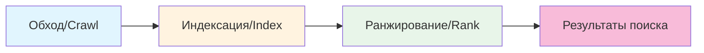

# 15.2 Полный гайд по SEO

> Краулеры поисковиков «слепы» — им нужно показать дорогу. Но когда путь указан, ранжирование реально определяет сам контент.

---

## Сяомин не может найти собственный сайт

Сяомин искал название своего сайта в Baidu и Google, пролистав десять страниц — и не нашёл.

«Мой сайт же в онлайне — почему поисковики его не проиндексировали?»

Он попробовал искать ключевые слова, связанные с продуктом, — и видел только чужие сайты. Его сайт был как лавочка в глубоком переулке: существует, но никто не знает.

Старый мастер сказал: «Краулеры поисковиков не находят вас автоматически. Каждый день в интернете рождаются миллионы новых страниц — краулеры физически не могут проверить каждую. Нужно проactively сказать им, где вы и что у вас есть».

---

## Что такое SEO и почему оно стоит вашего времени

**SEO (Search Engine Optimization)** — практика улучшения позиций сайта в поисковой выдаче.

Для инди-разработчиков SEO может быть самым экономичным способом привлечения юзеров:

| Ценность | Объяснение |
|------|------|
| Бесплатный трафик | Посетители без оплаты за рекламу |
| Долгая отдача | Хорошие SEO-результаты сохраняются годами — вас находят, даже пока вы спите |
| Квалифицированные юзеры | У поискового трафика чёткий интент: люди активно ищут решение своей проблемы |
| Бренд-экспозиция | Высокая позиция сама по себе — знак доверия |

В отличие от соц-шеринга из предыдущего раздела, SEO-трафик — тип «медленно, но стабильно». Соц-шеринг — как фейерверк: один пост, всплеск азарта — и ушло. SEO — как посадить дерево: первые месяцы почти не видно, но когда ранжирование выросло, вы получаете стабильный ежедневный трафик без повторных промоушенов.

### Как работают поисковики

Чтобы делать SEO хорошо, сначала нужно понять, как работают поисковики. Весь процесс — три шага:

**Шаг 1: Обход (Crawl)**. У поисковиков есть программы-«краулеры», которые стартуют с известных веб-страниц и идут по ссылкам к новым, как пауки по паутине. Если на ваш сайт нет ссылок, краулеры не найдут вас — в этом и проблема Сяомина.

**Шаг 2: Индексация (Index)**. Обнаружив страницу, краулер забирает её содержимое, анализирует, какую информацию она несёт, и кладёт в гигантскую базу (индекс). Это как каталогизация новых книг в библиотеке: книги приехали, но ещё не расставлены по полкам.

**Шаг 3: Ранжирование (Rank)**. Когда юзер ищет ключевое слово, поисковик находит в индексе все релевантные страницы и сортирует их по сотням факторов (релевантность контента, качество страницы, авторитетность сайта, user experience и т.д.). Верхние позиции — то, что юзеры видят в выдаче.

Понимание этих трёх шагов делает логику SEO прозрачной: **во-первых, дать краулерам найти вас (техническая настройка); во-вторых, дать краулерам понять вас (оптимизация контента); в-третьих, убедить поисковик, что вы лучше других (качество и авторитетность)**.

---

## Базовое трио: даём краулерам найти вас

Технический фундамент SEO сводится к трём вещам: **Metadata + Sitemap + Robots.txt**. Это ваш «входной билет» — без них поисковики даже не узнают, что существует ваш сайт.

Хорошая новость: все три — стандартизированные конфигурации. Скажите Claude Code, что нужна SEO-инфраструктура, — и он настроит всё разом.

<SEOProcess />

### Metadata

Metadata — способ сказать поисковикам, «о чём эта страница». Два самых важных поля:

- **`title`**: заголовок страницы, напрямую отображаемый в выдаче. Это первый фактор, влияющий на решение юзера кликнуть.
- **`description`**: описание страницы, серым текстом под заголовком в выдаче. Хорошее описание заметно поднимает кликабельность.

У каждой страницы должны быть уникальные title и description. Если у всех страниц заголовок «Мой сайт», поисковики решат, что контент монотонный, а юзеры не поймут, какую страницу им искать.

### Sitemap

Sitemap — XML-файл со списком всех страниц сайта и временем их обновления. Думайте о нём как о «карте-путеводителе» для краулеров: «Эй, вот мои страницы, эти обновлялись недавно — заходи в первую очередь».

Без Sitemap краулеры могут находить страницы только одну за другой по ссылкам, потенциально пропуская «острова» — страницы, на которые никто не ссылается. С Sitemap краулеры узнают все ваши страницы разом.

### Robots.txt

Robots.txt говорит краулерам, какие страницы можно и нельзя забирать. Например, вы не хотите, чтобы поисковики индексировали эндпоинты `/api/` или бэкенд-страницы `/admin/` — в выдаче от них нет пользы, а чувствительную информацию они могут подставить.

Robots.txt — также место, где вы сообщаете краулерам, где лежит ваш Sitemap. При визите сайта краулеры обычно сначала проверяют `robots.txt`, находят оттуда URL Sitemap и затем сканируют страницы по нему.

### Настройка в Next.js

Все три конфигурации имеют стандартные файловые конвенции в Next.js: объект `metadata` для метаданных, `app/sitemap.ts` для генерации sitemap и `app/robots.ts` для правил краулеров. Claude Code с загруженным Skill `next-best-practices` справляется с этим effortlessly — всё это стандартные фреймворковые фичи, сторонние библиотеки не нужны.

---

## Сайт Сяомина индексируется

Сяомин попросил Claude Code настроить SEO-трио. Затем он сабмитнул Sitemap через вебмастер-инструменты крупных поисковиков:

1. [Google Search Console](https://search.google.com/search-console) — вебмастер-инструмент Google: просто регистрируетесь и подаёте Sitemap
2. [Bing Webmaster Tools](https://www.bing.com/webmasters) — вебмастер-инструмент Bing, процесс похож на Google

Обе платформы бесплатны. Сабмит Sitemap — по сути proactive сообщение поисковикам: «Эй, мой сайт здесь, вот список страниц — заходите посмотреть».

Что до Baidu, Сяомин хотел подать и туда, но обнаружил, что вебмастер-платформа Baidu ставит для личных сайтов высокие барьеры: требуется верификация владения сайтом, и неохотно индексирует сайты без файлинга. Сервер Сяомина был в Гонконге без ICP-регистрации, так что Baidu пока оставался вне досягаемости. Старый мастер: «Сначала сфокусируйся на Google и Bing. Baidu возьмём позже, когда переедешь сервером в материковый Китай».

Через две недели Сяомин поискал название своего сайта в Google — он наконец появился в выдаче! Позиция низкая, на третьей странице, но проиндексирован.

«Как попасть на первую страницу?»

Старый мастер: «Техническая настройка — лишь входной билет: она решает проблему «найдут ли вас». Но «на какой позиции» — зависит от качества вашего контента».

---

## Контент — ядро SEO

Многие думают, SEO — это настройка кучи технических параметров. Нет. Техническая настройка — лишь малая часть SEO; ранжирование реально определяет **сам контент**.

Подумайте: какова цель поисковиков? Давать юзерам самые ценные результаты. Если ваш контент реально решает проблемы юзеров, у поисковика нет причин не поднимать вас высоко. И наоборот: контент пустой — никакая техническая оптимизация не спасёт.

### Оптимизация заголовков

Заголовок — самый заметный элемент выдачи и первый фактор решения юзера кликнуть.

| Принцип | Объяснение |
|------|------|
| Ключевые слова вперёд | Самое важное ключевое слово — в начало заголовка: юзеры сканируют выдачу слева направо |
| Оптимальная длина | Лучше 50–60 символов; длинное обрежется с многоточием |
| Уникальность | У каждой страницы разный заголовок, иначе поисковики путаются |

Хорошая структура заголовка: `Основное ключевое слово | Второстепенное ключевое слово | Название бренда`

Например: `Туториал деплоя Next.js | Гайд по Vercel в один клик | Техноблог Сяомина`

### Принцип E-E-A-T

Google оценивает качество контента по ключевому фреймворку **E-E-A-T**:

- **Experience**: есть ли у автора реальный опыт? Пишущий туториал по деплою — сам ли он что-то задеплоил?
- **Expertise**: демонстрирует ли контент профессиональные знания? Поверхностно или вглубь?
- **Authoritativeness**: есть ли авторитет у сайта и автора в этой области?
- **Trustworthiness**: заслуживает ли контент доверия? Указаны ли источники?

Звучит абстрактно, но суть проста: **пишите о том, что реально понимаете, и давайте по-настоящему ценный контент**.

Поисковики умнеют. Десять лет назад можно было выехать на keyword stuffing — теперь нет. Алгоритм Google отличает статью с реальной начинкой от SEO-пустышки, собранной ради ранжирования. Так что лучшая SEO-стратегия — просто серьёзно писать хороший контент.

### Структура URL

URL — тоже сигнал, помогающий поисковикам понять содержимое страницы.

| Хороший URL | Плохой URL |
|---------|---------|
| `/blog/how-to-learn-nextjs` | `/post?id=123` |
| `/products/laptops` | `/products?type=1&cat=2` |

Хорошие URL: короткие, описательные, разделённые дефисами, все строчные. Юзер может угадать содержимое страницы по URL — и поисковик тоже.

---

## Скорость страницы: user experience — тоже ранкинг-фактор

Google официально включил page experience в ранкинг-факторы в 2021 году. Это значит: даже при отличном контенте, если страница грузится медленно, интеракции лагают, а вёрстка прыгает, — ранжирование пострадает.

### Core Web Vitals

Google определяет три ключевые метрики page experience:

| Метрика | Хорошее значение | Объяснение |
|------|--------|------|
| **LCP** | < 2.5s | Largest Contentful Paint — как быстро появляется основной контент страницы |
| **INP** | < 200ms | Interaction to Next Paint — как быстро юзер видит отклик после клика |
| **CLS** | < 0.1 | Cumulative Layout Shift — не сдвигается ли контент во время загрузки |

Становиться экспертом по оптимизации производительности не нужно. Большинство современных фреймворков (Next.js, Nuxt и т.д.) уже имеют встроенные оптимизации: автоматический code splitting, оптимизация картинок, preloading и т.д. Но несколько направлений стоят внимания:

- **Картинки**: WebP вместо JPG/PNG — файлы меньше, качество сопоставимое. Компонент `<Image>` в Next.js делает это автоматически.
- **Code splitting**: код грузится по требованию — юзеру на главной не нужен код страницы «О нас».
- **Кэширование**: браузерный кэш и CDN, чтобы вернувшиеся юзеры не перекачивали все ресурсы.
- **Сжатие**: включите Gzip или Brotli для уменьшения передаваемого объёма.

Claude Code тоже поможет проверить и подтюнить эти оптимизации. Скорость страницы можно протестировать инструментом Google [PageSpeed Insights](https://pagespeed.web.dev/) — он даёт конкретные рекомендации.

### Structured data

Structured data — ещё одна продвинутая техника. Она использует формат JSON-LD, чтобы сообщить поисковикам «структуру» контента страницы: это статья, кто автор, когда опубликована, есть ли рейтинг и т.д.

Прочитав structured data, поисковик может показать в выдаче «rich snippets» — дату публикации статьи, звёздный рейтинг продукта, списки FAQ. Эти rich snippets заметнее обычной выдачи и кликабельнее.

Частые типы structured data: Article, Product, FAQPage, BreadcrumbList. Скажите Claude Code, что нужно добавить structured data, указав тип вашей страницы.

---

## Ускорение индексации: как быстрее дать поисковикам себя обнаружить

Настроив SEO-инфраструктуру, возможно, придётся ещё подождать индексации. Эти методы ускоряют процесс:

| Метод | Объяснение |
|------|------|
| Сабмит Sitemap | Подача в Google Search Console и Bing Webmaster Tools — самый прямой способ |
| Активный пуш | Некоторые вебмастер-платформы позволяют API-пушить URL новых страниц |
| Внешние ссылки | Если уже проиндексированный сайт ссылается на вас, краулеры найдут вас по этой ссылке |
| Соцсети | Шеринг ссылок в соцсетях (перекликается с OG-конфигурацией из 15.1) — краулеры находят вас и с соцплатформ |

Из них самую большую ценность имеет «внешние ссылки». Если на вас ссылается авторитетный сайт, поисковики тоже считают ваш контент ценным — как с цитированиями научных статей: чем больше вас цитируют, тем вы влиятельнее. Но внешние ссылки напрямую не контролируются — они зависят от того, действительно ли ваш контент заслуживает цитирования.

---

## Google и Bing vs Baidu: два разных мира

Для личных проектов с серверами за рубежом Google и Bing — главные поля битвы. Они не дискриминируют зарубежные серверы, и обычно через недели после сабмита Sitemap вас индексируют.

Baidu — другой мир. Если ваши юзеры в основном в Китае, Baidu SEO заслуживает внимания, но барьеры заметно выше:

| Измерение | Google / Bing | Baidu |
|------|--------|------|
| Барьер индексации | Сабмит Sitemap, без требований к локации сервера | Сильно предпочитает отечественные серверы, редко индексирует незарегистрированные сайты |
| Оценка контента | Принципы E-E-A-T, ценит глубину контента | Ценит оригинальность, строго наказывает плагиат |
| Технические требования | Core Web Vitals — ранкинг-фактор | Больше ценит скорость доступа из отечественных хостов |
| Мобильные | Mobile-first индексация (мобильная версия в приоритете) | Мобильный вес так же высок |
| Безопасность/Комплаенс | HTTPS — ранкинг-фактор | ICP-регистрация почти пререквизит индексации |

Коротко: **Baidu SEO = отечественный сервер + ICP-регистрация + оптимизация контента**. Если ваш сервер за рубежом без регистрации, Baidu вас в основном не проиндексирует. Это не решается технической настройкой — это инфраструктурный выбор.

Сервер Сяомина был в Гонконге, так что он сфокусировался сначала на Google и Bing. Baidu он возьмёт позже — когда продукт нацеливается на отечественных юзеров, сервер переезжает в материковый Китай и ICP-регистрация пройдена. Подробно об ICP-регистрации — в 15.4 Юридический комплаенс.

---

## SEO-чек-лист

Пробегитесь по чек-листу перед запуском, чтобы убедиться в базовом покрытии:

<SEOChecklist />

**Базовая настройка**

SEO-инфраструктуру (Metadata, Sitemap, Robots.txt) Claude Code настроит для вашего Next.js-проекта за один заход. Claude Code с загруженным Skill `next-best-practices` автоматически разрулит эти стандартные фичи.

Что нужно вам:
- [ ] Сабмитнуть Sitemap в Google Search Console и Bing Webmaster Tools

**Качество контента** (требует вашего ревью)
- [ ] Оригинальный контент, решающий реальные проблемы юзеров
- [ ] Семантическая HTML-структура (чёткая иерархия h1 → h2 → h3)
- [ ] У картинок есть alt-описания (помогает поисковикам понять содержимое)

**Техническая оптимизация** (делает фреймворк, но стоит проверить)
- [ ] Чистые, описательные URL
- [ ] Хорошая скорость загрузки (тест PageSpeed Insights)
- [ ] Mobile-friendly (адаптивный дизайн)
- [ ] HTTPS-шифрование

---

## FAQ

### Q1: Через сколько видно результаты SEO?

Обычно 3–6 месяцев. Новым сайтам нужно время на обнаружение поисковиками и выработку доверия. Это не то, что срабатывает сразу после настройки: поисковикам нужно время отсканировать ваши страницы, оценить качество контента и понаблюдать поведенческие данные юзеров.

Не сдавайтесь из-за отсутствия результатов за месяц-два. SEO — долгосрочная инвестиция, но когда срабатывает, отдача непрерывна.

### Q2: Какая правильная плотность ключевых слов?

Стандартного значения нет, и считать её специально не нужно. Просто пишите естественно.

Десять лет назад в SEO-кругах ходило «плотность ключевых слов 2–5%», и люди исступленно пихали ключевые слова в статьи. Современные поисковики на это не ведутся: они судят релевантность через семантическое понимание, а не простой подсчёт вхождений. Преднамеренный keyword stuffing может быть помечен как «keyword stuffing» — и ранжирование упадёт.

---

Ранжирование сайта Сяомина медленно растёт. С третьей страницы на вторую, со второй — в низ первой. У него появляется новый вопрос: что делают эти посетители из поиска и соц-шеринга после прихода? Какие страницы самые популярные? Где юзеры уходят?

Пора посмотреть на данные.
