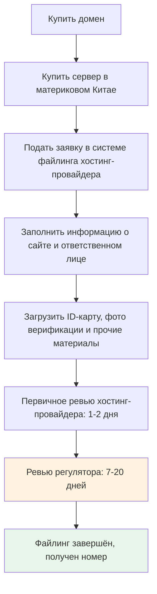

# 15.4 Юридический комплаенс

> Юридический комплаенс — не опция, а обязательное. Не ждите жалобы, чтобы задуматься о соответствии законам.

---

## «Личным проектам это тоже нужно?»

Сайт Сяомина начал обзаводиться юзерами. Немногими — пара десятков в день, — но настоящие люди реально пользовались тем, что он построил. Он с удовольствием проверял аналитику Umami, когда мастер вдруг посерьёзнел.

«Ты собираешь данные юзеров. Политика конфиденциальности у тебя есть?»

«Э? Личным проектам она тоже нужна?» Сяомин думал, политика конфиденциальности — забота больших компаний.

«Пока ты собираешь данные юзеров — даже если это просто статистика визитов Umami — строго говоря, она нужна». Мастер сделал паузу. «Знаешь, какой штраф за нарушение GDPR? 4% мирового годового оборота или 20 миллионов евро — что больше».

Сяомина передёрнуло. Его личный проект вряд ли попадёт на радар ЕС, но мысль мастера ясна: **осознанность комплаенса нужна с самого начала — не догоняйте, когда проект вырастет**.

---

## Почему юридический комплаенс важен

Интернет-продукты задействуют данные юзеров и бизнес-активность, значит обязаны соответствовать законам. Это не «только для больших компаний» — закон одинаково относится к инди-разработчикам и корпорациям.

| Риск | Последствие |
|------|------|
| Нарушение законов о защите данных | Колоссальные штрафы, снятие приложения, остановка сервиса |
| Отсутствие Terms of Service | Нет правовой защиты в спорах |
| Сайт без файлинга | Блокировка в материковом Китае |
| Нарушение приватности юзеров | Репутационный ущерб, потеря юзеров, медийная огласка |

Хорошая новость: для личных проектов комплаенс не сложен. Не нужно нанимать юриста (хотя для формальных продуктов рекомендуется) и читать GDPR от корки до корки. Разберитесь, что вам нужно, и попросите Claude Code сгенерировать комплаенс-документы под вашу ситуацию — это куда проще, чем кажется.

---

## Политика конфиденциальности: расскажите юзерам, какие данные собираете

Политика конфиденциальности — публичный документ, объясняющий, какие данные юзеров собирает ваш сайт или приложение, зачем, как хранит, как использует и какие права есть у юзеров.

### Когда нужна политика конфиденциальности

Многие думают, что политика нужна лишь при сборе «персональной информации». На деле — если вы собираете что-то из перечисленного, она нужна:

- **Информация аккаунта**: email, имя юзера, пароль (хешированный)
- **Поведенческие данные**: просмотры страниц, клики — да, аналитика Umami тоже считается
- **Персонально идентифицируемые данные**: имя, телефон, адрес
- **Данные локации**: IP-адрес, GPS
- **Cookies и похожие технологии**: если используете cookies (Umami — нет, но многие другие инструменты — да)

Чисто статический сайт-визитка — без аналитики, форм и логина — может обойтись без политики. Но как только добавите tracking-код Umami, строго говоря, политика нужна. Хотя Umami не трекает персональную идентичность, она всё же собирает анонимные данные о посетителях.

### Что должно быть в политике конфиденциальности

Соответствующая закону политика должна отвечать на вопросы:

| Содержание | Описание |
|------|------|
| Сбор данных | Какие данные собираете? Зачем? |
| Использование данных | Для чего используются собранные данные? |
| Хранение данных | Где хранятся? Сколько удерживаются? |
| Шеринг данных | Передаются ли третьим лицам? В каких случаях? |
| Права юзеров | Могут ли юзеры просмотреть, изменить, удалить свои данные? |
| Cookie-политика | Используете ли cookies? Для чего? |
| Контакты | К кому обращаться юзерам с вопросами? |

Выглядит объёмно, но для личных проектов большинство ответов просты. Например, «шеринг данных» — вы вряд ли продаёте данные третьим лицам, так что просто пишете: «Мы не продаём вашу персональную информацию».

### GDPR: если у вас есть юзеры из ЕС

GDPR (General Data Protection Regulation) — закон ЕС о защите данных, один из строжайших privacy-регламентов мира. Если ваш сайт доступен юзерам из ЕС (даже если сервер не там), теоретически вы должны соответствовать GDPR.

Дополнительные требования GDPR:

- Чёткое правовое основание обработки данных (что даёт вам право собирать эти данные?)
- Право юзеров на удаление всех своих данных («right to be forgotten»)
- При утечке данных юзеров и регулятор нужно уведомить в течение 72 часов
- При обработке персональных данных в масштабе — назначить Data Protection Officer (DPO)

Звучит пугающе, но хорошая новость: **с аналитикой Umami соответствие GDPR куда проще**. Umami не использует cookies, не трекает персональную идентичность, не собирает идентифицируемые данные — ровно то, о чём GDPR заботится больше всего. В политике нужно объяснить, что вы используете анонимный аналитический инструмент, а вот cookie-баннер не нужен.

### Как сгенерировать политику конфиденциальности

Не копируйте чужую политику. Каждый продукт собирает разные данные и использует разные сторонние сервисы — политики тоже должны различаться. Скопированная политика может упоминать фичи, которых у вас нет («Мы используем Google Analytics для трекинга поведения юзеров» — а у вас Umami), или упускать данные, которые вы реально собираете.

Правильный подход: попросить Claude Code отсканировать кодовую базу, определить, какие данные собирает продукт (регистрационная информация, аналитика, платежи и т.д.) и какие сторонние сервисы используются (Umami, Stripe, Supabase и т.д.), и сгенерировать политику под фактическую конфигурацию. Сгенерированная AI политика подогнана под ваш продукт лучше генерического шаблона и профессиональнее самописной.

Когда сгенерирована — поместите политику на отдельную страницу (обычно `/privacy`) и добавьте ссылку в футер сайта.

---

## Terms of Service: определите правила игры

Terms of Service (ToS) определяет права и обязанности юзеров при использовании вашего сервиса. Если политика конфиденциальности говорит «как я обращаюсь с вашими данными», то ToS — «правила между нами».

### Зачем нужны Terms of Service

Без ToS у вас нет правовой основы при спорах. Например:

- Юзер постит незаконный контент на вашей платформе — кто отвечает?
- Юзер заявляет, что ваш сервис причинил ему убытки — обязаны ли вы компенсировать?
- Вы хотите заблокировать аккаунт юзера — есть ли у вас на это право?

Всё это должно быть заранее прояснено в ToS.

### Ключевое содержание

| Содержание | Описание |
|------|------|
| Описание сервиса | Что за сервис вы даёте и каковы его границы? |
| Обязанности юзеров | Что юзерам нельзя (незаконный контент, атаки на систему и т.д.) |
| Ответственность за контент | Кто отвечает за пользовательский контент — обычно сам юзер |
| Интеллектуальная собственность | Ваш код — ваш; контент юзеров — юзеров |
| Изменения сервиса | Вы вправе менять, приостанавливать или прекращать сервис |
| Дисклеймер | Сервис предоставляется «as is», без гарантии 100% доступности |
| Разрешение споров | Как разрешаются споры и право какой юрисдикции применяется |

### Как сгенерировать

Как и с политикой: расскажите Claude Code, что делает ваш продукт и что могут юзеры (Могут постить контент? Загружать файлы? Использовать платные фичи?) — и пусть сгенерирует ToS.

Поместите на страницу `/terms` и добавьте ссылку в футер. Если в продукте есть регистрация, флоу должен требовать отметить чекбокс «Я прочитал и согласен с Terms of Service и Политикой конфиденциальности».

---

## ICP-файлинг: особое требование материкового Китая

ICP-файлинг — система, уникальная для материкового Китая. Если ваш сервер в материковом Китае, сайт обязан пройти ICP-файлинг для нормального доступа; иначе его могут заблокировать сетевые провайдеры.

### Когда требуется

| Локация сервера | Файлинг? |
|-----------|-------------|
| Материковый Китай | Требуется |
| Гонконг, Макао | Не требуется |
| Другие страны/регионы | Не требуется |

Сервер Сяомина был в Гонконге — файлинг не нужен. Но мастер всё равно хотел, чтобы он понимал правила: если продукт вырастет и захочется переехать на отечественный сервер ради скорости и Baidu SEO (как говорилось в 15.2, Baidu куда реже индексирует сайты без ICP-файлинга), придётся пройти процедуру.

### Виды файлинга

| Вид | Описание | Для кого |
|------|------|---------|
| ICP-файлинг | Базовый, обязателен для всех сайтов материкового Китая | Все сайты, хостящиеся в материковом Китае |
| Public security filing | Регистрация в органах общественной безопасности | Требуется в некоторых провинциях/городах, пройти в течение 30 дней после ICP-файлинга |
| Commercial ICP license | Для сайтов с платными информационными услугами | Коммерческие сайты с платными фичами |

Большинству личных проектов достаточно стандартного ICP-файлинга. Если есть платные фичи (мемберство, онлайн-шопинг), может понадобиться ещё и commercial ICP license — но планка выше и обычно требует бизнес-лицензии.

### Процесс файлинга

Весь процесс обычно занимает 2–4 недели. Несколько моментов:

- **Во время файлинга сайт может быть недоступен** — при первичном файлинге сайт обычно должен быть оффлайн на период ревью регулятора
- **Информация файлинга должна быть правдивой** — ложь отклонят, серьёзные случаи могут попасть в чёрный список
- **Номер файлинга обязан отображаться в футере сайта** — после завершения вы получите номер (вида «京ICP备XXXXXXXX号»), он должен стоять в футере со ссылкой на страницу проверки Министерства промышленности и информатизации
- **Своевременно обновляйте изменения** — сменили сервер, домен или ответственное лицо — обновите информацию файлинга

### Тайминг файлинга

| Стадия | Время |
|------|------|
| Первичное ревью хостинг-провайдера | 1–2 рабочих дня |
| Ревью регулятора | 7–20 рабочих дней |
| Итого | Около 2–4 недель |

---

## Чек-лист комплаенса

Мастер дал Сяомину чек-лист: «Когда Claude Code сгенерирует комплаенс-документы, пройдись по нему и убедись, что ничего не упущено».

**Приватность и данные**
- [ ] Политика конфиденциальности сгенерирована Claude Code по скану кода и развёрнута на странице `/privacy`
- [ ] Ссылка на политику заметно размещена в футере сайта
- [ ] Проверить, точно ли политика отражает фактический сбор данных (типы, цели, место хранения)
- [ ] Убедиться, что есть механизм запросов юзеров на доступ и удаление данных (как минимум — контактный email)
- [ ] При обслуживании юзеров из ЕС проверить базовое соответствие GDPR

**Terms of Service**
- [ ] ToS сгенерированы Claude Code по фичам продукта и развёрнуты на странице `/terms`
- [ ] При регистрации юзеры обязаны согласиться с условиями
- [ ] Проверить, точно ли условия отражают границы сервиса и распределение ответственности

**Специфика материкового Китая**
- [ ] Если сервер в материковом Китае — ICP-файлинг пройден
- [ ] Номер файлинга в футере сайта со ссылкой на MIIT
- [ ] Контент соответствует законам и регуляциям КНР

**Прочее**
- [ ] В футере сайта есть контакты (минимум один email)
- [ ] При использовании cookies — уведомление о cookies
- [ ] При необходимости репортинга юзеров — канал жалоб

---

## Частые вопросы

### Q1: Личному проекту правда нужна политика конфиденциальности?

Строго говоря — да: при сборе любых данных юзеров (включая анонимную аналитику) она нужна. На практике маленький личный проект вряд ли привлечёт внимание регуляторов. Но выработка комплаенс-привычки с ранних пор — благо: проект вырастет, и не придётся учиться с нуля. А генерация политики занимает минуты и стоит почти нуля.

### Q2: За нарушение GDPR правда штрафуют?

Да. Большинство крупных штрафов пришлись на большие компании (Meta оштрафована на 1,2 млрд евро, Amazon — на 746 млн), но были случаи и с меньшими компаниями и физлицами. Размер зависит от серьёзности нарушения: для личного проекта базового комплаенса (политика + минимизация данных) обычно достаточно.

---

## Путь Сяомина к комплаенсу

Сяомин попросил Claude Code сгенерировать политику конфиденциальности и ToS под фактическую ситуацию продукта. Он рассказал Claude Code:

- Продукт — Web-приложение с регистрацией юзеров (собирает email и имена)
- Использует Umami для анонимной аналитики трафика
- Хранит данные в Supabase, серверы в Сингапуре
- Нет платных фич и сбора платёжной информации

Claude Code сгенерировал два документа. Сяомин провалидировал их и добавил в футер сайта. Затем прошёл чек-лист комплаенса — всё отмечено, кроме ICP-файлинга (сервер в Гонконге — не нужен).

На этом глава 15 завершена. Оглядываясь на путь Сяомина:

- Его ссылки прошли путь от plain синих URL до аккуратных share-карточек (OG)
- Сайт прошёл путь от «невидимки» для поисковиков до находимого (SEO)
- Он прошёл путь от «не знаю, пользуется ли кто-то» до «смотрю на данные каждую неделю для решений» (Umami)
- Он прошёл путь от «личным проектам комплаенс не нужен» до «у меня и политика конфиденциальности, и ToS» (комплаенс)

Его сайт прошёл путь от просто «юзабельного» до «находимого, понятного и заслуживающего доверия».

В следующей главе мы будем использовать данные и юзер-фидбек для управления итерациями продукта: менять не то, что вы считаете нужным, а то, что говорят данные.
