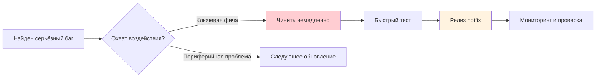
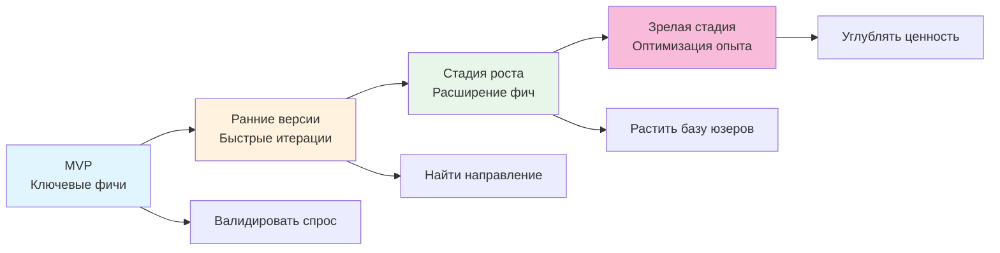

# 16.4 Итерация и рост

> День запуска продукта — не конец, а настоящее начало.

---

## Урок смены всего разом

Опираясь на фидбек и данные, Сяомин составил список улучшений: оптимизировать навигацию, упростить регистрацию, починить три бага и добавить поиск. Он две недели шипил все изменения одним залпом.

В итоге фича поиска привнесла новый баг, из-за которого у части юзеров списки заметок отображались криво. Хуже: из-за того, что он поменял слишком много сразу, он долго не мог понять, где проблема. Меняй он по одной вещи за раз — сразу бы знал, какое изменение вызвало сбой.

Опытный мастер сказал: «Меняй понемногу. Каждый раз убеждайся, что всё в порядке, и только потом переходи к следующему изменению».

---

## Балансируем частоту обновлений

Слишком быстрые и слишком медленные обновления одинаково проблемны.

Обновляетесь слишком быстро — юзеры устают: только привыкли к новому интерфейсу, как он снова меняется. Частые обновления легко вносят новые баги, продукт не успевает стабилизироваться, документация отстаёт. Слишком медленно — потребности юзеров не удовлетворяются, интерес тает, конкуренты обгоняют, и вы теряете петлю фидбека: медленные изменения — медленное обучение.

Хороший каденс быстро отвечает на потребности юзеров, сохраняя стабильность. Как? Мастер научил Сяомина методу: слоям.

---

## Трёхслойная стратегия обновлений

Не все обновления одинаковы. Разделите их на три слоя, каждый со своим ритмом.

**Hotfix'ы** — самый срочный слой: аварийные фиксы багов, релизятся в любой момент с наименьшим риском. Например, сломан логин — до следующей недели не дождёшься: чинить нужно сейчас. Hotfix закрывает ровно одну проблему и не тянет за собой других изменений. Сделали — тестируйте, релизьте и мониторьте немедленно.

**Мелкие обновления** — второй слой: небольшие фичи, оптимизации и несрочные баги, релизятся раз в неделю с умеренным риском. Лучше собрать недельную пачку мелких изменений и выпустить вместе, чем пушить разрозненные апдейты каждый день.

**Мажорные релизы** — третий слой: новые фичи, рефакторинг и архитектурные изменения, релизятся раз в месяц с наибольшим риском. Мажоры требуют более тщательного тестирования, более полной документации и более ясной коммуникации с юзерами.

С трёхслойной стратегией продукт Сяомина стал куда стабильнее. Срочное фиксировалось немедленно, мелкие улучшения собирались в недельные пачки, крупные фичи выходили раз в месяц. И юзеры выработали стабильные ожидания.

---

## Постепенные rollout'ы

Сяомин спросил: «А нельзя просто выкатить новую фичу сразу всем?»

Опытный мастер: «Ты только что на себе это прочувствовал. Пусть сначала малая группа юзеров попробует новую фичу. Если всё хорошо — разворачивай на всех. Это называется gradual rollout».

Преимущества постепенного rollout'а прямолинейны: проблемы затрагивают лишь часть юзеров, снижая риск; фичи валидируются в реальном окружении, что надёжнее тестового; а по мере стабилизации можно постепенно расширять — к полному релизу у вас уже есть уверенность.

Как это сделать на практике? Простейший путь — whitelist: пусть несколько дружественных юзеров попробуют первыми — отлично для внутреннего тестирования. Продвинутый путь — проценты: случайно показывать новую фичу 10% юзеров — хорошо для масштабной валидации. Можно делать случайные корзины — по сути, A/B-тест. Или условные триггеры: показывать фичу только при выполнении условий — полезно для контроля рисков.

Feature Flags — частый способ реализовать gradual rollout. Скажите Claude Code, что нужна система feature-флагов, и ясно опишите логику whitelist и процентов — этого достаточно. Конкретная реализация зависит от вашего стека.

---

## Управление изменениями

Когда фича обновляется, юзеры должны об этом узнать.

О новых фичах: подсветите ценность и научите пользоваться. Убираете фичу — уведомите заранее и объясните почему: внезапно удалить то, на что люди полагаются, — большая ошибка. Изменения UI — покажите сравнение «до/после» и проведите юзеров через переход. Фиксы багов — простого упоминания, что проблема решена, достаточно.

Changelog — простейший и самый эффективный способ коммуникации. Каждый релиз пишите пару строк, чтобы юзеры видели: продукт непрерывно улучшается. Формальность не нужна — нескольких фраз о том, что изменилось и почему, достаточно.

---

## Ритм итераций

Разные стадии — разные ритмы.

Ранняя стадия — быстрые итерации: один мелкий релиз в неделю, фокус на ключевых фичах, быстрая валидация гипотез, избегание чрезмерной оптимизации. Цель стадии — найти верное направление, и скорость важнее совершенства.

Стадия роста — стабильный ритм: мелкий релиз раз в две недели и мажор раз в месяц, баланс качества и скорости. Направление уже известно — расширяете функциональность, параллельно приоритизируя стабильность.

Зрелая стадия — непрерывная оптимизация: темп замедляется, фокус смещается с «добавления фич» на «улучшение опыта», углубление ценности.

Продукт Сяомина ещё на ранней стадии, и он выбрал быстрые итерации.

### Новые фичи vs фиксы багов

Опытный мастер дал простой принцип: 80% усилий — на стабильность и фиксы багов, 20% — на разработку новых фич.

Соотношение может удивить: «80% на баги? А когда делать новые фичи?» Но логика проста: юзеры предпочтут стабильный простой продукт набитому фичами, который вечно падает. Стабильность — фундамент всего.

---

## Always in Beta

Прошло несколько месяцев. Продукт Сяомина стал куда стабильнее, база юзеров медленно росла. Он спросил мастера: «А когда будет "готово"?»

Мастер ответил: «Никогда».

Традиционно Beta означает тестовую версию: временную, нестабильную, ждущую «официального релиза». Но в современном продуктовом мышлении Beta — перманентный миндсет: непрерывное улучшение без остановки. «Always in Beta» не значит, что продукт незавершён. Это значит: всегда верить, что есть куда улучшаться, и оставаться открытым к обучению и корректировкам.

Плюсы этого миндсета: он снижает перфекционистское давление — не нужно сделать всё идеально за один заход, ведь всегда есть следующая версия. Он поощряет быстрые эксперименты, держит скромным (признавая, что не на все вопросы есть ответы) и помогает улучшаться через фидбек.

---

## Удваивайте ставки на то, что юзеры любят

Ресурсы ограничены — направляйте усилия на то, что юзерам по-настоящему нравится.

Как распознать популярные фичи? Ищите четыре сигнала: высокое использование (фичей пользуются часто), много позитивного фидбека (юзеры упоминают её проactively), сильное влияние на retention (юзеры фичи удерживаются лучше) и выраженная готовность платить (юзеры готовы за неё платить).

Распознав — как усилить? Можно углубить фичу: сделать мощнее и полнее. Можно расширить вокруг: добавить связанную функциональность, чтобы ключевой опыт стал полнее. Можно оптимизировать опыт: сделать фичу проще и плавнее в использовании. И можно продвигать: чтобы больше юзеров узнали о её существовании.

---

## Отпускайте то, чем никто не пользуется

Сяомин обнаружил, что построенная им «система тегов» почти не используется. Он потратил на неё неделю — а интенсивность использования меньше 2%.

Он разрывался: «Убрать? Ведь я потратил на неё время».

Опытный мастер: «Sunk cost — не причина продолжать вкладывать. Фичи, которыми никто не пользуется, лишь добавляют нагрузку на поддержку и усложняют продукт. Каждая лишняя фича — ещё одно место, где могут заводиться баги, ещё одно, что нужно тестировать, и ещё одна опция, сбивающая с толку новых юзеров».

Как распознать неиспользуемые фичи? Низкое использование, юзеры никогда не упоминают, много проблем при малой ценности и слабое соответствие направлению продукта — всё это сигналы.

Как отпускать — зависит от ситуации. Если использование экстремально низкое — убирайте сразу. Если часть юзеров зависит — выводите поэтапно: перестаньте продвигать и уберите со временем. Если есть лучшая альтернатива — замените.

::: tip Подготовка к удалению фичи

1. Проанализируйте данные использования и подтвердите, что интенсивность действительно низкая
2. Уведомите затронутых юзеров заранее
3. Предложите альтернативу или гайд по миграции
4. Мониторьте фидбек после удаления

Не удаляйте тихо. Даже если фичей пользуются лишь 2% юзеров — они заслуживают уведомления заранее.

:::

---

## Малые шаги, быстрые движения

Оглядываясь на прошедшие месяцы, Сяомин заметил паттерн: чем меньше каждое изменение, тем лучше результаты.

Малые изменения снижают риск: когда каждое изменение мало, проще локализовать проблему. Малые изменения дают быстрый фидбек: раньше узнаёте, туда ли движетесь, вместо того чтобы через месяц обнаружить промах. Малые изменения легче психологически: не нужно «копить на большой рывок» — прогресс ощущается каждый день. Малые изменения накапливаются: фиксируйте по одной маленькой проблеме в неделю — это 52 улучшения за год.

Это и есть ядро «малых шагов, быстрых движений»: не гнаться за одним большим прорывом разом — а стремиться к стабильным непрерывным улучшениям.

---

## Большая картина эволюции продукта

От MVP до зрелого продукта — процесс постепенный:

Цель стадии MVP — провалидировать спрос: действительно ли кому-то нужно то, что вы строите? Цель стадии ранних версий — найти направление: что юзерам действительно нужно? Цель стадии роста — растить базу: помочь большему числу людей найти продукт и пользоваться им. Цель зрелой стадии — углубить ценность: сделать ключевой опыт исключительным.

Продукт Сяомина движется от MVP к стадии ранних версий. Спрос уже провалидирован (люди пользуются) — и сейчас он с помощью фидбека и данных ищет верное направление.

---

## Долгосрочное мышление

В конце мастер поговорил с Сяомином о теме побольше: долгосрочном мышлении.

Краткосрочное мышление гонится за виральностью; долгосрочное — за непрерывным улучшением. Краткосрочное хочет быстрого расширения; долгосрочное ищет стабильного роста. Краткосрочное пытается угодить всем; долгосрочное фокусируется на ключевых юзерах. Краткосрочное ждёт мгновенного успеха; долгосрочное верит в постепенное накопление.

«Все те успешные продукты, которые ты видишь, — сказал мастер, — не стали такими за ночь. Каждый прошёл через бесчисленные итерации, провалы и корректировки. Каждое твоё маленькое улучшение сейчас строит будущее».

---

## Частые вопросы

### Q1: Когда останавливаться в итерациях?

У продуктовой итерации нет конечной точки. Но можно корректировать темп: на ранней стадии итерировать быстро для валидации гипотез, на зрелой — держать стабильный каденс непрерывной оптимизации. «Остановка итераций» обычно означает, что продукт начинает клониться к упадку.

### Q2: Как избежать переитерации?

Фокус на ключевых метриках. Если новые изменения не дают улучшений — остановитесь и переосмыслите направление вместо продолжения подкруток. Иногда «не менять» лучше, чем «менять наугад».

### Q3: Как балансировать новые фичи и фиксы багов?

Принцип 80/20: 80% усилий — на стабильность и фиксы багов, 20% — на новые фичи. Стабильность — фундамент всего.

---

## Напутствие в конце книги

Сяомин оглянулся на пройденный путь.

С первой главы про настройку окружения он научился писать код с Claude Code, определять требования через PRD, строить интерфейсы на компонентных библиотеках, хранить данные в базе, связывать frontend и backend через API, защищать юзеров аутентификацией, обеспечивать качество тестами, управлять кодом через Git, деплоиться в продакшен через Vercel, смотреть данные в Umami и помогать людям находить себя через SEO.

Теперь у него настоящий продукт, настоящие юзеры и настоящий фидбек. Он умеет собирать фидбек, приоритизировать, понимать юзеров и непрерывно итерировать.

Продукт всё ещё мал, и юзеров всё ещё немного. Но он растёт — и Сяомин растёт вместе с ним.

Запуск продукта — не конец, а настоящее начало. Иди и строй.
