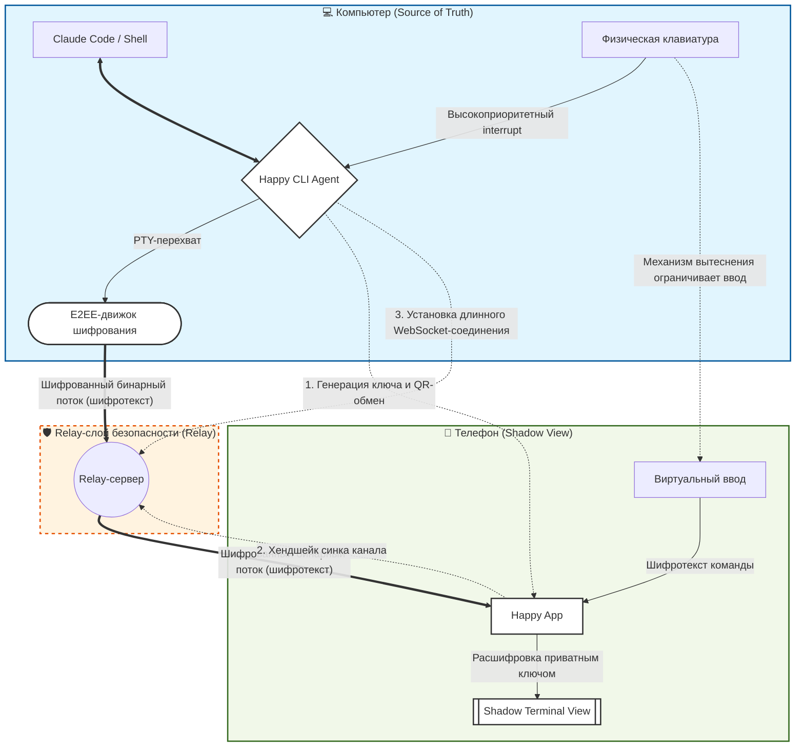

# AI Coding где угодно и когда угодно: инструментарий Happy Coder

> Автор: Mu Cheng

**Happy Coder** — опенсорсный бесплатный инструмент удалённого управления, спроектированный специально для AI-ассистентов командной строки вроде **Claude Code**, **Codex** и **Gemini**.

Его ключевое видение — не заменить ваш компьютер, а «положить мощные терминальные возможности в карман» через продвинутую **технологию сквозного шифрования**. С Happy Coder вы можете с мобильных устройств когда угодно и где угодно удалённо управлять AI-программинг-агентами, работающими на десктопе, — превращая AI-дев-воркфлоу, когда-то прикованный к десктопу, в кросс-пространственную мобильную продуктивность полного покрытия.

> В Happy App можно даже кодить с AI голосовым вводом — просто разговаривая


Примечания:

- Официальный сайт Happy Coder: [https://happy.engineering](https://happy.engineering)
- Happy App: [Web UI + мобильный клиент](https://github.com/slopus/happy/tree/main/packages/happy-app)
- Happy CLI: [интерфейс командной строки для Claude Code и Codex](https://github.com/slopus/happy-cli)
- Happy Server: [сервер шифрованной синхронизации](https://github.com/slopus/happy-server)

## I. Почему это инструмент №1 эпохи AI

В девелоперских кругах 2026-го **Happy Coder** заслужил звание «ультимативного инструмента», потому что он выходит за рамки логики «просто писать код» и эволюционирует в **кроссплатформенный интеллектуальный R&D-хаб**.

Это лишь плагин, интегрированный в ваш редактор, — и он закрывает три большие боли девелоперов эпохи AI: **мульти-девайс-синк, приватность и исполнение «тяжёлых задач»**.

- Настоящая «продуктивность»: отличный мобильный опыт
- Экстремальная приватность (шифрование уровня Signal)
- От «окошка чата» к «командной строке»: апгрейд на измерение
- «Будильник разработчика» 2026 года
- Будьте счастливым программистом: следите за прогрессом разработки кода где угодно — в лифте, кафе, за едой, в поезде, самолёте или даже на прогулке

> Магия Happy Coder не в том, что его модели сильнее чужих, — а в том, что он делает AI-разработку естественной как дыхание, где угодно и когда угодно, и столь же защищённой, как банковский сейф.

<video src="/images/Advanced/happy-coder/Happy-App.mp4" autoplay muted loop playsinline controls></video>

### 1. Какие боли решает Happy Coder?

Сравнение традиционной AI-разработки и режима Happy Coder

| **Ключевая боль** | **Традиционный AI-программинг (олдскул)** | **Режим Happy Coder (следующее поколение)** | **Соответствующая «суперспособность»** |
| ------------------- | ------------------------------------------- | ------------------------------- | -------------------------------------- |
| **Пространственные ограничения** | Обязан сидеть за компьютером; долгие ожидания генерации кода или прогонов тестов | **Взял телефон — и пошёл**<br />Следите за прогрессом разработки кода где угодно — в лифте, кафе, за едой, в поезде, самолёте, на прогулке | **Relay-penetration**<br />(публичный IP не нужен), без требования одной сети — подключение когда угодно |
| **Физическая нагрузка** | Многочасовая посадка давит на шею и позвоночник, поза фиксирована | **Кодьте стоя, лёжа, на ходу**<br />Полностью освобождает позу тела | **Voice-to-Action**<br />(настоящее голосовое программирование) |
| **Фрагментированное время** | Дорога, очереди и прочие обрывки времени годятся лишь на скроллинг телефона — сложные задачи не решить | **Достали телефон**<br />— и домашний компьютер чинит баги и рефакторит: превращаем мусор в золото | **Multi-Sessions**<br />(параллельное переключение задач) |
| **Тревога ожидания** | В долгих задачах (прогон тестов) страшно отойти: вдруг AI остановится, ожидая авторизации | **Когда задача завершена или нужна авторизация**<br />— телефон в кармане вибрирует | **Smart Push**<br />(умные push-уведомления) |
| **Барьеры безопасности** | Настройка remote desktop сверхсложна; SSH-коннективность плохая; страх утечки кода | **Отсканировал QR — и подключился**<br />Сквозное шифрование защищает приватность кода, релей не может подглядывать.<br />Релей лишь переправляет шифрованные «блоки данных» — **он не видит и не может расшифровать содержимое вашего кода** | **E2EE-архитектура**<br />(сквозное шифрование) |
| **Конфликты управления** | При удалённой работе ввод с локальной клавиатуры создаёт хаос | **У физической клавиатуры высший приоритет**<br />Вернувшись за стол, не нужно тапать «exit» на телефоне.<br />Просто нажмите **любую клавишу** — контроль мгновенно вернётся к компьютерному терминалу, а телефон уйдёт в «режим наблюдателя» | **Zero Disruption**<br />(бесшовная передача управления) |

Ключевые ценности:

- **Для соло-разработчиков**: это ваш «удалённый контроллер мозга», освобождающий из пленя кресла
- **Для тимлидов**: позволяет вмешиваться в сложные процессы исполнения кода когда угодно — хоть на встрече или ревью
- **Для хардкорных гиков**: самое защищённое решение удалённого взаимодействия с AI-агентами с нулевой конфигурацией

### 2. Как устроен Happy Coder

Happy Coder использует «тринитарную» коллаборативную системную архитектуру — «архитектуру трёх мушкетёров»:


- **Happy CLI (на компьютере — «мозг»)**: это «интеллектуальная оболочка», обёрнутая вокруг AI-ассистентов (Claude Code, Gemini, CodeX). Отвечает за **мгновенное шифрование** содержимого экрана терминала и упаковку для передачи

> **Простыми словами**: это ваш **«личный секретарь»**, сидящий за компьютером: смотрит в экран, кладёт информацию в сейф — и отправляет по почте

- **Relay-сервер (в облаке — «трубопровод», перевалочный пункт)**: **двунаправленный сигнальный релей на WebSocket**. Это цифровой мост между компьютером и телефоном, решающий задачу «проникновения» в сложных сетевых окружениях. Переправляет данные компьютера на телефон — неважно, вы на 5G или в cafe-Wi-Fi: «печатаете за компьютером — телефон отображает мгновенно»

  Используя особенности протокола WebSocket — через инициированные компьютером «активные» шифрованные длинные соединения — он изящно обходит firewall-перехваты внешних вторжений, достигая мгновенной пробивки в любом сетевом окружении.

> **Простыми словами**: это **«слепой курьер»** — отвечает лишь за переноску сейфа. Без ключа он совершенно не видит код внутри. Пользуйтесь со спокойной душой!

- **Happy App (на телефоне)**: конечный пункт данных. Отвечает за **локальную расшифровку** и красивый интерфейс, попутно захватывая ваш голос или набранные команды. Поддерживает iOS, Android и Web

> **Простыми словами**: это ваш «удалённый монитор + пульт», позволяющий работать за тысячи километров, как будто сидите прямо перед компьютером

### 3. Операционная логика Happy Coder

Чтобы досконально понять механизм работы Happy Coder, разберём его **низкоуровневую коммуникационную логику**, **схему шифрования** и **модель коллаборации с AI**.

- **Стандартный терминал**: Юзер ↔ Терминал ↔ Claude Code

- **Режим Happy**: Юзер ↔ **Happy CLI** ↔ Claude Code

  Когда `Claude Code` выводит на экран строку, Happy CLI мгновенно захватывает её и превращает в шифрованный поток данных.

> Суть диаграммы ниже: компьютер — **настоящий мозг** (Source of Truth), телефон — **пульт** (Shadow View), а relay-сервер — лишь **слепой к содержимому** переносчик.



Разбор ключевой логики по диаграмме выше:

**Ключевое звено: поток теневого управления**

Виртуальный ввод телефона ↔ Happy App ↔ Relay-сервер ↔ Happy CLI ↔ Claude Code

> Простыми словами: телефон шлёт команды через App, они проходят через релей и шифрующего агента — и в итоге «симулируют» нажатия клавиш для AI-ассистента

**Звено безопасности: поток сквозного шифрования (E2EE)**

Локальные данные ↔ Шифрование CLI ↔ Пересылка шифротекста (Relay) ↔ Расшифровка в App ↔ Взгляд юзера

> Простыми словами: данные превращаются в «абракадабру» до выхода из компьютера; relay-сервер лишь переправляет; и только ваш телефон держит приватный ключ, чтобы расшифровать

**Звено конфликтов: механизм вытеснения**

Ввод физической клавиатуры → Принудительный перехват Happy CLI → Приостановка удалённого ввода

> Простыми словами: когда вы печатаете за компьютером лично, система автоматически отрезает права ввода телефона — локальная операция всегда приоритетнее

**Звено коллаборации: петля удалённого оповещения**

AI исполняет и выдаёт результат → Happy CLI захватывает вывод → Приложение телефона шлёт async-уведомление → Юзер принимает решение

> Простыми словами: расцепляет «отправить команду» и «ждать результат» — даже если вы погасите экран телефона, завершение AI на компьютере всё равно прилетит вам в ладонь через это звено

### 4. Безопасность и приватность

> Многие беспокоятся: *«Мой код в безопасности, когда проходит через их серверы?»*

**Официальное обещание**: Happy использует **Zero-Knowledge-архитектуру**

- **Сквозное шифрование**: ключи обмениваются через QR-код или URL при пейринге; данные шифруются ещё до выхода из компьютера

- **Роль релея — только пересылка**: Happy Server — просто курьер: он лишь переправляет шифрованные «блоки данных». Он видит только шифрованные бинарные блоки и никак не может расшифровать ваш контент

- **Опция self-hosting**: если вы гик — можете задеплоить собственный приватный Happy Server на своём VPS по [официальному гайду](https://happy.engineering/docs/guides/self-hosting/)
- **Опенсорсная прозрачность**: весь исходный код можно ревьюить когда угодно на [GitHub](https://github.com/slopus/happy)

### 5. Безопасность и FAQ

- **Q: Компьютер уснул — подключение всё ещё работает?**

A: Нет. Компьютер обязан работать и оставаться онлайн. Рекомендуем на время длинных задач увеличить таймаут сна системы — или просто использовать облачный хост для постоянного коннективити

- **Q: Мой код будет загружаться?**

A: Нет. Happy лишь переправляет шифрованные «бинарные чанки» через релей. Он не хранит и не может читать ваш исходный код

- **Q: При запуске `happy` — ошибка?**

A: Проверьте, установлен ли `claude-code` глобально. Если проблема прав — попробуйте `sudo` перед командой (Mac) или запуск от администратора (Windows)

## II. Пререквизиты для работы с Happy Coder

Туториал использует Windows как базовое окружение (для большинства), но Mac/Linux аналогично — без волнений.

### 1. Требования к окружению

Убедитесь, что ваш компьютер соответствует условиям:

- **Node.js установлен** (рекомендуется 18 или новее)
- **Claude Code установлен** (или другой поддерживаемый CLI)
- **Смартфон** (для установки App)
- Git установлен (опционально, в основном для разработки проектов — к Happy Coder отношения не имеет)

### 1.1. Установка Node.js

Официальная страница загрузки Node.js: [https://nodejs.org/en/download](https://nodejs.org/en/download)


Проверьте версию командой:

```bash
node -v

# Вывод терминала вида v24.11.1 — установка успешна
```

### 1.2. Установка Git

Прежде чем пользоваться Git, его нужно установить. Git работает на Linux/Unix, Solaris, Mac и Windows.

- Загрузки Git для всех систем: [https://git-scm.com/install/windows](https://git-scm.com/install/windows)
- После установки доступен командный git-инструмент (со встроенным SSH-клиентом) и графический инструмент управления Git-проектами
- Найдите `Git -> Git Bash` в меню «Пуск» для открытия командного окна Git


Проверьте версию:

```bash
git -v

# Вывод вида git version 2.52.0.windows.1 — установка успешна
```

### 1.3. Установка Claude Code

[Этот шаг в Windows PowerShell] Снесите существующий Claude Code, если был (не установлен — пропустите)

```bash
npm uninstall -g @anthropic-ai/claude-code
```

[Этот шаг в Windows PowerShell] Установите официальный пакет. Подробности — [официальная документация Claude Code](https://code.claude.com/docs/en/quickstart)

```bash
# Глобальная установка Claude Code
npm install -g @anthropic-ai/claude-code
```

Запустите Claude Code, набрав `claude` в терминале и нажав Enter


> Совет: открывать Claude Code через «cmd» в адресной строке папки — удобнее и быстрее

### 1.4. Провайдеры моделей

Самые ходовые отечественные провайдеры моделей

| Модель | Компания | Ключевые особенности | Ссылка |
| :--------- | :-------- | :----------------------------------------------------------- | :----------------------------------------------------------- |
| **DeepSeek** | **DeepSeek** | **Король соотношения цена/качество**: сильнейшая опенсорсная сила Китая. Серия DeepSeek-V3.2/R1 поразила мир математической логикой и кодинг-способностями при крайне низкой стоимости инференса | [DeepSeek](https://platform.deepseek.com) |
| **GLM (Zhipu Qingyan)** | **Zhipu AI** | **Академичность/сильное рассуждение**: родом из Tsinghua. Серия GLM-5 сильна в сложных рассуждениях и оркестрации агентов — ядро отечественного опенсорс-комьюнити | [Zhipu AI](https://bigmodel.cn/glm-coding) |
| **Qwen (Tongyi Qianwen)** | **Alibaba** | **Универсал/бизнес-экосистема**: сверхдлинный контекст, стабильно лидирует в китайских и кодинг-бенчмарках, глубоко интегрирован с Alibaba Cloud | [Qwen](https://bailian.console.aliyun.com/) |
| **Kimi** | **Moonshot AI** | **Специалист длинных текстов**: первый в Китаче преодолел барьер «длинного контекста». Kimi 2.5 — нативная мультимодальная архитектура: визуальное понимание, программирование, эффективная коллаборация кластеров агентов и офисная автоматизация полного цикла. Тоже опенсорс | [Kimi](https://www.kimi.com/membership/pricing) |
| **MiniMax** | **MiniMax** | **Эмоциональное взаимодействие/полная мультимодальность**: Hailuo AI — международный лидер в генерации голоса и видео (Hailuo 2.0), сильные AI-социальные атрибуты | [MiniMax](https://platform.minimaxi.com/docs/coding-plan/intro) |

Самые ходовые международные провайдеры моделей

| Модель | Компания | Ключевые особенности | Ссылка |
| :--------- | :------------ | :----------------------------------------------------------- | :------------- |
| **Claude** | **Anthropic** | **Баланс гуманитарии и логики**: известен «Constitutional AI», высокая безопасность. Claude 4.x силён в творческом письме, анализе длинных документов и сложном программировании (Claude Code) | Для Китая рекомендован релей |
| **Gemini** | Google | **Нативная мультимодальность**: сильна в поисковой интеграции, длинном контексте (2M+ токенов) и понимании видео. Gemini 3 зовут экспертом по документации и legacy-коду | Для Китая рекомендован релей |
| **GPT** | OpenAI | **Отраслевой эталон**: соединяет o-серию логических рассуждений с быстротой GPT-серии. GPT-5 — мощное мультимодальное понимание и автономное исполнение агентов.<br />Со встроенной **o1-архитектурой reinforcement-рассуждений** демонстрирует сверхчеловеческую стабильность на предельно сложной оптимизации алгоритмов, реализации криптографических протоколов и логических тупиках, требующих многократных выводов | Для Китая рекомендован релей |

### Обязательно ли покупать API-услуги моделей?

- Примечание: сам Happy Coder бесплатен и опенсорсен. Оплаты не требуется!

- Однако вызываемые им Claude Code, Gemini и CodeX продолжат потреблять вашу квоту токенов или тарифицироваться провайдерами моделей — услуги моделей для использования обязательны
- Happy Coder официально поддерживает терминалы Claude Code (дефолт), Gemini и CodeX CLI
- Например: Claude Code можно подключить и к отечественным моделям (**GLM**, **Qwen**, **DeepSeek**, **Kimi**, **MiniMax** и др.)

## 3. Использование Happy Coder

Полный гайд: установка Happy CLI, авторизационный логин, работа с Claude Code-терминалом в браузере и подключение к терминалу Claude Code через мобильное приложение — включая перехват любого терминала из любого места.

### 1. Установка Happy CLI на компьютер

- Установите инструмент командной строки Happy Coder на компьютере (или сервере), где вы запускаете код
- **Пререквизит**: установлен Node.js 18 или новее

Откройте привычный терминал (Terminal или PowerShell) и введите:

```bash
npm install -g happy-coder
```

### 2. Запуск Happy Coder (по умолчанию стартует Claude Code)

Введите в терминале:

```bash
happy
# или
happy claude
```

На примере Windows:


После запуска `happy claude` выберите, каким терминалом авторизоваться (Mobile App или Web Browser)


Примечание:

- Вариант 1: Mobile App — подключение телефона к CLI-терминалу Happy Coder на компьютере
- Вариант 2: Web Browser — подключение к CLI-терминалу Happy Coder через страницу браузера

### 3. Выбор Web Browser

Выберите Web Browser, чтобы пользоваться Claude Code в браузере

- Создайте аккаунт и пройдите авторизацию
- Начните сессию — и пользуйтесь Claude Code в браузере

Введите `happy claude` в терминале, нажмите Enter и выберите `Web Browser`


При выборе `Web Browser` автоматически всплывёт окно браузера:


### Первое подключение может провалиться

При первом клике «Accept Connection» подключение к терминалу может сорваться — без паники!


Просто откройте официальный сайт Happy Coder [https://happy.engineering](https://happy.engineering/) и кликните «Launch Web App»


### Создание аккаунта

После клика «Launch Web App» вы попадёте на страницу логина приложения — сперва создайте аккаунт


После «Create Account» вы войдёте в режим «Web Browser» — терминал покажет, что подключение успешно


После «Start New Session» наберите «Hello» в текстовом поле для теста — ошибка подскажет «Select a device to start session»


Вернитесь на страницу «Connect Terminal» браузера, правый клик → «Reload» для рефреша, затем снова кликните кнопку «Connect Terminal»


### Подключение терминала успешно

Рефрешнув страницу, снова кликните «Accept Connection» — покажет «Terminal Connected Successfully», и терминал тоже изменится


После клика «OK» кликните текущий каталог терминала в списке слева для входа в режим диалога


### Старт сессии и отправка команд: свободно пользуемся Claude Code в браузере

Кликнув текущий диалог в списке слева, вы входите в режим диалога — терминал синкается в реальном времени


Дальше — как разработка проектов в терминале Claude Code раньше: чёрное окно терминала больше не нужно (помните: не закрывайте терминал)


При нажатии `Ctrl + C` в терминале happy claude завершит сессию — и страница браузера тоже выйдет из сессии


Для переподключения просто введите `happy claude` в терминале — браузер подключится автоматически и начнёт сессию, а терминал автоматически войдёт в режим сессии Claude Code, без дополнительной верификации.


> Теперь можно продолжать пользоваться Claude Code в браузере

### Перехватывайте управление когда угодно

- Когда браузер в сессии, терминал Claude Code по умолчанию в залоченном (наблюдательном) состоянии (сгенерированный контент видно синкающимся с браузером в реальном времени)
- Когда нужно вручную перехватить управление в терминале — нажмите любую клавишу с курсором в терминале, и можно снова вводить команды
- Если же вы продолжите печатать и отправлять команды в диалоговом окне браузера — браузер снова возьмёт управление, и терминал Claude Code вернётся в залоченное (наблюдательное) состояние

### 4. Выбор Mobile App

Если ранее вы подключали другой терминал (например, браузер) — сначала нужно разлогиниться перед мобильным подключением

```bash
# Happy coder logout
happy auth logout
```

После ввода команды терминал спросит: «You will need to re-authenticate to use Happy again. Are you sure you want to log out? (y/N)»


Выберите «y» для подтверждения выхода


После выхода снова введите команду запуска в терминале:

```bash
happy claude
```

Введите `happy claude` в терминале


После запуска `happy claude` выберите Mobile App для авторизации терминала и Enter для подтверждения


После выбора «Mobile App» сгенерируются QR-код и URL мобильной авторизации для верификации

- Отсканируйте QR-код приложением Happy
- Или введите URL вручную для авторизации


### Установка Happy App

- Android: скачайте [Happy Coder](https://play.google.com/store/apps/details?id=com.ex3ndr.happy) в Google Play
- iOS: скачайте [Happy Coder](https://apps.apple.com/us/app/happy-codex-claude-code-app/id6748571505) в Apple App Store

> После установки просто откройте Happy App — регистрация и логин не требуются


### Подключение к терминалу компьютера через App

- Тапните кнопку «Open Camera» в App, чтобы отсканировать QR-код терминала
- Или тапните «Manual URL Entry» и скопируйте адрес подключения, показанный после «Or manually enter this URL» в терминале


### Начало realtime-сессии с Claude Code и Happy App

- Печатайте текстовый ввод в Happy App на мобильном устройстве
- Или используйте голосовой ввод
- Мобильный и десктоп не обязаны быть в одной сети — коннективити realtime откуда угодно


Когда вы отправляете команду с телефона, она синкается в реальном времени в Claude Code на компьютере для завершения диалога с моделью


> Теперь через Happy App на телефоне вы можете отправлять команды для любой нужной задачи

### Бесшовная передача управления в любой момент

- Вернувшись за стол, не нужно ничего выключать на телефоне
- Просто нажмите **любую клавишу** на клавиатуре компьютера — контроль мгновенно перепрыгнет с телефона на десктоп-терминал, а мобильное приложение автоматически войдёт в «режим наблюдателя»
- Чтобы вернуть управление телефону — просто введите команду в чате Happy App: десктоп-терминал переключится обратно в «режим наблюдателя»

## 4. Частые команды Happy Coder

Команд у Happy Coder немного. Ниже — справочник основных, утилитных и связанных подкоманд для быстрого поиска при необходимости.

### 1. Основные команды (старт сессии)

| **Команда**     | **Описание**                                              |
| --------------- | ------------------------------------------------------------ |
| `happy`         | **Дефолт: запуск Claude Code**. Стартует сессию Claude Code с выбором Mobile App или Web Browser |
| `happy gemini`  | Запуск сессии Gemini CLI                                     |
| `happy codex`   | Запуск режима OpenAI Codex                                      |
| `happy connect` | Подключение и верификация сервиса (например, `happy connect gemini`)    |

### 2. Утилитные команды

| **Команда**     | **Функция**                                     |
| --------------- | ------------------------------------------------------------ |
| `happy auth`    | **Управление аутентификацией**: логин, логаут или управление собственной учёткой Happy Coder<br />например: `happy auth logout` — выход из сессии |
| `happy connect` | **Облачная синкронизация ключей**: безопасное хранение API-ключей AI-вендоров в Happy Cloud для кросс-девайс доступа |
| `happy notify`  | **Отправка push-уведомления**: вручную отправить push-сообщение на подключённое мобильное устройство (телефон/планшет) |
| `happy daemon`  | **Управление фоновым сервисом**: старт, стоп или рестарт демона Happy Coder (резидентный фоновый сервис) |
| `happy doctor`  | **Диагностика и траблшутинг**: самопроверка окружения, детект конфигурационных ошибок и предложения фиксов |

### 3. Подкоманды connect

| **Команда**            | **Функция**                                     |
| ---------------------- | ------------------------------------------------------------ |
| `happy connect gemini` | **Авторизация Google Gemini**: привязка аккаунта Google для моделей Gemini. |
| `happy connect claude` | **Авторизация Anthropic Claude**: привязка аккаунта Anthropic для моделей серии Claude. |
| `happy connect codex`  | **Авторизация OpenAI Codex**: привязка аккаунта OpenAI для моделей Codex/GPT. |
| `happy connect status` | **Просмотр статуса подключений**: текущий статус аутентификации у всех AI-вендоров. |

### 4. Краткая справка подкоманд Gemini

| **Команда**                      | **Функция**                                     |
| -------------------------------- | ------------------------------------------------------------ |
| `happy gemini`                   | **Старт сессии Gemini**: вход в AI-программинг на моделях Gemini |
| `happy gemini model set <model>` | **Установка дефолтной модели**: переключение на конкретную версию (например, flash или pro) |
| `happy gemini model get`         | **Просмотр текущей модели**: какая версия Gemini активна |
| `happy gemini project set <id>`  | **Установка Project ID**: конфигурация Google Cloud project ID (для энтерпрайз/workspace-аккаунтов) |
| `happy gemini project get`       | **Просмотр текущего Project ID**                                  |

Рекомендации свежих моделей Gemini (издание февраля 2026): Gemini полностью эволюционировала в **эпоху 3.0**. Если пользуетесь Happy Coder — выбирайте модель по сложности задач:

| **Model ID**              | **Роль**            | **Сценарий**                                                 |
| ------------------------- | ------------------- | ------------------------------------------------------------ |
| **`gemini-3-pro`**        | **Тяжеловес / флагман** | **Глубокая разработка и архитектура**: режим «Deep Think», идеален для рефакторинга сложной логики, крупных модулей, кросс-файловых аудитов кода. |
| **`gemini-3-flash`**      | **Универсал / дефолт** | **Ежедневный эффективный кодинг**: текущий выбор по умолчанию. Рассуждения превосходят 2.5 Pro при экстремально низкой задержке. Отличен для быстрых фиксов багов и юнит-тестов. |
| **`gemini-3-flash-lite`** | **Специалист эффективности / лёгкая** | **Простая помощь и форматирование**: высокая экономичность — простое форматирование кода, написание комментариев, realtime-проверки синтаксиса. |

Связанные команды:

```bash
# 1. Переключиться на самый мощный 3 Pro (рекомендуется для сложных проектов)
happy gemini model set gemini-3-pro

# Или на самый быстрый 3 Flash (рекомендуется для ежедневной работы)
happy gemini model set gemini-3-flash

# 2. Проверить применение настроек
happy gemini model get

# 3. Начать AI-программинг-сессию
happy gemini
```


## 5. Разработка в облаке: AI-программинг где угодно с Happy Coder

Если мы хотим подключаться и использовать AI-программинг-инструменты когда угодно — через десктоп-клиенты, мобильные устройства или мини-программы, — свободные от ограничений локального железа и способные стартовать работу, AI-разработку, дизайн или гейминг по требованию, с переключением конфигураций и эластичным использованием ресурсов, — можно выбрать облачные хосты или облачные компьютеры.

> В этом гайде мы выбрали самое доступное и при этом мощное решение: **«Облачный компьютер Alibaba Cloud Wuying + Happy Coder»** — для AI-программинга в облаке, когда угодно и где угодно.


### 1. Что такое облачный компьютер?

- Вы больше никогда не увидите физический системник — ключевые компоненты компьютера работают на Alibaba Cloud. Нужны лишь монитор и клавиатура с мышью.
- Поскольку ключевые компоненты в облаке, конфигурацию можно апгрейдить и даунгрейдить в любой момент, а работать — с любых устройств откуда угодно.
- Платите только за время включённого компьютера.


### 2. Сценарии использования облачного компьютера

- **AI-офис и AI-разработка**: AI-модели всегда под рукой для ежедневной работы; множество окружений и систем подходят для AI-разработки.
- **Облачный дизайн / программинг**: апгрейдите конфигурацию по требованию — и ощутите плавность топового железа для дизайн-работы.
- **Исследование AI**: сфера AI эволюционирует стремительно — новые инструменты почти каждый день.
- **Обучение и тренинги**: пошарьте экран компьютера одним кликом — без времени на загрузку и настройку софта.
- **Киберспорт и развлечения**: мгновенный старт облачного гейминга — *Black Myth: Wukong*, *Naraka: Bladepoint* и множество других облачных игр.
- **Командировки**: не нужно таскать тяжёлый ноутбук — планшет и телефон мгновенно становятся рабочим компьютером.
- **Слабые ПК, MacBook'и и телефоны играют в топ-игры**: слабые машины мгновенно становятся производительными, а MacBook и телефон тоже тянут AAA-игры.


### 3. Преимущества облачных компьютеров

Прочтём преимущества облачных компьютеров с трёх сторон: пробой потолка производительности, расширение функциональности устройств и преодоление платформенных ограничений.

### 3.1 Пробой потолка производительности

Через клиент Wuying слабые традиционные компьютеры тоже запускают крупный софт или игры — включая программинг.

> Для разработки, деплоя AI-больших моделей и прочего конфигурацию можно апгрейдить в любой момент под реальные нужды.


### 3.2 Расширение функциональности устройств

Pad-устройства, изначально для досуга, мгновенно становятся инструментами продуктивности установкой клиента Wuying Cloud Computer — работа и игра в балансе.

> Заметили? Больше не нужно носить ноутбук на выходе! Даже ваш телевизор мгновенно становится компьютером.


### 3.3 Преодоление платформенных ограничений

Для софта или игр, залоченных под конкретные платформы, облачный компьютер помогает обойти ограничение. Без возни с дуал-бутом и виртуалками — AAA-игры на Mac без проблем!

> Включая разработку: когда нужны Linux, Windows или мультиплатформенное тестирование — переключение когда угодно экономит время и силы.


### 4. Как пользоваться облачным компьютером

Просто установите и залогиньтесь в клиент Wuying — и запустите облачный компьютер одним кликом внутри клиента.

- Десктоп: поддерживаются клиенты Windows и macOS
- Web: открывайте веб-версию в Chrome, Firefox и других браузерах
- Мобильные: поддерживаются iOS и Android

> Загрузка клиента Wuying Cloud Computer: [https://www.aliyun.com/product/wuying/download](https://www.aliyun.com/product/wuying/download)

### 4.1 Установка клиента Wuying (десктоп)

- Скачайте подходящую версию клиента под ваше устройство и ОС.
- После успешной установки вы сможете пользоваться сервисами Wuying где угодно и когда угодно.
- Рекомендуем логин через QR-код аккаунта Alibaba.


Выберите Personal Edition и залогиньтесь через Alipay.


Новым юзерам доступен бесплатный месячный триал при первой регистрации (для обучения — более чем достаточно).


Подтвердите получение и оформите заказ.

- Gold Edition: системный диск 60GB + диск данных 40GB + публичный bandwidth 10 Mbps + 40 core-hours вычислительной мощности (месяц бесплатно, потом ¥9.9/мес за продление)
- 240 core-hours вычислительной мощности (бесплатно, действует 1 год)


Настройте базовую информацию облачного компьютера.

- Имя облачного компьютера: задайте своё (по аналогии с именем локального компьютера)
- Основная локация: принцип близости (выбирайте узел рядом с вашим городом — теоретически быстрее)


Кликните «Place Order Now» для продолжения.


После успешного заказа отсканируйте для включения безпарольной оплаты.

> Примечание: автопродление позже можно отменить в Alipay. На триальную политику для новых регистраций это не повлияет — если не пользуетесь, списаний не будет, без волнений.


После успешного скана Alipay кликните кнопку «Completed Activation and Authorized Deduction».


Войдите на страницу успешного заказа.


Страницу заказа можно закрыть и войти на главную клиента Wuying Cloud Computer. Просто кликните кнопку «Connect» для входа в облачный компьютер.


Дефолтная система при первом входе — Windows; все операции идентичны локальному компьютеру.


Примечание:

- Установка dev-окружений и инструментов в облачном компьютере идентична локальному.
- Аналогично — установка AI-программинг-инструментов и конфигурация моделей проходят тем же процессом.

### 4.2 Переключение ОС на облачном компьютере Wuying

- Дефолт — Windows, но переключиться на Linux можно в любой момент.
- Вернуться на Windows можно тем же способом.


После подтверждения подтвердите ещё раз — и ОС переключится.


После успешного переключения вы войдёте в систему Linux.


### Установка клиента Wuying (мобильная)

Если пользуетесь мобильным устройством:

- Поищите и скачайте **Wuying Cloud Computer App** в сторе приложений (для управления и работы с облачными компьютерами)
- После логина через QR-код Alipay можно управлять облачными компьютерами Wuying и через мини-программу Alipay (только управление, без прямых операций)


### Гибкий выбор конфигурации при старте облачного компьютера

Самая мощная фича облачных компьютеров — выбирать желаемую конфигурацию перед каждым запуском.

| **Режим** | **Ядра CPU** | Память | GPU VRAM | **Тариф core-hours** | **Рекомендуемые сценарии** |
| ------------- | ------------- | ------ | -------- | ------------------ | ------------------------- |
| **Economy** | 4 ядра | 8 GiB | - | 4 core-hours / час | Лёгкое редактирование кода, работа с документами, простые скрипты |
| **Smooth** | 8 ядер | 16 GiB | - | 8 core-hours / час | **Ежедневная AI-разработка**. Плавно тянет VS Code и несколько сессий AI-агентов |
| **Performance** | 16 ядер | 32 GiB | - | 16 core-hours / час | Компиляция крупных проектов, мультиконтейнерные операции, сложный анализ архитектур |
| **Esports** | 12 ядер | 46 GiB | 11 GiB | 60 core-hours / час | GPU-ускоренные задачи, локальные большие модели или рендеринг графики |

> Для триала выбирайте минимальную конфигурацию. Переключиться можно в любой момент (высокие конфигурации сжигают core-hours быстрее)


### 5. Деплой и установка Happy Coder на облачном компьютере: полная миграция в облако

- Установите и настройте Claude Code и модели, как на локальной машине — убедитесь, что всё работает как локально
- Установите Happy Coder на облачный компьютер — шаги идентичны локальной установке


- После успешной установки запустите `happy claude`, выберите терминал Mobile App для авторизации и нажмите Enter


После выбора «Mobile App» сгенерируются QR-код и URL мобильной авторизации для верификации личности:

- Отсканируйте QR-код мобильным приложением Happy
- Или введите URL вручную для авторизации


### Подключение к терминалу облачного компьютера через Happy App на телефоне

Откройте Happy App на телефоне, отсканируйте QR-код или введите URL для авторизации — и вводите промпт для подключения к Claude Code на облачном компьютере и разработки проекта


Тем временем Claude Code на стороне облачного компьютера тоже синкается


### Бесшовная передача управления когда угодно

- Вернувшись за стол, не нужно ничего выключать на телефоне
- Просто нажмите **любую клавишу** на клавиатуре — контроль мгновенно перепрыгнет с телефона на компьютерный терминал, а телефон автоматически войдёт в «режим наблюдателя»
- Чтобы вернуть управление телефону — просто введите команду в чате Happy App, и компьютерный терминал вернётся в «режим наблюдателя»

> Кроме того, ещё один плюс облачных компьютеров — можно напрямую оперировать (перехватывать) Claude Code на телефоне когда угодно через «Wuying Cloud Computer App»

### Управление облачным компьютером через Wuying Cloud Computer App


## VI. Почему я выбрал этот AI-программинг-тулчейн

В эпоху AI-программинга традиционная модель «компьютер + компилятор» становится бутылочным горлышком. Я выбрал Happy Coder + Claude Code (Gemini или Codex) + Happy App + облачный компьютер Wuying, чтобы построить никогда-не-офлайн, мульти-мозговой коллаборативный и абсолютно защищённый супер-dev-остров. Я использую этот тулчейн как best practice ежедневной разработки проектов.

- Фактически это передовая **«Agent-First»**-парадигма разработки
- Суть: **облачный вычислительный центр + всеспособный мульти-модельный мозг + кросс-девайс портативный контроль**

### 1. Ключевая архитектура

Система по сути держит **«тяжёлое продакшен-окружение»** в облаке, делегирует **«интеллектуальные решения»** AI и оставляет **«контроль»** в ваших руках.

- **Вычислительный фундамент (облачный компьютер Wuying):** круглосуточно онлайн, высокопроизводительное, эластично масштабируемое облачное Linux/Windows-окружение. Гарантирует, что сложные задачи не лагают (до 12-ядерного GPU, 46GB RAM, 11GB GPU VRAM эластичной вычислительной мощности; в энтерпрайз-версиях — и выше). Достигает «данные не приземляются» для кодовых активов с физической изоляцией безопасности против утечек.
- **Движок исполнения:** всеспособный «резидентный программист» — CLI-интеллектуальный агент с мульти-модельным планированием. Happy Coder нативно поддерживает Claude Code + Gemini CLI + Codex и подключается ко всем ходовым моделям отечественным и международным (Claude, Gemini, GPT, Minimax, Kimi, GLM и др.)
- **Шлюз коллаборации/шифрование:** Happy Coder + мобильное приложение Happy (бесшовная связка и пуш сообщений между облачным терминалом и мобильным устройством) использует тот же **E2EE-протокол сквозного шифрования**, что и Signal. Код шифруется на облачном десктопе до передачи; relay-сервер видит лишь абракадабру, и расшифровать может только приватный ключ на моём телефоне.

> Закрывает боли разработчиков «когда угодно, где угодно, высокоэффективно, дёшево»

### 2. Это мой «всеспособный мозг», а тем более — all-star моделей

Больше не нужно мучиться выбором между Claude или Gemini — все модели, отечественные и международные, переключаются когда угодно: «сильнейший мозг», берущий лучшее от всех. Он может прочесть сотни тысяч строк моего кода и дать самые точные рекомендации по рефакторингу.

### 3. Это моя «овеществлённая продуктивность»: AI работает — я пью кофе

Это меня больше всего зажигает. Связкой **Happy Coder** и **Happy App** я добился **асинхронной разработки**:

- **Оффлайн-исполнение задач:** могу отправить команды рефакторинга на **облачном компьютере Wuying** — закрыть ноутбук и пойти в зал или в дорогу.
- **Удалённый realtime-надзор:** когда AI требует подтверждения записи файлов или встречает runtime-ошибки, **мобильное приложение** мгновенно шлёт уведомление. Тапаю «Разрешить» на телефоне — и AI продолжает спринт в облаке.

> **Простыми словами:** я нанял старшего программиста на дежурстве 24/7, а мне остаётся лишь работа «апруver» на телефоне.

### 4. Это моя «цифровая крепость»: архитектура безопаснее локальной разработки

Безопасность — не довесок, а фундамент системы. Через «данные не приземляются» и «сквозное шифрование» я закрыл главную приватность-боль AI-разработки:

- **Шифрование военного класса:** **Happy Coder** использует тот же **E2EE-протокол сквозного шифрования**, что и Signal. Код шифруется на облачном десктопе до передачи; relay-сервер видит лишь абракадабру, и расшифровать может только приватный ключ на моём телефоне.
- **Физическая изоляция приватности:** весь ключевой код, API-ключи и dev-окружения заперты в **облачном компьютере Wuying**. Мои личные устройства не держат чувствительных данных: даже потеряй я телефон, кодовые активы остаются в безопасности облачного сейфа.
- **Анонимность и минимальные права:** регистрация аккаунта не нужна — поверхность атаки для утечки личности снижена; каждая критическая операция AI требует моего удалённого ручного апрува, что предотвращает риски «схода агента с рельсов».

## VII. Happy Coder + Wuying: идеальный тулчейн

| **Измерение**      | **Традиционная локальная разработка**              | **Режим «Happy + Wuying»**                                                        |
| ------------------ | ---------------------------------------------- | -------------------------------------------------------------------------------- |
| **Workspace**      | Прикован к столу и монитору               | Где угодно с интернетом (телефон, планшет, компьютер)                                 |
| **Эффективность**     | Пялиться на прогресс-бары, боясь отойти  | **Async-доставка**— апрувите на телефоне, пока AI продолжает двигаться вперёд          |
| **Вычислительная мощность**  | Ограничена локальным железом, сильный перегрев   | Эластичная облачная конфигурация: бесшовно от 4 ядер до 12-ядерного GPU и выше |
| **AI-способности**  | Одна модель, ограниченный контекст                  | Мульти-модельный микс с миллионотокенным длинным контекстом                |
