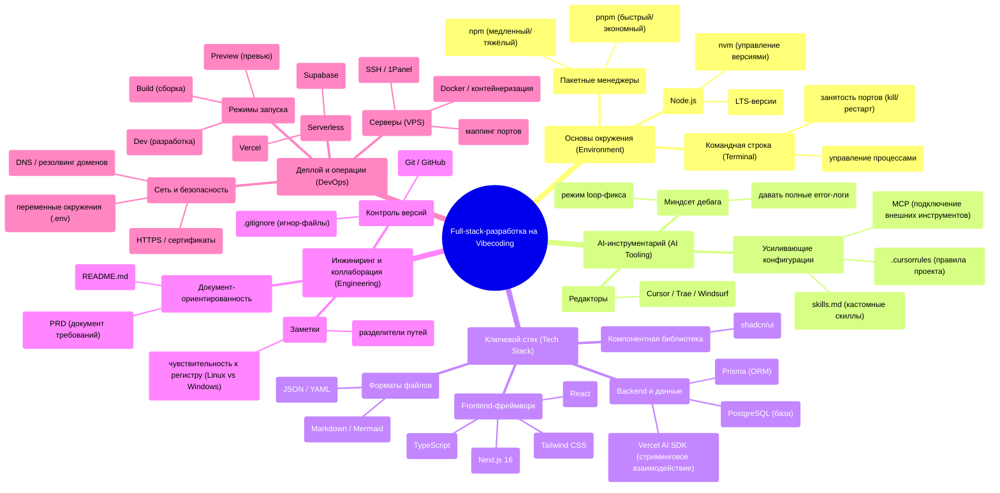

# Advanced-гайд: от идеи до продукта за 100 часов

Если пролистать оглавление этого продвинутого туториала, вы увидите море технических терминов: настройка окружения, пакетные менеджеры, базы данных, деплой...

Это сильно похоже на оглавление традиционного программистского образования. Но скажу сразу: **это не главное — это лишь инструменты**.

Последнее десятилетие программистское образование, кажется, впало в огромное заблуждение: начинать с синтаксиса, структур данных и алгоритмов, будто освоение этого даст возможность строить продукты. Звучит логично. Но в реальности между «умением писать код» и «умением строить продукты» — гигантская пропасть.

Ещё неприятнее, что многие думают: создание софта — это просто написание кода. Но правда ровно обратная: **код — никогда не отправная точка софта; это финальный шаг решения**.

Видите ли, любой софтверный проект начинается с **проблемы**.

Это может быть бизнес-проблема: ресторан ежедневно держит двухчасовые очереди в пиковые часы, и владелец хочет сократить время ожидания.

Это может быть научная проблема: лаборатория генерирует горы экспериментальных данных ежедневно, и исследователи хотят автоматически анализировать тренды.

Это может быть личная проблема: вы хотите фиксировать каждую прочитанную книгу и упорядочивать инсайты, которые она дала.

Это может быть даже вымышленная проблема: вы просто хотите попрактиковаться в конкретной технологии — и придумываете требование сами для себя.

Чтобы решить проблему, сначала нужно сформировать **решение**.

Решение охватывает множество измерений: какие процессы спроектировать, какие правила установить, какие роли назначить, как скоординировать все стороны. Это и есть ядро проекта.

И лишь когда отдельным частям решения нужна автоматизация, масштабирование или выход за человеческие пределы, вы думаете: **«Эту часть можно реализовать софтом»**.

Только тогда код выходит на сцену.

Так что **написание кода — то, что нужно на относительно позднем этапе**.

---

## Пропасть исчезает

Но маятник эпохи качнулся на новую позицию.

До появления AI-инструментов программирования между «идеей» и «продуктом» зияла гигантская пропасть под названием «способность к реализации».

У вас были идеи, но вы не умели кодить. Или умели чуть-чуть, но качества не хватало: не запускается, или запускается — и сыпется багами.

Или были деньги нанять разработчиков, но стоимость коммуникации была запредельной, а построенное — вечно мимо цели.

Или вы стиснули зубы и сделали сами, потратили месяцы — и обнаружили, что продукт не то, что нужно юзерам.

Так идеи оставались лишь идеями.

Я видел слишком много таких людей: острое бизнес-чутьё, богатый отраслевой опыт, глубокое понимание юзеров. Но лишь потому, что они не умели кодить, идеи оставались в блокнотах, разговорах за кружкой, бессонных ночах.

Сколько потенциально миропеременяющих продуктов заблокировала эта пропасть.

Сейчас эта пропасть заполняется.

Это похоже на историю технологии фотографии.

Раньше, чтобы сделать приличный кадр, что нужно было понимать? Диафрагму, выдержку, фокус, ISO, баланс белого... Пришлось бы разобраться во всех этих сложных принципах и купить дорогое оборудование. Большинство сдавалось уже на мыслях об этом.

Теперь? Камера телефона автоматически обрабатывает все технические детали. Вам нужно фокусироваться лишь на двух вещах: что снимать — и как сделать красиво.

AI-инструменты программирования работают так же.

Они берут на себя детали кода; вы фокусируетесь на самом продукте — **какую проблему хотите решить и как её решить**.

Это не значит, что можно полностью не разбираться в технологиях. Всё ещё нужно понимать принципы и границы технологий — как нужно знать, что «в темноте получаются смазанные кадры», пользуясь камерой телефона.

Но не нужно заучивать каждую строчку кода — как не нужно знать лежащие в основе алгоритмы камеры вашего телефона.

**Порог входа снизился, но потолок остался — и стал даже выше.**

И происходит ещё одно, более важное изменение.

Раньше мы думали: сначала нужны большие модели, потом приложения. Компании-разработчики больших моделей ведут — мы следуем.

Но посмотрите сейчас по отраслям: **взрывные AI-сценарии — не у компаний больших моделей, а там, где ближе всего к реальным проблемам**.

Что это значит для вас? То, что не нужно ждать, пока AI-компании выпустят новые фичи. Нужно лишь понять проблему рядом с вами и решить её существующими AI-инструментами. В этом процессе ваше понимание AI будет расти естественно.

---

## Кто учитель

Здесь происходит и ещё более глубокое изменение.

На протяжении человеческой истории опыт и мудрость всегда накапливались с возрастом — старшие учили младших, мастера передавали знания ученикам. Так было тысячи лет.

Но это покоится на предпосылке: мир меняется достаточно медленно, и прошлый опыт справляется с будущими вызовами.

Когда технологии итерируют быстрее, чем люди накапливают опыт, предпосылка рушится.

Вы видели такие картины:

Молодой новичок может разбираться в дебаге сервера лучше своего технически сильного учителя; студент, только начинающий учить программирование, может острее чувствовать ценность AI-инструментов, чем сеньор с десятью годами за плечами; новая сотрудница operations может автоматизировать свою работу AI-инструментами быстрее ветеранов-коллег.

Это не вина возраста — это неизбежный результат ускоряющихся времён.

Когда «опыт» не успевает отстояться в «мудрость», технологии уже обновились несколько кругов.

Так что мы видим тихо происходящую смену ролей: это больше не старшие передают знания в одну сторону — младшее поколение становится проводниками.

Это не отвержение традиции. Наоборот — это новый ответ на вопрос «кто впереди, исследуя».

В эту эпоху те, кто первыми принимают новые технологии, естественно несут ответственность вести других сквозь туман.

Это не зависит от стажа, дипломов или должности — только от того, готовы ли вы сделать первый шаг, пока другие остаются в стороне и смотрят.

**Когда мир меняется слишком быстро, самое опасное — не пойти не туда. Самое опасное — стоять на месте.**

---

## Другой путь

В этом продвинутом туториале вы не увидите традиционного пути «учим программирование с синтаксиса».

Вместо этого вы увидите путь деятеля:

Начать с проблемы, сформировать решение, затем AI-инструментами превратить решение в продукт.

Каждую главу я пишу как ретроспективную заметку — это не энциклопедическая куча точек знания, а ясная запись решений, ям, метаний и компромиссов того времени, чтобы вы сначала получили рабочий путь и ключевую философию.

Это не мануал «как сделать»; это заметки «как я прошёл».

---

### Один человек — целая команда

Чтобы вы поняли своеобразие пути, который нам предстоит, нужно сначала посмотреть, как традиционно устроена современная разработка софта.

**В крупных интернет-компаниях вывод в свет одной внешне простой фичи — полный и сложный процесс:**

Сначала **фаза требований**: продакты пишут документы требований, организуют ревью, PM'ы, разработчики и тестировщики сидят в переговорке и обсуждают полдня.

Затем **фаза технического проектирования**: backend и frontend пишут тех-пропозалы, организуют тех-ревью, порой с участием апстрим- и даунстрим-команд.

Дальше **фаза разработки**: кодинг, юнит-тесты, самопроверка интерфейсов, интеграция frontend-backend. Каждый кодит за своим экраном, потом собираются синкать интерфейсы.

Затем **фаза тестирования**: после самопроверки разработчики «сабмитят на тестирование» QA-команде, которая делает ручное и автоматизированное тестирование, находит баги и отдаёт разработчикам на фиксы. Туда-сюда — проходят дни.

Потом **фаза деплоя**: мерж кода, верификация в pre-prod, canary-релизы — сначала 5% юзеров, потом 10%, 50%, наконец 100%. Каждый шаг осторожен: лишь бы не случилось чего.

Наконец **фаза итерации**: двухнедельные циклы, непрерывное планирование и доставка новых фич. Весь процесс работает как прецизионная машина, цикл за циклом.

Что хорошего в этом процессе? Стандартизировано, управляемо, низкий риск.

Но проблемы очевидны: медленно, тяжело, высокий порог.

От предложения до запуска фича часто проходит недели и даже месяцы. И каждый шаг требует отдельных людей: продакты, backend-разработчики, frontend-разработчики, QA-инженеры...

Для отдельных людей или малых команд этот процесс почти невоспроизводим. Откуда столько людей? Столько времени?

---

**В эпоху AI этот процесс сжат и перестроен:**

**Фаза требований**: вы сами продакт — пишете PRD, понятные AI. Не нужно владеть профессиональной продуктовой терминологией — нужно ясно объяснить, что хотите сделать.

**Фаза технического проектирования**: AI генерирует тех-пропозалы; вы лишь ревьюите и корректируете. Как опытный архитектор рядом, готовый советовать в любой момент.

**Фаза разработки**: AI пишет код; вы описываете требования и проверяете результат. Не нужно заучивать использование каждого API и помнить детали каждого фреймворка.

**Фаза тестирования**: AI пишет тест-кейсы и исполняет их автоматически. Больше не тратите горы времени на повторяющийся тестовый код и не боитесь упустить edge cases.

**Фаза деплоя**: деплой в облачные платформы одним кликом, сборка и релиз автоматически. Не нужно самому конфигурировать серверы и настраивать CI/CD-пайплайны.

**Фаза итерации**: быстрые корректировки на основе данных и фидбека — итерации за дни или даже часы. Хотите поменять фичу? Результат через минуты.

Видите: недели — в минуты, десятки людей — в одного. Это не преувеличение — это происходящая реальность.

Заметьте: это не значит, что процесс исчез.

Просто многие шаги автоматизированы AI — или один человек носит множество шляп.

Вам не нужно писать каждую строчку кода, но всё ещё нужно понимать, что делает каждый шаг, почему так, и как разбираться при проблемах.

**Именно этому учит туториал: не заменить процесс, а овладеть его ядром и использовать AI для ускорения.**

---

### 100 часов на весь путь

Этот гайд идёт нитью «гайд по избеганию ям от нуля до продакшена», проводя вас через полный процесс доставки продукта, связывающий full-stack-разработку:

**Шаг 1: Выбор технологий и подготовка окружения** (главы 1–2)

Сначала подготовить сцену. Выбрать правильный стек, настроить dev-окружение, освоить базовые методы работы с AI. Без этого фундамента, как бы ни были хороши идеи — они не приземлятся.

**Шаг 2: Определение проблемы и дизайн решения** (глава 3)

Пишем PRD, ясно определяем, какую проблему решаем и как. Многие пропускают этот шаг: сразу кодить — ощущение лучше. Но поверьте: продуманная проблема сэкономит позже бесчисленные часы.

Возможно, вы заметили: **реальный флоу проекта — «сначала продумать проблему, потом выбрать технологии», но порядок туториала обратный**.

Это намеренно. PRD содержит технические термины вроде Next.js, Prisma, база — если вы даже не знаете, что это, документ не прочитать. Так что сначала настройте окружение, познакомьтесь с инструментами и получите базовое чувство технологий — потом учитесь правильно писать PRD.

**Шаг 3: Реализация продукта** (главы 4–8)

UI/UX-дизайн делает продукт красивым и удобным, хранение данных делает информацию персистентной, security-механизмы защищают приватность юзеров, автотесты обеспечивают качество. У каждого шага — свои инструменты и методы.

**Шаг 4: Релиз и итерация** (главы 9–16)

От локального — к публичному, чтобы мир увидел продукт; от одиночки — к команде, изучение коллаборации и шеринга; от запуска — к непрерывному улучшению, чтобы продукт эволюционировал через фидбек.

В конце этого пути вас ждёт не «стать программистом», а «стать человеком, решающим проблемы продуктами». **Код — средство, не цель**. Ваша цель — решать проблемы и создавать ценность; код — лишь один из инструментов её достижения.

---

## Хватит думать — начинайте делать

В эпоху неопределённости и ускорения передумка — часто враг действия.

У вас было такое:

Хотите построить продукт — но всё кажется, что подготовка недостаточна. Хотите изучить технологию — но всё кажется, что сначала нужно пройти все туториалы. Хотите решить проблему — но всё кажется, что, возможно, есть решение лучше.

И вы топчетесь на месте, глядя, как другие убегают вперёд.

Не ждите идеальной идеи, чтобы начать строить продукт; не ждите прозрения финала, чтобы начать бежать.

Потому что в реальном мире идеальной отправной точки никогда не было.

Продукты, которыми вы восхищаетесь, часто начинались с грубых MVP. Предприниматели, которых вы уважаете, часто корректировали направление через пробы и ошибки.

**В эту эпоху мышление создаёт проблемы; действие создаёт ответы.**

---

## Что остаётся делать вам

Услышав это, вы можете спросить: если AI может так много — что остаётся мне?

Отличный вопрос.

AI действительно нас заменил. Но заменил он ровно то, что мы и не хотели делать, не могли или не должны были делать.

Рутину, повторяемость, рискованное, скучное — это AI забрал.

А оставил нам — точнее, вынудил нас — исследовать новые возможности, делать то, что хорошо получается лишь у людей.

Продумав эти отношения, вы поймёте, как сосуществовать с AI:

**Рутину — AI, суждение и творчество — себе.**

**Тяжёлую работу — AI, вкус и мышление — себе.**

**Механическое исполнение — AI, вдохновение и креативность — себе.**

AI может сгенерировать код — но не может решить, какой продукт строить.

AI может написать тест-кейсы — но не поможет понять реальные потребности юзеров.

AI может оптимизировать производительность — но не найдёт за вас ту проблему, которую стоит решать.

**Работа, требующая суждения, вкуса, связей и творчества, всегда останется территорией человека.**

---

## Перед стартом

Правильный способ использовать этот туториал:

Не жуйте его как учебник от корки до корки.

Относитесь к нему как к карте, гайду, другу, к которому можно всегда обратиться за помощью.

Когда столкнётесь с конкретной проблемой — откройте нужную главу и посмотрите, как я прошёл. Когда растеряны — читайте предисловия и смотрите ход мысли того времени. Когда не знаете, что дальше — смотрите обзор глав и выбирайте направление для старта.

**Учение — не заучивание; учение — подражание.**

**Рост — не ожидание; рост — действие.**

За 100 часов вы удивитесь, на что способны.

Нет, может, и 100 не понадобится.

**Тише едешь — дальше будешь.**

Это не конец; это начало.

Туториал написан не чтобы вы стали full-stack-инженером после прочтения — а чтобы вы стали человеком, который может решать проблемы по ходу чтения.

**Пусть вас ведёт не страх «а вдруг сломается», а видение «а что может получиться».** Нужно лишь увидеть тот продукт, решающий проблему, — и отправиться его реализовывать.

Давайте эволюционировать вместе.

Фу Ханкан / Eyre

1 января 2026

::: info Заметка о прогрессе туториала
Основной текст/изображения некоторых глав дописываются; контент может корректироваться с итерациями. Как и с кодом: сначала каркас — потом детали. Следите за официальным релизом — и спасибо за терпение!
:::

---

## Обзор глав

| Глава | Тема |
|---|---|
| 1 | [Настройка окружения](/Advanced/01-environment-setup/) |
| 2 | [Как использовать AI](/Advanced/02-ai-tuning-guide/) |
| 3 | [От требований к документации](/Advanced/03-prd-doc-driven/) |
| 4 | [Базовые знания разработки](/Advanced/04-dev-fundamentals/) |
| 5 | [Красивые и удобные интерфейсы](/Advanced/05-ui-ux/) |
| 6 | [Где живут данные](/Advanced/06-data-persistence-database/) |
| 7 | [Связываем frontend и backend](/Advanced/07-backend-api/) |
| 8 | [Кто может трогать мои данные](/Advanced/08-auth-security/) |
| 9 | [Тестирование фич](/Advanced/09-testing-automation/) |
| 10 | [Доступ из публичной сети](/Advanced/10-localhost-public-access/) |
| 11 | [Совместная разработка](/Advanced/11-git-collaboration/) |
| 12 | [Автодеплой Serverless](/Advanced/12-serverless-deploy-cicd/) |
| 13 | [Домены и доступ](/Advanced/13-domain-dns/) |
| 14 | [Деплой на серверы](/Advanced/14-vps-ops-deploy/) |
| 15 | [SEO, шеринг и аналитика](/Advanced/15-seo-analytics/) |
| 16 | [Юзер-фидбек и итерация продукта](/Advanced/16-user-feedback-iteration/) |

---

## Обзор знаний

