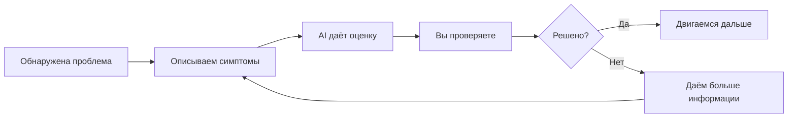

# 0.3 Что делать, если вы застряли: единый процесс обращения за помощью

## Сначала выработайте реакцию лучше, чем «продавливать на упорстве»

Когда многие новички сталкиваются с проблемой, первая реакция часто одинакова: начать наугад менять код, искать тексты ошибок по одному, думать «наверное, это просто не моё» — и потом долго сидеть на одной проблеме, боясь двигаться дальше.

Базовый курс не рекомендует этот путь.

В эпоху AI-программирования более эффективная первая реакция:

> **Сначала опишите проблему ясно, затем пусть AI поможет вам двигаться дальше.**

Это не лень. Это способ работы, который одновременно легче и эффективнее.

## Единая формула обращения за помощью

Когда застряли, сообщите AI в таком порядке: что вы только что сделали, какую проблему видите сейчас и какого результата изначально хотели. Если можете приложить скриншот или полный текст ошибки — ещё лучше.

## Простейший шаблон вопроса

```text
Что я только что сделал: [ваше последнее действие]

Какая проблема видна сейчас: [что вы наблюдаете]

Какого результата я изначально хотел: [какой эффект вы хотели получить]

Сначала помоги определить наиболее вероятную причину, затем скажи, что делать дальше.
```

## Три типовых примера

### Пример 1: пустая страница

```text
Я только что попросил AI изменить layout главной страницы.

Теперь страница открывается пустой.

Я изначально хотел увидеть обновлённую homepage. Сначала помоги определить наиболее вероятную причину, затем скажи, что делать дальше.
```

### Пример 2: кнопка не реагирует

```text
Я только что добавил кнопку отправки.

Теперь при клике ничего не происходит.

Я рассчитывал, что клик отправит сообщение. Помоги сначала определить наиболее вероятную проблему.
```

### Пример 3: чат отвечает не так

```text
Я только что обновил информацию о профиле digital twin.

Теперь его ответы всё равно звучат механически и не следуют моей настройке.

Я хочу, чтобы он говорил больше похоже на меня. Помоги понять: инструкции недостаточно ясны — или что-то не применилось.
```

## Если с первого раза не решилось

Если проблема не решилась с первой попытки — это не провал. Многие проблемы не относятся к типу «решается одним вопросом»; это скорее маленький итеративный процесс:



Лучший следующий шаг: рассказать AI о новых симптомах, объяснить, что вы сделали по его прошлой рекомендации, и продолжить следующий раунд анализа.

## Какая информация ценнее всего

Если первого ответа всё ещё не хватает, самое ценное, что можно добавить: скриншоты, полный оригинальный текст ошибки, какую именно часть вы только что меняли и чем видимый результат отличается от ожидаемого.

Не пишите просто «не работает», «сломалось» или «всё равно не выходит». В такой информации слишком мало содержания — AI тоже не сможет вынести суждение.

## Помните: не сваливайте каждую проблему на AI

Если возникла проблема, не думайте сразу «AI опять ошибся». Чаще точнее описывается так: вы недостаточно ясно объяснили цель, не ограничили scope изменений, окружение или конфигурация подготовлены не полностью — либо какой-то шаг фактически не применился, как ожидалось.

Это не поиск виноватых. Это более устойчивая рамка для совместной работы:

**Когда возникает проблема, сначала смотрите на контекст, цели, границы и окружение — а не немедленно перекладывайте ответственность на AI.**

::: details Хотите копнуть чуть глубже?
Если вам нужно систематическое понимание debugging с AI, workflow и правил проекта — можно перейти в продвинутый курс и читать дальше:
- [Глава 2: Как использовать AI](/ru/Advanced/02-ai-tuning-guide/)
:::

---

[Следующий раздел: Итоги главы: базовая карта обучения →](./0.4-how-to-learn.md)
