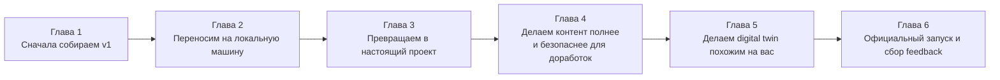

# 0.4 Итоги главы: карта обучения базового курса

## Теперь посмотрите на весь маршрут целиком

К этому моменту вы уже знаете, чему этот базовый курс учит и не учит, что вы в итоге соберёте, подходит ли вам этот путь и как двигаться дальше, когда застряли.

Самое важное сейчас — увидеть весь маршрут целиком. Когда вы понимаете, на какой стадии находитесь, зачем нужен следующий шаг и что получите, пройдя его, — значительная часть тревоги исчезает разом.

## Как выглядит весь маршрут

## Как каждая глава продвигает проект

| Глава | Как меняется проект |
|------|--------------------|
| Глава 1 | Сначала вы соберёте `v1`, который можно открыть, показать и использовать для простого чата |
| Глава 2 | Проект переедет с платформы на ваш компьютер и станет тем, что можно continuously итерировать |
| Глава 3 | Homepage из шаблонного превратится в нечто, что выглядит сделанным намеренно |
| Глава 4 | Проект перестанет быть «тонким»: посетителю станет проще понять, кто вы, и яснее — что спросить |
| Глава 5 | Digital twin перестанет просто «отвечать» — он начнёт звучать как вы |
| Глава 6 | Проект перейдёт из состояния «только у меня на компьютере» в «живая ссылка, доступная другим» |

## Куда этот путь вас постепенно приведёт

Отложим абстрактные ярлыки навыков — только практические изменения. Сначала вы научитесь ясно выражать требования, затем перенесёте проект на своё рабочее место. Дальше научитесь оценивать, стала ли страница больше похожа на настоящий проект и удобнее ли она стала; а ещё — как оставлять себе пространство для отката в коде, чтобы не паниковать при каждой правке. После этого вы начнёте делать digital twin похожим на себя — и наконец по-настоящему опубликуете весь проект, чтобы его могли увидеть другие.

## Когда стоит остановиться, а когда — продолжать

Если вы хотите хотя бы раз испытать «я тоже могу это собрать», то прохождения одной главы 1 уже вполне достаточно.

Если же вы хотите завершить первый полный цикл — идите до главы 6. Ни один из вариантов не является провалом и не говорит о лени. Разница лишь в следующем: к концу главы 1 вы получаете первый положительный feedback; к концу главы 6 — первый полный проектный цикл.

## Что вы уже прояснили к этому моменту

Теперь вы ясно понимаете позиционирование курса, что вы в итоге соберёте, как учиться, как задавать вопросы и как двигаться дальше. И главное — у вас есть чёткое ощущение, куда каждую следующую главу проект приведёт.

## Перед стартом убедитесь хотя бы в этом

- [ ] Я понимаю, что этот базовый курс — не традиционный курс грамматики
- [ ] Я знаю, какой проект я в итоге соберу
- [ ] Я понимаю, подходит ли мне этот маршрут
- [ ] Я знаю, как просить AI о помощи, когда застрял
- [ ] Я понимаю, что продвигает каждая из глав с 1 по 6

## Следующий шаг

Не задерживайтесь в «фазе подготовки» дольше. Вы уже знаете маршрут и то, что будете собирать. Важнейший следующий шаг — не прочитать ещё одно объяснение, а начать собирать первую версию.

Если вам понадобится систематическое понимание окружения и инструментов, AI-workflow, продуктовой документации, UI/UX, API, security, Git-коллаборации или деплоя — вы сможете позже перейти в продвинутый курс, когда упрётесь в эти границы. А сейчас у вас уже есть всё, чтобы войти в главу 1.

---

[В главу 1: Первая версия →](/ru/Basic/01-awakening/)
