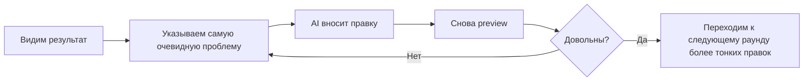

# 1.3 Генерируем первую версию на платформе и делаем три раунда доводки

## Теперь собираем по-настоящему

К этому моменту у вас уже есть партия реальных материалов о себе и заполненный шаблон требований первой версии.

Следующее самое важное — реально передать эту информацию AI-инструменту прототипирования, чтобы первая версия наконец появилась.

Разбор ведётся на примере **Miaoda**. Если вы используете другой инструмент, поддерживающий генерацию страниц из естественного языка, workflow практически тот же: открыть платформу, создать новый проект, вставить требования, дождаться генерации и перейти в режим preview.

## Для первой генерации держим цель очень скромной

Запомните:

> Цель первой генерации — не «сразить всех наповал», а «сначала получить версию, которую можно посмотреть, покликать и с которой можно поболтать».

Поэтому важнейшее на этом этапе — не выкидывать модные трюки, а удержать scope под контролем: страница показывает, кто вы; на странице есть зона чата с digital avatar; общая структура ясная; и хотя бы мобильная версия не разваливается полностью.

## Рекомендуемый порядок действий

Сначала создайте новый проект и дайте ему простое понятное имя — например, `my-homepage` или `personal-homepage-v1`. Затем вставьте целиком заполненный шаблон из предыдущего раздела — и не вносите больших правок в последний момент: дайте первой версии полностью отработать. Дальше терпеливо дождитесь окончания первого раунда генерации и не прерывайте процесс на полпути, если инструмент явно не уехал в совершенно постороннюю сторону. Когда генерация завершится, войдите в preview. При первом preview смотрите только на три вещи:

1. Сгенерировалась ли структура страницы
2. Верна ли в целом личная информация
3. Появилась ли уже зона чата с digital avatar

В Miaoda после вставки требований процесс обычно не прыгает сразу к финальной странице. Чаще инструмент сначала помогает собрать более структурированный документ требований, уточняя имя приложения, core-функции, структуру страниц и требования к стилю. Это нормальный шаг: он не значит, что инструмент завис, — он значит, что инструмент помогает до конца уточнить требования, которые вы только что дали на естественном языке.

Пока общее направление не выглядит явно неверным, жмите `Generate App Now` в правом нижнем углу.


Здесь смотрите в основном на две вещи: во-первых, правильно ли этот документ описывает «кто вы, что должно быть на странице и что должен делать digital avatar»; во-вторых, не расходятся ли явно требования к стилю справа с вашими ожиданиями. Если с этим всё в порядке — двигайтесь дальше и не увязайте в деталях слишком рано.

## При первом preview не спешите критиковать всё подряд

Увидев результат впервые, многие сразу входят в состояние «здесь не так, там не так».

Но более эффективный подход — сначала оценить три вещи: это уже страница; она уже передаёт направление «это я»; и в ней уже есть фундамент для продолжения итераций.

На двух скриншотах ниже — реальный результат первой страницы. У всех разные материалы, у платформы разное состояние генерации в каждый момент, и требования к стилю вы давали свои, поэтому ваша страница может выглядеть иначе. Но **похожие проблемы на первой странице — совершенно нормальны**; не делайте вывод «этот путь не работает» лишь потому, что первая версия несовершенна.


Если внимательно посмотреть на такой результат первой версии, одновременно видны и хорошие знаки, и проблемы. Хорошая новость: скелет страницы уже есть — hero-блок, секция проектов, зона чата и ссылки в footer уже существуют. Проблемы тоже очевидны: например, имя или информация могут быть извлечены с ошибкой; чат-бокс может стоять неуклюже, прижатым к правому краю страницы; кнопки `Q1`, `Q2` и `Q3` часто являются просто демо-быстрыми вопросами и ещё не подключены к большой модели; а некоторые ссылки, карточки или кнопки выглядят кликабельными, но на деле пока никуда не ведут.

Именно поэтому мы постоянно подчёркиваем: цель первой версии — не сделать всё идеально за один шаг, а сначала вытащить версию, которую можно продолжать улучшать.

Здесь я пока остановлюсь на этапе «результата первой страницы». Позже, когда дойдём до дальней подстройки, доводки и приёмочных проверок, я добавлю продолжение скриншотов этого же кейса в соответствующих местах. Пока достаточно усвоить логику оценки: в первой версии сначала проверяем, появился ли скелет и где очевидные проблемы; не нужно ждать всех скриншотов, чтобы продолжать читать.

Если ответ в целом «да» — вы справились.

Потому что критерий успеха главы 1 никогда не был «всё правильно с первого раза». Он такой:

**Сначала вытащить версию, которую можно продолжать улучшать.**

## Если первая страница — не то, что вы хотели, это тоже нормально

Это не значит, что вы потерпели неудачу, и не значит, что инструмент плохой.

Чаще бывает так: ваше описание недостаточно конкретно; стиль, который вы хотите, недостаточно ясен; либо вы ещё не ограничили задачу словами «сначала сделай только первую версию, не добавляй лишнего». Возможно и другое: платформа сначала дала прототип, «демонстрирующий структуру», — отсюда и типовые проблемы первой страницы: неточная информация, непоключённые заглушки-взаимодействия, неработающие ссылки.

И эти проблемы как раз показывают: генерация — не конец; норма — это iteration.

## Рекомендуемый метод доводки в три раунда



### Раунд 1: чиним очевидные ошибки

В этом раунде работаем только с самыми заметными проблемами: неверная информация, пропавшие секции, серьёзно сломанный layout, неправильно отображающийся вход в чат. Проблемы со скриншотов выше — «имя неправильное», «чат-бокс прижат к правому краю», «ссылки в footer выглядят кликабельными, но никуда не ведут», «Q1/Q2/Q3 — только заглушки» — всё это то, что стоит чинить в этом раунде в первую очередь.

Сказать можно так:

```text
Пока не делай больших изменений на всей странице.

Сначала хочу исправить несколько очевидных проблем:
1. Моё имя отображается неверно. Исправь на правильный вариант.
2. Чат-бокс справа прижат к правому краю страницы. Дай ему более естественные внешние отступы и воздух.
3. Подключи внешние ссылки и способы связи на странице, чтобы они работали как настоящие кликабельные ссылки.
4. Если Q1 / Q2 / Q3 — только демо-кнопки, не подавай их как реальный чат: либо преврати их в вопросы, реально запускающие беседу, либо пока убери.

В этом раунде исправь только эти очевидные проблемы. Общий стиль не переделывай.
```

Если вас в этот момент больше всего волнует, «а подключён ли чат-бот к модели на самом деле», задайте отдельный дополнительный вопрос:

```text
Проверь, подключена ли текущая зона чата к реальному вызову большой модели.
Если это пока только demo или подбор по ключевым словам — явно скажи, в каком состоянии оно сейчас находится.
Если платформа поддерживает — подключи его в реально работающий LLM-чат; если для этого шага не хватает конфигурации, тоже ясно скажи, чего именно не хватает.
```

### Раунд 2: настраиваем стиль и контент

В этом раунде разбираем проблемы типа «всё уже работает, но всё ещё не ощущается как я»: стиль слишком вычурный или слишком пресный, цвета не совпадают с задумкой, иерархия личной информации всё ещё недостаточно ясна. В примере выше, скажем, чат-бокс уже появился, но визуально смотрится немного деревянно и недостаточно согласован с hero-блоком — это как раз случай для продолжения правок в текущем раунде.

Сказать можно так:

```text
Структура сейчас в целом правильная.
Дальше хочу настроить только общий стиль:
- Сделай страницу более минималистичной и чистой
- Смени основную палитру на тёмно-синий и белый
- Не добавляй новых сложных модулей
Внеси только изменения уровня стиля.
```

### Раунд 3: мелкие шлифовки

Здесь обрабатываем детали из серии «не критично, но станет лучше»: звучит ли текст на кнопках естественнее, яснее ли prompt-текст в зоне чата, комфортнее ли отступы у avatar и блока профиля.

Сказать можно так:

```text
Страница в целом уже близка к тому эффекту, который я хочу.
Сейчас внеси только мелкие шлифовки:
- Сделай наводящий текст в чат-боксе чуть более естественным
- Сделай отступы в блоке avatar и профиля более комфортными
- Не добавляй новых модулей и не переделывай layout
```

## Два очень важных принципа доводки

Первое: за один раз меняем только одну категорию проблем. Не перечисляйте всё сразу: поменять палитру, поменять layout, поменять логику чата — и заодно добавить секцию портфолио. Так scope правок очень легко выходит из-под контроля. Более устойчиво — каждый раз фокусироваться на одной главной цели. Второе: обозначайте границы изменений максимально ясно. Можно прямо писать «меняй только эту часть», «новые модули пока не добавляй», «текущую общую структуру сохрани». Это заметно снижает шанс ситуации «попросил починить одно — поменялось ещё десять мест».

## Что чинить в этом раунде сразу, а что оставить на следующие главы

Если проблем сейчас видно много — не нужно решать всё разом в главе 1. Устойчивее сначала разделить «что починить сейчас» и «что систематично будем делать позже».

| Чиним сейчас | Продолжаем в следующих главах |
|------|------------------|
| Неправильное имя, неверно извлечённая информация | Более цельный интерфейс и единый стиль (глава 3) |
| Очевидные проблемы layout, пропавшие секции | Как разумнее достроить контентные модули (глава 4) |
| Кнопки-ссылки никуда не ведут | Как сделать digital avatar похожим на вас и стабильнее (глава 5) |
| Зона чата — заглушка без реальных вызовов | Запуск и проверка в реальных условиях (глава 6) |

Иными словами, вы вполне можете продолжать промптить Miaoda сейчас: подключить ссылки, исправить очевидные ошибки, вытащить зону чата из состояния «демо-реквизит» хотя бы в состояние «ясно объясняет, что с ней сейчас». Но более систематичный UI-polish мы разберём в главе 3; а инструкцию для digital avatar, реальный опыт диалога, API и более стабильные ответы продолжим делать в главе 5.

## Если после трёх раундов всё ещё не то

Если вы уже прошли три раунда туда-сюда, а результат всё ещё далёк от ожиданий, — не продолжайте точить детали.

Лучше вернуться и проверить две вещи: не были ли ваши исходные требования слишком размытыми и не намешали ли вы слишком много целей в один и тот же раунд.

Часто в этот момент нужно не «продолжать настраивать сильнее», а **переписать более ясную версию описания требований**.

::: details Хотите глубже?
Если нужно систематическое понимание многоходовых диалогов, mindset отладки и AI-workflow — переходите в продвинутый курс и читайте дальше:
- [Глава 2: Как использовать AI](/ru/Advanced/02-ai-tuning-guide/)
:::

---

[Следующий раздел: Итоги главы: приёмка первого раунда и чек-лист оптимизации на следующий →](./1.4-vibe-vs-spec.md)
